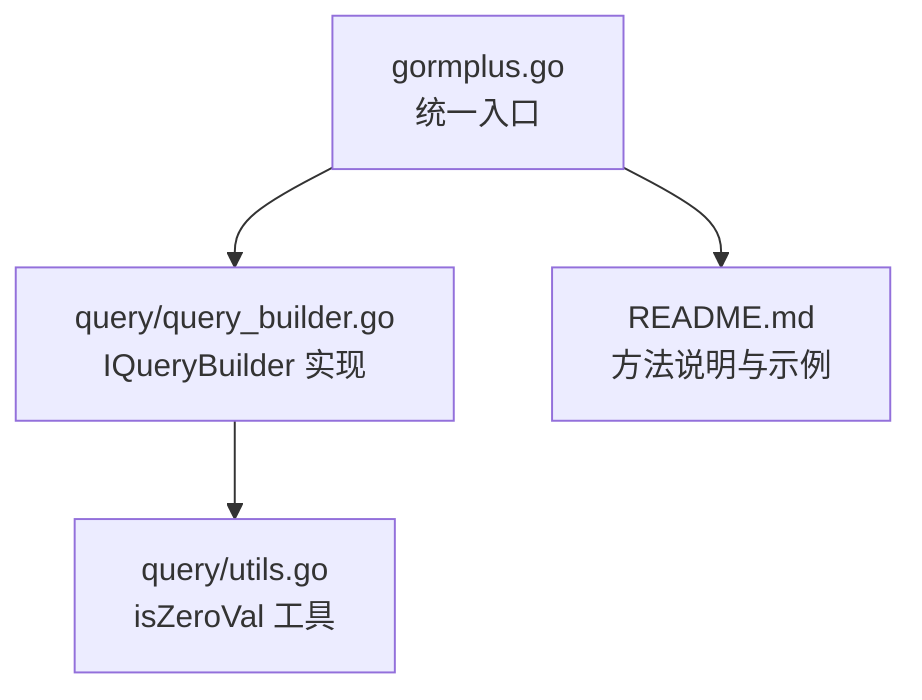
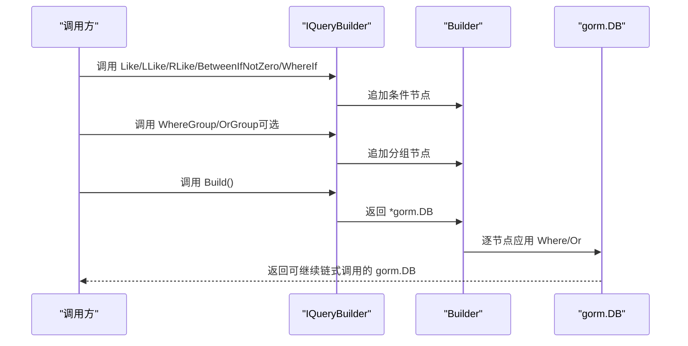
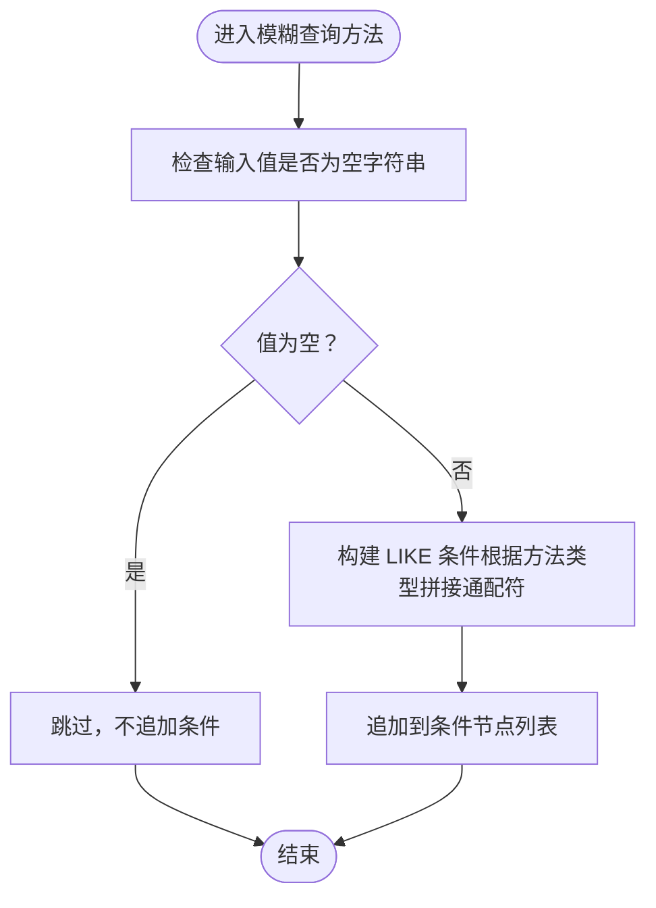
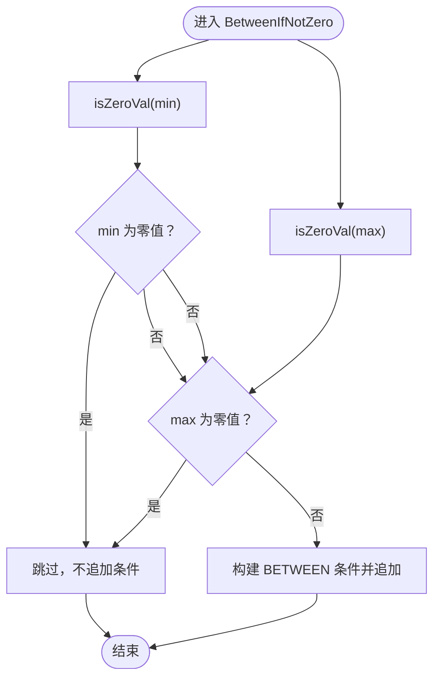
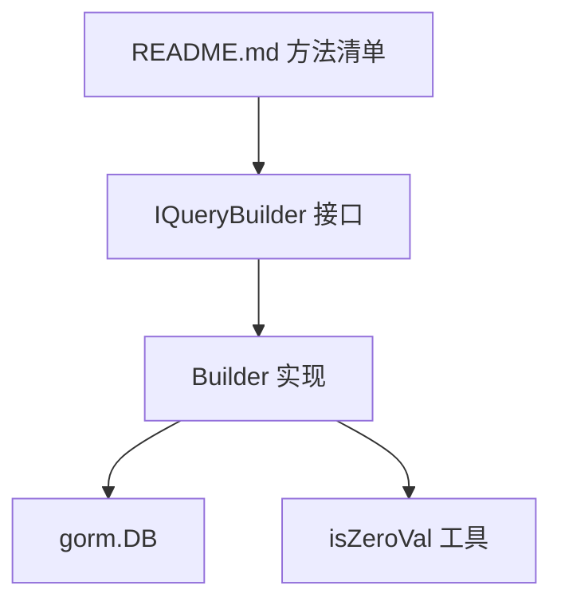

# 基础查询方法

<cite>
**本文引用的文件**
- [gormplus.go](file://gormplus.go)
- [query_builder.go](file://query/query_builder.go)
- [utils.go](file://query/utils.go)
- [README.md](file://README.md)
</cite>

## 目录
1. [简介](#简介)
2. [项目结构](#项目结构)
3. [核心组件](#核心组件)
4. [架构概览](#架构概览)
5. [详细组件分析](#详细组件分析)
6. [依赖分析](#依赖分析)
7. [性能考虑](#性能考虑)
8. [故障排查指南](#故障排查指南)
9. [结论](#结论)
10. [附录](#附录)

## 简介
本章节面向“基础查询方法”的技术文档，重点围绕模糊查询（Like、LLike、RLike）与范围查询（BetweenIfNotZero）两大类方法，系统阐述其设计思想、实现原理、空值/零值处理机制、性能优化建议，并结合真实业务场景给出使用范式与最佳实践。同时对比原生 GORM 的行为差异，帮助读者在复杂查询场景中做出更优决策。

## 项目结构
- 本项目采用模块化组织，查询能力集中在 query 子包中，对外通过 gormplus.go 提供统一入口。
- 基础查询方法位于 query/query_builder.go，零值判断工具位于 query/utils.go。
- README.md 提供了方法清单与典型用法示例，便于快速上手。

图表来源
- [gormplus.go:246-248](file://gormplus.go#L246-L248)
- [query/query_builder.go:66-145](file://query/query_builder.go#L66-L145)
- [query/utils.go:6-43](file://query/utils.go#L6-L43)
- [README.md:274-285](file://README.md#L274-L285)

章节来源
- [gormplus.go:246-248](file://gormplus.go#L246-L248)
- [query/query_builder.go:66-145](file://query/query_builder.go#L66-L145)
- [README.md:274-285](file://README.md#L274-L285)

## 核心组件
- IQueryBuilder 接口：提供链式条件拼装能力，包含模糊查询、范围查询、条件开关、条件分组与 Build 出口。
- Builder 结构体：IQueryBuilder 的具体实现，负责收集条件节点并在 Build 时应用到原生 gorm.DB。
- isZeroVal 工具：统一的零值判断逻辑，支撑 BetweenIfNotZero 的“任一零值跳过”行为。
- README.md 方法清单：列出 Like/LLike/RLike、BetweenIfNotZero、WhereIf、WhereGroup、OrGroup、Build 等方法。

章节来源
- [query/query_builder.go:66-145](file://query/query_builder.go#L66-L145)
- [query/query_builder.go:166-221](file://query/query_builder.go#L166-L221)
- [query/utils.go:6-43](file://query/utils.go#L6-L43)
- [README.md:274-285](file://README.md#L274-L285)

## 架构概览
基础查询方法的运行时流程如下：
- 通过 gormplus.Query 创建 IQueryBuilder 实例，链式调用 Like/LLike/RLike、BetweenIfNotZero、WhereIf、WhereGroup/OrGroup。
- 条件以“节点”形式保存在 Builder.clauses 中，Build 时逐个应用到 gorm.DB。
- BetweenIfNotZero 使用 isZeroVal 判断零值，决定是否拼接 BETWEEN 条件。
- 模糊查询方法在值为空字符串时跳过，避免无意义的 LIKE 条件。

图表来源
- [query/query_builder.go:166-221](file://query/query_builder.go#L166-L221)
- [query/query_builder.go:215-242](file://query/query_builder.go#L215-L242)

## 详细组件分析

### 模糊查询方法（Like、LLike、RLike）
- 设计目标：在值为空字符串时自动跳过，避免生成无意义的 LIKE 条件，提升可读性与可维护性。
- 实现要点：
  - Like：双侧模糊，值为空时跳过。
  - LLike：左侧模糊，值为空时跳过。
  - RLike：右侧模糊，值为空时跳过。
- 空值处理机制：基于“值是否为空字符串”进行判断，空则不追加条件。
- 使用场景：
  - Like：全文检索关键词，如“搜索用户名包含 admin”。
  - LLike：前缀匹配，如“搜索订单号以 ORD2024 开头”。
  - RLike：后缀匹配，如“搜索邮箱域名 @gmail.com”。

图表来源
- [query/query_builder.go:176-184](file://query/query_builder.go#L176-L184)

章节来源
- [query/query_builder.go:69-85](file://query/query_builder.go#L69-L85)
- [query/query_builder.go:176-184](file://query/query_builder.go#L176-L184)
- [README.md:274-285](file://README.md#L274-L285)

### 范围查询方法（BetweenIfNotZero）
- 设计目标：在“最小值”和“最大值”同时为零值时跳过，避免生成无意义的 BETWEEN 条件。
- 实现要点：
  - 使用 isZeroVal 判断最小值与最大值是否均为非零。
  - 任一为零值则整体跳过，不追加条件。
- 零值判断逻辑：
  - 支持 int/uint/float/string/bool 等常见类型。
  - 对 string 类型判断空串；对 bool 判断 false。
  - 其他类型通过反射判定是否为零值。
- 使用场景：
  - 时间区间筛选：起止时间任一未选择时跳过。
  - 金额区间筛选：上下限任一未设置时跳过。
  - 日期范围：前端可选填，后端自动适配。

图表来源
- [query/query_builder.go:186-188](file://query/query_builder.go#L186-L188)
- [query/utils.go:6-43](file://query/utils.go#L6-L43)

章节来源
- [query/query_builder.go:87-95](file://query/query_builder.go#L87-L95)
- [query/query_builder.go:186-188](file://query/query_builder.go#L186-L188)
- [query/utils.go:6-43](file://query/utils.go#L6-L43)
- [README.md:274-285](file://README.md#L274-L285)

### 条件开关与分组（WhereIf、WhereGroup、OrGroup）
- WhereIf：条件为真时追加 AND 条件，否则整体跳过。常用于可选筛选。
- WhereGroup：将一组条件用括号包裹后以 AND 连接到主查询，组内可继续使用 WhereIf/Like/LLike 等。
- OrGroup：将一组条件用括号包裹后以 OR 连接到主查询，组内可继续使用 WhereIf/Like/LLike 等。
- 作用：保证括号语义正确，避免逻辑歧义。

章节来源
- [query/query_builder.go:97-131](file://query/query_builder.go#L97-L131)
- [query/query_builder.go:197-213](file://query/query_builder.go#L197-L213)

### Build 出口
- Build：遍历 Builder.clauses，逐个应用到 gorm.DB，返回原生 *gorm.DB，可继续调用 Find/Count/Order/Limit 等。

章节来源
- [query/query_builder.go:135-144](file://query/query_builder.go#L135-L144)
- [query/query_builder.go:215-221](file://query/query_builder.go#L215-L221)

## 依赖分析
- IQueryBuilder 依赖 gorm.DB，通过链式追加条件节点，最终 Build 输出原生 gorm.DB。
- BetweenIfNotZero 依赖 isZeroVal 工具进行零值判断。
- 模糊查询方法依赖字符串判空逻辑。
- README.md 提供方法清单与示例，指导使用。

图表来源
- [query/query_builder.go:66-145](file://query/query_builder.go#L66-L145)
- [query/query_builder.go:166-221](file://query/query_builder.go#L166-L221)
- [query/utils.go:6-43](file://query/utils.go#L6-L43)
- [README.md:274-285](file://README.md#L274-L285)

章节来源
- [query/query_builder.go:66-145](file://query/query_builder.go#L66-L145)
- [query/query_builder.go:166-221](file://query/query_builder.go#L166-L221)
- [query/utils.go:6-43](file://query/utils.go#L6-L43)
- [README.md:274-285](file://README.md#L274-L285)

## 性能考虑
- 模糊查询建议优先使用右侧模糊（RLike）以利用前缀索引，减少全模糊带来的性能损耗。
- BetweenIfNotZero 在任一边界为零值时跳过，避免不必要的范围扫描。
- WhereIf/WhereGroup/OrGroup 仅在条件满足时追加，有助于减少 SQL 条件数量，降低解析与执行成本。
- Build 时逐节点应用，保持与原生 gorm 的行为一致，便于数据库优化器识别与执行计划复用。

章节来源
- [query/query_builder.go:76-85](file://query/query_builder.go#L76-L85)
- [query/query_builder.go:87-95](file://query/query_builder.go#L87-L95)
- [query/query_builder.go:190-213](file://query/query_builder.go#L190-L213)

## 故障排查指南
- 模糊查询未生效：确认传入值非空字符串，否则将被自动跳过。
- 范围查询未生效：确认最小值与最大值均非零值，否则将被自动跳过。
- 条件分组括号语义异常：检查 WhereGroup/OrGroup 的回调是否正确嵌套，确保组内条件链式拼装。
- Build 后无法继续链式调用：确认未在中间环节中断链式调用，Build 返回的是原生 gorm.DB，可继续 Find/Count/Order/Limit 等。

章节来源
- [query/query_builder.go:176-184](file://query/query_builder.go#L176-L184)
- [query/query_builder.go:186-188](file://query/query_builder.go#L186-L188)
- [query/query_builder.go:197-213](file://query/query_builder.go#L197-L213)
- [query/query_builder.go:215-221](file://query/query_builder.go#L215-L221)

## 结论
- 基础查询方法通过“空值/零值跳过”与“条件分组”两大机制，显著简化了可选筛选与复杂条件的拼装过程。
- BetweenIfNotZero 的零值判断逻辑严谨，覆盖多种数值与布尔类型，适合时间/金额等区间筛选场景。
- 模糊查询方法在值为空时自动跳过，避免冗余条件，提升 SQL 可读性与执行效率。
- 与原生 GORM 的差异在于：这些方法提供了更友好的链式 API 与自动跳过机制，减少手写 if 判断与 SQL 拼接的负担。

## 附录
- 方法清单与示例参考 README.md 的“原生 gorm 链式条件构造器（Query）”章节，包含 Like/LLike/RLike、BetweenIfNotZero、WhereIf、WhereGroup、OrGroup、Build 等方法的使用说明与示例。

章节来源
- [README.md:274-285](file://README.md#L274-L285)