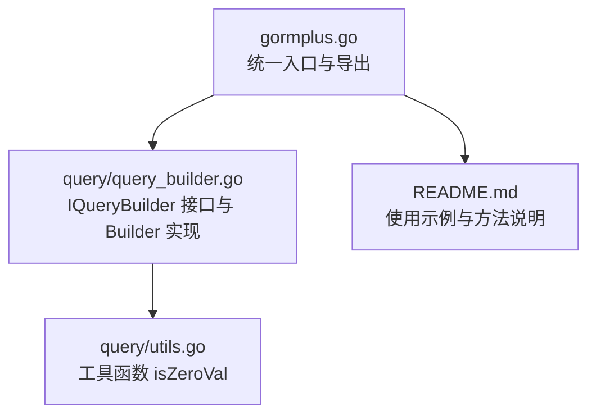
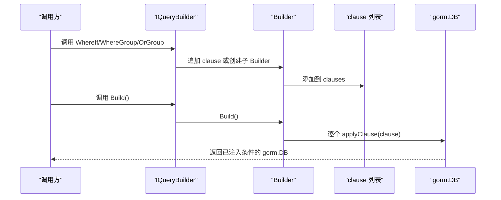
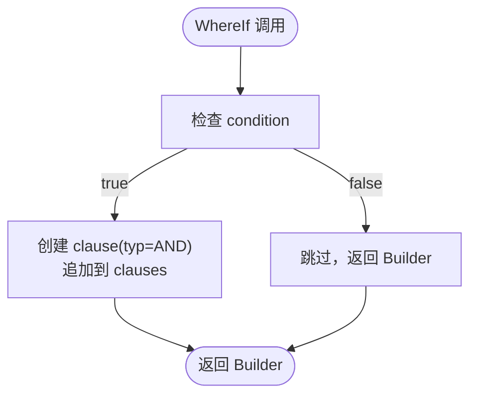
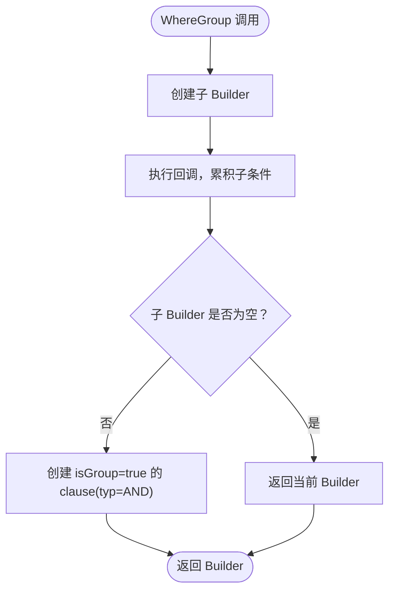
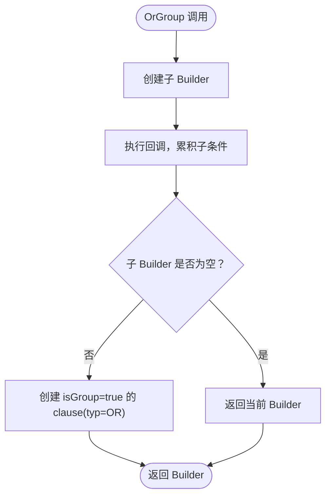
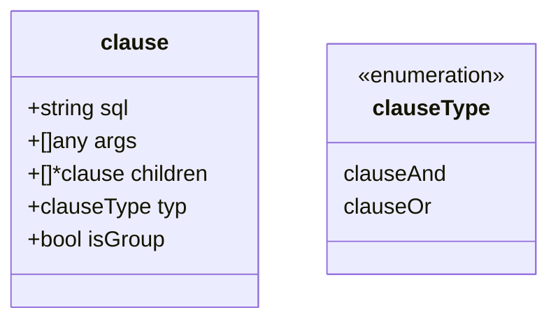
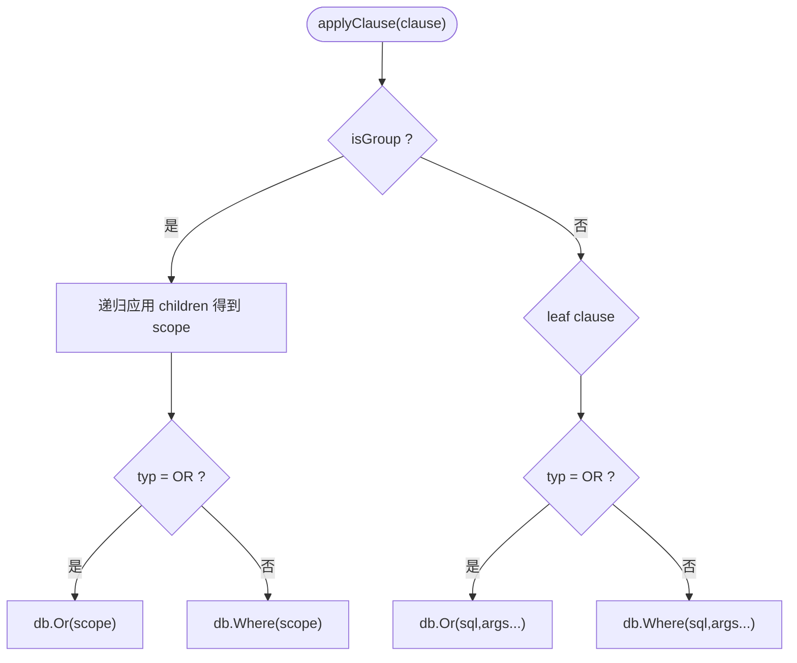
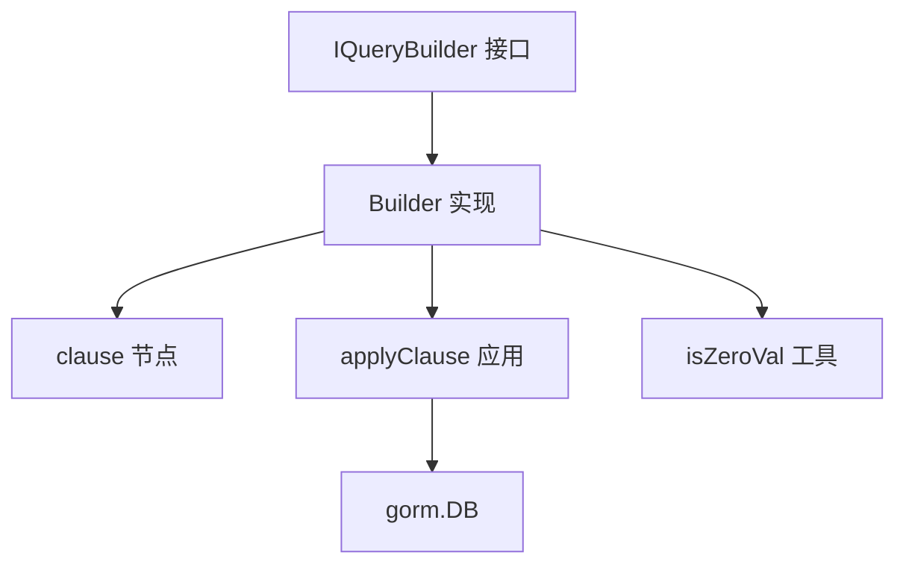

# 条件开关方法

<cite>
**本文档引用的文件**
- [gormplus.go](file://gormplus.go)
- [query_builder.go](file://query/query_builder.go)
- [utils.go](file://query/utils.go)
- [README.md](file://README.md)
</cite>

## 目录
1. [简介](#简介)
2. [项目结构](#项目结构)
3. [核心组件](#核心组件)
4. [架构概览](#架构概览)
5. [详细组件分析](#详细组件分析)
6. [依赖分析](#依赖分析)
7. [性能考虑](#性能考虑)
8. [故障排查指南](#故障排查指南)
9. [结论](#结论)
10. [附录](#附录)

## 简介
本技术文档聚焦于条件开关方法的设计与实现，重点阐述以下三个核心方法：
- WhereIf：条件开关，根据布尔条件决定是否追加 AND 条件，支持参数绑定与占位符。
- WhereGroup：条件分组（AND 括号），将一组条件用括号包裹后以 AND 连接到主查询，保证运算优先级与逻辑分组。
- OrGroup：条件分组（OR 括号），将一组条件用括号包裹后以 OR 连接到主查询，同样保证括号语义与嵌套组合。

文档将从设计理念、实现原理、数据结构、处理流程、参数绑定方式、错误处理与性能特征等方面进行系统化说明，并提供丰富的使用场景与对比分析，帮助读者在可选筛选场景中高效、安全地构建复杂查询条件。

## 项目结构
本项目采用模块化组织，条件开关方法位于 query 子包中，统一入口通过 gormplus.go 导出。README.md 提供了完整的使用示例与方法说明。

图表来源
- [gormplus.go:222-248](file://gormplus.go#L222-L248)
- [query/query_builder.go:66-145](file://query/query_builder.go#L66-L145)
- [query/utils.go:6-43](file://query/utils.go#L6-L43)
- [README.md:219-285](file://README.md#L219-L285)

章节来源
- [gormplus.go:222-248](file://gormplus.go#L222-L248)
- [query/query_builder.go:66-145](file://query/query_builder.go#L66-L145)
- [README.md:219-285](file://README.md#L219-L285)

## 核心组件
- IQueryBuilder 接口：定义链式条件构造器能力，包括模糊查询、范围查询、条件开关与条件分组等。
- Builder 结构体：实现 IQueryBuilder，内部维护 clauses 切片，按顺序累积条件节点。
- clause 结构体：抽象条件节点，支持普通条件与分组条件，区分 AND/OR 类型与是否为分组。
- applyClause 函数：将 clause 应用到 gorm.DB 上，递归处理分组与 OR 条件。

章节来源
- [query/query_builder.go:66-145](file://query/query_builder.go#L66-L145)
- [query/query_builder.go:149-242](file://query/query_builder.go#L149-L242)

## 架构概览
条件开关方法的运行时架构围绕 Builder 与 clause 展开，形成“链式构建 + 延迟应用”的模式。链式调用将条件以 clause 形式保存在 Builder.clauses 中，最终通过 Build() 逐个应用到 gorm.DB 上。

图表来源
- [query/query_builder.go:190-221](file://query/query_builder.go#L190-L221)
- [query/query_builder.go:225-242](file://query/query_builder.go#L225-L242)

## 详细组件分析

### WhereIf 条件开关
- 设计理念
  - 以布尔条件控制是否追加 AND 条件，避免冗余 if-else 判断，提升代码可读性与可维护性。
  - 支持原生 SQL 与参数绑定，参数通过占位符与变参传入，保持与 gorm 原生参数绑定一致。
- 实现原理
  - When condition 为真时，创建 clause 并追加到 Builder.clauses；为假时直接返回当前 Builder，跳过该条件。
  - clause.typ 为 clauseAnd，确保与上一个 AND 条件串联。
- 参数绑定方式
  - query 字段为原生 SQL 片段，args 为参数列表，最终以 gorm.Where(sql, args...) 应用。
- 复杂度与性能
  - 时间复杂度 O(n)，n 为链式调用次数；空间复杂度 O(n)，存储 clauses。
  - 无额外运行时开销，仅在 Build() 时一次性应用。
- 错误处理
  - 条件为假时不追加，不抛异常；参数绑定错误在 Build() 后由 gorm 抛出。
- 使用场景
  - 可选筛选、动态过滤、权限控制等。

图表来源
- [query/query_builder.go:190-195](file://query/query_builder.go#L190-L195)

章节来源
- [query/query_builder.go:99-107](file://query/query_builder.go#L99-L107)
- [query/query_builder.go:190-195](file://query/query_builder.go#L190-L195)

### WhereGroup 条件分组（AND 括号）
- 设计理念
  - 将一组条件用括号包裹，以 AND 连接到主查询，保证逻辑分组与运算优先级。
  - 支持在分组内继续使用 WhereIf/Like/LLike/RLike/BetweenIfNotZero 等完整能力。
- 实现原理
  - 创建子 Builder，将分组内的条件累积到子 Builder.clauses。
  - 若子 Builder 为空，直接返回当前 Builder；否则创建 isGroup=true 的 clause，typ=clauseAnd。
  - applyClause 遇到 isGroup=true 时，先递归应用子 clause，再以 db.Where(scope) 包裹。
- 嵌套使用
  - 可在 WhereGroup 内再次调用 WhereGroup 或 OrGroup，形成多层括号分组。
- 使用场景
  - 复杂 AND 条件的逻辑分组，避免遗漏括号导致的优先级问题。

图表来源
- [query/query_builder.go:197-204](file://query/query_builder.go#L197-L204)
- [query/query_builder.go:225-237](file://query/query_builder.go#L225-L237)

章节来源
- [query/query_builder.go:111-120](file://query/query_builder.go#L111-L120)
- [query/query_builder.go:197-204](file://query/query_builder.go#L197-L204)

### OrGroup 条件分组（OR 括号）
- 设计理念
  - 将一组条件用括号包裹，以 OR 连接到主查询，常用于“主条件 OR 子条件集合”的场景。
- 实现原理
  - 与 WhereGroup 类似，但创建的是 typ=clauseOr 的分组 clause。
  - applyClause 遇到 isGroup=true 且 typ=clauseOr 时，使用 db.Or(scope) 包裹。
- 使用场景
  - “主条件 OR (子条件 AND 子条件)” 的复杂筛选。

图表来源
- [query/query_builder.go:206-213](file://query/query_builder.go#L206-L213)
- [query/query_builder.go:225-242](file://query/query_builder.go#L225-L242)

章节来源
- [query/query_builder.go:122-131](file://query/query_builder.go#L122-L131)
- [query/query_builder.go:206-213](file://query/query_builder.go#L206-L213)

### 数据结构与处理流程

#### clause 结构体
- 字段
  - sql：SQL 片段
  - args：参数数组
  - children：子 clause 列表（仅在 isGroup=true 时有效）
  - typ：clauseType（clauseAnd 或 clauseOr）
  - isGroup：是否为分组
- 作用
  - 统一表示条件与分组，便于递归应用到 gorm.DB。

图表来源
- [query/query_builder.go:149-162](file://query/query_builder.go#L149-L162)

#### applyClause 应用流程
- 若 isGroup=true
  - 递归应用 children，得到子查询作用域 scope
  - 若 typ=clauseOr：db.Or(scope)
  - 否则：db.Where(scope)
- 若 isGroup=false
  - 若 typ=clauseOr：db.Or(sql, args...)
  - 否则：db.Where(sql, args...)

图表来源
- [query/query_builder.go:225-242](file://query/query_builder.go#L225-L242)

章节来源
- [query/query_builder.go:149-242](file://query/query_builder.go#L149-L242)

### 参数绑定与占位符
- WhereIf 支持原生 SQL 与参数绑定，参数通过变参传入，最终以 gorm.Where(sql, args...) 应用。
- WhereGroup/OrGroup 内部条件同样遵循该绑定方式，保持一致性。
- BetweenIfNotZero 使用 isZeroVal 判断零值，避免将零值作为筛选条件。

章节来源
- [query/query_builder.go:190-195](file://query/query_builder.go#L190-L195)
- [query/query_builder.go:186-188](file://query/query_builder.go#L186-L188)
- [query/utils.go:6-43](file://query/utils.go#L6-L43)

### 与传统 if-else 的优势
- 可读性：链式调用减少分支嵌套，逻辑更清晰。
- 可组合性：WhereGroup/OrGroup 提供稳定的括号语义，避免手写 SQL 时括号遗漏导致的优先级问题。
- 参数安全：统一的参数绑定方式，降低 SQL 注入风险。
- 可测试性：每个条件可独立测试，便于单元测试与集成测试。

章节来源
- [query/query_builder.go:99-131](file://query/query_builder.go#L99-L131)
- [README.md:219-285](file://README.md#L219-L285)

## 依赖分析
- IQueryBuilder 依赖 gorm.DB，通过 db.WithContext(ctx).Model(...) 初始化。
- Builder 依赖 clause 与 applyClause，实现条件累积与应用。
- BetweenIfNotZero 依赖 isZeroVal，统一零值判断逻辑。

图表来源
- [query/query_builder.go:66-145](file://query/query_builder.go#L66-L145)
- [query/query_builder.go:149-242](file://query/query_builder.go#L149-L242)
- [query/utils.go:6-43](file://query/utils.go#L6-L43)

章节来源
- [query/query_builder.go:66-145](file://query/query_builder.go#L66-L145)
- [query/query_builder.go:149-242](file://query/query_builder.go#L149-L242)
- [query/utils.go:6-43](file://query/utils.go#L6-L43)

## 性能考虑
- 时间复杂度：链式构建 O(n)，Build() 应用 O(n)。
- 空间复杂度：O(n)，存储 clauses。
- 参数绑定：与 gorm 原生参数绑定一致，避免字符串拼接带来的性能与安全问题。
- 括号分组：递归应用子 clause，深度受限于分组层级，一般为常数级开销。
- 零值过滤：BetweenIfNotZero 使用 isZeroVal，避免无效条件进入 SQL，减少数据库负担。

## 故障排查指南
- 条件未生效
  - 检查 WhereIf 的 condition 是否为真；若为假，条件将被跳过。
  - 确认参数绑定顺序与占位符数量一致。
- 括号语义错误
  - 使用 WhereGroup/OrGroup 包裹相关条件，确保优先级符合预期。
  - 避免在分组外直接拼接 OR 条件，可能导致优先级混乱。
- 参数绑定异常
  - 确保 args 数量与 SQL 中占位符一致；gorm 在 Build() 后抛出参数错误。
- 零值导致条件缺失
  - BetweenIfNotZero 会在任一零值时跳过条件，确认输入值是否为零值。

章节来源
- [query/query_builder.go:190-195](file://query/query_builder.go#L190-L195)
- [query/query_builder.go:186-188](file://query/query_builder.go#L186-L188)
- [query/query_builder.go:225-242](file://query/query_builder.go#L225-L242)

## 结论
WhereIf、WhereGroup、OrGroup 三者共同构成了 gorm-plus 条件构造器的“条件开关 + 分组控制”能力。通过布尔条件与分组括号，开发者可以在不牺牲可读性与安全性的情况下，灵活构建复杂的查询条件。结合 README.md 的示例与本技术文档的实现细节，可在可选筛选、权限控制、复杂联表查询等场景中高效落地。

## 附录
- 使用示例参考
  - 原生 gorm 链式条件构造器示例与方法说明：[README.md:219-285](file://README.md#L219-L285)
  - gormplus.Query 包装入口与示例：[gormplus.go:222-248](file://gormplus.go#L222-L248)