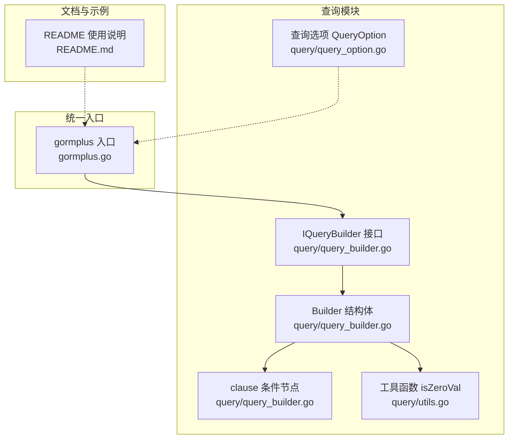
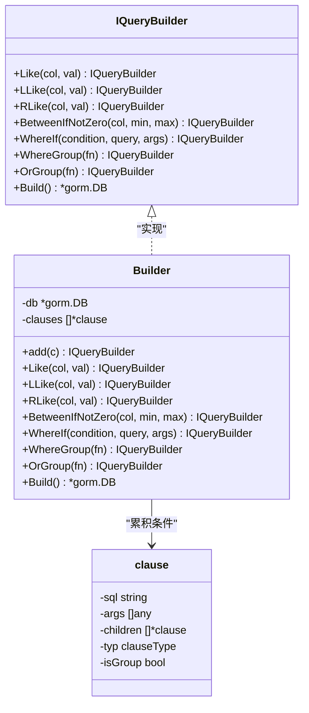
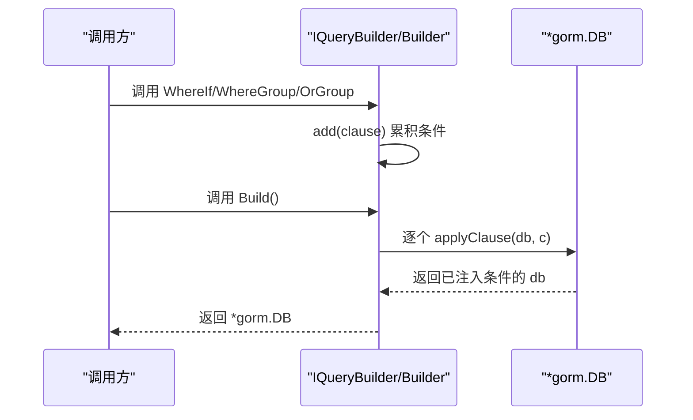
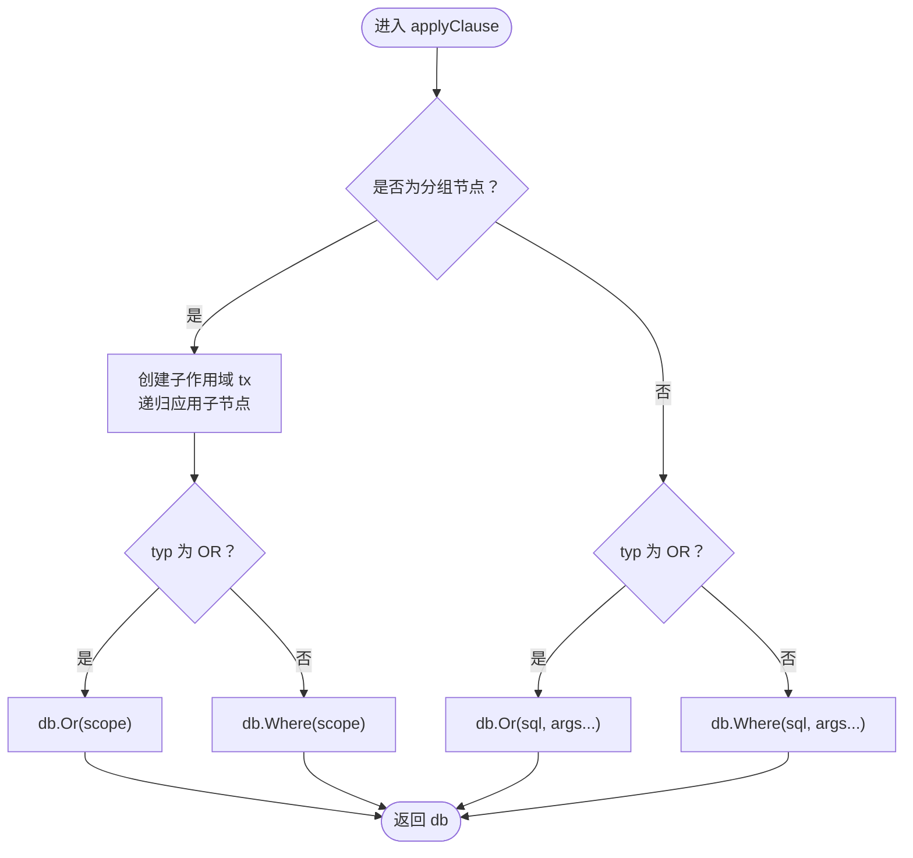
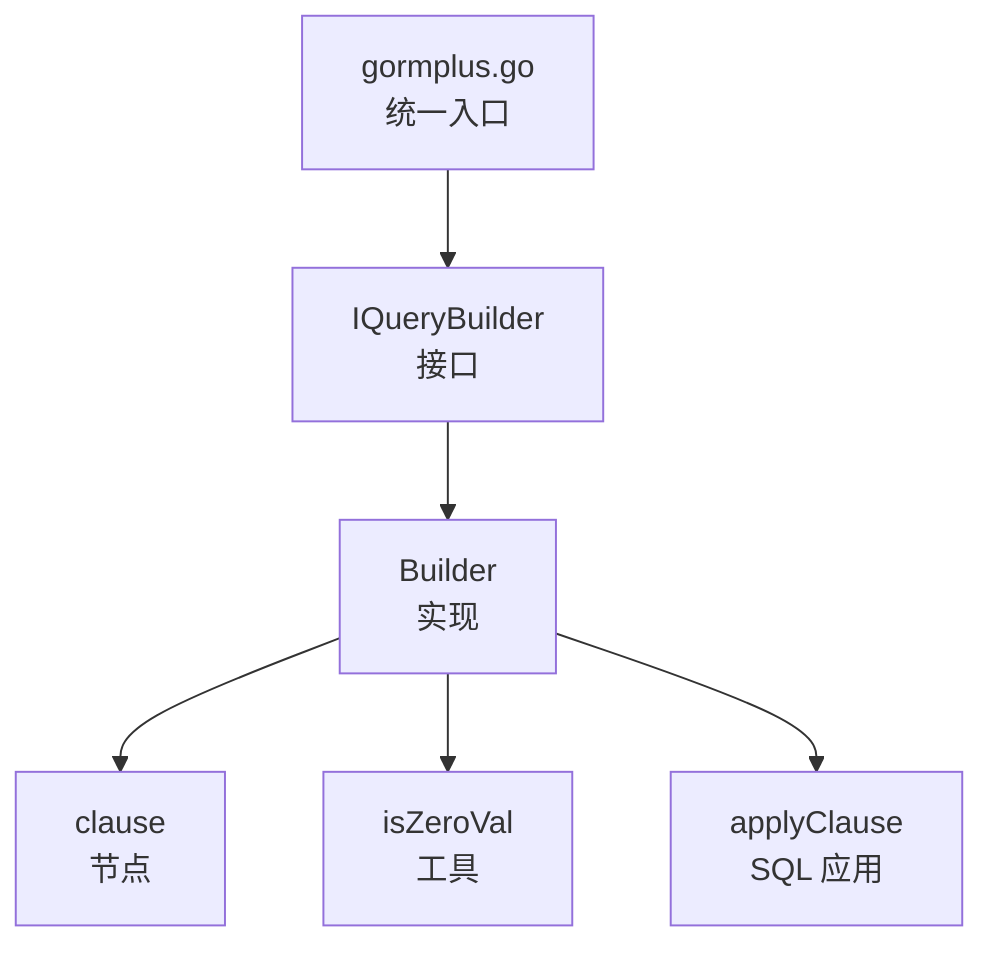

# 构建器接口设计

<cite>
**本文档引用的文件**
- [query_builder.go](file://query/query_builder.go)
- [gormplus.go](file://gormplus.go)
- [query_option.go](file://query/query_option.go)
- [utils.go](file://query/utils.go)
- [README.md](file://README.md)
</cite>

## 目录
1. [简介](#简介)
2. [项目结构](#项目结构)
3. [核心组件](#核心组件)
4. [架构概览](#架构概览)
5. [详细组件分析](#详细组件分析)
6. [依赖分析](#依赖分析)
7. [性能考虑](#性能考虑)
8. [故障排查指南](#故障排查指南)
9. [结论](#结论)
10. [附录](#附录)

## 简介
本文件面向构建器接口设计，聚焦 IQueryBuilder 接口及其 Builder 实现，系统阐述其设计理念、架构原理、方法命名规范与参数约定，并深入解析条件节点（clause）的设计与 SQL 生成机制。同时提供链式调用的实现原理与性能考量，以及基于此接口进行扩展的最佳实践，并说明与原生 GORM 的集成方式与兼容性。

## 项目结构
本项目采用模块化组织，核心查询构建器位于 query 包，统一入口位于 gormplus 包，配套工具与选项位于 query 子包。README 提供了完整的使用示例与最佳实践。

**图表来源**
- [query_builder.go:1-307](file://query/query_builder.go#L1-L307)
- [gormplus.go:216-288](file://gormplus.go#L216-L288)
- [query_option.go:1-199](file://query/query_option.go#L1-L199)
- [utils.go:1-44](file://query/utils.go#L1-L44)
- [README.md:219-283](file://README.md#L219-L283)

**章节来源**
- [query_builder.go:1-307](file://query/query_builder.go#L1-L307)
- [gormplus.go:216-288](file://gormplus.go#L216-L288)
- [query_option.go:1-199](file://query/query_option.go#L1-L199)
- [utils.go:1-44](file://query/utils.go#L1-L44)
- [README.md:219-283](file://README.md#L219-L283)

## 核心组件
- IQueryBuilder 接口：定义链式条件构建器的对外能力，包括模糊查询、范围查询、条件开关、条件分组与出口 Build。
- Builder 结构体：实现 IQueryBuilder，内部维护 clauses 列表与底层 gorm.DB 上下文。
- clause 条件节点：抽象 SQL 片段（sql、args、children、typ、isGroup），支持 AND/OR 与分组括号。
- 工具函数 isZeroVal：判断零值，用于 BetweenIfNotZero 等“零值跳过”逻辑。
- 查询选项 QueryOption：为 gorm-gen 类型安全链式构造器提供选项聚合（与 IQueryBuilder 并行存在）。

**章节来源**
- [query_builder.go:66-145](file://query/query_builder.go#L66-L145)
- [query_builder.go:147-169](file://query/query_builder.go#L147-L169)
- [query_builder.go:149-155](file://query/query_builder.go#L149-L155)
- [query_builder.go:6-43](file://query/query_builder.go#L6-L43)
- [query_option.go:21-30](file://query/query_option.go#L21-L30)

## 架构概览
IQueryBuilder 以 Builder 为核心实现，通过 add 方法累积 clause，Build 时逐个应用 applyClause，最终返回原生 gorm.DB，从而无缝衔接所有 gorm 原生方法（Find、Count、Order、Limit、Joins 等）。

**图表来源**
- [query_builder.go:66-145](file://query/query_builder.go#L66-L145)
- [query_builder.go:166-221](file://query/query_builder.go#L166-L221)
- [query_builder.go:149-155](file://query/query_builder.go#L149-L155)

## 详细组件分析

### IQueryBuilder 接口设计与方法规范
- 模糊查询族：Like、LLike、RLike，均在值非空时追加 LIKE 条件，空值自动跳过，提升可选筛选的健壮性。
- 范围查询：BetweenIfNotZero，仅当 min 与 max 均非零时生效，适配时间区间、金额区间等常见场景。
- 条件开关：WhereIf，condition 为真时追加 AND 条件，false 时整体跳过，替代冗长的 if 判断。
- 条件分组：WhereGroup 与 OrGroup，分别以 AND/OR 将子条件用括号包裹，保证语义正确，组内可继续使用完整 IQueryBuilder 能力。
- 出口：Build 返回原生 *gorm.DB，后续可直接调用 gorm 原生方法。

命名规范与参数约定：
- 方法名采用动词短语，语义清晰，如 WhereIf、BetweenIfNotZero。
- 参数遵循“列名 + 条件 + 可变参数”的模式，便于链式拼装。
- 条件分组通过函数回调注入，避免手写括号与 AND/OR 混乱。

**章节来源**
- [query_builder.go:66-145](file://query/query_builder.go#L66-L145)

### Builder 结构体与内部实现
- 字段：
  - db：底层 gorm.DB，带上下文，承载查询执行。
  - clauses：累积的条件节点切片，按顺序应用。
- add 方法：将 clause 追加到 clauses，返回自身以支持链式调用。
- Like/LLike/RLike：基于 WhereIf 的便捷包装，自动拼接列名与 LIKE 模式。
- BetweenIfNotZero：基于 isZeroVal 的零值判断，仅在双非零时追加 BETWEEN 条件。
- WhereIf：condition 为真时创建 AND 类型 clause 并追加。
- WhereGroup/OrGroup：创建子 Builder，收集子条件后以括号形式追加，typ 分别为 AND/OR。
- Build：遍历 clauses，逐个调用 applyClause 应用到 db，返回最终 *gorm.DB。

**图表来源**
- [query_builder.go:190-221](file://query/query_builder.go#L190-L221)
- [query_builder.go:225-242](file://query/query_builder.go#L225-L242)

**章节来源**
- [query_builder.go:166-221](file://query/query_builder.go#L166-L221)

### 条件节点（clause）设计与 SQL 生成机制
- 结构体字段：
  - sql：SQL 片段（含 ? 占位符）。
  - args：与 sql 对应的参数切片。
  - children：子节点数组，用于分组。
  - typ：clauseType（AND/OR）。
  - isGroup：是否为分组节点。
- applyClause：
  - 若 isGroup：
    - 递归对 children 应用 applyClause，形成子作用域 tx。
    - 根据 typ 选择 db.Where(scope) 或 db.Or(scope)。
  - 若非分组：
    - 根据 typ 选择 db.Where(sql, args...) 或 db.Or(sql, args...)。
- 该机制确保：
  - 条件分组的括号语义正确。
  - AND/OR 优先级与组合逻辑符合预期。
  - 与 gorm 的 Where/Or 语义完全一致，便于无缝集成。

**图表来源**
- [query_builder.go:225-242](file://query/query_builder.go#L225-L242)

**章节来源**
- [query_builder.go:149-155](file://query/query_builder.go#L149-L155)
- [query_builder.go:225-242](file://query/query_builder.go#L225-L242)

### 链式调用实现原理与性能考虑
- 实现原理：
  - 所有方法返回 IQueryBuilder，内部通过 add 追加 clause，保持调用链不断。
  - Build 时一次性遍历并应用所有条件，避免中间态暴露。
- 性能考虑：
  - 条件累积在内存中，Build 时一次性应用，时间复杂度 O(N)，N 为条件数量。
  - 零值跳过（BetweenIfNotZero）减少不必要的 SQL 片段拼接。
  - 条件分组通过 children 递归应用，避免字符串拼接带来的复杂度与错误风险。
  - 与 gorm 原生 Where/Or 语义一致，复用底层优化。

**章节来源**
- [query_builder.go:171-174](file://query/query_builder.go#L171-L174)
- [query_builder.go:186-188](file://query/query_builder.go#L186-L188)
- [query_builder.go:215-221](file://query/query_builder.go#L215-L221)

### 与原生 GORM 的集成方式与兼容性
- 入口统一：gormplus.Query 提供便捷入口，内部委托 query.NewQuery。
- Build 返回原生 *gorm.DB，后续可直接调用 gorm 原生方法（Find、Count、Order、Limit、Joins、Scan 等）。
- README 提供了丰富的使用示例，涵盖分页、联表、条件分组等典型场景。
- 兼容性：
  - 保持与 gorm.Where/Or 的参数与占位符约定一致。
  - 通过 WithContext 传递上下文，支持链路追踪、超时控制等。

**章节来源**
- [gormplus.go:246-248](file://gormplus.go#L246-L248)
- [query_builder.go:60-64](file://query/query_builder.go#L60-L64)
- [README.md:219-283](file://README.md#L219-L283)

### 扩展最佳实践
- 基于现有方法扩展：
  - 新增方法时遵循“条件成立才追加”的原则，保持与 WhereIf 一致的语义。
  - 使用 isZeroVal 统一零值判断，避免重复逻辑。
- 条件分组：
  - 使用 WhereGroup/OrGroup 包裹复杂条件，确保括号与优先级正确。
- 与 gorm-gen 的协作：
  - gorm-gen 类型安全链式构造器（IGenWrapper）与 IQueryBuilder 并行存在，可根据场景选择。
  - QueryOption 提供聚合配置，便于在复杂场景中统一管理条件、排序、分页等。

**章节来源**
- [query_builder.go:6-43](file://query/query_builder.go#L6-L43)
- [query_builder.go:197-213](file://query/query_builder.go#L197-L213)
- [query_option.go:21-30](file://query/query_option.go#L21-L30)

## 依赖分析
- IQueryBuilder 依赖 gorm.DB 与 clause 节点。
- Builder 依赖工具函数 isZeroVal 与 applyClause。
- gormplus 入口将 IQueryBuilder 暴露为统一 API，便于全局使用。

**图表来源**
- [gormplus.go:216-288](file://gormplus.go#L216-L288)
- [query_builder.go:66-145](file://query/query_builder.go#L66-L145)
- [query_builder.go:149-155](file://query/query_builder.go#L149-L155)
- [query_builder.go:6-43](file://query/query_builder.go#L6-L43)
- [query_builder.go:225-242](file://query/query_builder.go#L225-L242)

**章节来源**
- [gormplus.go:216-288](file://gormplus.go#L216-L288)
- [query_builder.go:66-145](file://query/query_builder.go#L66-L145)
- [query_builder.go:149-155](file://query/query_builder.go#L149-L155)
- [query_builder.go:6-43](file://query/query_builder.go#L6-L43)
- [query_builder.go:225-242](file://query/query_builder.go#L225-L242)

## 性能考虑
- 时间复杂度：Build 遍历条件 O(N)，N 为条件数量；分组递归 O(M)，M 为子条件数量。
- 内存占用：clauses 切片累积条件，空间复杂度 O(N)。
- 零值跳过：BetweenIfNotZero 通过 isZeroVal 提前终止，减少 SQL 片段与参数数量。
- 与 gorm 的一致性：直接调用 gorm.Where/Or，复用底层优化与参数绑定。

[本节为通用性能讨论，无需具体文件分析]

## 故障排查指南
- 条件未生效：
  - 检查 WhereIf 的 condition 是否为真，或值是否为空导致跳过。
  - 确认 BetweenIfNotZero 的边界值是否为零值。
- 条件分组错误：
  - 确保 WhereGroup/OrGroup 的子条件正确闭包注入，避免遗漏或错误闭包。
- 与 gorm 原生方法冲突：
  - Build 返回的是原生 *gorm.DB，可直接调用 gorm 原生方法；若出现参数绑定问题，检查占位符与参数数量是否一致。
- 上下文与超时：
  - 通过 WithContext 传递上下文，确保链路追踪与超时控制生效。

**章节来源**
- [query_builder.go:190-195](file://query/query_builder.go#L190-L195)
- [query_builder.go:186-188](file://query/query_builder.go#L186-L188)
- [query_builder.go:197-213](file://query/query_builder.go#L197-L213)
- [query_builder.go:60-64](file://query/query_builder.go#L60-L64)

## 结论
IQueryBuilder 通过 Builder 与 clause 节点的组合，提供了简洁、可读性强且与 gorm 原生生态完全兼容的链式条件构建能力。其“条件成立才追加”的设计与零值跳过机制提升了可选筛选的健壮性；条件分组确保了复杂查询的括号与优先级正确性。结合 gormplus 的统一入口与 README 的丰富示例，开发者可以高效地在项目中落地该接口，并基于其扩展更多实用方法。

[本节为总结性内容，无需具体文件分析]

## 附录
- 使用示例与最佳实践详见 README 的“原生 gorm 链式条件构造器（Query）”章节。
- gorm-gen 类型安全链式构造器与 QueryOption 提供了另一种查询风格的选择。

**章节来源**
- [README.md:219-283](file://README.md#L219-L283)
- [query_option.go:21-30](file://query/query_option.go#L21-L30)