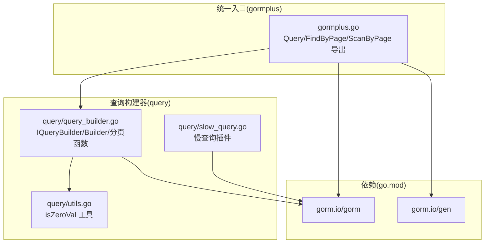
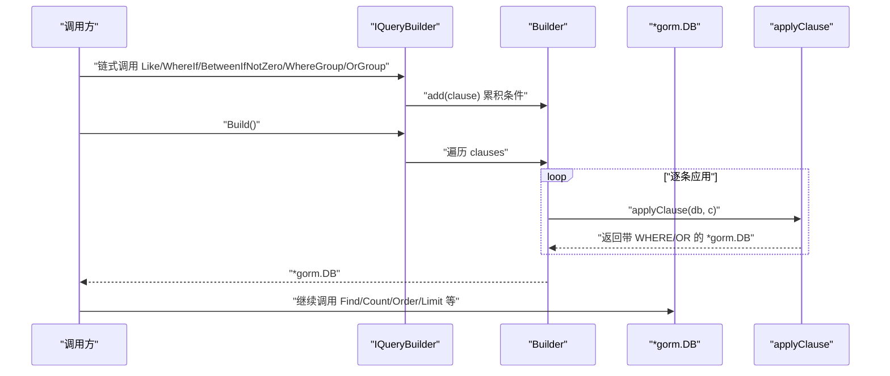
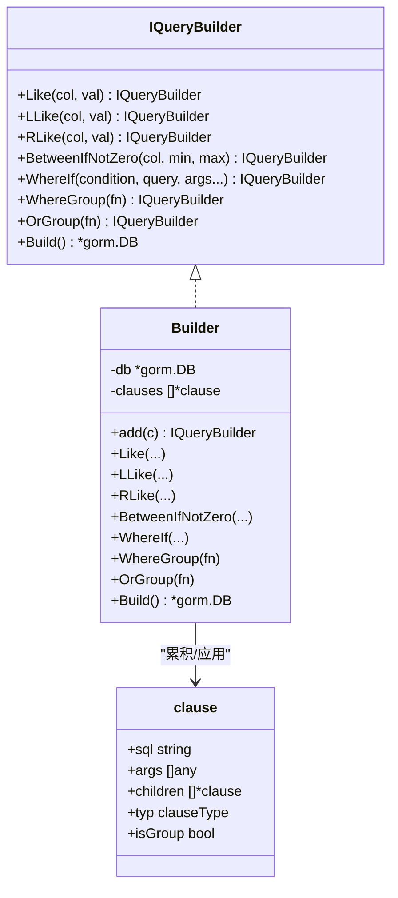
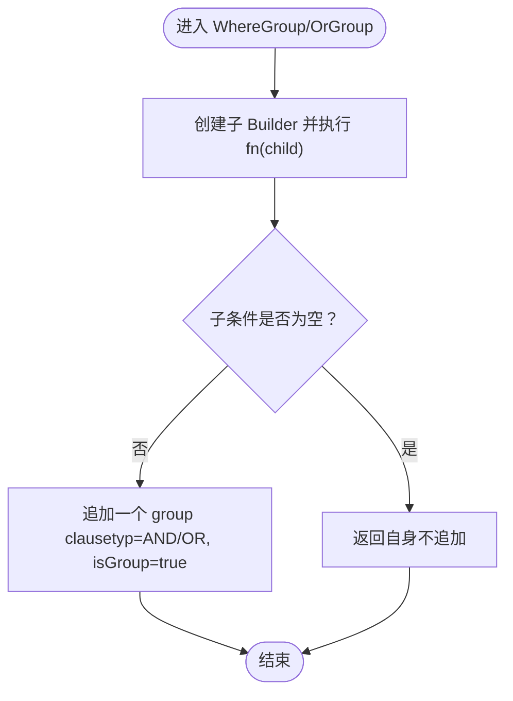
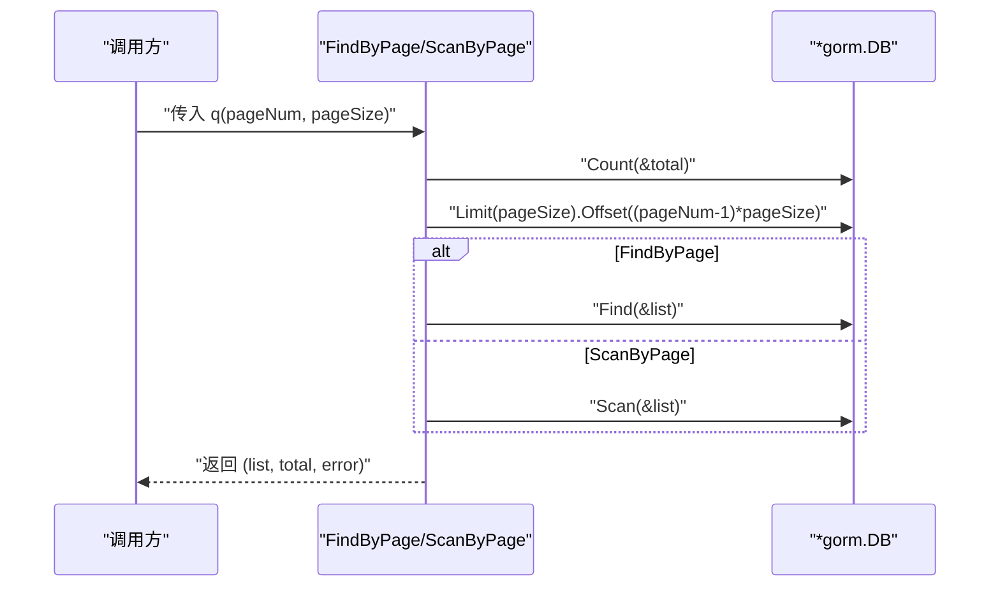
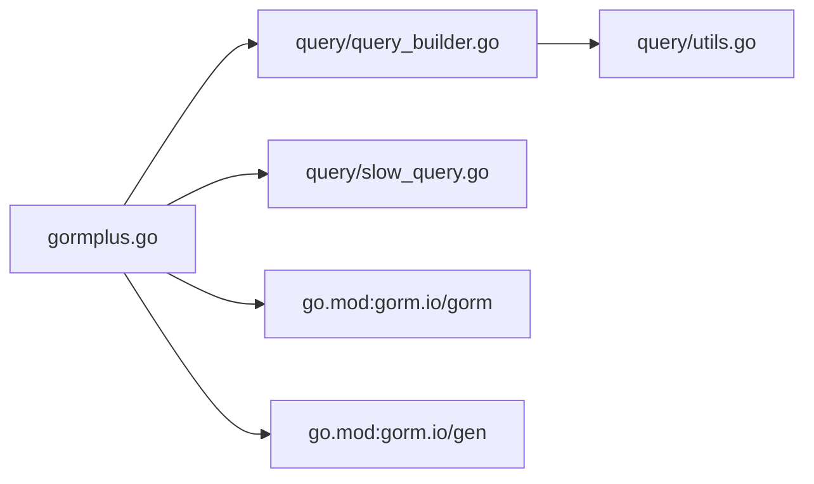

# 查询构建器

<cite>
**本文引用的文件**
- [query/query_builder.go](file://query/query_builder.go)
- [query/query_option.go](file://query/query_option.go)
- [query/utils.go](file://query/utils.go)
- [query/slow_query.go](file://query/slow_query.go)
- [gormplus.go](file://gormplus.go)
- [README.md](file://README.md)
- [go.mod](file://go.mod)
- [version.go](file://version.go)
</cite>

## 目录
1. [简介](#简介)
2. [项目结构](#项目结构)
3. [核心组件](#核心组件)
4. [架构概览](#架构概览)
5. [详细组件分析](#详细组件分析)
6. [依赖分析](#依赖分析)
7. [性能考虑](#性能考虑)
8. [故障排查指南](#故障排查指南)
9. [结论](#结论)
10. [附录](#附录)

## 简介
本文件面向“查询构建器”模块，系统性阐述基于原生 GORM 的链式条件构造器 IQueryBuilder 的设计理念、实现原理与使用方法。内容涵盖：
- IQueryBuilder 接口定义与链式调用语义
- 模糊查询（Like/LLike/RLike）、范围查询（BetweenIfNotZero）、条件开关（WhereIf）、条件分组（WhereGroup/OrGroup）等关键方法
- 泛型分页查询（FindByPage/ScanByPage）的实现机制与使用场景
- 与原生 GORM 的兼容性与扩展性
- 性能优化建议与最佳实践
- 慢查询监控插件的集成与使用

## 项目结构
查询构建器位于 query 子包，核心文件包括：
- query/query_builder.go：IQueryBuilder 接口与 Builder 实现、模糊/范围/条件开关/分组/出口 Build、泛型分页函数
- query/utils.go：零值判断工具 isZeroVal
- query/slow_query.go：慢查询监控插件（gorm 插件形式）
- gormplus.go：统一入口导出 Query、FindByPage、ScanByPage 等，并桥接 query 包能力
- README.md：快速开始与使用示例
- go.mod：依赖声明（GORM、GORM-Gen 等）

图表来源
- [query/query_builder.go:1-307](file://query/query_builder.go#L1-L307)
- [query/utils.go:1-44](file://query/utils.go#L1-L44)
- [query/slow_query.go:1-235](file://query/slow_query.go#L1-L235)
- [gormplus.go:216-288](file://gormplus.go#L216-L288)
- [go.mod:3-10](file://go.mod#L3-L10)

章节来源
- [README.md:17-41](file://README.md#L17-L41)
- [go.mod:1-26](file://go.mod#L1-L26)

## 核心组件
- IQueryBuilder 接口：定义链式条件构造器能力，支持模糊查询、范围查询、条件开关、条件分组、Build 返回原生 gorm.DB
- Builder 结构体：持有 *gorm.DB 与条件节点切片，按链式调用累积条件，Build 时逐个应用
- clause/applyClause：内部条件节点与应用逻辑，支持 AND/OR 与括号分组
- 泛型分页函数：FindByPage（Find 映射）与 ScanByPage（Scan 映射），自动 Count 并分页取数
- 慢查询插件：基于 gorm 插件钩子，对 Query/Create/Update/Delete/Row/Raw 全类操作进行耗时统计与日志输出

章节来源
- [query/query_builder.go:66-145](file://query/query_builder.go#L66-L145)
- [query/query_builder.go:166-242](file://query/query_builder.go#L166-L242)
- [query/query_builder.go:244-307](file://query/query_builder.go#L244-L307)
- [query/slow_query.go:85-235](file://query/slow_query.go#L85-L235)

## 架构概览
查询构建器采用“链式条件累积 + 最终一次性应用”的设计，确保：
- 条件拼装清晰、可读性强
- 与原生 GORM 完全兼容，Build 后可继续调用所有 gorm 原生方法
- 通过内部 clause 抽象，保证括号分组与 AND/OR 语义正确

图表来源
- [query/query_builder.go:190-221](file://query/query_builder.go#L190-L221)
- [query/query_builder.go:225-242](file://query/query_builder.go#L225-L242)

## 详细组件分析

### IQueryBuilder 接口与 Builder 实现
- 接口职责：提供链式条件构造能力，最终 Build 返回原生 gorm.DB
- Builder 设计要点：
  - 持有 db 与 clauses 切片，add 方法追加 clause
  - Like/LLike/RLike 基于 WhereIf，空值自动跳过
  - BetweenIfNotZero 基于 isZeroVal 判断，任一零值跳过
  - WhereIf(condition, sql, args...)：condition 为真时追加 AND 条件
  - WhereGroup/OrGroup：将子函数内的条件用括号包裹，分别以 AND/OR 连接
  - Build：遍历 clauses，逐个应用到 db，返回最终 *gorm.DB

图表来源
- [query/query_builder.go:66-145](file://query/query_builder.go#L66-L145)
- [query/query_builder.go:149-155](file://query/query_builder.go#L149-L155)
- [query/query_builder.go:166-221](file://query/query_builder.go#L166-L221)

章节来源
- [query/query_builder.go:66-145](file://query/query_builder.go#L66-L145)
- [query/query_builder.go:166-221](file://query/query_builder.go#L166-L221)

### 模糊查询（Like/LLike/RLike）
- Like：双侧模糊，值为空自动跳过
- LLike：左侧模糊，值为空自动跳过
- RLike：右侧模糊，值为空自动跳过
- 设计动机：简化空值判断，提升可读性；右侧模糊可利用前缀索引，性能更优

章节来源
- [query/query_builder.go:176-184](file://query/query_builder.go#L176-L184)

### 范围查询（BetweenIfNotZero）
- 语义：闭区间 [min, max]，min 与 max 同时非零才生效
- 适用场景：时间区间、金额区间等前端可选筛选
- 实现：基于 isZeroVal 判断，任一零值跳过

章节来源
- [query/query_builder.go:186-188](file://query/query_builder.go#L186-L188)
- [query/utils.go:6-43](file://query/utils.go#L6-L43)

### 条件开关（WhereIf）
- 语义：condition 为真时追加 AND 条件，支持占位符；为假时整体跳过
- 适用场景：所有可选筛选条件，替代冗长的 if 判断
- 与原生 GORM 的兼容性：WhereIf 内部调用 db.Where(sql, args...)，保持语义一致

章节来源
- [query/query_builder.go:190-195](file://query/query_builder.go#L190-L195)

### 条件分组（WhereGroup/OrGroup）
- WhereGroup：将子函数内的条件用括号包裹后以 AND 连接到主查询
- OrGroup：将子函数内的条件用括号包裹后以 OR 连接到主查询
- 语义保证：内部可继续使用 WhereIf/Like/LLike 等完整能力，括号层级正确

图表来源
- [query/query_builder.go:197-213](file://query/query_builder.go#L197-L213)

章节来源
- [query/query_builder.go:111-131](file://query/query_builder.go#L111-L131)
- [query/query_builder.go:197-213](file://query/query_builder.go#L197-L213)

### 出口（Build）
- 将累积的 clause 逐个应用到 db，返回最终的 *gorm.DB
- applyClause：根据 clause.typ（AND/OR）与 isGroup 决定使用 db.Where 或 db.Or，并递归应用子条件

章节来源
- [query/query_builder.go:215-242](file://query/query_builder.go#L215-L242)

### 泛型分页查询（FindByPage/ScanByPage）
- FindByPage：适用于结果直接映射到模型结构体的列表查询，内部自动 Count 并分页取数
- ScanByPage：适用于联表查询、自定义 SELECT 字段映射到 VO 的场景，使用 Scan 代替 Find
- 通用逻辑：校正 pageNum/pageSize（最小值），先 Count 再 Limit/Offset 取数

图表来源
- [query/query_builder.go:257-306](file://query/query_builder.go#L257-L306)

章节来源
- [query/query_builder.go:244-307](file://query/query_builder.go#L244-L307)

### 与原生 GORM 的兼容性与扩展性
- 兼容性：IQueryBuilder.Build 返回原生 *gorm.DB，后续可继续调用所有 gorm 原生方法（Select/Joins/Order/Limit/Find/Count 等）
- 扩展性：在不改变现有链式语法的前提下，新增方法（如 RawWhere/RawOrWhere/RawWhereIf）可无缝接入
- 上层统一入口：gormplus.Query/FindByPage/ScanByPage 直接导出 query 包能力，便于全局使用

章节来源
- [query/query_builder.go:135-144](file://query/query_builder.go#L135-L144)
- [gormplus.go:216-288](file://gormplus.go#L216-L288)

### 慢查询监控插件
- 插件类型：gorm.Plugin，覆盖 Query/Create/Update/Delete/Row/Raw 全类操作
- 工作机制：before 钩子记录开始时间，after 钩子计算耗时，超过阈值触发自定义 Logger
- 配置项：Threshold（阈值，默认 200ms）、Logger（自定义日志函数）
- 与租户插件互不干扰，可同时注册

章节来源
- [query/slow_query.go:85-235](file://query/slow_query.go#L85-L235)

## 依赖分析
- 直接依赖：gorm.io/gorm（原生 ORM）
- 间接依赖：gorm.io/gen（类型安全链式构造器相关能力）
- 版本：go 1.25.5；gorm v1.31.1；gorm-gen v0.3.27

图表来源
- [gormplus.go:88-101](file://gormplus.go#L88-L101)
- [go.mod:3-10](file://go.mod#L3-L10)

章节来源
- [go.mod:1-26](file://go.mod#L1-L26)

## 性能考虑
- 模糊查询优先使用右侧模糊（RLike）以利用前缀索引，减少全表扫描
- BetweenIfNotZero 在前端可选区间场景下自动跳过零值，避免无效条件导致的索引失效
- WhereIf 条件开关避免冗余 if 判断，减少分支与字符串拼接
- 分页查询先 Count 再 Limit/Offset，避免一次性拉取大量数据；如需极致性能，可结合数据库层面的游标分页或覆盖索引
- 慢查询监控建议阈值设置为 200ms~500ms，便于及时发现异常 SQL

[本节为通用性能建议，不直接分析具体文件]

## 故障排查指南
- 条件未生效
  - 检查 WhereIf/RLike/Like 等方法的值是否为空（空值将被跳过）
  - 检查 BetweenIfNotZero 的 min/max 是否为零值
- 括号分组错误
  - 确认 WhereGroup/OrGroup 的子函数是否正确传入，且子函数内条件是否使用完整 IQueryBuilder 能力
- 分页总数异常
  - 确认 Build 后是否在 Count 前去除了 ORDER BY（FindByPage/ScanByPage 内部已处理）
- 慢查询告警频繁
  - 调整 Threshold 阈值或优化 SQL（索引、查询计划）

章节来源
- [query/query_builder.go:176-188](file://query/query_builder.go#L176-L188)
- [query/query_builder.go:257-306](file://query/query_builder.go#L257-L306)
- [query/slow_query.go:104-161](file://query/slow_query.go#L104-L161)

## 结论
查询构建器通过 IQueryBuilder 接口与 Builder 实现，提供了简洁、可读、可组合的链式条件构造能力，并与原生 GORM 完全兼容。配合泛型分页函数与慢查询监控插件，能够满足大多数业务查询场景的需求。建议在实际使用中遵循“右侧模糊优先、条件开关化简、分组括号正确”的原则，并结合慢查询监控持续优化 SQL 性能。

[本节为总结性内容，不直接分析具体文件]

## 附录
- 快速开始与示例参考：README.md 中的“原生 gorm 链式条件构造器（Query）”章节
- 版本信息：Version = v1.0.13

章节来源
- [README.md:219-283](file://README.md#L219-L283)
- [version.go:1-4](file://version.go#L1-L4)