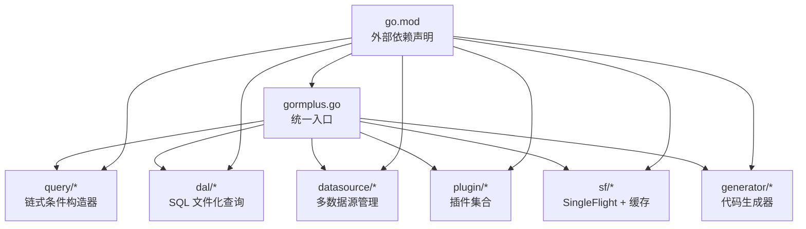
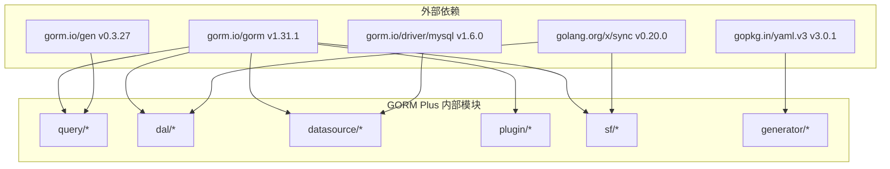
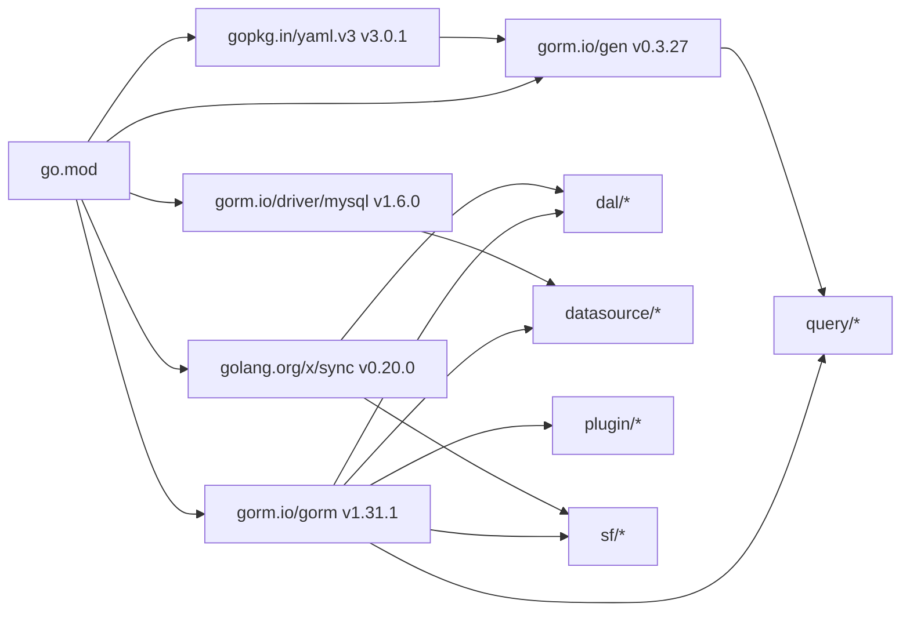
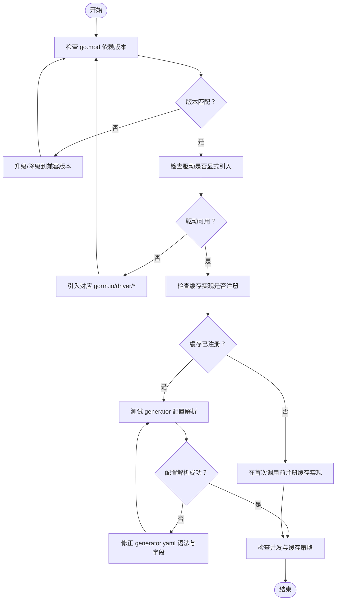

# 依赖管理

<cite>
**本文引用的文件**
- [go.mod](file://go.mod)
- [go.sum](file://go.sum)
- [README.md](file://README.md)
- [gormplus.go](file://gormplus.go)
- [version.go](file://version.go)
- [datasource/manager.go](file://datasource/manager.go)
- [plugin/tenant.go](file://plugin/tenant.go)
- [plugin/dataPermission.go](file://plugin/dataPermission.go)
- [query/query_builder.go](file://query/query_builder.go)
- [sf/sf.go](file://sf/sf.go)
- [dal/dal.go](file://dal/dal.go)
- [generator/config.go](file://generator/config.go)
- [generator/generator.go](file://generator/generator.go)
</cite>

## 目录
1. [简介](#简介)
2. [项目结构](#项目结构)
3. [核心组件](#核心组件)
4. [架构总览](#架构总览)
5. [详细组件分析](#详细组件分析)
6. [依赖分析](#依赖分析)
7. [性能考虑](#性能考虑)
8. [故障排查指南](#故障排查指南)
9. [结论](#结论)
10. [附录](#附录)

## 简介
本文件面向 GORM Plus 的依赖管理，系统梳理项目对外部依赖的引入策略、版本约束与兼容性，解释模块化设计与可选依赖的取舍，给出避免循环依赖与版本冲突的方法论，并提供升级与维护策略、向后兼容性保障以及破坏性变更处理方式。最后提供常见依赖问题的诊断与修复步骤。

## 项目结构
GORM Plus 采用“统一入口 + 模块化子包”的组织方式：
- 统一入口：gormplus.go 导出全部能力，用户仅需 import 一个包即可使用。
- 子模块：query、dal、datasource、plugin、sf、generator 等，职责清晰、边界明确。
- 外部依赖：通过 go.mod 显式声明，避免隐式依赖；驱动通过 Dialector 外部传入，不内置任何数据库驱动。

图表来源
- [gormplus.go:1-120](file://gormplus.go#L1-L120)
- [go.mod:1-26](file://go.mod#L1-L26)

章节来源
- [gormplus.go:1-120](file://gormplus.go#L1-L120)
- [go.mod:1-26](file://go.mod#L1-L26)

## 核心组件
- 外部依赖与版本
  - gorm.io/gorm：ORM 核心，版本 v1.31.1。
  - gorm.io/gen：类型安全链式构造器，版本 v0.3.27。
  - gorm.io/driver/mysql：MySQL 驱动，版本 v1.6.0。
  - gopkg.in/yaml.v3：YAML 配置解析，版本 v3.0.1。
  - golang.org/x/sync：SingleFlight 并发控制，版本 v0.20.0。
  - 其他间接依赖通过 go.sum 锁定具体版本，确保可复现构建。
- 模块化与可选依赖
  - 驱动通过 Dialector 外部传入，不内置任何数据库驱动，避免强制绑定。
  - 代码生成器 generator 仅在需要时使用，不强制依赖。
  - 缓存可插拔，内存缓存默认启用，可替换为 Redis 等实现。
- 版本与兼容性
  - go.mod 指定 go 1.25.5，确保与较新 Go 版本兼容。
  - gorm-plus 版本号在 version.go 中维护，便于发布与追踪。

章节来源
- [go.mod:1-26](file://go.mod#L1-L26)
- [go.sum:1-100](file://go.sum#L1-L100)
- [version.go:1-4](file://version.go#L1-L4)
- [datasource/manager.go:174-200](file://datasource/manager.go#L174-L200)
- [generator/config.go:10-31](file://generator/config.go#L10-L31)
- [sf/sf.go:88-92](file://sf/sf.go#L88-L92)

## 架构总览
GORM Plus 的依赖关系围绕 gorm.io/gorm 与 gorm.io/gen 构建，通过插件机制扩展多租户、数据权限、自动填充、慢查询监控等功能；通过 datasource 管理多数据源与读写分离；通过 dal 提供 SQL 文件化查询；通过 sf 提供缓存与 singleflight；通过 generator 提供代码生成能力。

图表来源
- [go.mod:5-10](file://go.mod#L5-L10)
- [go.sum:71-79](file://go.sum#L71-L79)
- [sf/sf.go:14](file://sf/sf.go#L14)
- [dal/dal.go:81](file://dal/dal.go#L81)

章节来源
- [go.mod:5-10](file://go.mod#L5-L10)
- [go.sum:71-79](file://go.sum#L71-L79)
- [sf/sf.go:14](file://sf/sf.go#L14)
- [dal/dal.go:81](file://dal/dal.go#L81)

## 详细组件分析

### 依赖引入策略与管理原则
- 显式声明与锁定
  - 所有直接依赖在 go.mod 中显式声明，避免隐式依赖导致的版本漂移。
  - go.sum 锁定具体版本，确保 CI/CD 与本地构建一致性。
- 驱动解耦与可选依赖
  - datasource 通过 Dialector 外部传入，不内置任何数据库驱动，避免强制绑定与循环依赖。
  - 用户按需引入 gorm.io/driver/*，仅在需要时安装，降低不必要的依赖。
- 插件与模块化
  - plugin 下的多租户、数据权限、自动填充等通过 gorm.Plugin 接口注册，避免强耦合。
  - gormplus.go 作为统一入口，聚合各模块导出，保持用户侧最小导入成本。
- 可插拔缓存与并发控制
  - sf 提供 SFCache 接口，内存缓存默认启用，可替换为 Redis 等实现。
  - 使用 golang.org/x/sync/singleflight 防止缓存击穿，避免重复计算。

章节来源
- [datasource/manager.go:174-200](file://datasource/manager.go#L174-L200)
- [gormplus.go:88-101](file://gormplus.go#L88-L101)
- [sf/sf.go:88-92](file://sf/sf.go#L88-L92)
- [sf/sf.go:14](file://sf/sf.go#L14)

### 依赖版本约束与兼容性
- gorm.io/gorm v1.31.1
  - 作为 ORM 核心，承载 query、dal、plugin、datasource 等模块的基础能力。
  - 与 gorm.io/gen v0.3.27 协同，提供类型安全链式构造器。
- gorm.io/gen v0.3.27
  - 与 gorm.io/gorm v1.x 兼容，提供类型安全的链式条件构造能力。
- gorm.io/driver/mysql v1.6.0
  - 仅在用户显式引入时生效，不内置驱动，避免强制依赖。
  - 与 datasource 通过 Dialector 交互，支持主从分离与读写分离。
- gopkg.in/yaml.v3 v3.0.1
  - 用于 generator 的 YAML 配置解析，generator 为可选模块。
- golang.org/x/sync v0.20.0
  - 提供 singleflight，用于 sf 与 dal 的并发控制与缓存防击穿。

章节来源
- [go.mod:5-10](file://go.mod#L5-L10)
- [go.sum:71-79](file://go.sum#L71-L79)
- [go.sum:52-53](file://go.sum#L52-L53)
- [go.sum:65-66](file://go.sum#L65-L66)

### 依赖升级与维护策略
- 向后兼容性保证
  - gorm-plus 版本号在 version.go 中维护，遵循语义化版本，尽量避免破坏性变更。
  - 插件注册与导出通过 gormplus.go 聚合，保持对外 API 稳定。
- 破坏性变更处理
  - 升级 gorm.io/gorm 或 gorm.io/gen 时，优先进行回归测试，验证 query、plugin、dal 等模块。
  - 对于驱动升级，确保 datasource.Dialector 与新驱动 API 兼容。
- 升级流程建议
  - 先升级 go.mod 中的版本，执行 go mod tidy，观察 go.sum 变化。
  - 运行单元测试与集成测试，重点覆盖多数据源、插件注入、缓存与生成器。
  - 如遇破坏性变更，通过适配层或配置项过渡，逐步迁移。

章节来源
- [version.go:1-4](file://version.go#L1-L4)
- [gormplus.go:88-101](file://gormplus.go#L88-L101)

### 循环依赖与版本冲突的避免
- 避免循环依赖
  - datasource 仅依赖 gorm.io/gorm，不反向依赖上层模块。
  - plugin 通过 gorm.Plugin 接口注册，不直接依赖业务代码。
  - gormplus.go 作为聚合入口，不被子模块反向依赖。
- 版本冲突规避
  - 使用 go.mod 显式声明版本，避免 go.sum 中混杂不同版本。
  - 对于第三方库的间接依赖，通过 go mod vendor 或 go mod download 管理。
  - 避免在同一项目中同时引入多个版本的 gorm 相关库。

章节来源
- [datasource/manager.go:11-13](file://datasource/manager.go#L11-L13)
- [plugin/tenant.go:138-141](file://plugin/tenant.go#L138-L141)
- [gormplus.go:88-101](file://gormplus.go#L88-L101)

### 可选依赖的设计思路
- generator 为可选模块
  - 仅在需要时引入 gopkg.in/yaml.v3，不强制依赖。
  - generator 通过配置文件加载，支持 Model/Repository/API/VO/DTO/Mapper 输出。
- 缓存可插拔
  - 默认内存缓存，无需额外配置即可使用。
  - 可通过 RegisterCache 注入 Redis 等实现，满足多实例部署需求。
- 驱动外部传入
  - datasource 通过 Dialector 外部传入，不内置任何驱动，用户按需引入。

章节来源
- [generator/config.go:10-31](file://generator/config.go#L10-L31)
- [sf/sf.go:101-114](file://sf/sf.go#L101-L114)
- [datasource/manager.go:174-200](file://datasource/manager.go#L174-L200)

## 依赖分析

### 依赖图谱

图表来源
- [go.mod:5-10](file://go.mod#L5-L10)
- [go.sum:71-79](file://go.sum#L71-L79)
- [sf/sf.go:14](file://sf/sf.go#L14)
- [dal/dal.go:81](file://dal/dal.go#L81)

章节来源
- [go.mod:5-10](file://go.mod#L5-L10)
- [go.sum:71-79](file://go.sum#L71-L79)
- [sf/sf.go:14](file://sf/sf.go#L14)
- [dal/dal.go:81](file://dal/dal.go#L81)

### 依赖关系与耦合度
- 低耦合
  - datasource 与 driver 解耦，通过 Dialector 交互。
  - plugin 通过 gorm.Plugin 接口注册，不反向依赖业务。
  - gormplus.go 聚合导出，避免子模块相互依赖。
- 高内聚
  - query、dal、sf、generator 等模块各自职责清晰，内部紧密协作。
- 可替换性
  - 缓存实现可替换，驱动可替换，生成器可禁用。

章节来源
- [datasource/manager.go:174-200](file://datasource/manager.go#L174-L200)
- [plugin/tenant.go:138-141](file://plugin/tenant.go#L138-L141)
- [gormplus.go:88-101](file://gormplus.go#L88-L101)

## 性能考虑
- 并发控制与缓存
  - 使用 golang.org/x/sync/singleflight 防止缓存击穿，提升高并发场景下的吞吐。
  - sf 默认内存缓存，TTL 可配置；Redis 等可插拔实现满足多实例部署。
- SQL 加载与缓存
  - dal 的 EmbedLoader 使用 singleflight 与缓存，避免重复读取与解析 SQL 文件。
- 多数据源与读写分离
  - datasource 支持从库轮询与懒连接，降低连接成本与延迟。

章节来源
- [sf/sf.go:14](file://sf/sf.go#L14)
- [dal/dal.go:150-174](file://dal/dal.go#L150-L174)
- [datasource/manager.go:17-25](file://datasource/manager.go#L17-L25)

## 故障排查指南

### 常见依赖问题与诊断
- 版本不匹配
  - 现象：升级 gorm.io/gorm 后，gorm.io/gen 报错或类型不匹配。
  - 处理：确保 gorm.io/gen 与 gorm.io/gorm 的兼容版本范围，必要时同时升级两者。
- 驱动缺失
  - 现象：datasource 注册后无法连接数据库。
  - 处理：确认已显式引入 gorm.io/driver/*，并使用 Dialector 正确打开连接。
- 缓存实现未注册
  - 现象：使用 SF 时未生效或报错。
  - 处理：确保在第一次调用 SF 之前注册缓存实现（RegisterCache），或使用默认内存缓存。
- YAML 配置解析失败
  - 现象：generator 加载配置时报错。
  - 处理：检查 generator.yaml 的语法与字段，确保 gopkg.in/yaml.v3 正常解析。
- 并发击穿与缓存穿透
  - 现象：高并发下数据库压力骤增。
  - 处理：启用 sf 的 singleflight 与缓存，合理设置 TTL；必要时接入 Redis。

章节来源
- [go.mod:5-10](file://go.mod#L5-L10)
- [datasource/manager.go:174-200](file://datasource/manager.go#L174-L200)
- [sf/sf.go:101-114](file://sf/sf.go#L101-L114)
- [generator/config.go:33-46](file://generator/config.go#L33-L46)

### 诊断流程图

图表来源
- [go.mod:5-10](file://go.mod#L5-L10)
- [datasource/manager.go:174-200](file://datasource/manager.go#L174-L200)
- [sf/sf.go:101-114](file://sf/sf.go#L101-L114)
- [generator/config.go:33-46](file://generator/config.go#L33-L46)

## 结论
GORM Plus 通过显式依赖声明、模块化设计与可插拔架构，实现了对外部依赖的精细化管理。驱动解耦、缓存可替换与生成器可选等策略，有效降低了不必要的依赖与耦合风险。遵循本文提供的升级与维护策略、兼容性保障与故障排查方法，可在保证稳定性的同时平滑演进。

## 附录

### 版本与兼容性对照
- gorm.io/gorm v1.31.1
  - 兼容 gorm.io/gen v0.3.27
  - 兼容 gorm.io/driver/mysql v1.6.0
- gopkg.in/yaml.v3 v3.0.1
  - 仅在 generator 使用时需要
- golang.org/x/sync v0.20.0
  - 用于 sf 与 dal 的并发控制

章节来源
- [go.mod:5-10](file://go.mod#L5-L10)
- [go.sum:71-79](file://go.sum#L71-L79)
- [go.sum:52-53](file://go.sum#L52-L53)
- [go.sum:65-66](file://go.sum#L65-L66)