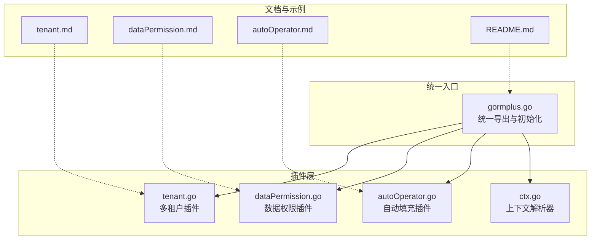
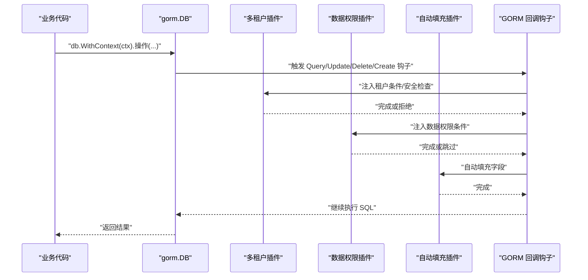
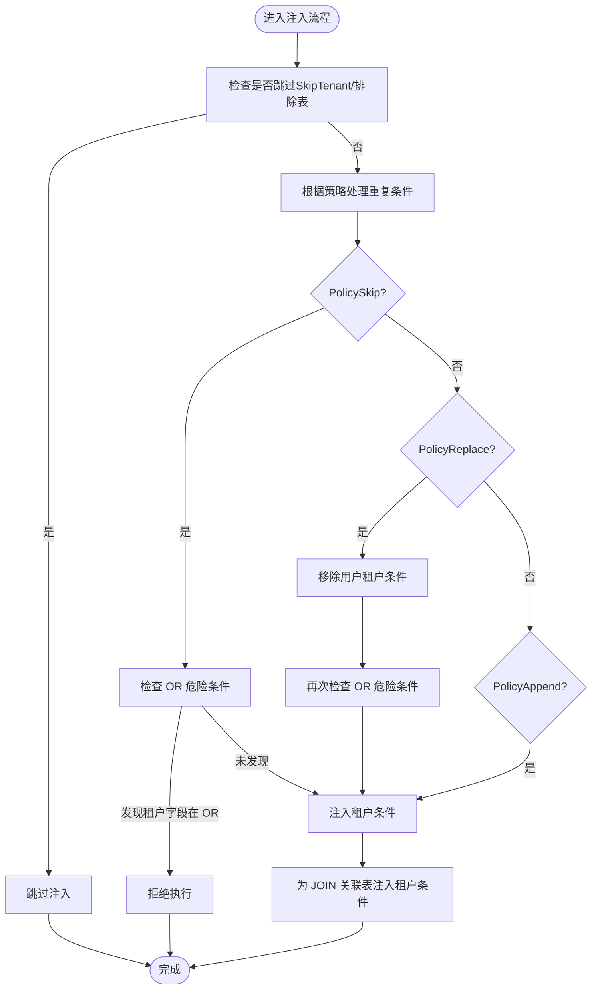
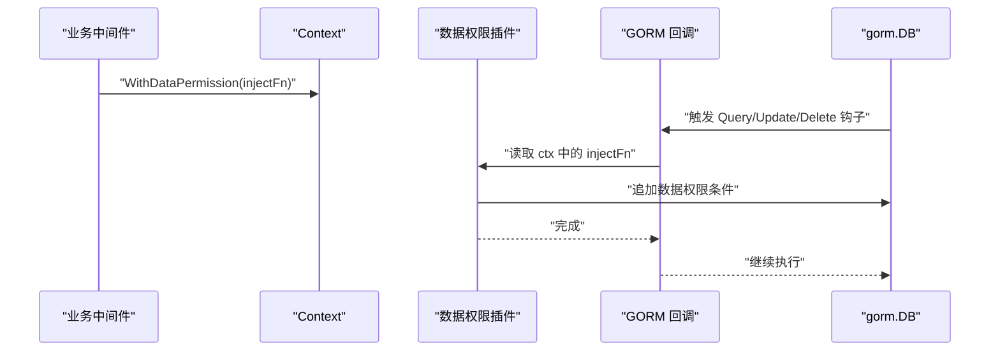
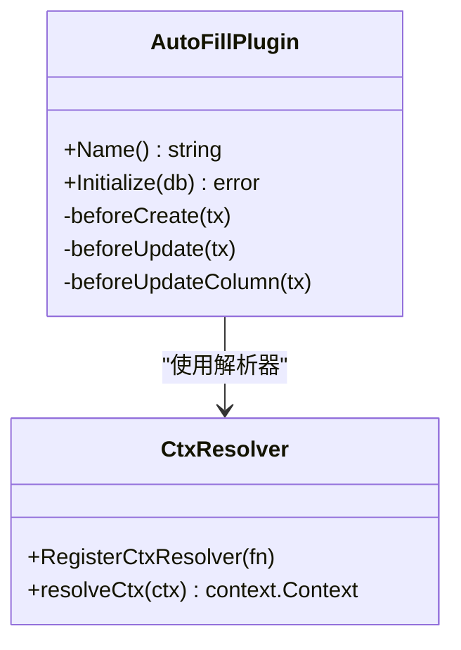
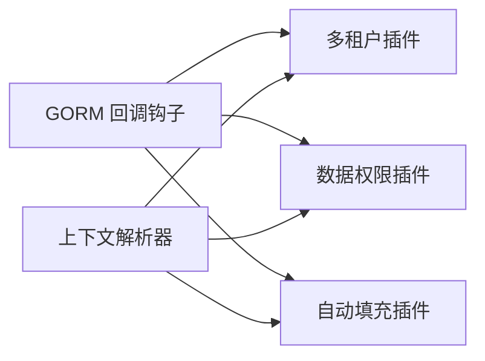

# 插件安全机制

<cite>
**本文引用的文件**
- [plugin/tenant.go](file://plugin/tenant.go)
- [plugin/dataPermission.go](file://plugin/dataPermission.go)
- [plugin/autoOperator.go](file://plugin/autoOperator.go)
- [plugin/ctx.go](file://plugin/ctx.go)
- [gormplus.go](file://gormplus.go)
- [plugin/tenant.md](file://plugin/tenant.md)
- [plugin/dataPermission.md](file://plugin/dataPermission.md)
- [plugin/autoOperator.md](file://plugin/autoOperator.md)
- [README.md](file://README.md)
</cite>

## 目录
1. [简介](#简介)
2. [项目结构](#项目结构)
3. [核心组件](#核心组件)
4. [架构总览](#架构总览)
5. [详细组件分析](#详细组件分析)
6. [依赖分析](#依赖分析)
7. [性能考量](#性能考量)
8. [故障排查指南](#故障排查指南)
9. [结论](#结论)
10. [附录](#附录)

## 简介
本文件系统化阐述 GORM Plus 插件的安全机制，重点覆盖以下方面：
- 租户隔离的安全保护：重复条件策略、OR 绕过检测、全表操作限制、覆盖租户 ID 的安全控制
- 数据权限的访问控制：基于中间件注入的条件注入与跳过机制
- 危险操作拦截：通过回调钩子在执行前进行安全检查
- 安全配置选项：PolicySkip、PolicyReplace 等策略的影响与选择
- 安全审计与日志：违规操作的检测与报警建议
- 最佳实践：中间件配置、上下文管理、服务端点保护
- 安全漏洞防护与应急处理

## 项目结构
GORM Plus 将多租户、数据权限、自动填充等能力以插件形式集成，统一入口位于顶层模块，便于集中初始化与使用。

图表来源
- [gormplus.go:1-120](file://gormplus.go#L1-L120)
- [plugin/tenant.go:1-120](file://plugin/tenant.go#L1-L120)
- [plugin/dataPermission.go:1-120](file://plugin/dataPermission.go#L1-L120)
- [plugin/autoOperator.go:1-120](file://plugin/autoOperator.go#L1-L120)
- [plugin/ctx.go:1-44](file://plugin/ctx.go#L1-L44)
- [plugin/tenant.md:1-30](file://plugin/tenant.md#L1-L30)
- [plugin/dataPermission.md:1-50](file://plugin/dataPermission.md#L1-L50)
- [plugin/autoOperator.md:1-102](file://plugin/autoOperator.md#L1-L102)
- [README.md:1-120](file://README.md#L1-L120)

章节来源
- [gormplus.go:1-120](file://gormplus.go#L1-L120)
- [README.md:17-41](file://README.md#L17-L41)

## 核心组件
- 多租户插件：在 Query/Update/Delete/Create 回调前注入租户条件，支持重复条件策略、OR 绕过检测、全表保护、覆盖租户 ID 与跳过机制
- 数据权限插件：在 Query/Update/Delete 回调前调用业务注入函数追加数据范围条件，支持跳过与排除表
- 自动填充插件：在 Create/Update 前自动填充操作人等字段，支持多种 Getter 与上下文键
- 上下文解析器：屏蔽 Gin/GoZero/Fiber 等框架差异，保证中间件写入的上下文能在回调中正确读取

章节来源
- [plugin/tenant.go:338-381](file://plugin/tenant.go#L338-L381)
- [plugin/dataPermission.go:128-162](file://plugin/dataPermission.go#L128-L162)
- [plugin/autoOperator.go:140-208](file://plugin/autoOperator.go#L140-L208)
- [plugin/ctx.go:7-44](file://plugin/ctx.go#L7-L44)

## 架构总览
GORM Plus 通过 gorm.Plugin 的回调钩子在关键阶段插入安全检查与条件注入，形成“前置拦截 + 自动注入”的安全闭环。

图表来源
- [plugin/tenant.go:355-381](file://plugin/tenant.go#L355-L381)
- [plugin/dataPermission.go:140-162](file://plugin/dataPermission.go#L140-L162)
- [plugin/autoOperator.go:190-208](file://plugin/autoOperator.go#L190-L208)

## 详细组件分析

### 多租户插件安全机制
- 回调注册与执行时机
  - Query/Update/Delete：在执行前注册钩子，分别进行安全检查与条件注入
  - Create：在执行前注册钩子，自动填充租户字段
- 重复条件策略（DuplicateTenantPolicy）
  - PolicySkip：默认策略。若用户已写 AND 条件包含租户字段，插件跳过注入；同时检测 OR 危险条件，发现即拒绝
  - PolicyReplace：先移除用户写的租户字段 AND 条件，再注入 ctx 中的租户 ID，强制隔离；仍会检测 OR 危险条件
  - PolicyAppend：不扫描已有条件，直接追加，性能最优但可能重复
- OR 绕过检测
  - 递归扫描 WHERE 表达式，若租户字段出现在 OR 分支，直接拒绝执行，防止 WHERE (tenant_id = X OR status = Y) 绕过隔离
- 全表保护
  - 无业务 WHERE 条件的 Update/Delete 默认被拒绝；可通过 AllowGlobalOperation 临时放开，或在配置中允许
- 覆盖租户 ID 与跳过
  - AllowOverrideTenantID=true 时，可通过 WithOverrideTenantID 覆盖中间件注入的租户 ID；默认关闭以防止绕过
  - SkipTenant 可完全跳过租户过滤，仅限特权场景使用
- JOIN 自动注入
  - 自动解析 JOIN 别名，为关联表注入租户条件；支持排除表与覆盖字段

图表来源
- [plugin/tenant.go:383-482](file://plugin/tenant.go#L383-L482)
- [plugin/tenant.go:527-595](file://plugin/tenant.go#L527-L595)
- [plugin/tenant.go:644-713](file://plugin/tenant.go#L644-L713)

章节来源
- [plugin/tenant.go:155-188](file://plugin/tenant.go#L155-L188)
- [plugin/tenant.go:383-482](file://plugin/tenant.go#L383-L482)
- [plugin/tenant.go:809-865](file://plugin/tenant.go#L809-L865)
- [plugin/tenant.go:1132-1223](file://plugin/tenant.go#L1132-L1223)

### 数据权限插件安全机制
- 注入时机：在 Query/Update/Delete 回调前调用业务注入函数
- 注入函数：由业务中间件在 ctx 中写入，插件读取并追加数据范围条件
- 跳过机制：通过 SkipDataPermission 在特权场景跳过数据权限过滤
- 排除表：支持运行时动态增删排除表，避免对公共表注入条件

图表来源
- [plugin/dataPermission.go:164-204](file://plugin/dataPermission.go#L164-L204)
- [plugin/dataPermission.go:231-266](file://plugin/dataPermission.go#L231-L266)

章节来源
- [plugin/dataPermission.go:106-127](file://plugin/dataPermission.go#L106-L127)
- [plugin/dataPermission.go:164-204](file://plugin/dataPermission.go#L164-L204)
- [plugin/dataPermission.go:231-339](file://plugin/dataPermission.go#L231-L339)

### 自动填充插件与上下文解析
- 自动填充：在 Create/Update 前自动填充操作人等字段，支持多种 Getter 与上下文键
- 上下文解析：RegisterCtxResolver 屏蔽框架差异，确保 Gin/GoZero/Fiber 等都能正确读取中间件写入的上下文

图表来源
- [plugin/autoOperator.go:140-275](file://plugin/autoOperator.go#L140-L275)
- [plugin/ctx.go:16-44](file://plugin/ctx.go#L16-L44)

章节来源
- [plugin/autoOperator.go:140-309](file://plugin/autoOperator.go#L140-L309)
- [plugin/ctx.go:7-44](file://plugin/ctx.go#L7-L44)

## 依赖分析
- 多租户插件依赖 GORM 的回调钩子，在 Query/Update/Delete/Create 阶段插入安全检查与条件注入
- 数据权限插件依赖业务中间件提供的注入函数，通过上下文传递
- 自动填充插件依赖 GORM 的回调钩子与上下文键，实现字段自动填充
- 上下文解析器为所有插件提供统一的上下文读取能力

图表来源
- [plugin/tenant.go:355-381](file://plugin/tenant.go#L355-L381)
- [plugin/dataPermission.go:140-162](file://plugin/dataPermission.go#L140-L162)
- [plugin/autoOperator.go:190-208](file://plugin/autoOperator.go#L190-L208)
- [plugin/ctx.go:37-44](file://plugin/ctx.go#L37-L44)

章节来源
- [plugin/tenant.go:355-381](file://plugin/tenant.go#L355-L381)
- [plugin/dataPermission.go:140-162](file://plugin/dataPermission.go#L140-L162)
- [plugin/autoOperator.go:190-208](file://plugin/autoOperator.go#L190-L208)
- [plugin/ctx.go:37-44](file://plugin/ctx.go#L37-L44)

## 性能考量
- 重复条件策略
  - PolicySkip：扫描 WHERE 条件，兼顾安全与性能
  - PolicyReplace：先移除用户条件再注入，额外一次条件扫描与修改
  - PolicyAppend：不扫描，性能最优，但可能产生重复条件
- JOIN 自动注入
  - 解析 JOIN 别名与表名，对复杂联表有一定开销；可通过 ExcludeJoinTables 与 JoinTableOverrides 控制
- 全表保护
  - 仅在 Update/Delete 回调阶段进行一次 WHERE 条件判断，开销极低

章节来源
- [plugin/tenant.go:527-595](file://plugin/tenant.go#L527-L595)
- [plugin/tenant.go:644-713](file://plugin/tenant.go#L644-L713)
- [plugin/tenant.go:809-865](file://plugin/tenant.go#L809-L865)

## 故障排查指南
- “检测到租户字段出现在 OR 条件中，已拒绝执行”
  - 说明：租户字段出现在 OR 分支，插件为防止绕过隔离而拒绝执行
  - 处理：将 OR 条件改为 AND 分组，或使用特权跳过（仅限必要场景）
- “禁止无业务条件的全表 Update/Delete”
  - 说明：默认策略禁止无业务 WHERE 条件的全表操作
  - 处理：添加业务 WHERE 条件，或使用 AllowGlobalOperation 临时放开，或在配置中允许
- “覆盖租户 ID 未生效”
  - 说明：需在注册时开启 AllowOverrideTenantID
  - 处理：启用 AllowOverrideTenantID 并使用 WithOverrideTenantID 写入目标租户 ID
- “中间件写入的上下文未生效”
  - 说明：Gin/GoZero/Fiber 等框架的上下文类型不同
  - 处理：注册 RegisterCtxResolver，确保插件能正确读取中间件写入的 Request.Context()

章节来源
- [plugin/tenant.go:420-482](file://plugin/tenant.go#L420-L482)
- [plugin/tenant.go:823-865](file://plugin/tenant.go#L823-L865)
- [plugin/tenant.go:1197-1223](file://plugin/tenant.go#L1197-L1223)
- [plugin/ctx.go:16-44](file://plugin/ctx.go#L16-L44)

## 结论
GORM Plus 插件通过“前置拦截 + 自动注入”的设计，在不侵入业务代码的前提下实现了强安全保护：
- 租户隔离：重复条件策略、OR 绕过检测、全表保护、覆盖与跳过机制
- 数据权限：基于中间件注入的灵活条件控制
- 自动填充：减少手误与遗漏，提升一致性
- 上下文解析：屏蔽框架差异，降低集成成本

建议在生产环境中默认采用 PolicySkip 与默认安全配置，仅在确有必要时启用覆盖与跳过，并配合严格的审计与告警机制。

## 附录

### 安全配置选项与影响
- 重复条件策略
  - PolicySkip：默认，兼顾安全与兼容
  - PolicyReplace：严格强制隔离，适合高风险场景
  - PolicyAppend：极致性能，需确保业务不手动写租户条件
- 全表保护
  - AllowGlobalUpdate/AllowGlobalDelete：默认关闭，防止误操作
  - AllowGlobalOperation：临时放开，仅限批量任务与迁移
- 覆盖与跳过
  - AllowOverrideTenantID：默认关闭，防止绕过
  - WithOverrideTenantID/SkipTenant：特权场景使用

章节来源
- [plugin/tenant.go:155-188](file://plugin/tenant.go#L155-L188)
- [plugin/tenant.go:289-322](file://plugin/tenant.go#L289-L322)
- [plugin/tenant.go:1147-1223](file://plugin/tenant.go#L1147-L1223)

### 安全审计与日志记录
- 违规操作检测
  - OR 绕过检测：在注入前扫描 WHERE 表达式，发现租户字段出现在 OR 分支即拒绝
  - 全表保护：在 Update/Delete 回调阶段检查是否存在业务 WHERE 条件
- 建议的日志与报警
  - 记录拒绝执行的 SQL 片段与上下文信息
  - 对特权操作（SkipTenant/AllowGlobalOperation/WithOverrideTenantID）进行审计留痕
  - 配合统一日志系统与告警平台，实现异常快速响应

章节来源
- [plugin/tenant.go:383-482](file://plugin/tenant.go#L383-L482)
- [plugin/tenant.go:823-865](file://plugin/tenant.go#L823-L865)

### 安全最佳实践
- 中间件配置
  - Gin：注册 RegisterCtxResolver，确保中间件写入的 Request.Context() 能被插件读取
  - GoZero/Fiber：按需注册，或直接使用标准 context
- 上下文管理
  - 租户 ID：在中间件中使用 WithTenantID 写入，避免在业务层重复处理
  - 数据权限：在中间件中使用 WithDataPermission 写入注入函数
  - 操作人：在中间件中使用 CtxGetter/OperatorGetter 写入操作人信息
- 服务端点保护
  - 对高风险端点（批量更新/删除）启用 AllowGlobalOperation 的最小化使用
  - 对特权端点（跨租户查询/数据迁移）仅在受控上下文中启用 SkipTenant/WithOverrideTenantID
- 安全漏洞防护与应急处理
  - 定期审查 ExcludeTables/ExcludeJoinTables 配置，避免误放敏感表
  - 对异常 SQL（大量 OR/全表操作）建立告警与阻断机制
  - 发生安全事件时，立即冻结相关特权操作、回溯日志并修复配置

章节来源
- [plugin/ctx.go:16-44](file://plugin/ctx.go#L16-L44)
- [plugin/tenant.go:1147-1223](file://plugin/tenant.go#L1147-L1223)
- [plugin/dataPermission.go:69-104](file://plugin/dataPermission.go#L69-L104)
- [plugin/autoOperator.go:37-74](file://plugin/autoOperator.go#L37-L74)
- [README.md:114-136](file://README.md#L114-L136)