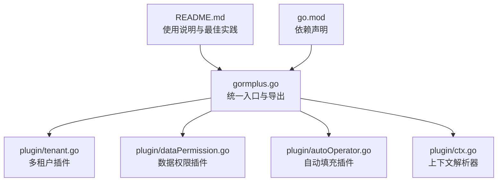
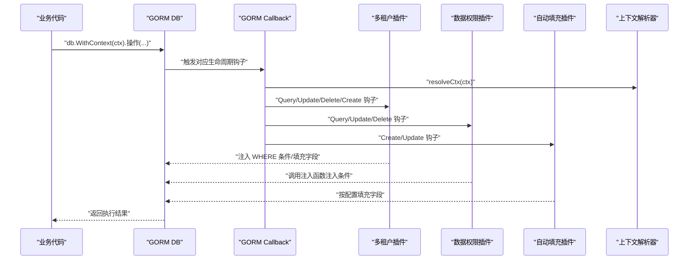
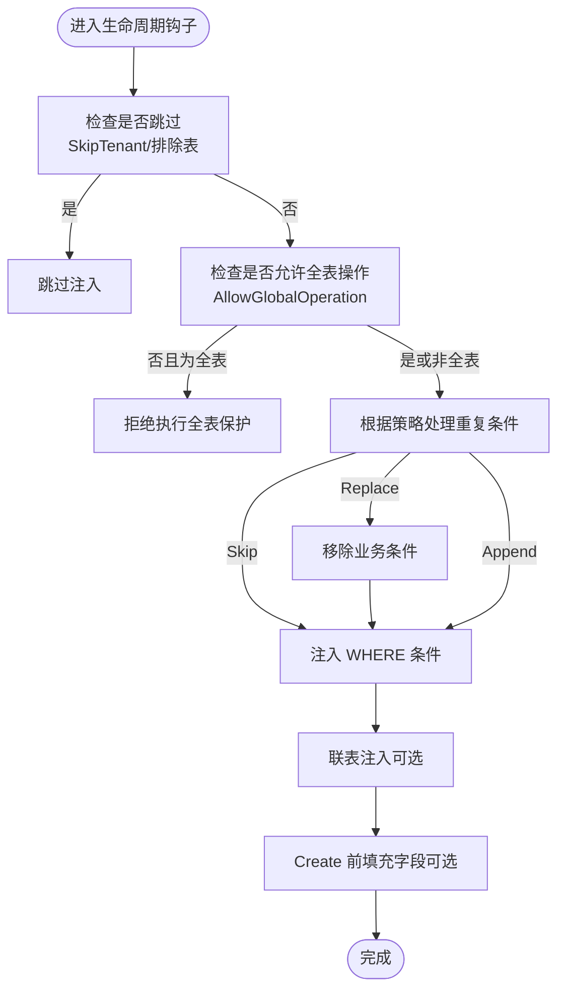
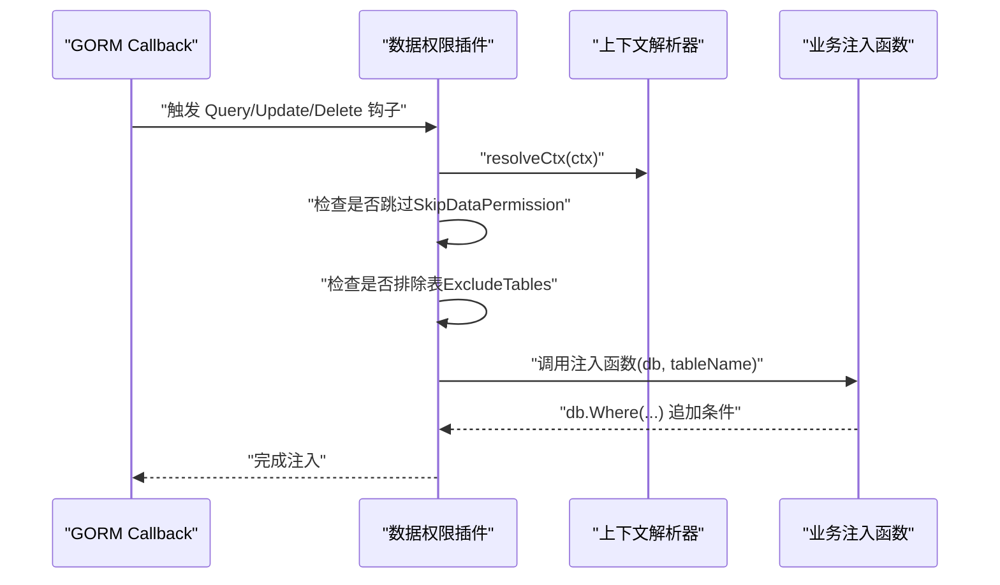
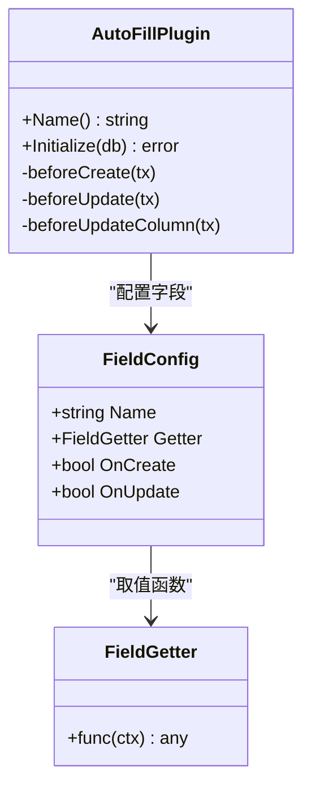
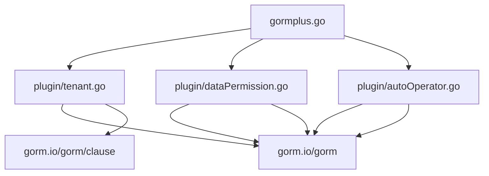

# 插件机制原理

<cite>
**本文引用的文件**
- [plugin/tenant.go](file://plugin/tenant.go)
- [plugin/dataPermission.go](file://plugin/dataPermission.go)
- [plugin/autoOperator.go](file://plugin/autoOperator.go)
- [plugin/ctx.go](file://plugin/ctx.go)
- [gormplus.go](file://gormplus.go)
- [README.md](file://README.md)
- [go.mod](file://go.mod)
</cite>

## 目录
1. [简介](#简介)
2. [项目结构](#项目结构)
3. [核心组件](#核心组件)
4. [架构总览](#架构总览)
5. [详细组件分析](#详细组件分析)
6. [依赖分析](#依赖分析)
7. [性能考量](#性能考量)
8. [故障排查指南](#故障排查指南)
9. [结论](#结论)
10. [附录](#附录)

## 简介
本文件系统性阐述 GORM Plus 的插件化架构与实现原理，重点围绕多租户、数据权限、自动填充三大插件，解释其如何通过 GORM 回调机制实现生命周期管理、注册流程与执行顺序，并说明插件接口设计、扩展点、上下文传递机制以及插件间的协作关系（如多租户与数据权限的配合、自动填充与上下文的联动）。文档同时提供插件开发基础、最佳实践与常见问题排查建议，帮助读者快速掌握并扩展插件能力。

## 项目结构
GORM Plus 采用“统一入口 + 子模块”的组织方式，插件相关代码集中在 plugin 目录，gormplus.go 提供对外统一 API，README.md 提供使用说明与最佳实践。

图表来源
- [gormplus.go:1-120](file://gormplus.go#L1-L120)
- [plugin/tenant.go:1-120](file://plugin/tenant.go#L1-L120)
- [plugin/dataPermission.go:1-120](file://plugin/dataPermission.go#L1-L120)
- [plugin/autoOperator.go:1-120](file://plugin/autoOperator.go#L1-L120)
- [plugin/ctx.go:1-44](file://plugin/ctx.go#L1-L44)
- [README.md:1-120](file://README.md#L1-L120)
- [go.mod:1-26](file://go.mod#L1-L26)

章节来源
- [gormplus.go:1-120](file://gormplus.go#L1-L120)
- [README.md:17-41](file://README.md#L17-L41)

## 核心组件
- 上下文解析器（ctx 解析器）：统一屏蔽不同 Web 框架（如 gin、go-zero、fiber）的 ctx 类型差异，保证插件能从任意上下文中读取中间件写入的信息。
- 多租户插件：在 Query/Update/Delete/Create 生命周期钩子中注入租户条件，支持多字段、联表自动注入、安全策略（重复条件跳过/替换/追加）、全表保护、覆盖租户 ID、跳过租户等。
- 数据权限插件：在 Query/Update/Delete 生命周期钩子中调用业务侧注入函数，按角色/部门等规则注入数据范围条件，支持排除表、跳过数据权限。
- 自动填充插件：在 Create/Update 生命周期钩子中按配置自动填充字段值，支持多种 Getter、UpdateColumn/Simple 等路径的兼容处理。

章节来源
- [plugin/ctx.go:1-44](file://plugin/ctx.go#L1-L44)
- [plugin/tenant.go:338-381](file://plugin/tenant.go#L338-L381)
- [plugin/dataPermission.go:128-162](file://plugin/dataPermission.go#L128-L162)
- [plugin/autoOperator.go:178-208](file://plugin/autoOperator.go#L178-L208)

## 架构总览
GORM Plus 插件机制基于 GORM 的回调系统（Callback）实现，插件在 db.Use() 时注册，随后在各生命周期阶段（Query/Update/Delete/Create）的 Before/After 钩子中执行。插件通过上下文解析器读取中间件写入的上下文信息，结合配置与安全策略，动态注入条件或填充字段。

图表来源
- [plugin/tenant.go:355-381](file://plugin/tenant.go#L355-L381)
- [plugin/dataPermission.go:140-162](file://plugin/dataPermission.go#L140-L162)
- [plugin/autoOperator.go:190-208](file://plugin/autoOperator.go#L190-L208)
- [plugin/ctx.go:37-43](file://plugin/ctx.go#L37-L43)

## 详细组件分析

### 多租户插件（Tenant）
- 设计思想
  - 通过 GORM 回调在 Query/Update/Delete 前注入 WHERE 条件，在 Create 前反射填充结构体字段，实现“业务零改动”的租户隔离。
  - 支持多字段、按表覆盖、联表自动注入、安全策略（重复条件跳过/替换/追加）、全表保护、覆盖租户 ID、跳过租户等。
- 生命周期与钩子
  - Query/Update/Delete：Before 注册 checkGlobalXxx，After 注册 injectWhere。
  - Create：Before 注册 injectCreate。
- 执行顺序
  - 先检查是否跳过（排除表、SkipTenant）、再检查是否允许全表操作（AllowGlobalOperation）、再根据策略注入条件或填充字段。
- 安全策略
  - 重复条件策略：PolicySkip（默认，检测 OR 危险拒绝）、PolicyReplace（先移除业务条件再注入）、PolicyAppend（直接追加，不检查）。
  - OR 危险检测：若租户字段出现在 OR 条件中，直接拒绝执行。
  - 全表保护：未携带业务 WHERE 条件的 Update/Delete 默认拒绝，可通过 AllowGlobalOperation 临时放开或在配置中永久放开。
- 联表注入
  - 自动解析 JOIN 子句中的表名与别名，按表覆盖配置注入租户条件，支持排除公共表。
- 上下文与覆盖
  - 默认从 WithTenantID 写入的值读取租户 ID；若 AllowOverrideTenantID=true，可使用 WithOverrideTenantID 覆盖。
- 动态排除表
  - 支持运行时 AddExcludeTable/RemoveExcludeTable/ExcludedTables。

图表来源
- [plugin/tenant.go:823-865](file://plugin/tenant.go#L823-L865)
- [plugin/tenant.go:529-595](file://plugin/tenant.go#L529-L595)
- [plugin/tenant.go:644-713](file://plugin/tenant.go#L644-L713)
- [plugin/tenant.go:749-807](file://plugin/tenant.go#L749-L807)

章节来源
- [plugin/tenant.go:338-381](file://plugin/tenant.go#L338-L381)
- [plugin/tenant.go:529-595](file://plugin/tenant.go#L529-L595)
- [plugin/tenant.go:644-713](file://plugin/tenant.go#L644-L713)
- [plugin/tenant.go:749-807](file://plugin/tenant.go#L749-L807)
- [plugin/tenant.go:823-865](file://plugin/tenant.go#L823-L865)
- [plugin/tenant.go:1030-1068](file://plugin/tenant.go#L1030-L1068)

### 数据权限插件（DataPermission）
- 设计思想
  - 将注入逻辑交由业务侧实现，插件仅负责在生命周期钩子中调用注入函数，实现“业务自由、插件无侵入”。
- 生命周期与钩子
  - Query/Update/Delete：Before 注册 inject，按表排除与跳过标记决定是否注入。
- 注入方式
  - 两种模式底层行为一致（均使用 db.Statement.Where），保留模式常量仅用于语义区分。
- 上下文与跳过
  - 通过 WithDataPermission 写入注入函数，SkipDataPermission 跳过数据权限过滤。
- 动态排除表
  - 支持 AddDataPermissionExcludeTable/RemoveDataPermissionExcludeTable/DataPermissionExcludedTables。

图表来源
- [plugin/dataPermission.go:140-162](file://plugin/dataPermission.go#L140-L162)
- [plugin/dataPermission.go:169-204](file://plugin/dataPermission.go#L169-L204)
- [plugin/ctx.go:37-43](file://plugin/ctx.go#L37-L43)

章节来源
- [plugin/dataPermission.go:128-162](file://plugin/dataPermission.go#L128-L162)
- [plugin/dataPermission.go:169-204](file://plugin/dataPermission.go#L169-L204)
- [plugin/dataPermission.go:231-266](file://plugin/dataPermission.go#L231-L266)
- [plugin/dataPermission.go:282-338](file://plugin/dataPermission.go#L282-L338)

### 自动填充插件（AutoFill）
- 设计思想
  - 在 Create/Update 生命周期钩子中按配置自动填充字段值，支持多种 Getter（内置 CtxGetter、OperatorGetter 与自定义）。
- 生命周期与钩子
  - Create：Before 注册 beforeCreate。
  - Update：Before 注册 beforeUpdate（普通路径）与 beforeUpdateColumn（SkipHooks 路径）。
- 字段与 Getter
  - FieldConfig 支持 Name（结构体字段或列名）、Getter、OnCreate、OnUpdate。
  - 支持多字段混合（操作人 + 租户 + 自定义字段）。
- 路径兼容
  - UpdateSimple/UpdateSimple 路径通过 clause.Set 注入，SetColumn 在 SkipHooks=true 路径无效时回退。

图表来源
- [plugin/autoOperator.go:178-208](file://plugin/autoOperator.go#L178-L208)
- [plugin/autoOperator.go:212-275](file://plugin/autoOperator.go#L212-L275)
- [plugin/autoOperator.go:287-308](file://plugin/autoOperator.go#L287-L308)

章节来源
- [plugin/autoOperator.go:178-208](file://plugin/autoOperator.go#L178-L208)
- [plugin/autoOperator.go:212-275](file://plugin/autoOperator.go#L212-L275)
- [plugin/autoOperator.go:287-308](file://plugin/autoOperator.go#L287-L308)

### 上下文解析器（CtxResolver）
- 设计思想
  - 屏蔽不同 Web 框架的 ctx 类型差异，统一从 Request.Context() 读取中间件写入的信息。
- 使用方式
  - gin：必须注册，将 *gin.Context 转换为 Request.Context()。
  - go-zero/fiber：无需注册，直接使用标准 context。
- 作用范围
  - 多租户、数据权限、自动填充插件均通过 resolveCtx 读取上下文，确保兼容性。

章节来源
- [plugin/ctx.go:16-43](file://plugin/ctx.go#L16-L43)
- [gormplus.go:103-125](file://gormplus.go#L103-L125)

## 依赖分析
- 依赖关系
  - gormplus.go 导出统一 API 并转发至 plugin 子模块。
  - plugin 子模块依赖 gorm.io/gorm 与 gorm.io/gorm/clause。
  - go.mod 声明 gorm.io/gorm、gorm.io/gen、gorm.io/driver/mysql 等依赖。
- 耦合与内聚
  - 插件与 GORM 回调强耦合，但通过上下文解析器与配置解耦业务细节。
  - 插件间通过 db.Use() 顺序与钩子执行顺序协作，避免直接耦合。

图表来源
- [gormplus.go:88-101](file://gormplus.go#L88-L101)
- [plugin/tenant.go:131-141](file://plugin/tenant.go#L131-L141)
- [plugin/dataPermission.go:3-10](file://plugin/dataPermission.go#L3-L10)
- [plugin/autoOperator.go:3-8](file://plugin/autoOperator.go#L3-L8)
- [go.mod:5-10](file://go.mod#L5-L10)

章节来源
- [gormplus.go:88-101](file://gormplus.go#L88-L101)
- [go.mod:5-10](file://go.mod#L5-L10)

## 性能考量
- 注入策略
  - PolicyAppend（直接追加）性能最优，但可能产生重复条件；PolicySkip（默认）兼顾安全与性能；PolicyReplace（强制替换）最安全但略增开销。
- 联表注入
  - 自动解析 JOIN 子句，按表覆盖与排除配置注入，避免重复解析与重复条件。
- UpdateSimple 路径
  - 自动填充插件针对 SkipHooks=true 的 UpdateColumn/Simple 路径做了兼容处理，避免 SetColumn 失效。
- 上下文解析
  - 通过全局解析器统一转换，减少框架差异带来的额外判断成本。

[本节为通用指导，不直接分析具体文件]

## 故障排查指南
- 租户条件未生效
  - 检查是否注册了 ctx 解析器（gin 必须注册）。
  - 检查是否跳过了租户过滤（SkipTenant）或排除表（AddExcludeTable）。
  - 检查重复条件策略与 OR 危险检测。
- 全表 Update/Delete 被拒绝
  - 未携带业务 WHERE 条件时默认拒绝；可通过 AllowGlobalOperation 临时放开或在配置中允许。
- 数据权限未生效
  - 检查中间件是否通过 WithDataPermission 写入注入函数。
  - 检查是否通过 SkipDataPermission 跳过。
- 自动填充未生效
  - 检查中间件是否通过 context.WithValue 写入 Getter 所需的 key。
  - 检查字段名与 Getter 配置是否正确。
- 框架兼容问题
  - gin 必须注册 ctx 解析器；go-zero/fiber 无需注册。

章节来源
- [plugin/tenant.go:823-865](file://plugin/tenant.go#L823-L865)
- [plugin/dataPermission.go:169-204](file://plugin/dataPermission.go#L169-L204)
- [plugin/autoOperator.go:212-275](file://plugin/autoOperator.go#L212-L275)
- [plugin/ctx.go:16-43](file://plugin/ctx.go#L16-L43)

## 结论
GORM Plus 的插件机制通过 GORM 回调系统实现了对生命周期的精细化控制，结合上下文解析器与配置化策略，提供了多租户、数据权限、自动填充等能力的统一扩展点。插件间通过钩子执行顺序与上下文传递协同工作，既保证了业务零改动的易用性，又提供了安全与性能的平衡方案。开发者可基于现有插件接口与扩展点，快速实现新的业务插件或定制现有插件的行为。

[本节为总结性内容，不直接分析具体文件]

## 附录
- 初始化与注册顺序建议
  - 注册 ctx 解析器（gin 必须）→ 注册多数据源 → 打开 DB → 注册多租户插件 → 注册数据权限插件 → 注册自动填充插件 → 注册慢查询监控 → 注册 SF 缓存（可选）。
- 插件开发要点
  - 实现 gorm.Plugin 接口（Name/Initialize），在 Initialize 中通过 db.Callback().Xxx().Before/After 注册钩子。
  - 通过 resolveCtx 读取上下文，避免框架差异。
  - 通过配置与安全策略（重复条件、OR 危险、全表保护）保障隔离与安全。
  - 针对 UpdateColumn/Simple 等特殊路径做兼容处理。

章节来源
- [gormplus.go:22-85](file://gormplus.go#L22-L85)
- [plugin/tenant.go:355-381](file://plugin/tenant.go#L355-L381)
- [plugin/dataPermission.go:140-162](file://plugin/dataPermission.go#L140-L162)
- [plugin/autoOperator.go:190-208](file://plugin/autoOperator.go#L190-L208)
- [plugin/ctx.go:37-43](file://plugin/ctx.go#L37-L43)