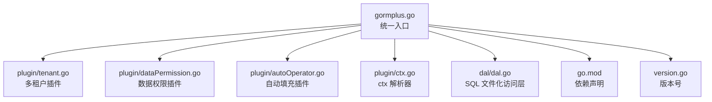
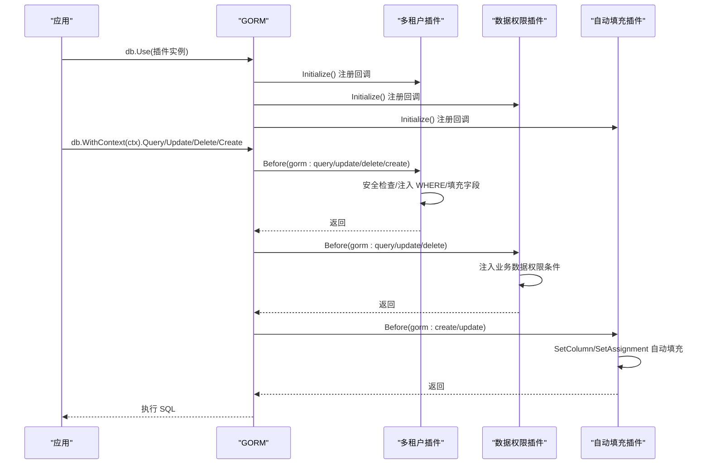
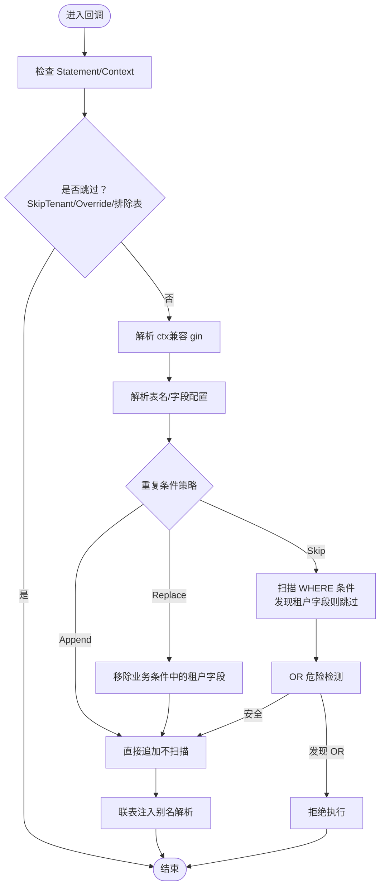
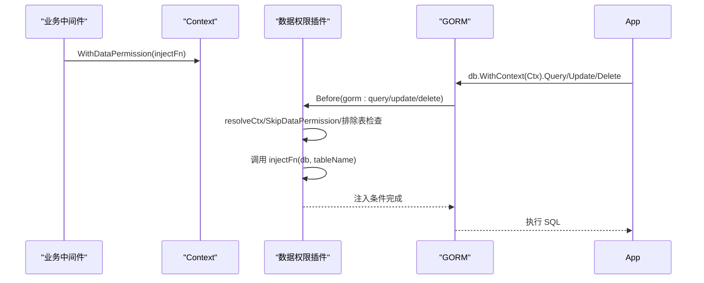
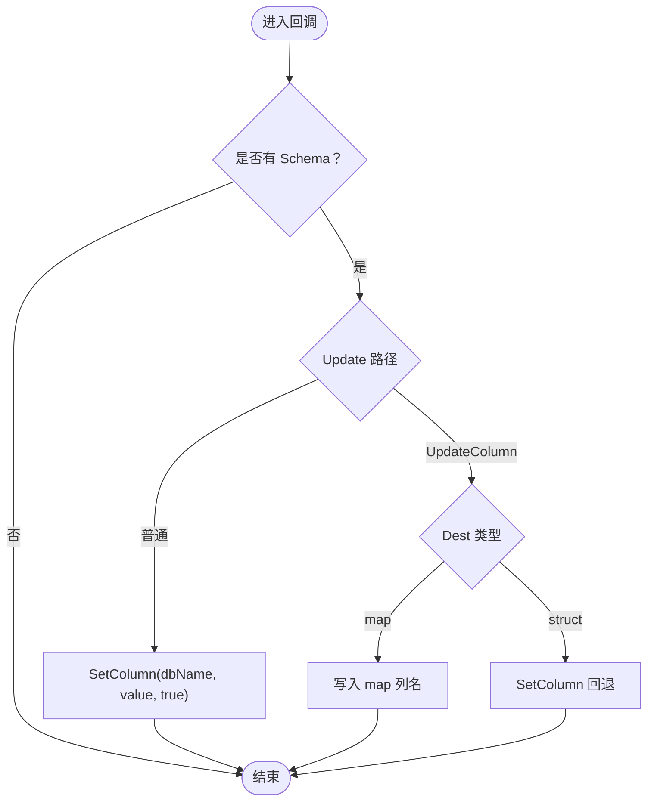
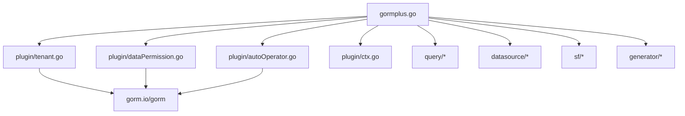

# 插件架构

<cite>
**本文引用的文件**
- [gormplus.go](file://gormplus.go)
- [tenant.go](file://plugin/tenant.go)
- [dataPermission.go](file://plugin/dataPermission.go)
- [autoOperator.go](file://plugin/autoOperator.go)
- [ctx.go](file://plugin/ctx.go)
- [tenant.md](file://plugin/tenant.md)
- [dataPermission.md](file://plugin/dataPermission.md)
- [autoOperator.md](file://plugin/autoOperator.md)
- [README.md](file://README.md)
- [version.go](file://version.go)
- [go.mod](file://go.mod)
- [dal.go](file://dal/dal.go)
</cite>

## 目录
1. [简介](#简介)
2. [项目结构](#项目结构)
3. [核心组件](#核心组件)
4. [架构总览](#架构总览)
5. [详细组件分析](#详细组件分析)
6. [依赖分析](#依赖分析)
7. [性能考量](#性能考量)
8. [故障排查指南](#故障排查指南)
9. [结论](#结论)
10. [附录](#附录)

## 简介
本文件系统化阐述 GORM Plus 的插件化架构，重点围绕多租户、数据权限、自动填充三大插件，结合 GORM 回调机制实现插件生命周期管理与执行顺序控制。文档还涵盖插件注册流程、上下文解析器、安全防护、动态配置与运行时调整、以及开发自定义插件的最佳实践与性能优化策略。

## 项目结构
GORM Plus 采用“统一入口 + 模块化插件”的组织方式：
- 统一入口：gormplus.go 提供顶层 API，聚合各模块能力（查询、数据源、缓存、插件等）。
- 插件模块：plugin/ 下包含多租户、数据权限、自动填充等插件实现。
- 上下文解析：plugin/ctx.go 提供跨框架的 ctx 解析器，屏蔽 gin/go-zero/fiber 的差异。
- 文档与示例：各插件配套 md 文档，便于快速上手。

图表来源
- [gormplus.go:1-1305](file://gormplus.go#L1-L1305)
- [tenant.go:1-1223](file://plugin/tenant.go#L1-L1223)
- [dataPermission.go:1-339](file://plugin/dataPermission.go#L1-L339)
- [autoOperator.go:1-309](file://plugin/autoOperator.go#L1-L309)
- [ctx.go:1-44](file://plugin/ctx.go#L1-L44)
- [dal.go:1-200](file://dal/dal.go#L1-L200)
- [go.mod:1-26](file://go.mod#L1-L26)
- [version.go:1-4](file://version.go#L1-L4)

章节来源
- [gormplus.go:1-1305](file://gormplus.go#L1-L1305)
- [README.md:1-891](file://README.md#L1-L891)

## 核心组件
- 统一入口与模块导出：gormplus.go 暴露注册函数、配置类型、上下文工具与各模块 API。
- 插件接口与生命周期：各插件实现 gorm.Plugin 接口，通过 db.Use 注册，并在 Initialize 中向 GORM 注册回调钩子。
- 上下文解析器：解决 gin 项目直接传 *gin.Context 导致插件无法读取中间件写入的 Request.Context 的问题。
- 插件配置：每类插件提供 Config 结构体，支持运行时动态调整（如排除表、覆盖租户 ID 等）。

章节来源
- [gormplus.go:103-125](file://gormplus.go#L103-L125)
- [tenant.go:338-381](file://plugin/tenant.go#L338-L381)
- [dataPermission.go:128-162](file://plugin/dataPermission.go#L128-L162)
- [autoOperator.go:140-208](file://plugin/autoOperator.go#L140-L208)
- [ctx.go:7-43](file://plugin/ctx.go#L7-L43)

## 架构总览
GORM Plus 插件通过 GORM 回调机制在关键生命周期点注入逻辑，形成“前置安全检查 + 条件注入 + 自动填充”的执行链。插件注册顺序影响回调执行顺序，建议遵循“安全 -> 条件注入 -> 自动填充”的顺序，以保证安全策略优先执行。

图表来源
- [tenant.go:355-381](file://plugin/tenant.go#L355-L381)
- [dataPermission.go:140-162](file://plugin/dataPermission.go#L140-L162)
- [autoOperator.go:190-208](file://plugin/autoOperator.go#L190-L208)

## 详细组件分析

### 多租户插件（Tenant）
- 设计要点
  - 通过 GORM 回调在 Query/Update/Delete/Create 前注入 WHERE 条件，支持多字段、按表覆盖、联表自动注入。
  - 安全策略：重复条件策略（跳过/替换/追加）、OR 危险检测、全表 Update/Delete 保护、覆盖租户 ID 与超管跳过。
  - 运行时动态调整：排除表、联表覆盖、临时放开全表保护、动态增删排除表。
- 生命周期与执行顺序
  - Query/Update/Delete：先安全检查，再注入 WHERE；Update/Delete 后续再注入一次（保证 UpdateColumn 等路径）。
  - Create：反射填充结构体字段。
- 关键实现路径
  - 回调注册与初始化：[tenant.go:355-381](file://plugin/tenant.go#L355-L381)
  - 安全检查与 OR 危险检测：[tenant.go:385-482](file://plugin/tenant.go#L385-L482)
  - 联表注入与别名解析：[tenant.go:644-747](file://plugin/tenant.go#L644-L747)
  - Create 前填充字段：[tenant.go:749-800](file://plugin/tenant.go#L749-L800)
  - 运行时动态排除表：[tenant.go:644-662](file://plugin/tenant.go#L644-L662)

图表来源
- [tenant.go:529-595](file://plugin/tenant.go#L529-L595)
- [tenant.go:385-482](file://plugin/tenant.go#L385-L482)
- [tenant.go:644-747](file://plugin/tenant.go#L644-L747)

章节来源
- [tenant.go:1-1223](file://plugin/tenant.go#L1-L1223)
- [tenant.md:1-30](file://plugin/tenant.md#L1-L30)

### 数据权限插件（DataPermission）
- 设计要点
  - 注入函数由业务中间件在 ctx 中注入，插件回调触发时调用注入函数追加条件。
  - 支持排除表、超管跳过、运行时动态增删排除表。
  - 注入方式：底层统一使用 db.Statement.Where，db.Scopes 在回调阶段无效。
- 生命周期与执行顺序
  - Query/Update/Delete：Before gorm:* 注册回调，执行时检查跳过标记与排除表，再调用注入函数。
- 关键实现路径
  - 回调注册：[dataPermission.go:140-162](file://plugin/dataPermission.go#L140-L162)
  - 注入逻辑：[dataPermission.go:164-204](file://plugin/dataPermission.go#L164-L204)
  - 运行时排除表管理：[dataPermission.go:282-316](file://plugin/dataPermission.go#L282-L316)

图表来源
- [dataPermission.go:164-204](file://plugin/dataPermission.go#L164-L204)
- [dataPermission.go:140-162](file://plugin/dataPermission.go#L140-L162)

章节来源
- [dataPermission.go:1-339](file://plugin/dataPermission.go#L1-L339)
- [dataPermission.md:1-50](file://plugin/dataPermission.md#L1-L50)

### 自动填充插件（AutoFill）
- 设计要点
  - 支持任意字段与自定义 Getter，Create/Update 前自动填充。
  - Update 路径区分 SkipHooks 与非 SkipHooks，分别处理 SetColumn 与 clause.Set。
  - 提供多 context key，支持同时传递多个字段值。
- 生命周期与执行顺序
  - Create：Before gorm:create 注册回调，填充 OnCreate=true 的字段。
  - Update：Before gorm:update 注册两条回调，分别处理普通 Update 与 UpdateColumn。
- 关键实现路径
  - 回调注册：[autoOperator.go:190-208](file://plugin/autoOperator.go#L190-L208)
  - Create 前填充：[autoOperator.go:210-227](file://plugin/autoOperator.go#L210-L227)
  - Update 前填充（普通/UpdateColumn）：[autoOperator.go:229-275](file://plugin/autoOperator.go#L229-L275)
  - 注入 clause.Set（UpdateSimple）：[autoOperator.go:285-308](file://plugin/autoOperator.go#L285-L308)

图表来源
- [autoOperator.go:210-275](file://plugin/autoOperator.go#L210-L275)
- [autoOperator.go:285-308](file://plugin/autoOperator.go#L285-L308)

章节来源
- [autoOperator.go:1-309](file://plugin/autoOperator.go#L1-L309)
- [autoOperator.md:1-102](file://plugin/autoOperator.md#L1-L102)

### 上下文解析器（CtxResolver）
- 设计要点
  - 全局注册，解决 gin 项目直接传 *gin.Context 导致插件无法读取 Request.Context 的问题。
  - resolveCtx 在插件内部统一调用，屏蔽框架差异。
- 关键实现路径
  - 注册与解析：[ctx.go:7-43](file://plugin/ctx.go#L7-L43)
  - 入口导出：[gormplus.go:105-125](file://gormplus.go#L105-L125)

章节来源
- [ctx.go:1-44](file://plugin/ctx.go#L1-L44)
- [gormplus.go:103-125](file://gormplus.go#L103-L125)

## 依赖分析
- 模块依赖
  - gormplus.go 依赖 plugin/* 实现与导出类型，依赖 query、datasource、sf、generator 等模块。
  - 插件模块依赖 gorm.io/gorm 与 gorm.io/gorm/clause。
- 外部依赖
  - go.mod 声明 gorm.io/gorm、gorm.io/gen、gorm.io/driver/mysql 等。
- 循环依赖
  - 插件模块之间无直接循环依赖，通过 gorm.DB.Config.Plugins 间接协作。

图表来源
- [gormplus.go:88-101](file://gormplus.go#L88-L101)
- [go.mod:5-25](file://go.mod#L5-L25)

章节来源
- [gormplus.go:88-101](file://gormplus.go#L88-L101)
- [go.mod:1-26](file://go.mod#L1-L26)

## 性能考量
- 回调注册顺序
  - 建议：多租户（安全）→ 数据权限（条件注入）→ 自动填充（字段填充），确保安全策略优先，减少不必要的条件扫描。
- 条件注入策略
  - 多租户默认 PolicySkip，既保证安全又避免重复注入；如确定业务代码不会手动写租户条件，可考虑 PolicyAppend 以降低扫描成本。
  - 数据权限统一使用 Statement.Where，避免在回调阶段调用 db.Scopes 的无效尝试。
- 自动填充路径优化
  - UpdateSimple/UpdateColumn 路径需注入 clause.Set，避免重复注入；普通 Update 使用 SetColumn。
- 运行时动态调整
  - 使用 Add/Remove 排除表时注意并发安全与锁粒度，避免频繁变更导致抖动。
- 缓存与并发
  - 插件内部使用 RWMutex 保护排除表集合，避免竞态；建议在高并发场景下尽量减少动态调整频率。

[本节为通用指导，不直接分析具体文件]

## 故障排查指南
- 常见问题与定位
  - OR 绕过风险：多租户检测到租户字段出现在 OR 条件中会直接拒绝执行。检查业务 SQL 是否误用 OR。
  - 全表 Update/Delete 被拒：默认禁止无业务 WHERE 条件的全表操作。临时放开使用 AllowGlobalOperation，或在业务中加入必要条件。
  - 重复条件冲突：PolicyReplace 会先移除业务条件中的租户字段再注入，注意确认是否符合预期。
  - gin ctx 读不到中间件数据：确认已注册 RegisterCtxResolver，或改为传 c.Request.Context()。
  - 数据权限未生效：确认中间件已调用 WithDataPermission 注入注入函数，且表不在排除列表中。
  - 自动填充未生效：确认 Getter 返回值类型与字段类型匹配，且 Update 路径正确（普通/UpdateColumn）。
- 定位步骤
  - 检查回调注册是否成功（Initialize 返回值）。
  - 使用 ExcludedTables/DataPermissionExcludedTables 快照排查排除表配置。
  - 通过 SkipTenant/SkipDataPermission 临时跳过验证问题范围。
  - 在开发环境开启 Debug 日志（如 DAL）辅助定位。

章节来源
- [tenant.go:385-482](file://plugin/tenant.go#L385-L482)
- [tenant.go:529-595](file://plugin/tenant.go#L529-L595)
- [dataPermission.go:164-204](file://plugin/dataPermission.go#L164-L204)
- [autoOperator.go:210-275](file://plugin/autoOperator.go#L210-L275)
- [ctx.go:7-43](file://plugin/ctx.go#L7-L43)

## 结论
GORM Plus 通过统一入口与插件化设计，将多租户、数据权限、自动填充等横切关注点以 GORM 回调的形式无缝集成到 ORM 生命周期中。借助上下文解析器与安全策略，插件在保证数据隔离与合规的同时，提供了灵活的配置与运行时调整能力。遵循推荐的注册顺序与最佳实践，可在保障安全的前提下获得良好的性能与可维护性。

[本节为总结性内容，不直接分析具体文件]

## 附录

### 插件注册流程与执行顺序
- 注册顺序建议
  - ① ctx 解析器（gin 项目必须）
  - ② 多数据源（可选）
  - ③ 多租户插件（安全优先）
  - ④ 数据权限插件（条件注入）
  - ⑤ 自动填充插件（字段填充）
  - ⑥ 慢查询监控（可选）
- 执行顺序
  - Query/Update/Delete：多租户 → 数据权限 → 自动填充
  - Create：多租户 → 自动填充

章节来源
- [gormplus.go:22-85](file://gormplus.go#L22-L85)
- [README.md:44-110](file://README.md#L44-L110)

### 插件接口设计与扩展点
- gorm.Plugin 接口
  - Name()：返回插件唯一名称
  - Initialize(*gorm.DB) error：注册回调钩子
- 扩展点
  - 回调钩子：Query/Update/Delete/Create Before/After 阶段
  - 上下文工具：WithXxx/SkipXxx/AllowGlobalOperation 等
  - 运行时动态调整：Add/Remove 排除表、覆盖租户 ID 等

章节来源
- [tenant.go:351-381](file://plugin/tenant.go#L351-L381)
- [dataPermission.go:138-162](file://plugin/dataPermission.go#L138-L162)
- [autoOperator.go:187-208](file://plugin/autoOperator.go#L187-L208)

### 开发自定义插件最佳实践
- 生命周期管理
  - 在 Initialize 中注册回调，使用 Before("gorm:*") 确保在关键阶段执行。
  - 避免在回调中执行阻塞操作，必要时使用异步或限流。
- 安全与防护
  - 对用户输入进行最小化信任假设，优先采用白名单策略。
  - 对 OR 条件进行严格扫描，防止绕过隔离。
- 性能优化
  - 尽量减少对 Statement.Clauses 的修改次数，合并条件。
  - 使用缓存与并发安全结构（如 RWMutex）。
- 错误处理
  - 使用 db.AddError 返回错误，避免吞掉异常。
  - 提供清晰的错误信息与上下文（表名、字段名、SQL 片段）。

[本节为通用指导，不直接分析具体文件]

### 配置管理与运行时动态调整
- 配置项
  - 多租户：DuplicatePolicy、AllowGlobalUpdate/AllowGlobalDelete、AllowOverrideTenantID、ExcludeTables、JoinTableOverrides 等。
  - 数据权限：ExcludeTables、InjectMode。
  - 自动填充：FieldConfig（Name/Getter/OnCreate/OnUpdate）。
- 运行时调整
  - 多租户：AddExcludeTable/RemoveExcludeTable/ExcludedTables。
  - 数据权限：AddDataPermissionExcludeTable/RemoveDataPermissionExcludeTable/DataPermissionExcludedTables。
  - 上下文：WithTenantID/WithOverrideTenantID/SkipTenant、WithDataPermission/SkipDataPermission、AllowGlobalOperation。

章节来源
- [tenant.go:239-336](file://plugin/tenant.go#L239-L336)
- [dataPermission.go:108-126](file://plugin/dataPermission.go#L108-L126)
- [autoOperator.go:90-138](file://plugin/autoOperator.go#L90-L138)
- [gormplus.go:475-661](file://gormplus.go#L475-L661)