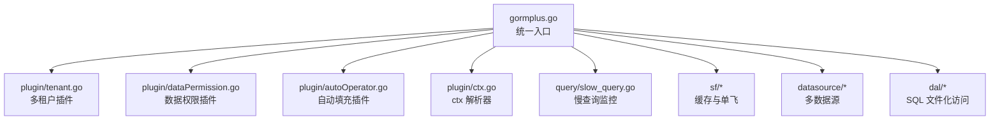
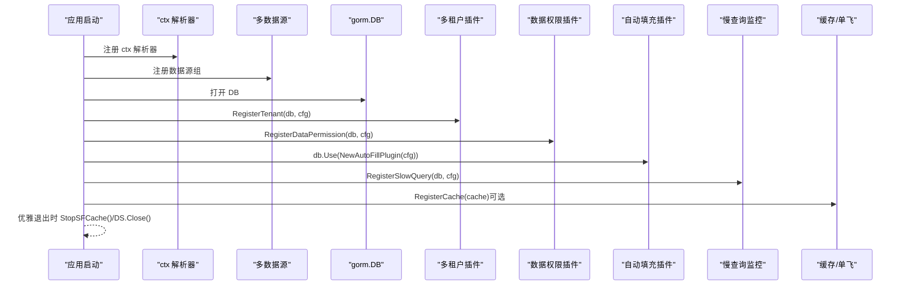
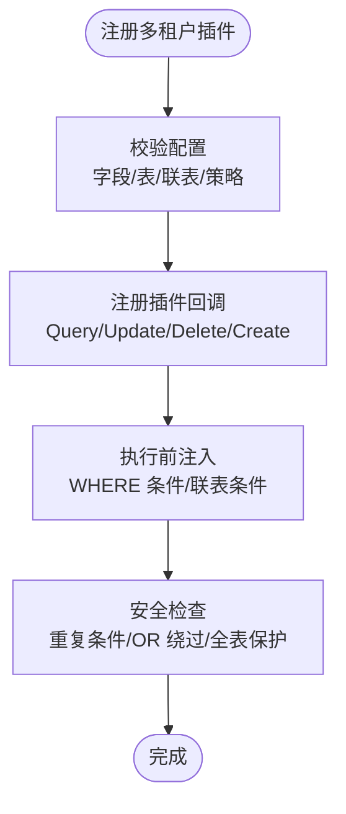
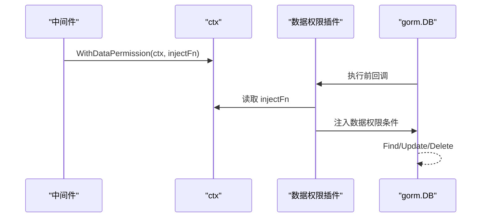
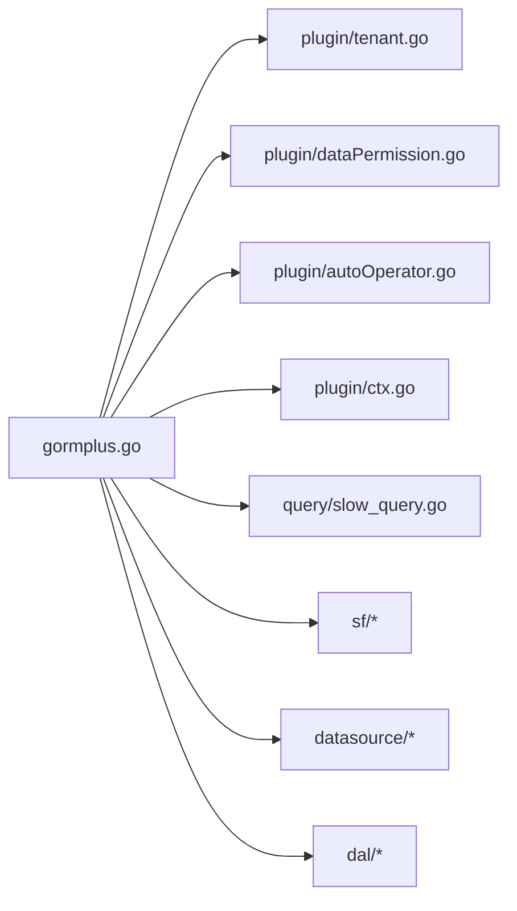

# 插件注册流程

<cite>
**本文引用的文件**
- [gormplus.go](file://gormplus.go)
- [plugin/tenant.go](file://plugin/tenant.go)
- [plugin/dataPermission.go](file://plugin/dataPermission.go)
- [plugin/autoOperator.go](file://plugin/autoOperator.go)
- [plugin/ctx.go](file://plugin/ctx.go)
- [query/slow_query.go](file://query/slow_query.go)
- [README.md](file://README.md)
- [version.go](file://version.go)
</cite>

## 目录
1. [简介](#简介)
2. [项目结构](#项目结构)
3. [核心组件](#核心组件)
4. [架构总览](#架构总览)
5. [详细组件分析](#详细组件分析)
6. [依赖分析](#依赖分析)
7. [性能考虑](#性能考虑)
8. [故障排查指南](#故障排查指南)
9. [结论](#结论)
10. [附录](#附录)

## 简介
本文面向 GORM Plus 插件注册流程，系统阐述标准注册顺序与最佳实践，重点说明注册顺序的重要性（ctx 解析器 → 多数据源 → 插件 → 缓存），并对比不同插件的注册方式与参数配置，包括 RegisterTenant、RegisterDataPermission、db.Use() 等注册方法的区别与适用场景。文档还覆盖注册时机要求、运行时动态注册限制、完整注册示例、常见错误排查方法，以及注册后的验证与调试手段（如排除表查询、运行时状态检查）。

## 项目结构
GORM Plus 采用“统一入口 + 模块化插件”的组织方式，核心入口导出所有能力，插件模块位于 plugin 目录，查询与慢查询监控位于 query 目录，缓存与单飞（SingleFlight）位于 sf 目录，多数据源位于 datasource 目录，SQL 文件化访问位于 dal 目录。

图表来源
- [gormplus.go:1-120](file://gormplus.go#L1-L120)
- [plugin/tenant.go:1-120](file://plugin/tenant.go#L1-L120)
- [plugin/dataPermission.go:1-120](file://plugin/dataPermission.go#L1-L120)
- [plugin/autoOperator.go:1-120](file://plugin/autoOperator.go#L1-L120)
- [plugin/ctx.go:1-44](file://plugin/ctx.go#L1-L44)
- [query/slow_query.go:1-120](file://query/slow_query.go#L1-L120)

章节来源
- [gormplus.go:1-120](file://gormplus.go#L1-L120)
- [README.md:17-41](file://README.md#L17-L41)

## 核心组件
- ctx 解析器：解决不同 Web 框架（如 gin）传入 *gin.Context 时，插件无法从 Request.Context 读取中间件写入的上下文数据的问题。注册后所有插件（多租户、数据权限、自动填充）均自动使用该解析器。
- 多数据源：通过外部 Dialector 注入驱动，支持 MySQL、PostgreSQL、SQLite 等任意 gorm 驱动；支持一主多从、读写分离、连接池配置；通过 DS.Auto(ctx) 在运行时根据 ctx 标记自动选择主/从库。
- 插件体系：
  - 多租户插件：在 Query/Update/Delete/Create 前自动注入租户条件，支持多字段、联表自动注入、安全策略（重复条件跳过/替换、OR 绕过拒绝、全表保护）、覆盖租户 ID、超管跳过等。
  - 数据权限插件：在 Query/Update/Delete 前调用业务侧注入函数追加数据权限条件，支持排除表、超管跳过、运行时动态维护排除表。
  - 自动填充插件：在 Create/Update 前自动填充字段值，支持多字段、自定义 Getter、UpdateColumn/Simple 等路径兼容。
  - 慢查询监控：在 Query/Create/Update/Delete/Raw/Row 各类操作前后记录耗时，超过阈值触发自定义 Logger。
- 缓存与单飞：支持内存缓存与可插拔缓存（如 Redis），提供 SF/SFWithTTL/SFNoCache/SFInvalidate 等 API；注册缓存需在第一次调用 SF 之前完成。

章节来源
- [gormplus.go:103-125](file://gormplus.go#L103-L125)
- [gormplus.go:127-214](file://gormplus.go#L127-L214)
- [gormplus.go:475-661](file://gormplus.go#L475-L661)
- [gormplus.go:663-748](file://gormplus.go#L663-L748)
- [gormplus.go:750-806](file://gormplus.go#L750-L806)
- [gormplus.go:348-473](file://gormplus.go#L348-L473)

## 架构总览
下图展示 GORM Plus 的插件注册顺序与交互关系，强调 ctx 解析器必须最先注册，多数据源在插件之前，插件注册后再进行缓存注册。

图表来源
- [gormplus.go:22-85](file://gormplus.go#L22-L85)
- [plugin/ctx.go:16-35](file://plugin/ctx.go#L16-L35)
- [query/slow_query.go:91-109](file://query/slow_query.go#L91-L109)
- [gormplus.go:385-401](file://gormplus.go#L385-L401)

章节来源
- [gormplus.go:22-85](file://gormplus.go#L22-L85)

## 详细组件分析

### ctx 解析器注册
- 作用：屏蔽不同 Web 框架的 ctx 类型差异，确保插件能从 Request.Context 读取中间件写入的数据。
- 注册时机：应用启动时调用一次，且必须在其他插件注册之前。
- 适用场景：
  - Gin：必须注册，将 *gin.Context 转换为 Request.Context。
  - Go-Zero/Fiber：使用标准 context，无需注册。
- 验证方法：直接传 *gin.Context 给 db.WithContext()，插件应能读取到中间件写入的值。

章节来源
- [plugin/ctx.go:16-35](file://plugin/ctx.go#L16-L35)
- [gormplus.go:103-125](file://gormplus.go#L103-L125)
- [README.md:114-136](file://README.md#L114-L136)

### 多数据源注册
- 作用：通过外部 Dialector 注入驱动，支持任意 gorm 驱动；支持一主多从、读写分离、连接池配置；通过 DS.Auto(ctx) 在运行时根据 ctx 标记自动选择主/从库。
- 注册时机：应用启动时调用一次，通常在 ctx 解析器之后。
- 配置要点：
  - Master/Slaves：分别配置主库与从库节点，支持独立连接池。
  - DSWithName/DSWithRead/DSWithWrite：在中间件中标记数据源名与读写属性，DS.Auto(ctx) 自动选择。
- 验证方法：通过 DS.Ping() 检查各节点健康；在中间件中注入标记后，DB 查询应命中对应节点。

章节来源
- [gormplus.go:127-214](file://gormplus.go#L127-L214)
- [README.md:139-216](file://README.md#L139-L216)

### 多租户插件注册
- 注册方式：
  - gormplus.RegisterTenant(db, cfg)：一次性注册，插件自动注入租户条件。
  - gormplus.NewTenantPlugin(cfg) + db.Use()：手动注册，适合需要更细粒度控制的场景。
- 配置要点：
  - TenantField/TenantFields/TableFields：支持单字段、多字段、按表覆盖。
  - AutoInjectJoinTables/ExcludeJoinTables/JoinTableOverrides：联表自动注入与覆盖。
  - DuplicatePolicy/AllowGlobalUpdate/AllowGlobalDelete/AllowOverrideTenantID：安全策略与行为控制。
- 注册时机：在 ctx 解析器与多数据源之后，业务代码开始使用 db.WithContext(ctx) 之前。
- 验证方法：
  - 查询自动注入 WHERE 条件。
  - 联表自动注入别名与字段。
  - 重复条件策略与 OR 绕过拒绝。
  - 全表保护与 AllowGlobalOperation。
  - 运行时动态维护排除表：AddExcludeTable/RemoveExcludeTable/ExcludedTables。

图表来源
- [plugin/tenant.go:355-381](file://plugin/tenant.go#L355-L381)
- [plugin/tenant.go:529-595](file://plugin/tenant.go#L529-L595)
- [plugin/tenant.go:385-482](file://plugin/tenant.go#L385-L482)

章节来源
- [gormplus.go:512-581](file://gormplus.go#L512-L581)
- [plugin/tenant.go:15-129](file://plugin/tenant.go#L15-L129)
- [plugin/tenant.go:239-336](file://plugin/tenant.go#L239-L336)
- [plugin/tenant.go:529-595](file://plugin/tenant.go#L529-L595)

### 数据权限插件注册
- 注册方式：
  - gormplus.RegisterDataPermission(db, cfg)：一次性注册，插件在 Query/Update/Delete 前调用业务注入函数。
  - gormplus.NewDataPermissionPlugin(cfg) + db.Use()：手动注册。
- 配置要点：
  - ExcludeTables：排除表列表。
  - InjectMode：注入方式（ModeScopes/ModeWhere，底层行为一致）。
- 注册时机：在 ctx 解析器与多数据源之后，业务代码开始使用 db.WithContext(ctx) 之前。
- 验证方法：
  - 中间件写入 WithDataPermission(ctx, injectFn)，业务查询自动注入条件。
  - SkipDataPermission(ctx) 跳过数据权限。
  - 运行时动态维护排除表：AddDataPermissionExcludeTable/RemoveDataPermissionExcludeTable/DataPermissionExcludedTables。

图表来源
- [plugin/dataPermission.go:164-204](file://plugin/dataPermission.go#L164-L204)
- [plugin/dataPermission.go:231-249](file://plugin/dataPermission.go#L231-L249)

章节来源
- [gormplus.go:673-690](file://gormplus.go#L673-L690)
- [plugin/dataPermission.go:108-126](file://plugin/dataPermission.go#L108-L126)
- [plugin/dataPermission.go:164-204](file://plugin/dataPermission.go#L164-L204)

### 自动填充插件注册
- 注册方式：db.Use(gormplus.NewAutoFillPlugin(cfg))，适合需要更灵活控制的场景。
- 配置要点：
  - Fields：字段名、Getter、OnCreate/OnUpdate。
  - CtxGetter/OperatorGetter：内置 Getter 工厂，支持从 ctx 读取操作人信息。
- 注册时机：在 ctx 解析器与多数据源之后，业务代码开始使用 db.WithContext(ctx) 之前。
- 验证方法：Create/Update 后字段自动填充；UpdateColumn/Simple 路径兼容。

章节来源
- [gormplus.go:783-806](file://gormplus.go#L783-L806)
- [plugin/autoOperator.go:120-138](file://plugin/autoOperator.go#L120-L138)
- [plugin/autoOperator.go:190-208](file://plugin/autoOperator.go#L190-L208)

### 慢查询监控注册
- 注册方式：gormplus.RegisterSlowQuery(db, cfg) 或 db.Use(&slowQueryPlugin{cfg})。
- 配置要点：
  - Threshold：慢查询阈值（默认 200ms）。
  - Logger：自定义日志函数，可透传 traceID 等链路信息。
- 注册时机：在 ctx 解析器与多数据源之后，业务代码开始使用 db.WithContext(ctx) 之前。
- 验证方法：超过阈值的 SQL 触发 Logger；info.SQL 为已替换参数的完整 SQL，可直接 EXPLAIN 分析。

章节来源
- [gormplus.go:750-781](file://gormplus.go#L750-L781)
- [query/slow_query.go:73-83](file://query/slow_query.go#L73-L83)
- [query/slow_query.go:113-161](file://query/slow_query.go#L113-L161)

### 缓存注册（可插拔）
- 注册方式：gormplus.RegisterCache(cache)；若不注册则使用默认内存缓存。
- 重要限制：必须在第一次调用 SF 之前注册，否则内存缓存已懒初始化，注册无效。
- 退出清理：StopSFCache()；使用自定义缓存（如 Redis）时无需调用，连接由用户自行管理。
- 验证方法：SF/SFWithTTL/SFNoCache/SFInvalidate 行为一致；Redis 模式下无需 StopSFCache。

章节来源
- [gormplus.go:385-401](file://gormplus.go#L385-L401)
- [gormplus.go:462-473](file://gormplus.go#L462-L473)
- [README.md:567-632](file://README.md#L567-L632)

## 依赖分析
- 组件耦合：
  - ctx 解析器是所有插件的前置依赖，必须最先注册。
  - 多数据源与插件相互独立，但都依赖 gorm.DB 的回调机制。
  - 缓存注册与插件注册无直接依赖，但缓存实现需在 SF 调用前完成。
- 导入关系概览：

图表来源
- [gormplus.go:88-101](file://gormplus.go#L88-L101)

章节来源
- [gormplus.go:88-101](file://gormplus.go#L88-L101)

## 性能考虑
- 注册顺序影响性能与正确性：ctx 解析器 → 多数据源 → 插件 → 缓存，确保插件能正确读取上下文、选择正确的 DB、并在缓存生效前完成注册。
- 插件安全策略：
  - 多租户：PolicySkip（默认）在已有 AND 条件时跳过注入，避免重复；PolicyReplace 强制替换并拒绝 OR 危险条件；PolicyAppend 不检查直接追加，性能最优但可能重复。
  - 数据权限：注入函数由业务侧实现，插件仅负责调用，避免耦合业务 SQL。
- 缓存策略：
  - SF/SFWithTTL/SFNoCache/SFInvalidate 提供不同场景下的缓存与单飞能力；TTL 建议根据场景选择（列表/统计 3s~30s，配置/字典 1min~5min，详情/实时 0）。
- 慢查询阈值：建议生产环境设为 200ms~500ms，避免误报与噪声。

[本节为通用指导，不直接分析具体文件]

## 故障排查指南
- 插件冲突与重复注入
  - 多租户：若业务代码已手动写入租户条件，PolicySkip 默认跳过注入；PolicyReplace 会先移除业务条件再注入；PolicyAppend 不检查直接追加，可能导致重复。
  - OR 绕过：若 WHERE 中出现租户字段与 OR 同时出现，插件会拒绝执行，防止绕过隔离。
  - 全表保护：无业务 WHERE 条件的 Update/Delete 默认被拒绝，可通过 AllowGlobalOperation 临时放开。
- 配置错误排查
  - ctx 解析器：Gin 项目必须注册，否则插件无法读取中间件写入的 Request.Context 数据。
  - 多数据源：确认 Dialector 正确传入，DS.Auto(ctx) 能根据 DSWithRead/DSWithWrite 正确选择主/从库。
  - 插件排除表：使用 AddExcludeTable/AddDataPermissionExcludeTable/RemoveExcludeTable 等 API 动态维护排除表。
- 注册时机限制
  - 缓存：必须在第一次调用 SF 之前注册，否则内存缓存已懒初始化，注册无效。
  - 插件：建议在 ctx 解析器与多数据源之后、业务代码开始使用 db.WithContext(ctx) 之前完成注册。
- 验证与调试
  - 排除表查询：ExcludedTables/DataPermissionExcludedTables 返回当前排除表快照，便于调试。
  - 运行时状态检查：通过插件提供的工具函数与日志输出定位问题。
  - 慢查询：超过阈值的日志包含完整 SQL（已替换参数），可直接复制执行并 EXPLAIN 分析。

章节来源
- [plugin/tenant.go:385-482](file://plugin/tenant.go#L385-L482)
- [plugin/tenant.go:529-595](file://plugin/tenant.go#L529-L595)
- [plugin/dataPermission.go:282-338](file://plugin/dataPermission.go#L282-L338)
- [gormplus.go:385-401](file://gormplus.go#L385-L401)
- [query/slow_query.go:134-161](file://query/slow_query.go#L134-L161)

## 结论
GORM Plus 的插件注册遵循严格的顺序：ctx 解析器 → 多数据源 → 插件 → 缓存。这一顺序确保插件能正确读取上下文、选择正确的 DB、并在缓存生效前完成注册。通过合理的配置与安全策略（重复条件处理、OR 绕过拒绝、全表保护），结合运行时动态维护排除表与慢查询监控，可有效提升系统的安全性、可维护性与可观测性。建议在应用启动阶段集中完成上述注册，并在开发与生产环境中分别设置合适的阈值与 TTL，以获得最佳体验。

[本节为总结性内容，不直接分析具体文件]

## 附录
- 版本信息：v1.0.13
- 快速开始与完整示例可参考 README 的“快速开始”与“模块总览”。

章节来源
- [version.go:1-4](file://version.go#L1-L4)
- [README.md:44-110](file://README.md#L44-L110)