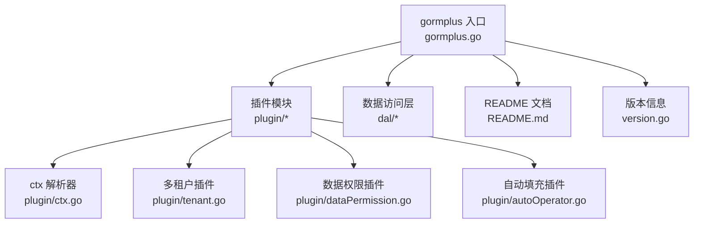
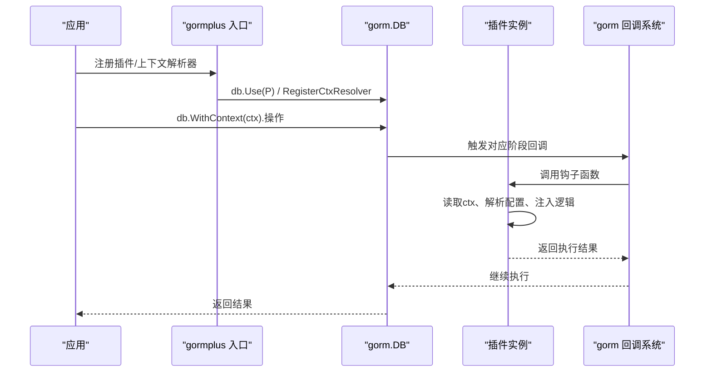
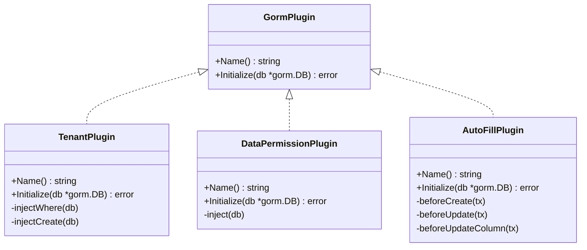
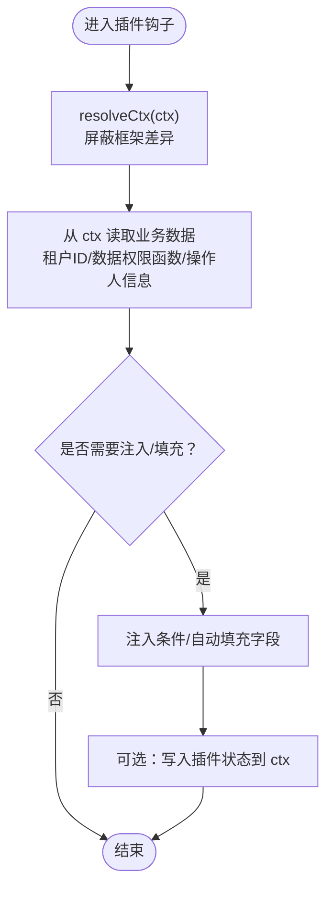
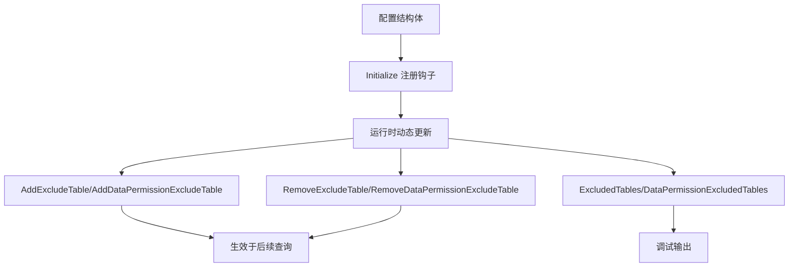
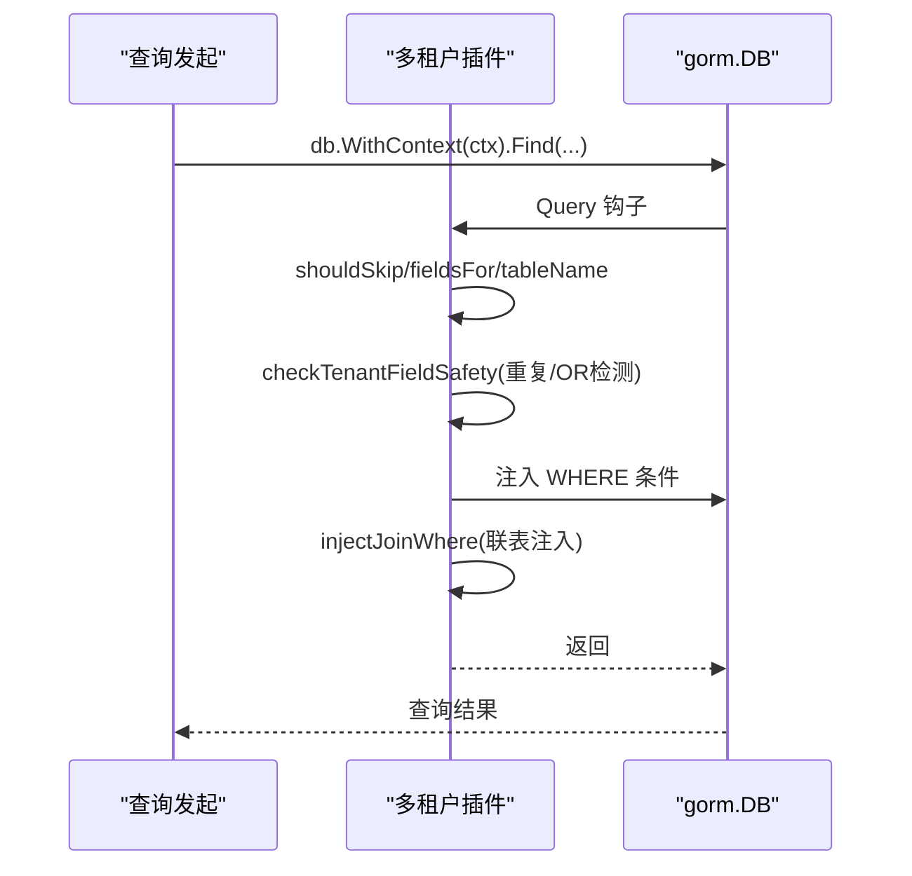
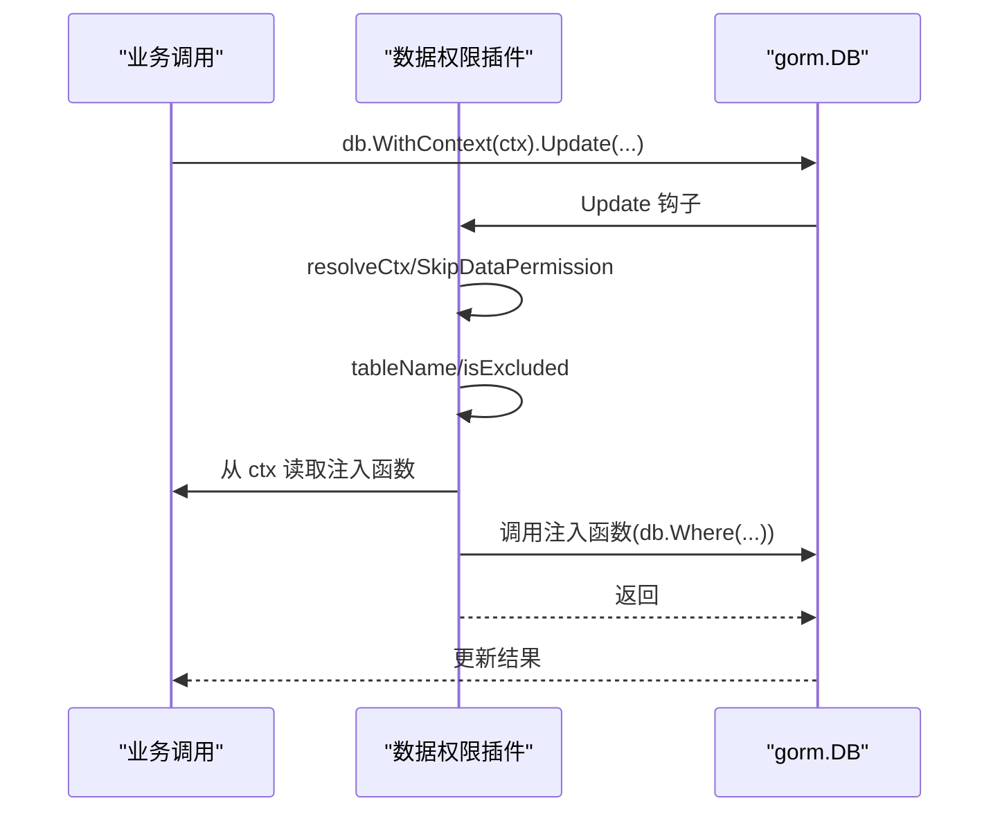
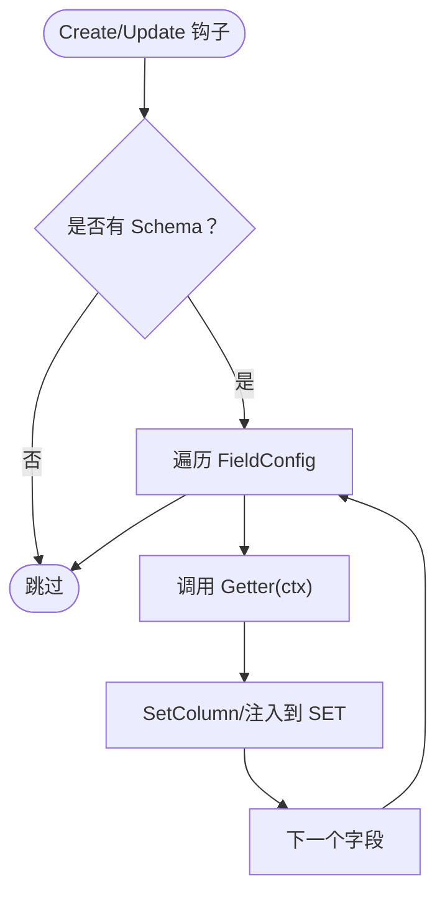
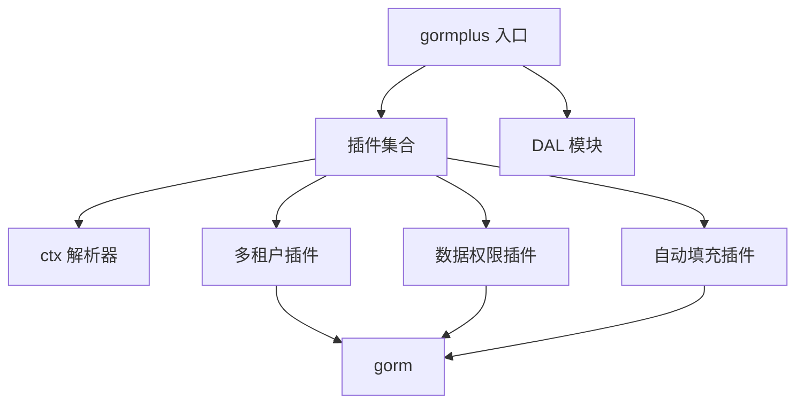

# 自定义插件开发

<cite>
**本文档引用的文件**
- [README.md](file://README.md)
- [gormplus.go](file://gormplus.go)
- [version.go](file://version.go)
- [plugin/ctx.go](file://plugin/ctx.go)
- [plugin/tenant.go](file://plugin/tenant.go)
- [plugin/tenant.md](file://plugin/tenant.md)
- [plugin/dataPermission.go](file://plugin/dataPermission.go)
- [plugin/dataPermission.md](file://plugin/dataPermission.md)
- [plugin/autoOperator.go](file://plugin/autoOperator.go)
- [plugin/autoOperator.md](file://plugin/autoOperator.md)
- [dal/dal.go](file://dal/dal.go)
- [dal/dal_test.go](file://dal/dal_test.go)
</cite>

## 目录
1. [简介](#简介)
2. [项目结构](#项目结构)
3. [核心组件](#核心组件)
4. [架构概览](#架构概览)
5. [详细组件分析](#详细组件分析)
6. [依赖分析](#依赖分析)
7. [性能考虑](#性能考虑)
8. [故障排查指南](#故障排查指南)
9. [结论](#结论)
10. [附录](#附录)

## 简介
本指南面向希望基于 GORM Plus 开发自定义插件的开发者，系统讲解插件接口定义、回调函数实现、生命周期管理、上下文交互、配置管理、最佳实践与测试策略。GORM Plus 通过 gorm.Plugin 接口与回调钩子（Callback）机制，将多租户、数据权限、自动填充等能力以插件形式提供，并统一通过 gormplus 入口导出。

## 项目结构
- 根入口：gormplus.go 提供统一导出与初始化流程
- 插件模块：plugin 目录包含 ctx 解析器、多租户、数据权限、自动填充等插件实现
- 数据访问层：dal 目录提供 SQL 文件化查询能力
- 文档与示例：各插件配套 md 文档展示使用方式
- 版本信息：version.go 提供版本号

**图表来源**
- [gormplus.go:1-120](file://gormplus.go#L1-L120)
- [plugin/ctx.go:1-44](file://plugin/ctx.go#L1-L44)
- [plugin/tenant.go:1-120](file://plugin/tenant.go#L1-L120)
- [plugin/dataPermission.go:1-120](file://plugin/dataPermission.go#L1-L120)
- [plugin/autoOperator.go:1-120](file://plugin/autoOperator.go#L1-L120)
- [dal/dal.go:1-120](file://dal/dal.go#L1-L120)
- [README.md:1-120](file://README.md#L1-L120)
- [version.go:1-4](file://version.go#L1-L4)

**章节来源**
- [gormplus.go:1-120](file://gormplus.go#L1-L120)
- [README.md:1-120](file://README.md#L1-L120)

## 核心组件
- gormplus 入口：统一导出插件注册、上下文解析、数据源管理、缓存、查询构建、代码生成器等能力
- 插件接口：遵循 gorm.Plugin，包含 Name() 与 Initialize(db) 两个核心方法
- 回调钩子：在 gorm 的 Create/Update/Query/Delete 等阶段注册 Before/After 钩子，实现业务逻辑注入
- 上下文解析：屏蔽框架差异，统一从 context 中读取业务数据
- 配置管理：通过结构化配置（TenantConfig、DataPermissionConfig、AutoFillConfig）控制插件行为

**章节来源**
- [gormplus.go:103-125](file://gormplus.go#L103-L125)
- [plugin/tenant.go:350-381](file://plugin/tenant.go#L350-L381)
- [plugin/dataPermission.go:138-162](file://plugin/dataPermission.go#L138-L162)
- [plugin/autoOperator.go:187-208](file://plugin/autoOperator.go#L187-L208)
- [plugin/ctx.go:31-43](file://plugin/ctx.go#L31-L43)

## 架构概览
GORM Plus 插件系统围绕 gorm.Plugin 接口展开，插件在 Initialize 中注册回调钩子，在钩子函数中读取上下文、解析配置、注入条件或自动填充字段。gormplus 入口负责对外暴露统一 API，并在必要时注册 ctx 解析器以兼容不同 Web 框架。

**图表来源**
- [gormplus.go:570-581](file://gormplus.go#L570-L581)
- [plugin/tenant.go:355-380](file://plugin/tenant.go#L355-L380)
- [plugin/dataPermission.go:142-161](file://plugin/dataPermission.go#L142-L161)
- [plugin/autoOperator.go:191-207](file://plugin/autoOperator.go#L191-L207)

## 详细组件分析

### 插件接口与生命周期
- 接口定义：gorm.Plugin
  - Name() string：返回插件唯一标识
  - Initialize(*gorm.DB) error：注册回调钩子
- 生命周期阶段
  - 多租户：Query/Update/Delete 前注入 WHERE 条件；Create 前自动填充字段
  - 数据权限：Query/Update/Delete 前调用业务注入函数追加条件
  - 自动填充：Create/Update 前根据 Getter 从上下文填充字段

**图表来源**
- [plugin/tenant.go:340-381](file://plugin/tenant.go#L340-L381)
- [plugin/dataPermission.go:132-162](file://plugin/dataPermission.go#L132-L162)
- [plugin/autoOperator.go:178-208](file://plugin/autoOperator.go#L178-L208)

**章节来源**
- [plugin/tenant.go:350-381](file://plugin/tenant.go#L350-L381)
- [plugin/dataPermission.go:138-162](file://plugin/dataPermission.go#L138-L162)
- [plugin/autoOperator.go:187-208](file://plugin/autoOperator.go#L187-L208)

### 上下文交互与数据读取
- ctx 解析器：RegisterCtxResolver 注册后，resolveCtx 统一将 *gin.Context 等框架特定类型转换为标准 context
- 读取业务数据：插件通过 resolveCtx(ctx) 获取标准 context，再从其中读取租户 ID、数据权限注入函数、操作人信息等
- 写入插件状态：通过 WithXxx(ctx, ...) 将状态写入 context，供后续插件或业务代码使用

**图表来源**
- [plugin/ctx.go:31-43](file://plugin/ctx.go#L31-L43)
- [plugin/tenant.go:534-537](file://plugin/tenant.go#L534-L537)
- [plugin/dataPermission.go:169-193](file://plugin/dataPermission.go#L169-L193)
- [plugin/autoOperator.go:212-226](file://plugin/autoOperator.go#L212-L226)

**章节来源**
- [plugin/ctx.go:31-43](file://plugin/ctx.go#L31-L43)
- [plugin/tenant.go:530-595](file://plugin/tenant.go#L530-L595)
- [plugin/dataPermission.go:164-204](file://plugin/dataPermission.go#L164-L204)
- [plugin/autoOperator.go:209-275](file://plugin/autoOperator.go#L209-L275)

### 配置管理与动态更新
- 配置结构：TenantConfig、DataPermissionConfig、AutoFillConfig 等
- 运行时动态更新：
  - 多租户：AddExcludeTable/RemoveExcludeTable/ExcludedTables
  - 数据权限：AddDataPermissionExcludeTable/RemoveDataPermissionExcludeTable/DataPermissionExcludedTables
- 配置验证：插件在初始化时进行参数校验（如租户字段不能为空）

**图表来源**
- [plugin/tenant.go:1085-1130](file://plugin/tenant.go#L1085-L1130)
- [plugin/dataPermission.go:282-338](file://plugin/dataPermission.go#L282-L338)

**章节来源**
- [plugin/tenant.go:1057-1068](file://plugin/tenant.go#L1057-L1068)
- [plugin/dataPermission.go:243-249](file://plugin/dataPermission.go#L243-L249)

### 多租户插件（复杂示例）
- 功能要点：自动注入 WHERE 条件、Create 自动填充、JOIN 自动注入、安全保护（重复条件策略、OR 绕过检测、全表保护）
- 配置优先级：TableFields > TenantFields > TenantField
- 联表处理：自动解析别名，支持覆盖配置与排除表

**图表来源**
- [plugin/tenant.go:529-595](file://plugin/tenant.go#L529-L595)
- [plugin/tenant.go:644-713](file://plugin/tenant.go#L644-L713)
- [plugin/tenant.md:1-30](file://plugin/tenant.md#L1-L30)

**章节来源**
- [plugin/tenant.go:383-510](file://plugin/tenant.go#L383-L510)
- [plugin/tenant.go:529-713](file://plugin/tenant.go#L529-L713)
- [plugin/tenant.md:1-30](file://plugin/tenant.md#L1-L30)

### 数据权限插件（复杂示例）
- 功能要点：在 Query/Update/Delete 前调用业务注入函数追加条件；支持跳过与排除表
- 注入方式：底层统一使用 db.Statement.Where 注入（db.Scopes 在回调中无效）

**图表来源**
- [plugin/dataPermission.go:164-204](file://plugin/dataPermission.go#L164-L204)
- [plugin/dataPermission.md:1-50](file://plugin/dataPermission.md#L1-L50)

**章节来源**
- [plugin/dataPermission.go:138-204](file://plugin/dataPermission.go#L138-L204)
- [plugin/dataPermission.md:1-50](file://plugin/dataPermission.md#L1-L50)

### 自动填充插件（简单示例）
- 功能要点：Create/Update 前根据 FieldConfig 与 Getter 从上下文填充字段
- 支持多种 Getter：内置 CtxGetter、OperatorGetter，或自定义 Getter
- 路径适配：普通 Update、UpdateColumn、UpdateSimple 等不同路径分别处理

**图表来源**
- [plugin/autoOperator.go:210-275](file://plugin/autoOperator.go#L210-L275)
- [plugin/autoOperator.md:1-102](file://plugin/autoOperator.md#L1-L102)

**章节来源**
- [plugin/autoOperator.go:187-275](file://plugin/autoOperator.go#L187-L275)
- [plugin/autoOperator.md:1-102](file://plugin/autoOperator.md#L1-L102)

## 依赖分析
- gormplus 入口依赖各插件模块与 DAL 模块
- 插件内部依赖 gorm 的 Plugin 接口与 Callback 系统
- ctx 解析器为插件提供统一的上下文访问能力
- 插件之间相互独立，通过 gorm 的 db.Use() 注册

**图表来源**
- [gormplus.go:88-101](file://gormplus.go#L88-L101)
- [plugin/ctx.go:1-44](file://plugin/ctx.go#L1-L44)
- [plugin/tenant.go:340-381](file://plugin/tenant.go#L340-L381)
- [plugin/dataPermission.go:132-162](file://plugin/dataPermission.go#L132-L162)
- [plugin/autoOperator.go:178-208](file://plugin/autoOperator.go#L178-L208)

**章节来源**
- [gormplus.go:88-101](file://gormplus.go#L88-L101)

## 性能考虑
- 回调钩子注册：尽量在 Initialize 中一次性完成，避免重复注册
- 条件注入：多租户/数据权限插件在钩子中直接操作 db.Statement.Where，避免额外 ORM 调用
- Schema 检查：自动填充插件在无 Schema 时跳过，避免无效计算
- 缓存与清理：DAL 模块提供 SQL 缓存与定时清理，减少重复加载开销
- 并发安全：插件内部使用互斥锁保护可变配置（如排除表集合）

**章节来源**
- [plugin/autoOperator.go:279-283](file://plugin/autoOperator.go#L279-L283)
- [dal/dal.go:502-519](file://dal/dal.go#L502-L519)

## 故障排查指南
- 插件未注册：检查 gormplus.RegisterTenant/RegisterDataPermission/db.Use 等调用
- 上下文数据读取失败：确认已注册 RegisterCtxResolver，且中间件正确写入 ctx
- 多租户 OR 绕过：插件会拒绝包含租户字段的 OR 条件，检查 SQL 是否误用 OR
- 全表保护：无业务条件的 Update/Delete 会被拒绝，可通过 AllowGlobalOperation 临时放开
- 数据权限未生效：确认中间件已写入 WithDataPermission，且表不在排除列表中
- 自动填充未生效：确认 Getter 返回值类型与字段类型匹配，Create/Update 路径正确

**章节来源**
- [plugin/tenant.go:823-865](file://plugin/tenant.go#L823-L865)
- [plugin/dataPermission.go:164-204](file://plugin/dataPermission.go#L164-L204)
- [plugin/autoOperator.go:210-275](file://plugin/autoOperator.go#L210-L275)

## 结论
GORM Plus 通过标准化的插件接口与回调机制，提供了多租户、数据权限、自动填充等企业级能力。开发者可基于现有插件实现模式，快速开发自定义插件，遵循上下文解析、配置管理、生命周期与错误处理的最佳实践，确保插件在性能、安全与可维护性方面达到生产级别要求。

## 附录

### 开发步骤清单
- 定义插件结构体与配置结构体
- 实现 gorm.Plugin 接口（Name/Initialize）
- 在 Initialize 中注册回调钩子
- 在钩子中使用 resolveCtx 读取上下文数据
- 根据业务需求注入条件或自动填充字段
- 提供运行时动态配置与快照查询接口
- 编写单元测试与集成测试，覆盖边界与异常场景

### 测试策略
- 单元测试：使用 mockLoader 与 SQLite 内存数据库，验证 DAL 查询、执行、分页等核心能力
- 集成测试：模拟真实请求链路，验证插件在不同框架（gin/go-zero/fiber）下的上下文解析与注入行为
- 性能测试：对比启用/禁用插件时的查询耗时，评估回调钩子对性能的影响

**章节来源**
- [dal/dal_test.go:1-120](file://dal/dal_test.go#L1-L120)
- [dal/dal_test.go:268-322](file://dal/dal_test.go#L268-L322)
- [dal/dal_test.go:447-501](file://dal/dal_test.go#L447-L501)
- [dal/dal_test.go:545-611](file://dal/dal_test.go#L545-L611)