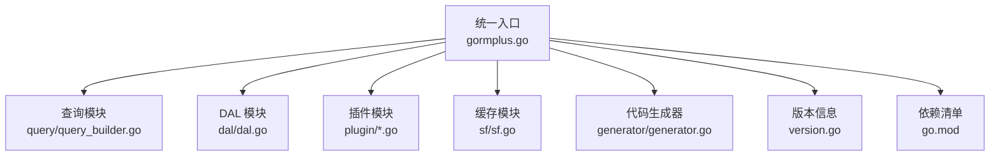
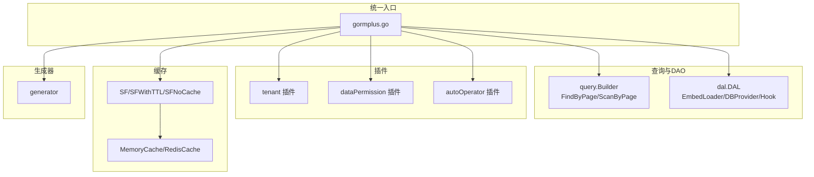
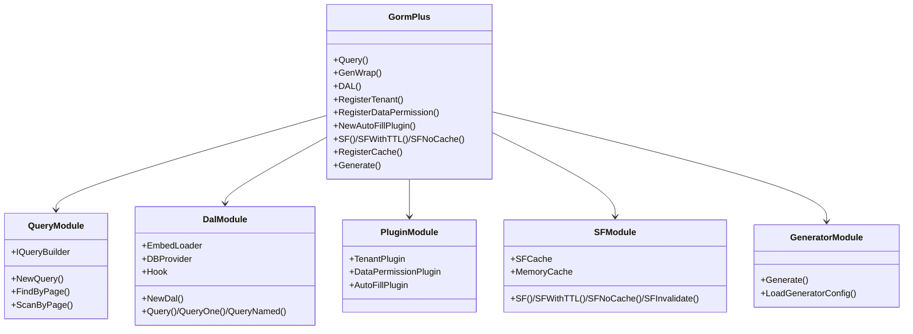
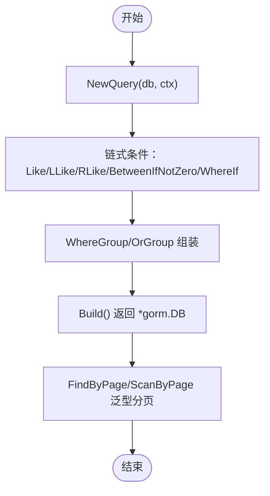
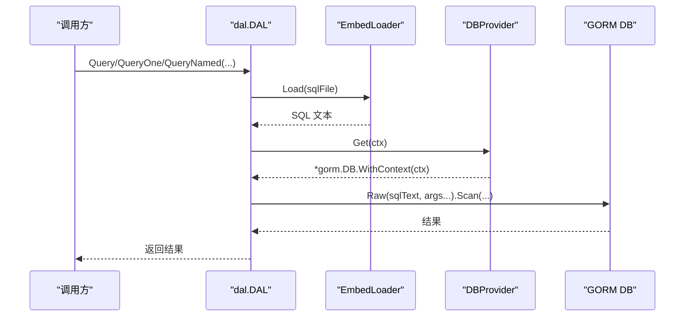
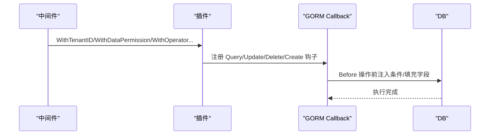
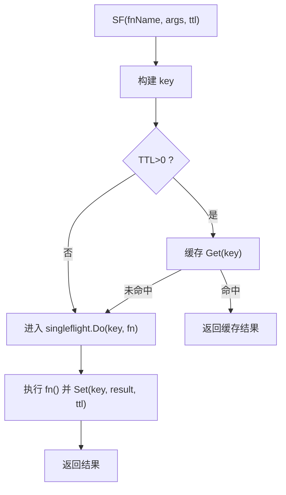
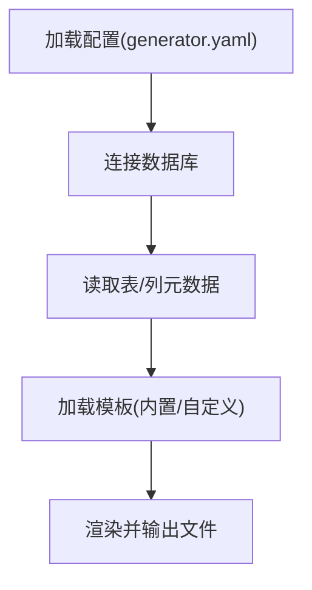
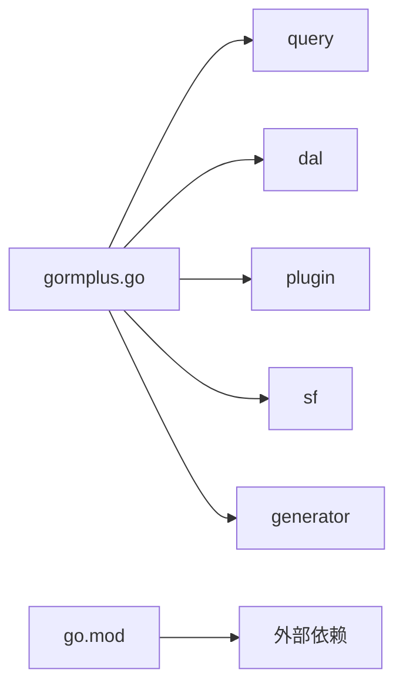

# 整体设计

<cite>
**本文引用的文件**
- [gormplus.go](file://gormplus.go)
- [version.go](file://version.go)
- [go.mod](file://go.mod)
- [README.md](file://README.md)
- [dal/dal.go](file://dal/dal.go)
- [query/query_builder.go](file://query/query_builder.go)
- [sf/sf.go](file://sf/sf.go)
- [plugin/tenant.go](file://plugin/tenant.go)
- [plugin/dataPermission.go](file://plugin/dataPermission.go)
- [plugin/autoOperator.go](file://plugin/autoOperator.go)
- [generator/generator.go](file://generator/generator.go)
</cite>

## 目录
1. [简介](#简介)
2. [项目结构](#项目结构)
3. [核心组件](#核心组件)
4. [架构总览](#架构总览)
5. [详细组件分析](#详细组件分析)
6. [依赖分析](#依赖分析)
7. [性能考虑](#性能考虑)
8. [故障排查指南](#故障排查指南)
9. [结论](#结论)
10. [附录](#附录)

## 简介
本项目旨在为 GORM 提供一套“统一入口、模块化能力、插件化扩展”的增强方案。通过单一导入接口，开发者即可获得链式条件构造、SQL 文件化查询、多数据源管理、多租户/数据权限/自动填充等横切能力，并支持可插拔缓存与慢查询监控，兼顾易用性与工程化实践。

设计核心理念：
- 统一入口：用户仅需 import 一个包，即可使用全部功能，降低心智负担与导入成本。
- 模块化：各能力以独立子模块组织，职责清晰、边界明确，便于按需启用。
- 插件化：围绕 GORM 的回调机制与中间件/上下文，提供可组合、可开关的横切能力。
- 可观测与稳定性：内置慢查询监控、SingleFlight 防缓存击穿、可插拔缓存，保障线上稳定。
- 版本与兼容：通过版本常量与清晰的 API 设计，尽量保证向后兼容与平滑升级路径。

## 项目结构
项目采用“统一入口 + 子模块”的组织方式，核心文件与模块如下：
- 统一入口：gormplus.go，集中导出所有能力，形成单一导入点。
- 子模块：
  - query：原生 GORM 链式条件构造器与泛型分页。
  - dal：SQL 文件化查询（embed + 泛型），支持命名参数、分页、Hook、缓存清理。
  - plugin：多租户、数据权限、自动填充等插件。
  - sf：SingleFlight + 可插拔缓存。
  - generator：基于 gorm-gen 的代码生成器。
- 版本与元信息：version.go、go.mod、README.md。

图表来源
- [gormplus.go:1-1305](file://gormplus.go#L1-L1305)
- [dal/dal.go:1-1506](file://dal/dal.go#L1-L1506)
- [query/query_builder.go:1-307](file://query/query_builder.go#L1-L307)
- [sf/sf.go:1-395](file://sf/sf.go#L1-L395)
- [plugin/tenant.go:1-1223](file://plugin/tenant.go#L1-L1223)
- [plugin/dataPermission.go:1-339](file://plugin/dataPermission.go#L1-L339)
- [plugin/autoOperator.go:1-309](file://plugin/autoOperator.go#L1-L309)
- [generator/generator.go:1-1260](file://generator/generator.go#L1-L1260)
- [version.go:1-4](file://version.go#L1-L4)
- [go.mod:1-26](file://go.mod#L1-L26)

章节来源
- [gormplus.go:1-1305](file://gormplus.go#L1-L1305)
- [README.md:17-41](file://README.md#L17-L41)

## 核心组件
- 统一入口与导出
  - gormplus.go 通过别名与导出函数，将 query、dal、plugin、sf、generator 等模块能力集中暴露，形成单一导入接口。
  - 优势：减少导入数量、统一命名空间、降低使用复杂度。
- 查询与分页
  - query.Builder 提供 Like/LLike/RLike、BetweenIfNotZero、WhereIf、分组 WhereGroup/OrGroup 等能力，并支持泛型 FindByPage/ScanByPage。
- DAL SQL 文件化
  - dal 提供 EmbedLoader、DBProvider、Hook、Options 等抽象，支持命名参数、分页、缓存清理、多数据源实例切换。
- 插件化横切能力
  - 多租户：自动注入 WHERE 条件、Create 自动填充、JOIN 自动注入、安全策略（重复条件、OR 绕过、全表保护）、动态排除表。
  - 数据权限：通过中间件注入函数，在 Query/Update/Delete 前自动追加业务条件。
  - 自动填充：在 Create/Update/SkipHooks 路径下自动写入字段值。
- SingleFlight + 可插拔缓存
  - SF/SFWithTTL/SFNoCache 三层保护；支持内存/Redis 等缓存实现；提供主动失效。
- 代码生成器
  - 基于 gorm-gen，支持 Model/Repository/API/VO/DTO 生成，模板可覆盖，路径解析与项目根定位。

章节来源
- [gormplus.go:1-1305](file://gormplus.go#L1-L1305)
- [query/query_builder.go:1-307](file://query/query_builder.go#L1-L307)
- [dal/dal.go:1-1506](file://dal/dal.go#L1-L1506)
- [sf/sf.go:1-395](file://sf/sf.go#L1-L395)
- [plugin/tenant.go:1-1223](file://plugin/tenant.go#L1-L1223)
- [plugin/dataPermission.go:1-339](file://plugin/dataPermission.go#L1-L339)
- [plugin/autoOperator.go:1-309](file://plugin/autoOperator.go#L1-L309)
- [generator/generator.go:1-1260](file://generator/generator.go#L1-L1260)

## 架构总览
统一入口将各模块能力聚合，通过上下文与中间件实现横切注入，通过 GORM 回调与插件机制实现可组合的横切能力。缓存模块提供 SingleFlight 与可插拔缓存，代码生成器提供工程化产出。

图表来源
- [gormplus.go:1-1305](file://gormplus.go#L1-L1305)
- [query/query_builder.go:1-307](file://query/query_builder.go#L1-L307)
- [dal/dal.go:1-1506](file://dal/dal.go#L1-L1506)
- [plugin/tenant.go:1-1223](file://plugin/tenant.go#L1-L1223)
- [plugin/dataPermission.go:1-339](file://plugin/dataPermission.go#L1-L339)
- [plugin/autoOperator.go:1-309](file://plugin/autoOperator.go#L1-L309)
- [sf/sf.go:1-395](file://sf/sf.go#L1-L395)
- [generator/generator.go:1-1260](file://generator/generator.go#L1-L1260)

## 详细组件分析

### 统一入口与模块化设计
- 设计要点
  - 通过 gormplus.go 导出类型别名与函数，将子模块 API 透明暴露，形成“单一导入、多模块能力”的统一入口。
  - 子模块内部保持低耦合，通过明确的接口（如 DBProvider、SQLLoader、Hook）解耦具体实现。
- 优势
  - 降低学习成本：用户只需记住一个包名。
  - 降低维护成本：子模块可独立演进与测试。
  - 易于扩展：新增模块只需在统一入口导出即可。

图表来源
- [gormplus.go:1-1305](file://gormplus.go#L1-L1305)
- [query/query_builder.go:1-307](file://query/query_builder.go#L1-L307)
- [dal/dal.go:1-1506](file://dal/dal.go#L1-L1506)
- [plugin/tenant.go:1-1223](file://plugin/tenant.go#L1-L1223)
- [plugin/dataPermission.go:1-339](file://plugin/dataPermission.go#L1-L339)
- [plugin/autoOperator.go:1-309](file://plugin/autoOperator.go#L1-L309)
- [sf/sf.go:1-395](file://sf/sf.go#L1-L395)
- [generator/generator.go:1-1260](file://generator/generator.go#L1-L1260)

章节来源
- [gormplus.go:1-1305](file://gormplus.go#L1-L1305)

### 查询与分页（Query）
- 能力概览
  - 提供 Like/LLike/RLike、BetweenIfNotZero、WhereIf、WhereGroup/OrGroup 等链式条件方法。
  - Build 返回原生 *gorm.DB，可继续使用 gorm 原生命令。
  - 提供 FindByPage/ScanByPage 泛型分页封装。
- 设计考量
  - 通过条件节点树与递归应用，保证括号与优先级正确。
  - 泛型分页避免重复写 Count/Limit/Offset，提升一致性与可读性。

图表来源
- [query/query_builder.go:1-307](file://query/query_builder.go#L1-L307)

章节来源
- [query/query_builder.go:1-307](file://query/query_builder.go#L1-L307)

### SQL 文件化查询（DAL）
- 能力概览
  - EmbedLoader 基于 fs.FS 打包 SQL，支持缓存与 singleflight 防击穿。
  - DBProvider 抽象数据库提供器，支持单库/多库/读写分离/多租户/分库分表。
  - Hook 生命周期钩子，支持慢 SQL 监控、指标采集、链路追踪。
  - 支持命名参数与位置参数、分页、执行与计数、预热与缓存清理。
- 设计考量
  - 将 SQL 与代码分离，利于 DBA 审核、版本管理与复杂 SQL 场景。
  - 通过 WithDB 注入上下文，实现多数据源实例的无感切换。

图表来源
- [dal/dal.go:1-1506](file://dal/dal.go#L1-L1506)

章节来源
- [dal/dal.go:1-1506](file://dal/dal.go#L1-L1506)

### 插件化横切能力
- 多租户插件
  - 注册一次，自动在 Query/Update/Delete/Create 前注入租户条件；支持多字段、表级覆盖、JOIN 自动注入、安全策略（重复条件跳过、OR 危险拒绝、全表保护）。
- 数据权限插件
  - 通过中间件注入业务函数，在 Query/Update/Delete 前追加数据范围条件；支持排除表动态维护。
- 自动填充插件
  - 在 Create/Update/SkipHooks 路径下自动写入字段值；支持多字段与自定义 Getter。

图表来源
- [plugin/tenant.go:1-1223](file://plugin/tenant.go#L1-L1223)
- [plugin/dataPermission.go:1-339](file://plugin/dataPermission.go#L1-L339)
- [plugin/autoOperator.go:1-309](file://plugin/autoOperator.go#L1-L309)

章节来源
- [plugin/tenant.go:1-1223](file://plugin/tenant.go#L1-L1223)
- [plugin/dataPermission.go:1-339](file://plugin/dataPermission.go#L1-L339)
- [plugin/autoOperator.go:1-309](file://plugin/autoOperator.go#L1-L309)

### SingleFlight + 可插拔缓存（SF）
- 能力概览
  - SF：带缓存的合并请求；SFWithTTL：显式 TTL；SFNoCache：纯合并不缓存；SFInvalidate：主动失效。
  - 支持内存缓存与 Redis 等自定义实现；默认懒初始化内存缓存。
- 设计考量
  - 通过 singleflight 防止缓存击穿；通过可插拔缓存适配多实例部署；通过主动失效保证一致性。

图表来源
- [sf/sf.go:1-395](file://sf/sf.go#L1-L395)

章节来源
- [sf/sf.go:1-395](file://sf/sf.go#L1-L395)

### 代码生成器（Generator）
- 能力概览
  - 基于 gorm-gen，生成 Model/Repository/API/VO/DTO；模板可覆盖；路径解析与项目根定位；支持交互式输入表名。
- 设计考量
  - 生成器与业务代码解耦，避免手写样板代码；模板可定制，满足不同团队规范。

图表来源
- [generator/generator.go:1-1260](file://generator/generator.go#L1-L1260)

章节来源
- [generator/generator.go:1-1260](file://generator/generator.go#L1-L1260)

### 版本管理与兼容性策略
- 版本常量
  - 通过 version.go 暴露版本号，便于运维与诊断。
- 兼容性策略
  - API 设计尽量保持稳定，新增能力以可选参数/可插拔方式提供，避免破坏性变更。
  - 插件注册与初始化遵循“尽早调用”原则，避免运行时状态不一致。
  - 通过 README 与示例文档，提供清晰的升级路径与迁移建议。

章节来源
- [version.go:1-4](file://version.go#L1-L4)
- [README.md:1-891](file://README.md#L1-L891)

## 依赖分析
- 外部依赖
  - gorm.io/gorm、gorm.io/gen、gorm.io/driver/mysql 等，通过 go.mod 管理。
- 内部模块依赖
  - gormplus.go 统一导出各模块；各模块内部保持低耦合，通过接口解耦。
- 循环依赖
  - 未发现循环依赖迹象；模块边界清晰。

图表来源
- [gormplus.go:1-1305](file://gormplus.go#L1-L1305)
- [go.mod:1-26](file://go.mod#L1-L26)

章节来源
- [go.mod:1-26](file://go.mod#L1-L26)

## 性能考虑
- 查询与分页
  - query.Builder 通过 Build 返回原生 *gorm.DB，避免额外封装开销；泛型分页减少重复代码与潜在错误。
- DAL
  - EmbedLoader 使用 singleflight 与缓存，避免重复解析 SQL；可选后台定时清理，防止内存膨胀。
- 插件
  - 多租户/数据权限在回调中注入，避免业务代码重复；安全策略（重复条件跳过、OR 危险拒绝）在注入前快速判断，减少无效执行。
- 缓存
  - SF/SFWithTTL/SFNoCache 三层保护，结合可插拔缓存与主动失效，平衡吞吐与一致性。
- 生成器
  - 模板可覆盖，避免重复生成；路径解析与项目根定位，减少 IO 与错误。

## 故障排查指南
- 上下文与框架差异
  - Gin/Go-Zero/Fiber 的 context 类型不同，需注册 ctx 解析器，确保插件能从中间件写入的值中读取。
- 多数据源
  - 中间件中通过 DSWithName/DSWithRead/DSWithWrite 标记数据源与读写方向；Repository 层通过 DS.Auto(ctx) 获取 DB。
- 多租户/数据权限
  - 确认中间件已写入租户 ID/数据权限函数；若出现 OR 绕过或全表保护错误，检查策略与业务条件。
- 缓存
  - 写操作后及时调用 SFInvalidate；若使用内存缓存，退出时调用 StopSFCache。
- 生成器
  - 确认 generator.yaml 路径解析正确；交互式输入表名时注意大小写与表存在性。

章节来源
- [README.md:114-136](file://README.md#L114-L136)
- [README.md:179-215](file://README.md#L179-L215)
- [plugin/tenant.go:436-468](file://plugin/tenant.go#L436-L468)
- [sf/sf.go:208-225](file://sf/sf.go#L208-L225)
- [generator/generator.go:22-68](file://generator/generator.go#L22-L68)

## 结论
本项目通过“统一入口 + 模块化 + 插件化”的设计，将 GORM 的能力以更易用、可观测、可扩展的方式呈现。统一入口降低了使用门槛，模块化提升了可维护性，插件化实现了横切能力的灵活组合。结合缓存与生成器，既满足日常开发效率，又兼顾线上稳定性与可演进性。版本与兼容性策略进一步保障了长期使用体验。

## 附录
- 快速开始与示例参考：README.md 中的安装、目录结构、快速开始与各模块使用示例。
- 版本信息：version.go 中的版本常量。

章节来源
- [README.md:1-891](file://README.md#L1-L891)
- [version.go:1-4](file://version.go#L1-L4)