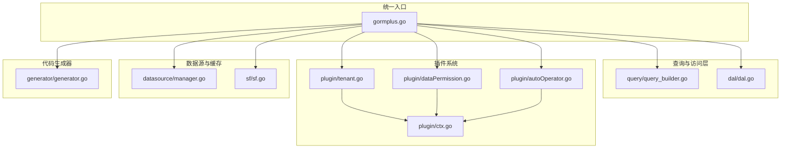
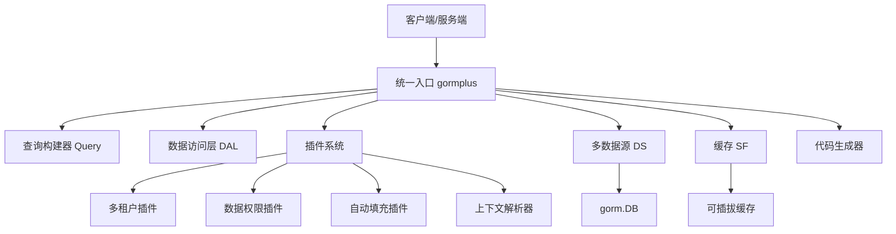
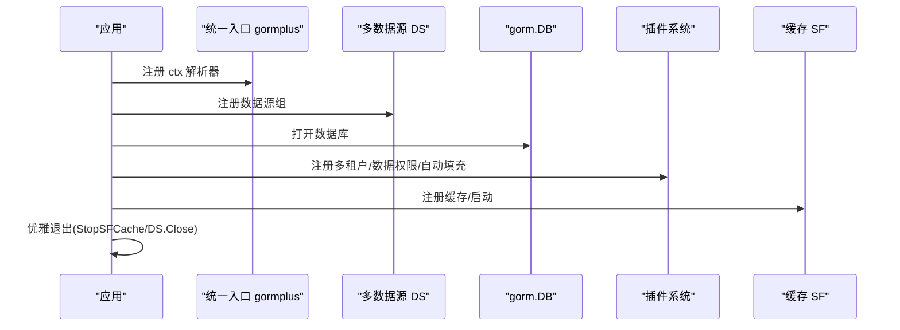
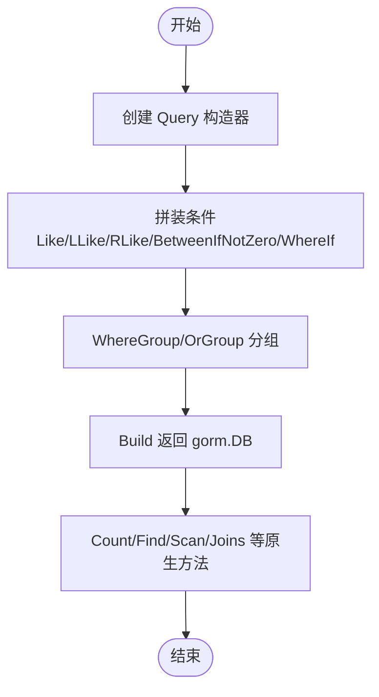
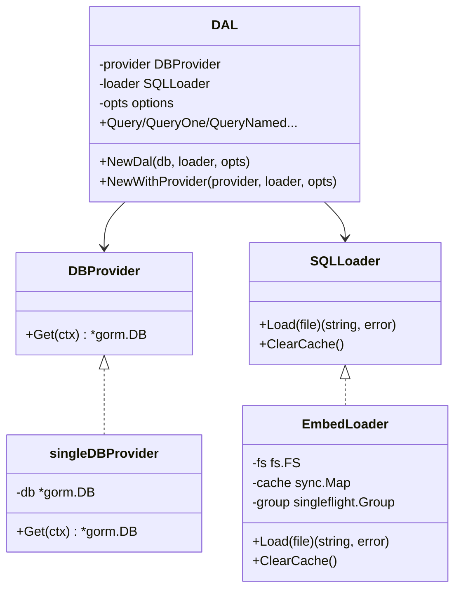
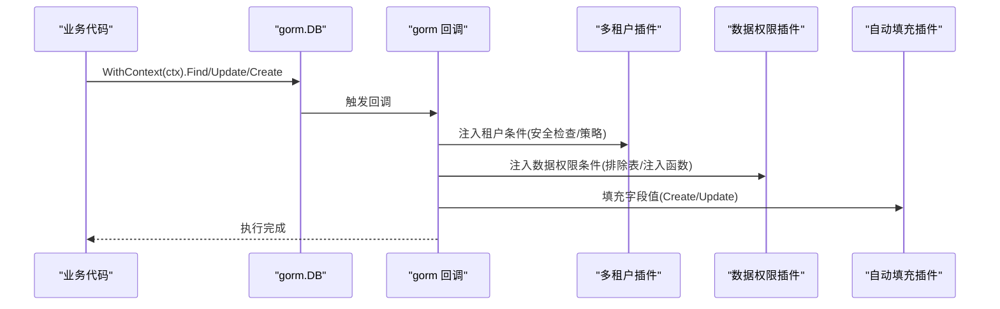
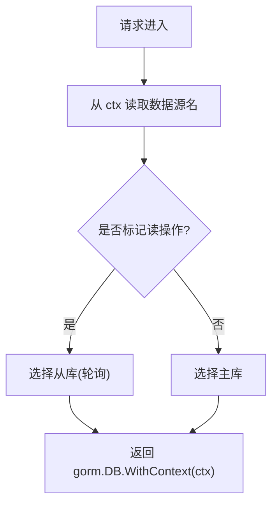
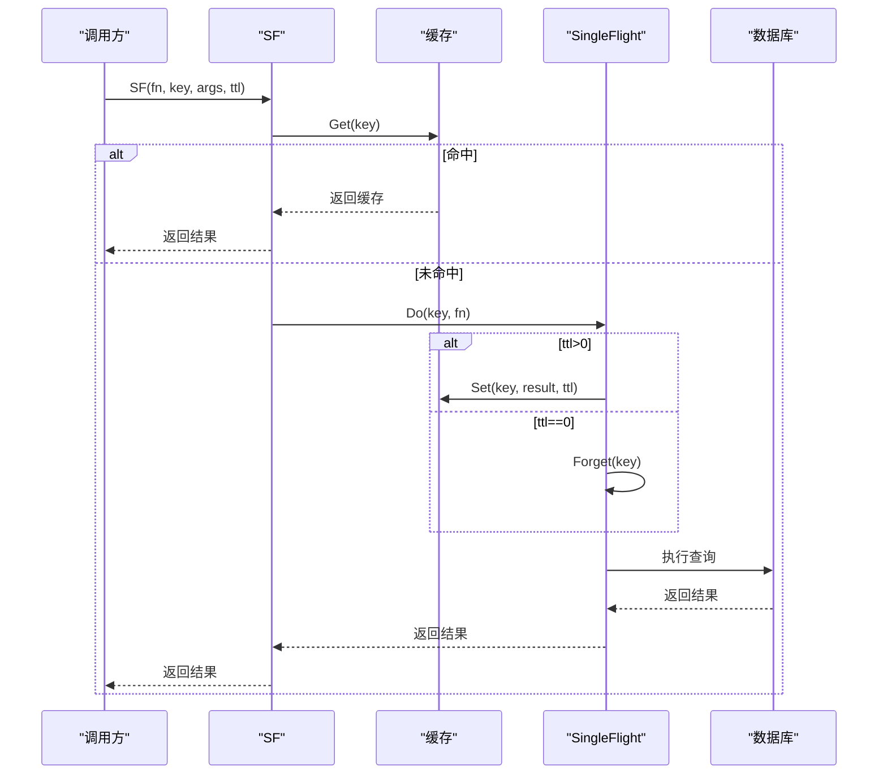
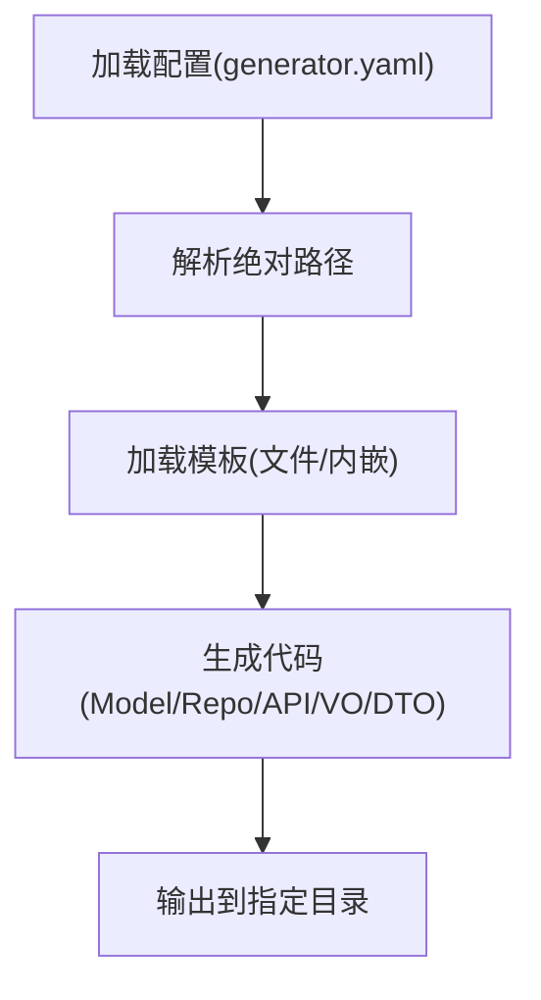
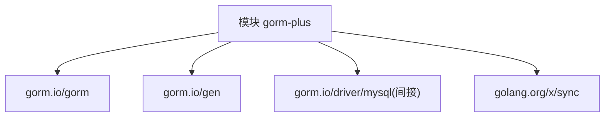

# 核心架构

<cite>
**本文引用的文件**
- [gormplus.go](file://gormplus.go)
- [version.go](file://version.go)
- [dal/dal.go](file://dal/dal.go)
- [plugin/tenant.go](file://plugin/tenant.go)
- [plugin/dataPermission.go](file://plugin/dataPermission.go)
- [plugin/autoOperator.go](file://plugin/autoOperator.go)
- [datasource/manager.go](file://datasource/manager.go)
- [sf/sf.go](file://sf/sf.go)
- [query/query_builder.go](file://query/query_builder.go)
- [generator/generator.go](file://generator/generator.go)
- [go.mod](file://go.mod)
- [README.md](file://README.md)
</cite>

## 目录
1. [简介](#简介)
2. [项目结构](#项目结构)
3. [核心组件](#核心组件)
4. [架构总览](#架构总览)
5. [详细组件分析](#详细组件分析)
6. [依赖关系分析](#依赖关系分析)
7. [性能考量](#性能考量)
8. [故障排查指南](#故障排查指南)
9. [结论](#结论)
10. [附录](#附录)

## 简介
GORM Plus 是一个基于 GORM 的增强扩展包，提供统一入口管理，涵盖查询构建器、数据访问层（DAL）、插件系统（多租户、数据权限、自动填充、慢查询监控）、多数据源管理、SingleFlight 可插拔缓存以及代码生成器等能力。其设计理念是“统一入口 + 插件化 + 模块解耦”，通过 gorm 回调机制与上下文解析器实现横切能力的自动化注入，降低业务代码侵入，提升可维护性与扩展性。

## 项目结构
项目采用按功能域划分的模块化组织方式，核心模块包括：
- 统一入口：gormplus.go，聚合导出所有能力
- 查询构建器：query/query_builder.go，原生 gorm 链式条件构造器
- 数据访问层：dal/dal.go，SQL 文件化查询（embed + 泛型）
- 插件系统：plugin/*，多租户、数据权限、自动填充、上下文解析器
- 多数据源管理：datasource/manager.go，任意驱动的一主多从读写分离
- 缓存与并发：sf/sf.go，SingleFlight + 可插拔缓存
- 代码生成器：generator/generator.go，Model/Repository/API/VO/DTO 一键生成
- 版本与依赖：version.go、go.mod

**图表来源**
- [gormplus.go:1-1305](file://gormplus.go#L1-L1305)
- [query/query_builder.go:1-307](file://query/query_builder.go#L1-L307)
- [dal/dal.go:1-1506](file://dal/dal.go#L1-L1506)
- [plugin/tenant.go:1-1223](file://plugin/tenant.go#L1-L1223)
- [plugin/dataPermission.go:1-339](file://plugin/dataPermission.go#L1-L339)
- [plugin/autoOperator.go:1-309](file://plugin/autoOperator.go#L1-L309)
- [datasource/manager.go:1-579](file://datasource/manager.go#L1-L579)
- [sf/sf.go:1-395](file://sf/sf.go#L1-L395)
- [generator/generator.go:1-1260](file://generator/generator.go#L1-L1260)

**章节来源**
- [README.md:17-41](file://README.md#L17-L41)
- [go.mod:1-26](file://go.mod#L1-L26)

## 核心组件
- 统一入口 gormplus：对外暴露统一 API，聚合各模块能力，简化用户导入与使用成本
- 查询构建器 Query：原生 gorm 链式条件构造器，支持模糊、范围、条件开关、分组等
- 数据访问层 DAL：SQL 文件化查询，支持命名参数、分页、Hook、缓存清理、多数据源
- 插件系统：多租户、数据权限、自动填充、上下文解析器，基于 gorm 回调机制自动注入
- 多数据源 DS：任意驱动的一主多从、读写分离、懒连接、健康检查、优雅关闭
- 缓存 SF：SingleFlight + 可插拔缓存，支持内存/Redis 等，提供 TTL 与主动失效
- 代码生成器：基于配置生成 Model/Repository/API/VO/DTO，支持模板覆盖与路径解析

**章节来源**
- [gormplus.go:1-1305](file://gormplus.go#L1-L1305)
- [query/query_builder.go:1-307](file://query/query_builder.go#L1-L307)
- [dal/dal.go:1-1506](file://dal/dal.go#L1-L1506)
- [plugin/tenant.go:1-1223](file://plugin/tenant.go#L1-L1223)
- [plugin/dataPermission.go:1-339](file://plugin/dataPermission.go#L1-L339)
- [plugin/autoOperator.go:1-309](file://plugin/autoOperator.go#L1-L309)
- [datasource/manager.go:1-579](file://datasource/manager.go#L1-L579)
- [sf/sf.go:1-395](file://sf/sf.go#L1-L395)
- [generator/generator.go:1-1260](file://generator/generator.go#L1-L1260)

## 架构总览
GORM Plus 的整体架构围绕“统一入口 + 插件化 + 模块解耦”展开。统一入口负责模块聚合与对外 API 暴露；插件系统通过 gorm 回调机制在 Query/Update/Delete/Create 等阶段自动注入横切逻辑；多数据源管理器通过上下文自动选择主/从库；缓存模块提供并发保护与缓存一致性；DAL 与查询构建器分别面向复杂 SQL 与链式条件场景；代码生成器提升工程效率。

**图表来源**
- [gormplus.go:1-1305](file://gormplus.go#L1-L1305)
- [plugin/tenant.go:1-1223](file://plugin/tenant.go#L1-L1223)
- [plugin/dataPermission.go:1-339](file://plugin/dataPermission.go#L1-L339)
- [plugin/autoOperator.go:1-309](file://plugin/autoOperator.go#L1-L309)
- [datasource/manager.go:1-579](file://datasource/manager.go#L1-L579)
- [sf/sf.go:1-395](file://sf/sf.go#L1-L395)
- [dal/dal.go:1-1506](file://dal/dal.go#L1-L1506)
- [query/query_builder.go:1-307](file://query/query_builder.go#L1-L307)
- [generator/generator.go:1-1260](file://generator/generator.go#L1-L1260)

## 详细组件分析

### 统一入口管理
- 设计理念：通过单一导入路径提供全部能力，隐藏内部模块细节，降低学习与使用成本
- 实现方式：在统一入口中导入各模块并导出类型别名、常量、函数，形成对外 API 面
- 初始化顺序：ctx 解析器 → 多数据源 → DB 打开 → 插件注册 → 缓存/退出清理

**图表来源**
- [gormplus.go:22-85](file://gormplus.go#L22-L85)
- [datasource/manager.go:258-277](file://datasource/manager.go#L258-L277)
- [sf/sf.go:101-114](file://sf/sf.go#L101-L114)

**章节来源**
- [gormplus.go:22-85](file://gormplus.go#L22-L85)

### 查询构建器（Query）
- 能力：模糊查询、范围查询、条件开关、AND/OR 分组、Build 返回原生 gorm.DB
- 适配：支持泛型分页 FindByPage/ScanByPage
- 优势：链式 API 简洁直观，自动跳过空值条件，减少样板代码

**图表来源**
- [query/query_builder.go:46-221](file://query/query_builder.go#L46-L221)

**章节来源**
- [query/query_builder.go:1-307](file://query/query_builder.go#L1-L307)

### 数据访问层（DAL）
- 特性：SQL 文件化管理、泛型查询、命名参数、事务、Hook、缓存清理、多数据源
- DBProvider：抽象数据库提供器，支持单库/多库/读写分离/多租户/分库分表
- Loader：EmbedLoader 基于 fs.FS，支持缓存与 singleflight 防击穿
- Hook：慢 SQL 监控、指标采集、链路追踪等

**图表来源**
- [dal/dal.go:89-301](file://dal/dal.go#L89-L301)

**章节来源**
- [dal/dal.go:1-1506](file://dal/dal.go#L1-L1506)

### 插件系统（多租户/数据权限/自动填充/上下文解析器）
- 多租户插件：在 Query/Update/Delete/Create 阶段自动注入租户条件，支持多字段、联表、安全策略
- 数据权限插件：通过业务注入函数在回调中追加数据权限条件，支持排除表与动态维护
- 自动填充插件：在 Create/Update 前自动填充字段值，支持多种 Getter 与上下文键
- 上下文解析器：统一解析不同框架的 ctx 类型差异，屏蔽 gin/go-zero/fiber 差异

**图表来源**
- [plugin/tenant.go:355-381](file://plugin/tenant.go#L355-L381)
- [plugin/dataPermission.go:140-162](file://plugin/dataPermission.go#L140-L162)
- [plugin/autoOperator.go:190-208](file://plugin/autoOperator.go#L190-L208)

**章节来源**
- [plugin/tenant.go:1-1223](file://plugin/tenant.go#L1-L1223)
- [plugin/dataPermission.go:1-339](file://plugin/dataPermission.go#L1-L339)
- [plugin/autoOperator.go:1-309](file://plugin/autoOperator.go#L1-L309)

### 多数据源管理（DS）
- 支持任意 gorm 驱动（MySQL/PostgreSQL/SQLite/SQL Server 等），通过 Dialector 外部传入
- 一主多从、懒连接、独立连接池、健康检查、优雅关闭
- 自动切换：通过上下文携带数据源名与读写标记，自动选择主/从库

**图表来源**
- [datasource/manager.go:288-323](file://datasource/manager.go#L288-L323)

**章节来源**
- [datasource/manager.go:1-579](file://datasource/manager.go#L1-L579)

### 缓存与并发（SF）
- 三层保护：纯 singleflight、singleflight + 缓存、主动失效
- 可插拔缓存：默认内存缓存，支持 Redis/Memcached 等
- TTL 选择：列表/统计 3s~30s，配置/字典 1min~5min，详情/实时 0 或 SFNoCache

**图表来源**
- [sf/sf.go:252-349](file://sf/sf.go#L252-L349)

**章节来源**
- [sf/sf.go:1-395](file://sf/sf.go#L1-L395)

### 代码生成器（Generator）
- 基于配置生成 Model/Repository/API/VO/DTO，支持模板覆盖
- 路径解析：自动解析相对路径到项目根目录，保证跨目录运行一致性
- 模板内嵌：模板文件嵌入二进制，无需额外文件

**图表来源**
- [generator/generator.go:22-68](file://generator/generator.go#L22-L68)
- [generator/generator.go:322-340](file://generator/generator.go#L322-L340)

**章节来源**
- [generator/generator.go:1-1260](file://generator/generator.go#L1-L1260)

## 依赖关系分析
- 语言与版本：Go 1.25.5
- 核心依赖：gorm.io/gorm、gorm.io/gen、gorm.io/driver/mysql（间接）
- 间接依赖：golang.org/x/sync（singleflight）、filippo.io/edwards25519、github.com/go-sql-driver/mysql 等

**图表来源**
- [go.mod:1-26](file://go.mod#L1-L26)

**章节来源**
- [go.mod:1-26](file://go.mod#L1-L26)

## 性能考量
- 查询构建器：链式条件自动跳过空值，减少无效条件拼装
- DAL：EmbedLoader 缓存 + singleflight 防击穿，支持定时清理避免内存膨胀
- DS：懒连接 + 独立连接池，避免启动阻塞与资源浪费
- SF：缓存命中快速返回，singleflight 合并并发请求，TTL 控制一致性与性能平衡
- 插件：回调注入在 gorm 内部完成，尽量避免额外反射开销

[本节为通用指导，无需具体文件分析]

## 故障排查指南
- 插件未生效：确认已注册 ctx 解析器（gin 项目必须），并确保在 db.Use 之前完成
- 多租户条件冲突：检查重复条件策略（PolicySkip/PolicyReplace/PolicyAppend），避免 OR 绕过
- 数据权限未注入：确认中间件已写入注入函数，且未被 SkipDataPermission 跳过
- 缓存不一致：写操作后调用 SFInvalidate 主动失效，确保 args 与查询一致
- 多数据源不可用：使用 DS.Ping 检查连通性，确认数据源名与读写标记正确
- DAL 未初始化：确保调用 dal.NewDal 并在 defer 中关闭

**章节来源**
- [plugin/tenant.go:436-468](file://plugin/tenant.go#L436-L468)
- [plugin/dataPermission.go:164-204](file://plugin/dataPermission.go#L164-L204)
- [sf/sf.go:275-291](file://sf/sf.go#L275-L291)
- [datasource/manager.go:394-430](file://datasource/manager.go#L394-L430)
- [dal/dal.go:415-430](file://dal/dal.go#L415-L430)

## 结论
GORM Plus 通过统一入口与插件化架构，将多租户、数据权限、自动填充、缓存、多数据源等横切能力无缝集成到 GORM 生态中。其模块边界清晰、扩展性强，既满足复杂 SQL 的 DAL 场景，也提供简洁的链式查询能力，并通过缓存与并发保护提升系统性能。遵循推荐初始化顺序与最佳实践，可显著降低业务侵入、提升开发效率与系统稳定性。

[本节为总结，无需具体文件分析]

## 附录
- 版本信息：v1.0.13
- 安装与使用：详见 README 快速开始与各模块使用说明

**章节来源**
- [version.go:1-4](file://version.go#L1-L4)
- [README.md:9-110](file://README.md#L9-L110)