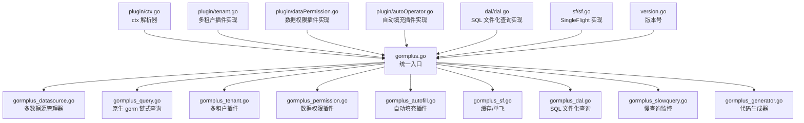
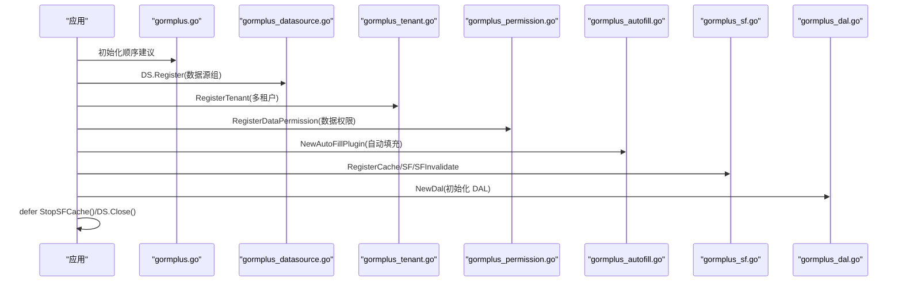
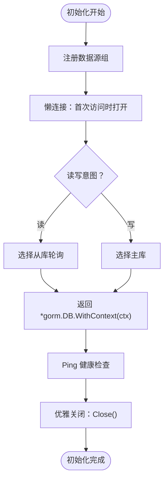
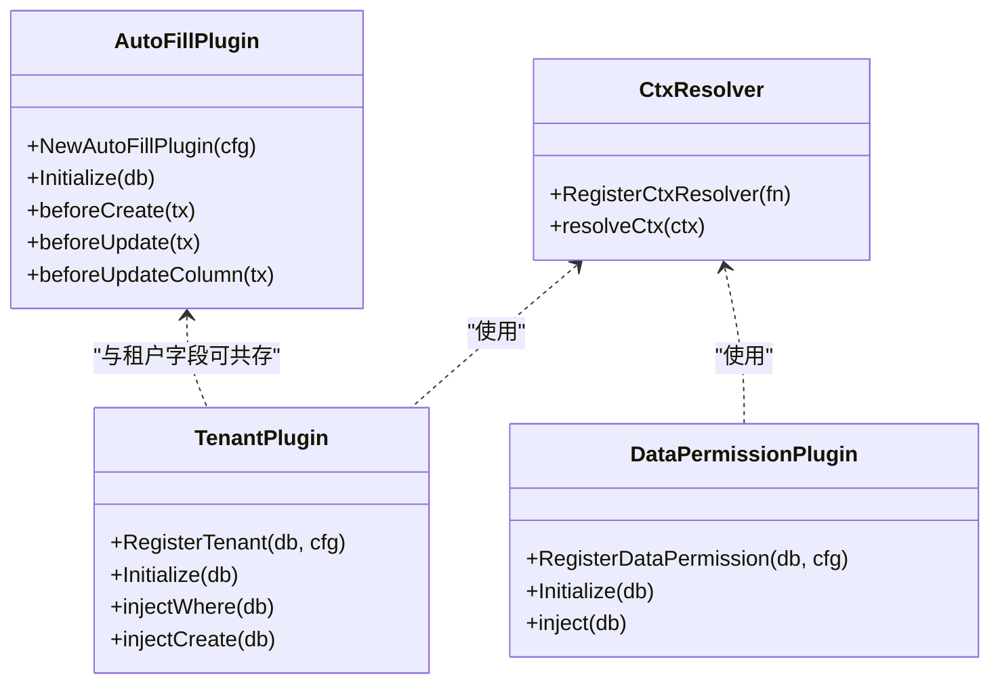
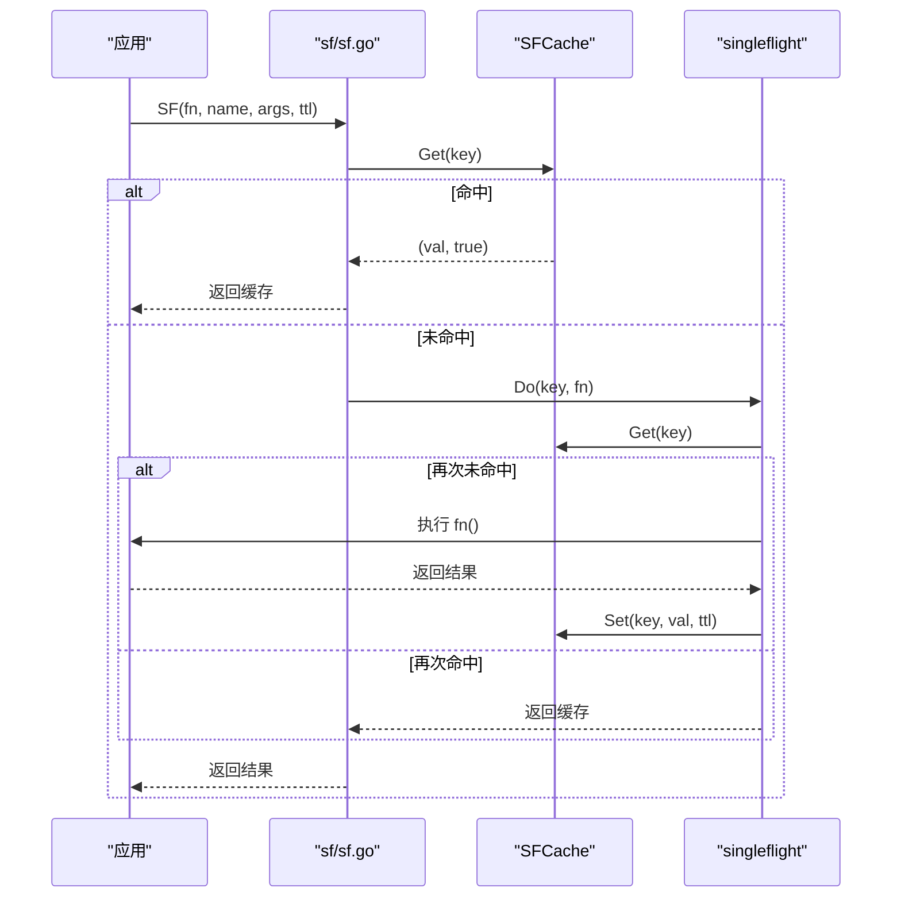
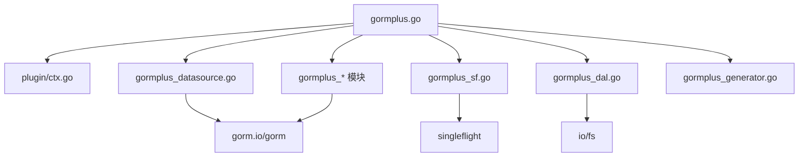

# 初始化生命周期

<cite>
**本文引用的文件**
- [gormplus.go](file://gormplus.go)
- [gormplus_autofill.go](file://gormplus_autofill.go)
- [gormplus_dal.go](file://gormplus_dal.go)
- [gormplus_datasource.go](file://gormplus_datasource.go)
- [gormplus_sf.go](file://gormplus_sf.go)
- [gormplus_tenant.go](file://gormplus_tenant.go)
- [gormplus_permission.go](file://gormplus_permission.go)
- [gormplus_slowquery.go](file://gormplus_slowquery.go)
- [gormplus_generator.go](file://gormplus_generator.go)
- [gormplus_query.go](file://gormplus_query.go)
- [plugin/ctx.go](file://plugin/ctx.go)
- [plugin/tenant.go](file://plugin/tenant.go)
- [plugin/dataPermission.go](file://plugin/dataPermission.go)
- [plugin/autoOperator.go](file://plugin/autoOperator.go)
- [dal/dal.go](file://dal/dal.go)
- [sf/sf.go](file://sf/sf.go)
- [version.go](file://version.go)
</cite>

## 目录
1. [简介](#简介)
2. [项目结构](#项目结构)
3. [核心组件](#核心组件)
4. [架构总览](#架构总览)
5. [详细组件分析](#详细组件分析)
6. [依赖关系分析](#依赖关系分析)
7. [性能考量](#性能考量)
8. [故障排查指南](#故障排查指南)
9. [结论](#结论)
10. [附录](#附录)

## 简介
本文档围绕 GORM Plus 的"初始化生命周期"进行系统化说明，重点阐述：
- 初始化流程与各阶段职责
- 模块注册顺序及其原因
- 错误处理与回滚机制
- 运行时动态配置与热更新能力
- 完整初始化示例与故障排查

GORM Plus 通过统一入口导出模块能力，提供多数据源管理、链式条件构造、多租户/数据权限自动注入、自动填充、SingleFlight 可插拔缓存、慢查询监控以及代码生成器等能力。初始化顺序直接影响插件行为、上下文解析一致性、缓存与数据源的可用性。

**更新** 由于模块化重构，初始化顺序和生命周期管理现在分布在多个专门文件中，需要更新文档以反映新的初始化步骤和最佳实践。

## 项目结构
仓库采用模块化组织，核心模块分布如下：
- gormplus.go：统一入口，导出所有能力与初始化入口
- gormplus_*：按功能拆分的模块入口文件，分别负责各自领域的初始化
- plugin/*：插件层（ctx 解析、多租户、数据权限、自动填充）
- dal/dal.go：SQL 文件化查询模块，支持 embed、Hook、缓存清理
- sf/sf.go：SingleFlight + 可插拔缓存（内存/Redis）
- version.go：版本号

图表来源
- [gormplus.go](file://gormplus.go)
- [gormplus_datasource.go](file://gormplus_datasource.go)
- [gormplus_query.go](file://gormplus_query.go)
- [gormplus_tenant.go](file://gormplus_tenant.go)
- [gormplus_permission.go](file://gormplus_permission.go)
- [gormplus_autofill.go](file://gormplus_autofill.go)
- [gormplus_sf.go](file://gormplus_sf.go)
- [gormplus_dal.go](file://gormplus_dal.go)
- [gormplus_slowquery.go](file://gormplus_slowquery.go)
- [gormplus_generator.go](file://gormplus_generator.go)
- [plugin/ctx.go](file://plugin/ctx.go)
- [plugin/tenant.go](file://plugin/tenant.go)
- [plugin/dataPermission.go](file://plugin/dataPermission.go)
- [plugin/autoOperator.go](file://plugin/autoOperator.go)
- [dal/dal.go](file://dal/dal.go)
- [sf/sf.go](file://sf/sf.go)
- [version.go](file://version.go)

章节来源
- [gormplus.go](file://gormplus.go)
- [gormplus_autofill.go](file://gormplus_autofill.go)
- [gormplus_dal.go](file://gormplus_dal.go)
- [gormplus_datasource.go](file://gormplus_datasource.go)
- [gormplus_sf.go](file://gormplus_sf.go)
- [gormplus_tenant.go](file://gormplus_tenant.go)
- [gormplus_permission.go](file://gormplus_permission.go)
- [gormplus_slowquery.go](file://gormplus_slowquery.go)
- [gormplus_generator.go](file://gormplus_generator.go)
- [gormplus_query.go](file://gormplus_query.go)
- [plugin/ctx.go](file://plugin/ctx.go)
- [plugin/tenant.go](file://plugin/tenant.go)
- [plugin/dataPermission.go](file://plugin/dataPermission.go)
- [plugin/autoOperator.go](file://plugin/autoOperator.go)
- [dal/dal.go](file://dal/dal.go)
- [sf/sf.go](file://sf/sf.go)
- [version.go](file://version.go)

## 核心组件
- 统一入口与初始化顺序
  - gormplus.go 提供初始化顺序建议与各模块导出，强调 ctx 解析器、多数据源、插件注册、缓存与优雅退出的顺序。
  - 模块化重构后，各功能领域通过专门的 gormplus_* 文件暴露初始化接口，形成清晰的职责边界。
- 多数据源管理器
  - gormplus_datasource.go 提供懒连接、读写分离、健康检查、优雅关闭等能力，支持运行时热注册。
- 插件层
  - gormplus_tenant.go：多租户插件，自动注入 WHERE 条件、安全检查、全表保护。
  - gormplus_permission.go：数据权限插件，按中间件注入函数自动追加条件。
  - gormplus_autofill.go：自动填充插件，按配置在 Create/Update 时填充字段。
  - gormplus_query.go：原生 gorm 链式条件构造器，提供扩展条件拼装能力。
- 缓存与单飞
  - gormplus_sf.go：提供 SF/SFWithTTL/SFNoCache/SFInvalidate，支持内存/Redis 缓存与后台清理。
- SQL 文件化查询
  - gormplus_dal.go：EmbedLoader、Hook、Options、默认全局实例、预热与缓存清理。
- 代码生成器配置
  - gormplus_generator.go：YAML 配置加载与解析。

**更新** 模块化重构后，核心组件现在通过专门的入口文件暴露，每个文件专注于单一职责，提高了代码的可维护性和可测试性。

章节来源
- [gormplus.go](file://gormplus.go)
- [gormplus_autofill.go](file://gormplus_autofill.go)
- [gormplus_dal.go](file://gormplus_dal.go)
- [gormplus_datasource.go](file://gormplus_datasource.go)
- [gormplus_sf.go](file://gormplus_sf.go)
- [gormplus_tenant.go](file://gormplus_tenant.go)
- [gormplus_permission.go](file://gormplus_permission.go)
- [gormplus_slowquery.go](file://gormplus_slowquery.go)
- [gormplus_generator.go](file://gormplus_generator.go)
- [gormplus_query.go](file://gormplus_query.go)

## 架构总览
GORM Plus 的初始化生命周期遵循"先基础设施，后业务增强"的原则，模块化重构后的初始化流程更加清晰：

- ① 注册 ctx 解析器（屏蔽框架差异）
- ② 注册多数据源（懒连接、读写分离）
- ③ 打开 DB（可直接使用，或通过 DS 获取）
- ④ 注册多租户/数据权限插件（自动注入）
- ⑤ 注册自动填充插件（Create/Update 自动写入）
- ⑥ 注册慢查询监控（可选）
- ⑦ 注册 SF 缓存（可选，默认内存缓存）
- ⑧ 初始化 DAL（可选，SQL 文件化查询）
- ⑨ 优雅退出（StopSFCache、DS.Close）

图表来源
- [gormplus.go](file://gormplus.go)
- [gormplus_datasource.go](file://gormplus_datasource.go)
- [gormplus_tenant.go](file://gormplus_tenant.go)
- [gormplus_permission.go](file://gormplus_permission.go)
- [gormplus_autofill.go](file://gormplus_autofill.go)
- [gormplus_sf.go](file://gormplus_sf.go)
- [gormplus_dal.go](file://gormplus_dal.go)

## 详细组件分析

### 统一入口与初始化顺序
- 初始化顺序建议与职责
  - ctx 解析器：解决 gin 项目直接传 *gin.Context 时插件无法从 Request.Context 读取中间件写入数据的问题。
  - 多数据源：通过 Dialector 外部传入驱动，支持任意 gorm 驱动；懒连接、读写分离、健康检查、优雅关闭。
  - 插件注册：多租户、数据权限、自动填充分别在 db 上注册；注册顺序影响注入时机与安全策略。
  - 缓存：RegisterCache 必须在第一次调用 SF 之前；StopSFCache 在应用退出时调用。
  - 优雅退出：StopSFCache、DS.Close。
- 初始化顺序的重要性
  - ctx 解析器必须在插件使用 ctx 前注册，否则插件无法读取中间件写入的值。
  - 多数据源必须在打开 DB 之前注册，以便后续通过 DS.Auto(ctx) 自动选择数据源与读写。
  - 插件注册顺序影响注入时机：多租户/数据权限在 Query/Update/Delete/Create 前注册，自动填充在 Create/Update 前注册。
  - 缓存注册必须早于首次 SF 调用，否则默认内存缓存已懒初始化，注册无效。

**更新** 模块化重构后，初始化顺序仍然保持不变，但每个步骤现在通过专门的入口文件实现，提供了更好的代码组织和职责分离。

章节来源
- [gormplus.go](file://gormplus.go)

### 多数据源管理器（懒连接、读写分离、健康检查）
- 关键能力
  - 懒连接：首次 Write/Read 时才建立连接，启动不阻塞。
  - 读写分离：通过 context 标记读/写意图，自动选择主库或从库；从库轮询。
  - 连接池：独立配置，提供生产推荐默认值。
  - 运行时热注册：支持运行时注册新数据源组。
  - 健康检查：Ping 返回 "name:role" → error 映射。
  - 优雅关闭：Close 关闭所有连接。
- 初始化要点
  - 通过 NodeConfig.Dialector 传入驱动，不内置任何驱动依赖。
  - Auto(ctx) 自动决策：从 context 读取数据源名与读写标记；无标记默认走主库。
  - MustAuto/MustWrite 适合启动阶段验证配置。

图表来源
- [gormplus_datasource.go](file://gormplus_datasource.go)

章节来源
- [gormplus_datasource.go](file://gormplus_datasource.go)

### 插件层（ctx 解析器、多租户、数据权限、自动填充）
- ctx 解析器
  - RegisterCtxResolver：替换全局解析器，屏蔽 gin/go-zero/fiber 差异。
  - resolveCtx：在插件读取 ctx 前统一转换。
- 多租户插件
  - 注册：RegisterTenant(db, cfg)，支持单字段、多字段、按表覆盖。
  - 安全策略：重复条件跳过、OR 危险条件拒绝、全表 Update/Delete 保护。
  - 运行时排除表：AddExcludeTable/RemoveExcludeTable/ExcludedTables。
- 数据权限插件
  - 注册：RegisterDataPermission(db, cfg)，按中间件注入函数追加条件。
  - 运行时排除表：AddDataPermissionExcludeTable/RemoveDataPermissionExcludeTable/DataPermissionExcludedTables。
- 自动填充插件
  - 注册：db.Use(NewAutoFillPlugin(cfg))，支持多字段 Getter。
  - Create/Update 前自动填充，UpdateSimple/UpdateColumn 路径兼容。

图表来源
- [plugin/ctx.go](file://plugin/ctx.go)
- [plugin/tenant.go](file://plugin/tenant.go)
- [plugin/dataPermission.go](file://plugin/dataPermission.go)
- [plugin/autoOperator.go](file://plugin/autoOperator.go)

章节来源
- [plugin/ctx.go](file://plugin/ctx.go)
- [plugin/tenant.go](file://plugin/tenant.go)
- [plugin/dataPermission.go](file://plugin/dataPermission.go)
- [plugin/autoOperator.go](file://plugin/autoOperator.go)
- [gormplus_tenant.go](file://gormplus_tenant.go)
- [gormplus_permission.go](file://gormplus_permission.go)
- [gormplus_autofill.go](file://gormplus_autofill.go)

### 缓存与单飞（SF）
- 能力概览
  - SF：带缓存的 singleflight，TTL 内共享结果。
  - SFNoCache：纯 singleflight，不缓存。
  - SFInvalidate：主动失效缓存。
  - RegisterCache：注册自定义缓存（内存/Redis），必须在第一次调用 SF 之前。
  - StopSFCache：停止内存缓存后台清理 goroutine。
- 初始化要点
  - RegisterCache 必须在第一次调用 SF 之前；否则默认内存缓存已懒初始化。
  - Redis 模式下无需 StopSFCache，连接生命周期由用户管理。
  - TTL 选择建议：列表/统计 3s~30s；配置/字典 1min~5min；详情/实时 0（SFNoCache）。

图表来源
- [sf/sf.go](file://sf/sf.go)
- [gormplus_sf.go](file://gormplus_sf.go)

章节来源
- [sf/sf.go](file://sf/sf.go)
- [gormplus_sf.go](file://gormplus_sf.go)

### SQL 文件化查询（DAL）
- 关键能力
  - EmbedLoader：基于 fs.FS 的 SQL 加载器，支持缓存与 singleflight 防击穿。
  - Hook：Before/After 生命周期钩子，可用于慢 SQL 监控、指标采集等。
  - Options：Debug、Hook、CacheCleanup。
  - 默认全局实例：NewDal 设置默认实例，后续直接使用包级函数。
  - 预热：Preload 提前加载 SQL 文件，暴露 embed 路径错误。
- 初始化要点
  - NewDal 必须在应用启动时调用一次，返回句柄用于生命周期管理（Close）。
  - WithCacheCleanup 可选，生产环境建议开启定时清理。
  - WithDB 可将指定 DAL 实例注入 context，用于多数据源场景。

章节来源
- [dal/dal.go](file://dal/dal.go)
- [gormplus_dal.go](file://gormplus_dal.go)

### 代码生成器配置
- 能力概览
  - Config：数据库连接与输出路径配置。
  - LoadConfig：从 YAML 文件加载配置。
- 初始化要点
  - generator.yaml 中配置数据库与输出路径。
  - LoadGeneratorConfig 解析后传入 Generate。

章节来源
- [gormplus_generator.go](file://gormplus_generator.go)

## 依赖关系分析
- 模块耦合
  - gormplus.go 作为统一入口，聚合各模块导出。
  - 各 gormplus_* 文件通过 plugin/*、dal/*、sf/* 等子模块实现具体功能。
  - 插件层依赖 plugin/ctx.go 的全局解析器，保证 ctx 一致性。
  - 多数据源管理器为 DS 全局实例，供业务通过 DS.Auto(ctx) 获取 DB。
  - 缓存模块与插件层解耦，通过 RegisterCache 注入。
  - DAL 与数据源管理器解耦，可通过 WithDB 注入不同实例。
- 外部依赖
  - gorm.io/gorm：数据库 ORM
  - gorm.io/driver/*：数据库驱动（通过 NodeConfig.Dialector 传入）
  - golang.org/x/sync/singleflight：并发合并
  - io/fs：SQL 文件嵌入

**更新** 模块化重构后，依赖关系更加清晰，每个 gormplus_* 文件只依赖其对应的实现模块，减少了交叉依赖。

图表来源
- [gormplus.go](file://gormplus.go)
- [plugin/ctx.go](file://plugin/ctx.go)
- [gormplus_datasource.go](file://gormplus_datasource.go)
- [gormplus_sf.go](file://gormplus_sf.go)
- [gormplus_dal.go](file://gormplus_dal.go)
- [gormplus_generator.go](file://gormplus_generator.go)

章节来源
- [gormplus.go](file://gormplus.go)
- [gormplus_datasource.go](file://gormplus_datasource.go)
- [gormplus_sf.go](file://gormplus_sf.go)
- [gormplus_dal.go](file://gormplus_dal.go)
- [gormplus_generator.go](file://gormplus_generator.go)

## 性能考量
- 懒连接与连接池
  - 多数据源管理器懒连接，首次访问才建立连接，避免启动阻塞。
  - 连接池独立配置，提供生产推荐默认值（MaxOpen、MaxIdle、MaxLifetime、MaxIdleTime）。
- singleflight 与缓存
  - SF/SFWithTTL 在高并发下合并请求，减少数据库压力。
  - 缓存 TTL 选择影响命中率与实时性：列表/统计短 TTL，配置/字典较长 TTL，详情/实时 0 TTL。
- SQL 文件缓存
  - EmbedLoader 缓存已加载 SQL，可结合 WithCacheCleanup 定时清理，防止内存无限增长。
- 插件注入成本
  - 多租户/数据权限在回调中注入条件，建议合理配置排除表，减少不必要的扫描与注入。

**更新** 模块化重构后，性能考量保持不变，但各模块的职责更加明确，有助于更好地进行性能优化和监控。

## 故障排查指南
- ctx 解析器未注册导致插件读取不到中间件数据
  - 现象：gin 项目直接传 *gin.Context，插件无法读取 Request.Context 中的值。
  - 处理：在应用启动时调用 RegisterCtxResolver，并确保中间件写入值到 Request.Context。
- 多数据源未注册或名称错误
  - 现象：DS.Auto(ctx) 报"未找到数据源名且未设置默认数据源"或"数据源未注册"。
  - 处理：确保 DS.Register 在打开 DB 前完成；检查 WithName 写入的数据源名与注册名一致。
- 插件注册顺序不当
  - 现象：多租户/数据权限未生效或注入冲突。
  - 处理：先注册 ctx 解析器，再注册多数据源，然后注册插件；确保插件注册在 db.Use/db.Callback 之前。
- 缓存注册时机错误
  - 现象：RegisterCache 无效或默认内存缓存未被替换。
  - 处理：必须在第一次调用 SF 之前注册；Redis 模式无需 StopSFCache。
- 缓存击穿与热点
  - 现象：大量并发请求同时穿透缓存。
  - 处理：使用 SF/SFWithTTL；为热点键设置合理 TTL；必要时使用 SFNoCache。
- 慢查询与性能问题
  - 现象：慢查询日志频繁。
  - 处理：启用 RegisterSlowQuery 并调整阈值；优化 SQL 与索引；使用分页与条件裁剪。
- DAL 初始化问题
  - 现象：dal: 未初始化，请先调用 dal.NewDal()。
  - 处理：确保在应用启动时调用 NewDal；使用 Preload 提前暴露 embed 路径错误。

**更新** 故障排查指南保持不变，但每个问题的定位和处理方式现在可以通过专门的入口文件进行更精确的诊断。

章节来源
- [gormplus.go](file://gormplus.go)
- [gormplus_datasource.go](file://gormplus_datasource.go)
- [gormplus_sf.go](file://gormplus_sf.go)
- [gormplus_dal.go](file://gormplus_dal.go)

## 结论
GORM Plus 的初始化生命周期强调"先基础设施、后业务增强"，通过 ctx 解析器、多数据源、插件注册、缓存与优雅退出的有序组合，确保系统在启动阶段稳定、在运行阶段具备良好的隔离与性能表现。模块化重构后，初始化流程更加清晰，每个模块都有专门的入口文件负责初始化，提高了代码的可维护性和可测试性。遵循初始化顺序与最佳实践，可有效避免常见问题并提升可观测性与可维护性。

**更新** 模块化重构显著提升了系统的可维护性，初始化流程虽然保持原有的顺序和原则，但通过专门的入口文件实现了更好的职责分离和代码组织。

## 附录
- 初始化顺序参考（来自 gormplus.go 与各模块入口文件）
  - ① ctx 解析器（gin 项目必须；go-zero / fiber 跳过）
  - ② 多数据源（Dialector 外部传入）
  - ③ 打开 DB（可直接使用，或通过 DS 获取）
  - ④ 多租户插件
  - ⑤ 数据权限插件
  - ⑥ 自动填充插件
  - ⑦ 慢查询监控（可选）
  - ⑧ 注册缓存（可选，默认内存缓存）
  - ⑨ 初始化 DAL（可选）
  - ⑩ 优雅退出（StopSFCache、DS.Close）

**更新** 附录中的初始化顺序保持不变，反映了模块化重构后仍然遵循的经典初始化流程。

章节来源
- [gormplus.go](file://gormplus.go)
- [gormplus_autofill.go](file://gormplus_autofill.go)
- [gormplus_dal.go](file://gormplus_dal.go)
- [gormplus_datasource.go](file://gormplus_datasource.go)
- [gormplus_sf.go](file://gormplus_sf.go)
- [gormplus_tenant.go](file://gormplus_tenant.go)
- [gormplus_permission.go](file://gormplus_permission.go)
- [gormplus_slowquery.go](file://gormplus_slowquery.go)
- [gormplus_generator.go](file://gormplus_generator.go)
- [gormplus_query.go](file://gormplus_query.go)