# 包结构设计

<cite>
**本文档引用的文件**
- [gormplus.go](file://gormplus.go)
- [version.go](file://version.go)
- [go.mod](file://go.mod)
- [README.md](file://README.md)
- [dal/dal.go](file://dal/dal.go)
- [dal/dal_test.go](file://dal/dal_test.go)
- [dal/provider.go](file://dal/provider.go)
- [dal/loader.go](file://dal/loader.go)
- [dal/hook.go](file://dal/hook.go)
- [dal/options.go](file://dal/options.go)
- [dal/instance.go](file://dal/instance.go)
- [dal/debug.go](file://dal/debug.go)
- [dal/query.go](file://dal/query.go)
- [dal/tx.go](file://dal/tx.go)
- [dal/must.go](file://dal/must.go)
- [query/query_builder.go](file://query/query_builder.go)
- [query/query_option.go](file://query/query_option.go)
- [query/slow_query.go](file://query/slow_query.go)
- [query/utils.go](file://query/utils.go)
- [plugin/ctx.go](file://plugin/ctx.go)
- [plugin/tenant.go](file://plugin/tenant.go)
- [plugin/dataPermission.go](file://plugin/dataPermission.go)
- [plugin/autoOperator.go](file://plugin/autoOperator.go)
- [sf/sf.go](file://sf/sf.go)
- [generator/config.go](file://generator/config.go)
- [generator/generator.go](file://generator/generator.go)
- [generator/example_test.go](file://generator/example_test.go)
</cite>

## 更新摘要
**变更内容**
- 更新 dal 包结构设计，反映从单一文件到多文件模块化的重大重构
- 新增各个专门文件的功能职责说明和接口设计
- 更新包间关系图以体现新的模块化架构
- 增强 DAL 模块的详细组件分析，涵盖所有新文件

## 目录
1. [简介](#简介)
2. [项目结构](#项目结构)
3. [核心组件](#核心组件)
4. [架构概览](#架构概览)
5. [详细组件分析](#详细组件分析)
6. [依赖关系分析](#依赖关系分析)
7. [性能考虑](#性能考虑)
8. [故障排查指南](#故障排查指南)
9. [结论](#结论)

## 简介

GORM Plus 是基于 GORM 和 gorm-gen 的增强扩展包，提供了完整的数据库访问层解决方案。该项目采用模块化设计，通过清晰的包结构实现了功能的解耦和复用。

**更新** 项目现已完成 dal 包的重大重构，从单一文件结构演进为多文件模块化架构，每个文件承担特定职责，提升了代码的可维护性和扩展性。

## 项目结构

项目采用按功能域划分的包结构设计，每个包都有明确的职责边界：

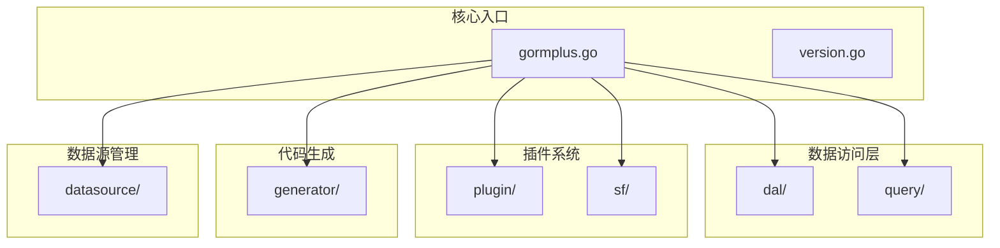

**图表来源**
- [gormplus.go:1-100](file://gormplus.go#L1-L100)
- [go.mod:1-26](file://go.mod#L1-L26)

**章节来源**
- [gormplus.go:1-100](file://gormplus.go#L1-L100)
- [go.mod:1-26](file://go.mod#L1-L26)

## 核心组件

### 包设计原则

1. **单一职责原则**：每个包专注于特定功能领域
2. **接口抽象**：通过接口定义契约，降低耦合度
3. **插件化架构**：核心功能通过插件形式扩展
4. **类型安全**：充分利用 Go 的泛型特性
5. **向后兼容**：版本升级时保持 API 稳定性

### 包间关系

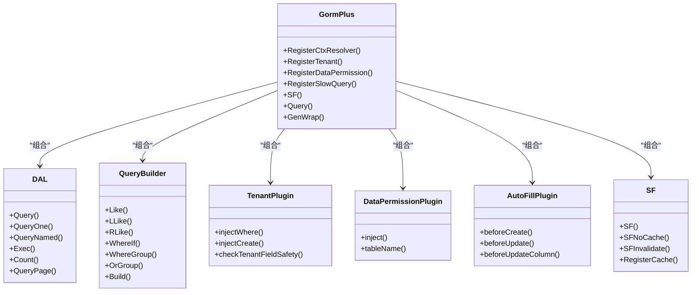

**图表来源**
- [gormplus.go:103-800](file://gormplus.go#L103-L800)
- [dal/dal.go:287-520](file://dal/dal.go#L287-L520)
- [query/query_builder.go:66-145](file://query/query_builder.go#L66-L145)
- [plugin/tenant.go:338-381](file://plugin/tenant.go#L338-L381)
- [plugin/dataPermission.go:128-162](file://plugin/dataPermission.go#L128-L162)
- [plugin/autoOperator.go:140-186](file://plugin/autoOperator.go#L140-L186)
- [sf/sf.go:235-350](file://sf/sf.go#L235-L350)

**章节来源**
- [gormplus.go:103-800](file://gormplus.go#L103-L800)

## 架构概览

GORM Plus 采用了分层架构设计，各层职责清晰：

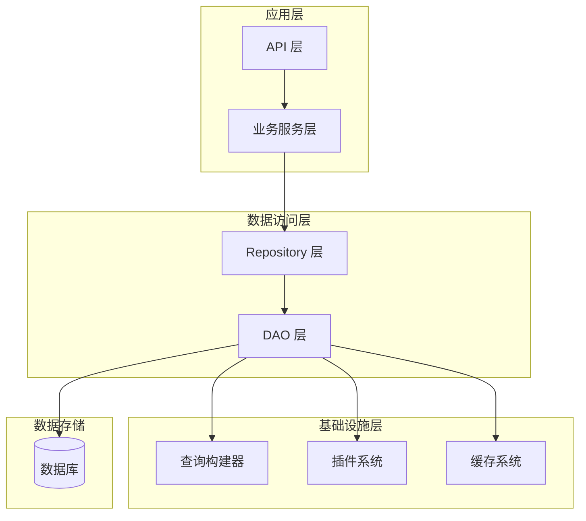

**图表来源**
- [dal/dal.go:1-100](file://dal/dal.go#L1-L100)
- [query/query_builder.go:1-50](file://query/query_builder.go#L1-L50)
- [plugin/tenant.go:1-50](file://plugin/tenant.go#L1-L50)
- [sf/sf.go:1-50](file://sf/sf.go#L1-L50)

## 详细组件分析

### DAL 模块（数据访问层）- 重构后的多文件架构

**更新** dal 模块已完成从单一文件到多文件模块化的重大重构，现在采用专门文件分工协作的架构模式：

#### 模块化文件结构

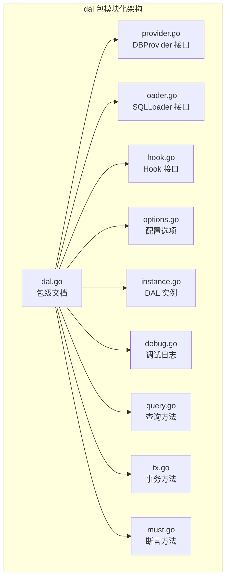

**图表来源**
- [dal/dal.go:71-82](file://dal/dal.go#L71-L82)
- [dal/provider.go:13-32](file://dal/provider.go#L13-L32)
- [dal/loader.go:17-24](file://dal/loader.go#L17-L24)
- [dal/hook.go:41-44](file://dal/hook.go#L41-L44)
- [dal/options.go:11-15](file://dal/options.go#L11-L15)
- [dal/instance.go:26-31](file://dal/instance.go#L26-L31)
- [dal/debug.go:13-50](file://dal/debug.go#L13-L50)
- [dal/query.go:40-74](file://dal/query.go#L40-L74)
- [dal/tx.go:15-20](file://dal/tx.go#L15-L20)
- [dal/must.go:12-20](file://dal/must.go#L12-L20)

#### 核心接口设计

**DBProvider 接口** - 数据库提供器接口
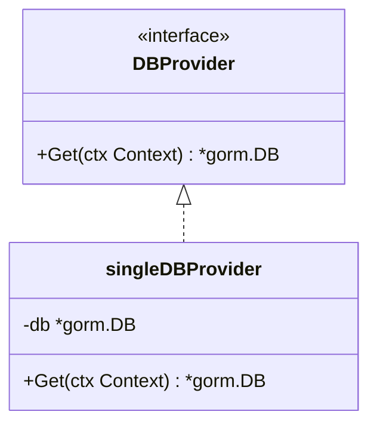

**SQLLoader 接口** - SQL 文件加载器接口
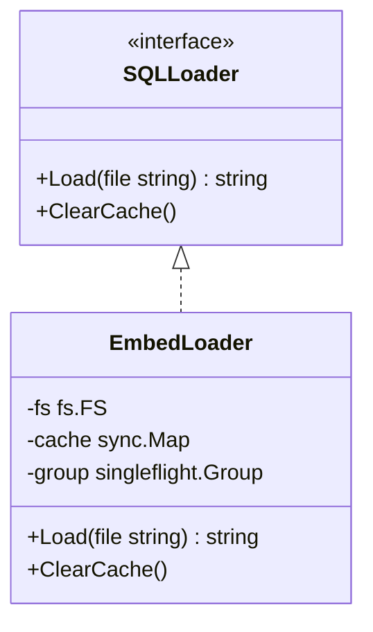

**Hook 接口** - 生命周期钩子接口
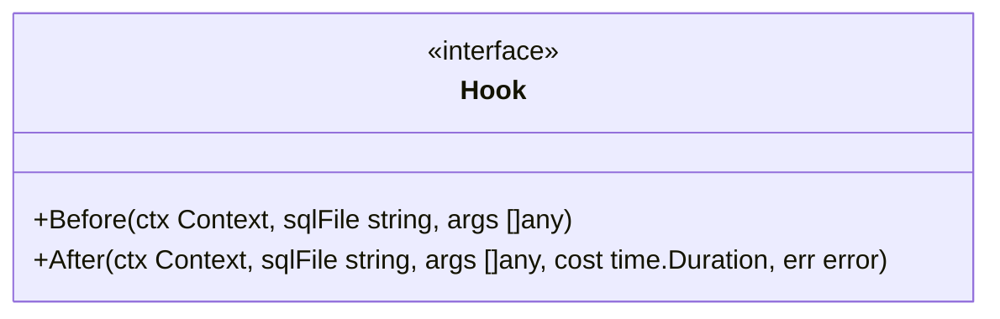

**章节来源**
- [dal/provider.go:13-32](file://dal/provider.go#L13-L32)
- [dal/loader.go:17-86](file://dal/loader.go#L17-L86)
- [dal/hook.go:41-44](file://dal/hook.go#L41-L44)

#### 配置选项系统

**Options 模式** - 灵活的配置管理
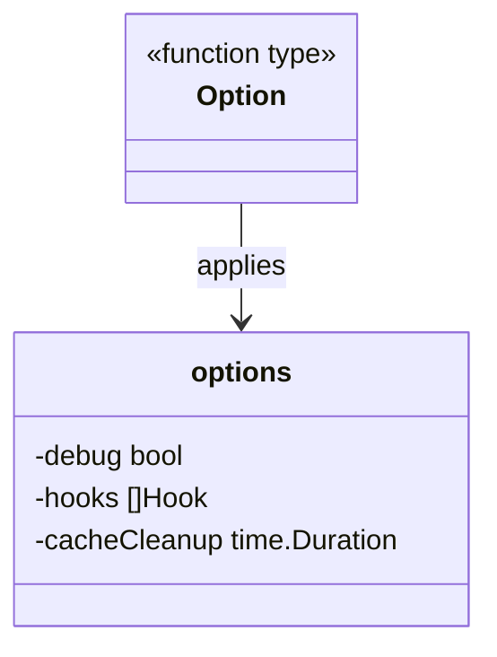

支持的配置选项：
- `WithDebug()` - 开启调试日志
- `WithHook()` - 注册生命周期钩子
- `WithCacheCleanup()` - 启用定时缓存清理

**章节来源**
- [dal/options.go:11-67](file://dal/options.go#L11-L67)

#### 实例管理与生命周期

**DAL 实例** - 核心数据访问层实例
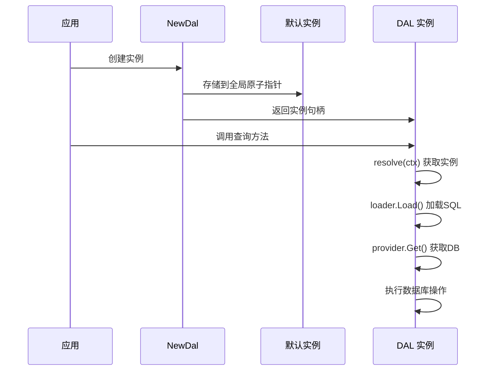

**章节来源**
- [dal/instance.go:43-147](file://dal/instance.go#L43-L147)

#### 查询功能模块化

**查询方法分离** - 按功能职责划分
- `query.go` - 核心查询方法（Query, QueryOne, QueryNamed, Exec, Count, QueryPage）
- `tx.go` - 事务相关方法（WithTx, TxQuery, TxExec, TxCount）
- `must.go` - 断言方法（MustExec, MustQueryOne）

**章节来源**
- [dal/query.go:40-589](file://dal/query.go#L40-L589)
- [dal/tx.go:15-338](file://dal/tx.go#L15-L338)
- [dal/must.go:12-50](file://dal/must.go#L12-L50)

#### SQL 文件加载机制

**EmbedLoader 实现** - 基于嵌入文件系统的高效加载
- 支持 `//go:embed` 编译时打包
- 内置缓存机制防止重复加载
- SingleFlight 并发控制防止缓存击穿
- 支持文件系统子目录操作

**章节来源**
- [dal/loader.go:26-86](file://dal/loader.go#L26-L86)

### Query 模块（查询构建器）

Query 模块提供了强大的链式查询条件构建能力：

#### 查询构建器设计

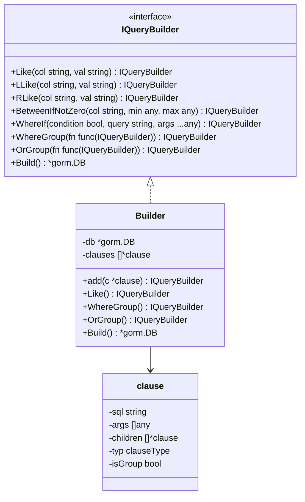

**图表来源**
- [query/query_builder.go:66-145](file://query/query_builder.go#L66-L145)
- [query/query_builder.go:149-174](file://query/query_builder.go#L149-L174)

#### 条件构建算法

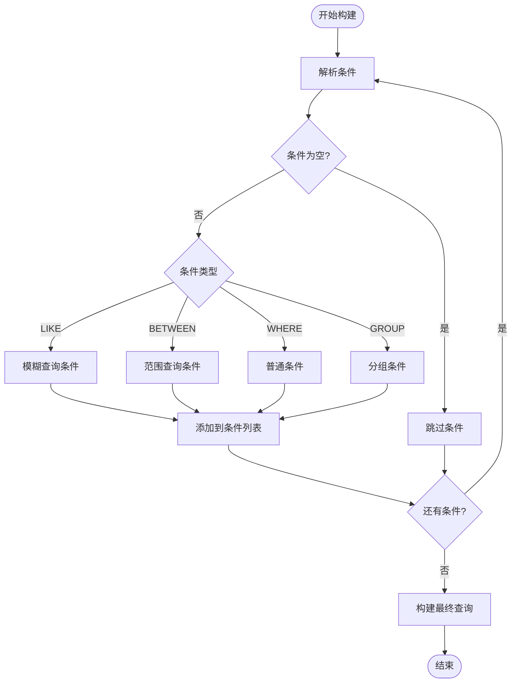

**图表来源**
- [query/query_builder.go:176-221](file://query/query_builder.go#L176-L221)

**章节来源**
- [query/query_builder.go:66-307](file://query/query_builder.go#L66-L307)

### Plugin 模块（插件系统）

Plugin 模块实现了多个数据库安全和便利功能的插件化设计：

#### 多租户插件架构

```mermaid
classDiagram
class TenantConfig {
+TenantField string
+TenantFields []TenantFieldConfig
+TableFields map[string][]TenantFieldConfig
+AutoInjectJoinTables *bool
+ExcludeJoinTables []string
+JoinTableOverrides []JoinTenantConfig
+AllowGlobalUpdate bool
+AllowGlobalDelete bool
+AllowOverrideTenantID bool
+DuplicatePolicy DuplicateTenantPolicy
+InjectMode InjectMode
+ExcludeTables []string
+GetTenantID func(ctx Context) (T, bool)
}
class tenantPlugin {
-cfg TenantConfig
-defaultField []TenantFieldConfig
-tableFields map[string][]TenantFieldConfig
-autoInjectJoin bool
-excludeJoinSet map[string]struct{}
-joinOverrideMap map[string]JoinTenantConfig
-excludeSet map[string]struct{}
+injectWhere()
+injectCreate()
+checkTenantFieldSafety()
+injectJoinWhere()
}
TenantConfig --> tenantPlugin
```

**图表来源**
- [plugin/tenant.go:239-336](file://plugin/tenant.go#L239-L336)
- [plugin/tenant.go:340-353](file://plugin/tenant.go#L340-L353)

#### 数据权限插件设计

数据权限插件提供了灵活的权限控制机制：

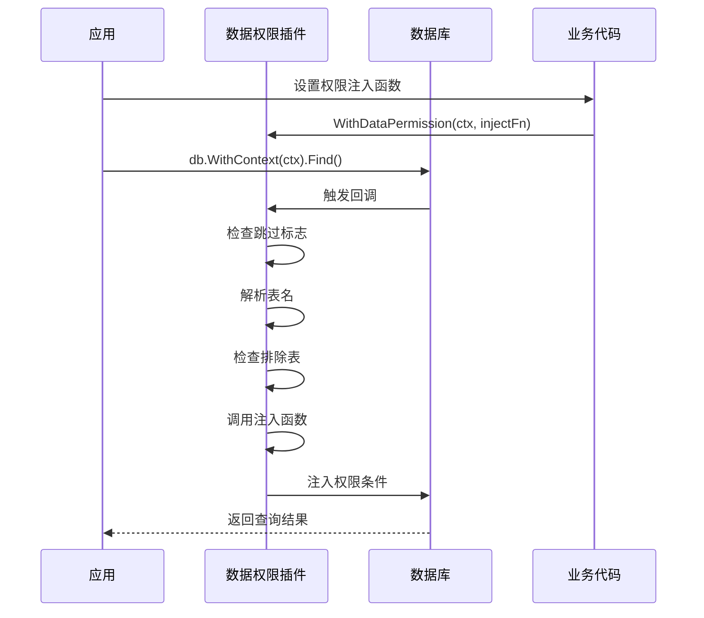

**图表来源**
- [plugin/dataPermission.go:164-204](file://plugin/dataPermission.go#L164-L204)

**章节来源**
- [plugin/tenant.go:1-800](file://plugin/tenant.go#L1-L800)
- [plugin/dataPermission.go:1-339](file://plugin/dataPermission.go#L1-L339)

### SF 模块（缓存系统）

SF 模块实现了高性能的缓存和并发控制机制：

#### SingleFlight 并发控制

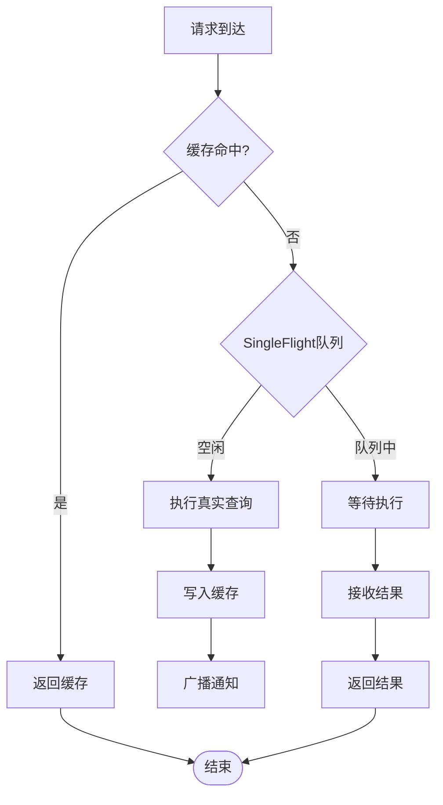

**图表来源**
- [sf/sf.go:293-350](file://sf/sf.go#L293-L350)

#### 缓存接口设计

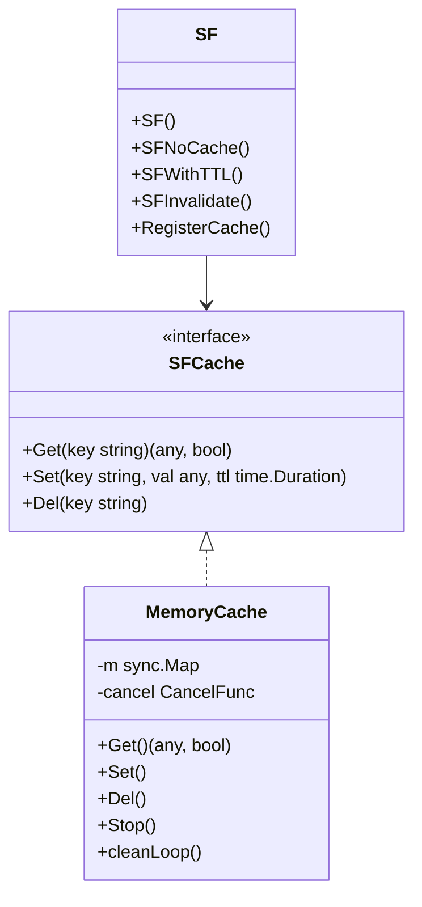

**图表来源**
- [sf/sf.go:49-93](file://sf/sf.go#L49-L93)
- [sf/sf.go:133-206](file://sf/sf.go#L133-L206)

**章节来源**
- [sf/sf.go:1-395](file://sf/sf.go#L1-L395)

### Generator 模块（代码生成器）

Generator 模块提供了完整的代码生成解决方案：

#### 配置管理系统

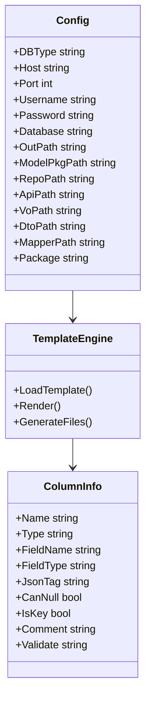

**图表来源**
- [generator/config.go:10-31](file://generator/config.go#L10-L31)
- [generator/generator.go:212-227](file://generator/generator.go#L212-L227)

**章节来源**
- [generator/config.go:1-47](file://generator/config.go#L1-L47)
- [generator/generator.go:1-800](file://generator/generator.go#L1-L800)

## 依赖关系分析

### 外部依赖管理

项目采用模块化依赖管理，主要依赖包括：

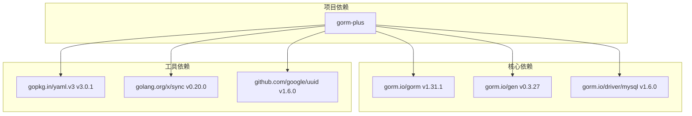

**图表来源**
- [go.mod:5-25](file://go.mod#L5-L25)

### 内部模块依赖

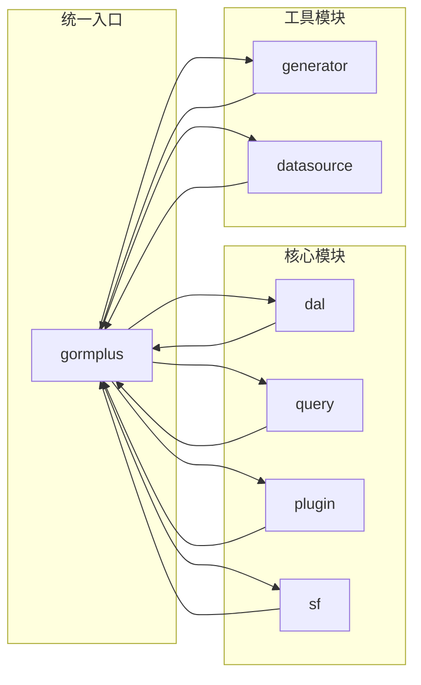

**图表来源**
- [gormplus.go:88-101](file://gormplus.go#L88-L101)

**章节来源**
- [go.mod:1-26](file://go.mod#L1-L26)
- [gormplus.go:88-101](file://gormplus.go#L88-L101)

## 性能考虑

### 缓存策略

1. **内存缓存**：默认使用，支持自动过期清理
2. **分布式缓存**：支持 Redis 等外部缓存
3. **单飞机制**：防止缓存击穿和雪崩效应

### 查询优化

1. **SQL 预编译**：减少 SQL 解析开销
2. **参数绑定**：防止 SQL 注入攻击
3. **连接池管理**：智能连接复用

### 并发控制

1. **SingleFlight**：合并并发请求
2. **上下文超时**：防止请求挂起
3. **资源限制**：控制内存和 CPU 使用

## 故障排查指南

### 常见问题诊断

#### 数据库连接问题

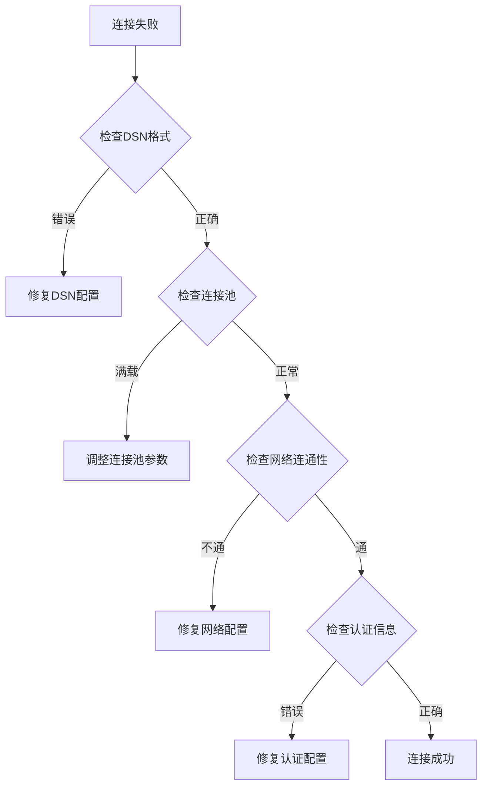

#### 插件冲突问题

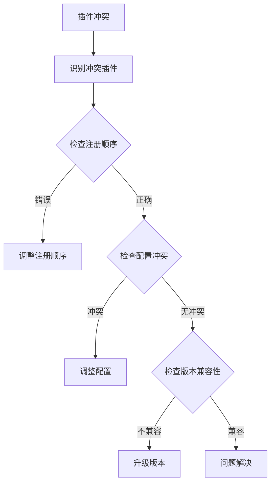

### 性能监控

1. **慢查询监控**：自动记录执行时间超过阈值的 SQL
2. **缓存命中率**：监控缓存使用效率
3. **连接池状态**：实时监控数据库连接使用情况

**章节来源**
- [query/slow_query.go:13-83](file://query/slow_query.go#L13-L83)
- [sf/sf.go:227-234](file://sf/sf.go#L227-L234)

## 结论

GORM Plus 通过精心设计的包结构实现了以下目标：

1. **功能解耦**：每个包都有明确的职责边界
2. **扩展性强**：插件化架构支持功能扩展
3. **类型安全**：充分利用 Go 泛型特性
4. **性能优化**：内置缓存和并发控制机制
5. **易于维护**：清晰的接口设计和文档

**更新** 特别值得强调的是，dal 包的多文件模块化重构显著提升了代码的可维护性和扩展性。通过将复杂功能分解为专门的文件，每个文件只关注特定职责，使得代码更加清晰、测试更加简单、维护更加容易。

该架构为大型项目的数据库访问层提供了坚实的基础，既满足了当前需求，又为未来的功能扩展预留了空间。