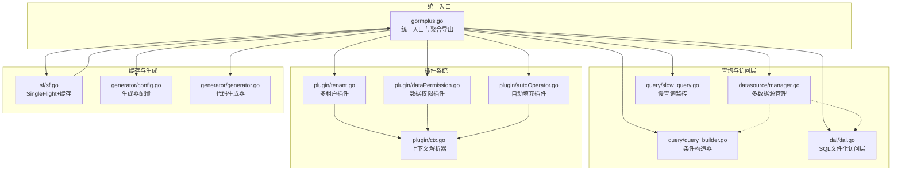
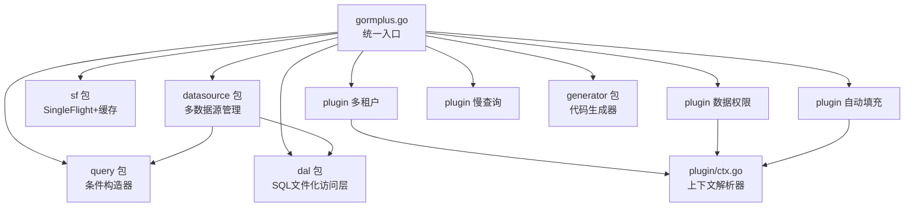
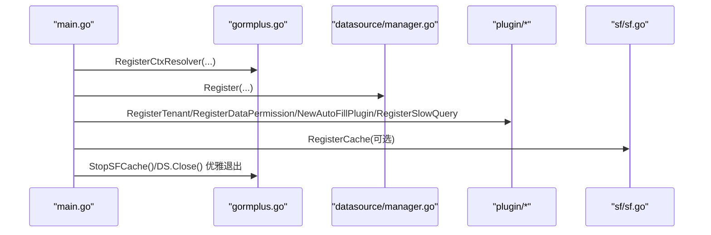
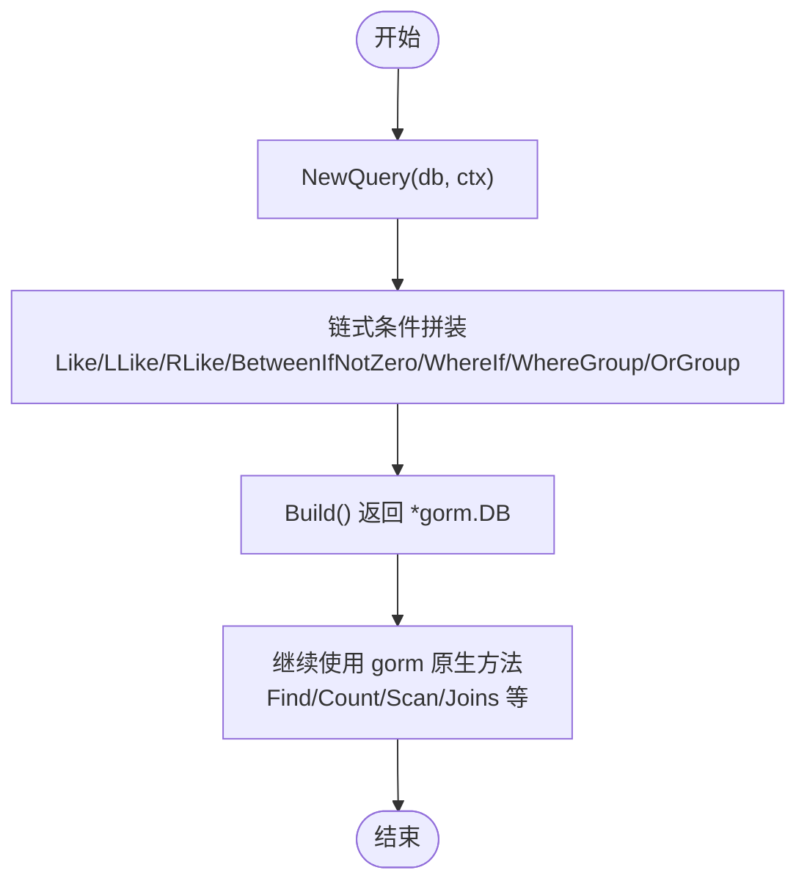
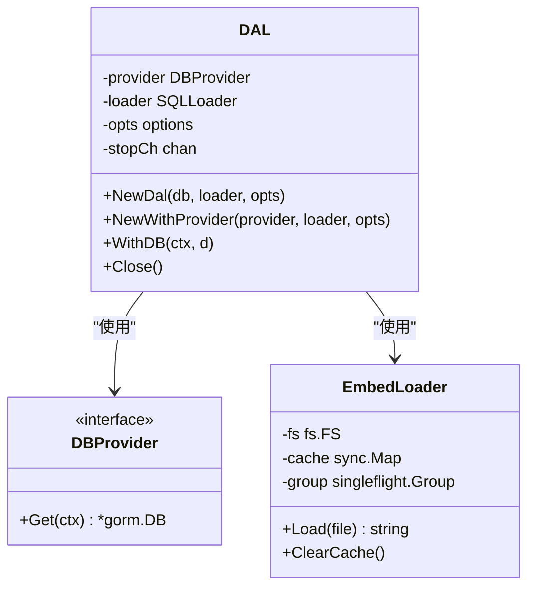
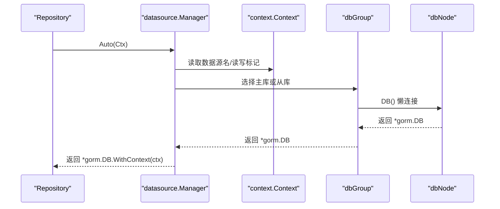
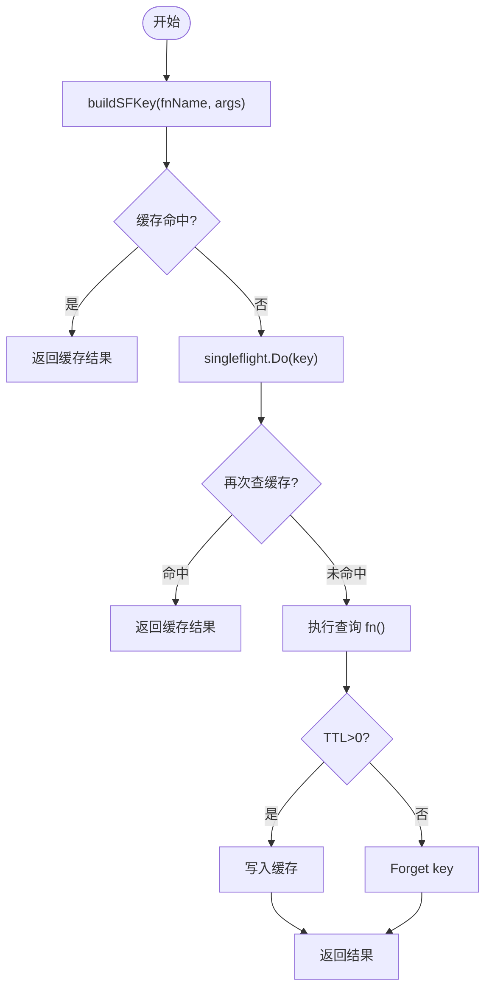
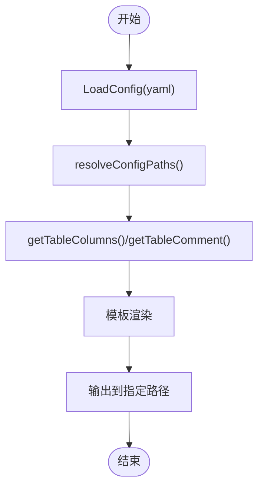

# 模块依赖关系

<cite>
**本文引用的文件**
- [go.mod](file://go.mod)
- [gormplus.go](file://gormplus.go)
- [dal/dal.go](file://dal/dal.go)
- [datasource/manager.go](file://datasource/manager.go)
- [generator/config.go](file://generator/config.go)
- [generator/generator.go](file://generator/generator.go)
- [plugin/ctx.go](file://plugin/ctx.go)
- [plugin/tenant.go](file://plugin/tenant.go)
- [plugin/dataPermission.go](file://plugin/dataPermission.go)
- [plugin/autoOperator.go](file://plugin/autoOperator.go)
- [sf/sf.go](file://sf/sf.go)
- [query/query_builder.go](file://query/query_builder.go)
- [query/slow_query.go](file://query/slow_query.go)
- [version.go](file://version.go)
</cite>

## 目录
1. [简介](#简介)
2. [项目结构](#项目结构)
3. [核心组件](#核心组件)
4. [架构总览](#架构总览)
5. [详细组件分析](#详细组件分析)
6. [依赖关系分析](#依赖关系分析)
7. [性能考量](#性能考量)
8. [故障排查指南](#故障排查指南)
9. [结论](#结论)
10. [附录](#附录)

## 简介
本文件聚焦于 GORM Plus 模块的依赖关系与模块间耦合度，系统梳理各功能模块的职责边界、接口设计、通信机制与生命周期管理，给出模块依赖图与架构图，帮助开发者理解整体结构并指导扩展与替换。

## 项目结构
GORM Plus 采用“统一入口 + 子模块”的组织方式，核心入口聚合各子模块能力，并通过子模块各自暴露清晰的 API 与插件化扩展点。主要模块包括：
- Query：原生 GORM 链式条件构造器
- DAL：SQL 文件化访问层（embed + 泛型）
- DS：多数据源管理（读写分离/主从）
- SF：SingleFlight + 可插拔缓存
- 插件：多租户、数据权限、自动填充、慢查询监控
- Generator：代码生成器（Model/Repository/API）



图表来源
- [gormplus.go:86-101](file://gormplus.go#L86-L101)
- [dal/dal.go:71-83](file://dal/dal.go#L71-L83)
- [datasource/manager.go:3-13](file://datasource/manager.go#L3-L13)
- [plugin/ctx.go:7-14](file://plugin/ctx.go#L7-L14)
- [plugin/tenant.go:129-141](file://plugin/tenant.go#L129-L141)
- [plugin/dataPermission.go:1-10](file://plugin/dataPermission.go#L1-L10)
- [plugin/autoOperator.go:1-9](file://plugin/autoOperator.go#L1-L9)
- [sf/sf.go:1-15](file://sf/sf.go#L1-L15)
- [query/query_builder.go:37-44](file://query/query_builder.go#L37-L44)
- [query/slow_query.go:1-11](file://query/slow_query.go#L1-L11)
- [generator/config.go:10-31](file://generator/config.go#L10-L31)
- [generator/generator.go:3-20](file://generator/generator.go#L3-L20)

章节来源
- [gormplus.go:86-101](file://gormplus.go#L86-L101)
- [go.mod:1-26](file://go.mod#L1-L26)

## 核心组件
- 统一入口与聚合导出：gormplus.go 通过导入各子模块并在包级导出统一 API，形成单一 import 即可使用全部功能的体验。
- 查询与条件构造：query 包提供链式条件构造器，支持模糊、范围、条件开关与分组，最终 Build 返回原生 *gorm.DB。
- DAL：基于 embed 的 SQL 文件化访问层，支持命名参数、泛型、Hook、缓存与多数据源切换。
- 多数据源管理：datasource 提供命名数据源组（一主多从）、懒连接、连接池、自动读写分离与健康检查。
- 插件系统：多租户、数据权限、自动填充、慢查询监控均通过 gorm Plugin 接口注册，具备独立配置与生命周期。
- 缓存与并发：sf 提供 SingleFlight 与可插拔缓存，支持 TTL 与主动失效。
- 代码生成器：generator 提供基于模板的 Model/Repository/API 生成，支持内嵌模板与路径解析。

章节来源
- [gormplus.go:1-86](file://gormplus.go#L1-L86)
- [query/query_builder.go:37-145](file://query/query_builder.go#L37-L145)
- [dal/dal.go:284-301](file://dal/dal.go#L284-L301)
- [datasource/manager.go:244-256](file://datasource/manager.go#L244-L256)
- [plugin/tenant.go:338-381](file://plugin/tenant.go#L338-L381)
- [plugin/dataPermission.go:128-136](file://plugin/dataPermission.go#L128-L136)
- [plugin/autoOperator.go:140-185](file://plugin/autoOperator.go#L140-L185)
- [sf/sf.go:49-131](file://sf/sf.go#L49-L131)
- [generator/config.go:10-31](file://generator/config.go#L10-L31)
- [generator/generator.go:37-68](file://generator/generator.go#L37-L68)

## 架构总览
GORM Plus 的架构围绕“统一入口 + 子模块 + 插件化”展开。统一入口负责模块聚合与导出；子模块通过清晰的 API 与上下文/配置进行交互；插件通过 gorm Callback 注入，彼此独立且可组合。



图表来源
- [gormplus.go:86-101](file://gormplus.go#L86-L101)
- [plugin/ctx.go:7-14](file://plugin/ctx.go#L7-L14)

## 详细组件分析

### 统一入口与生命周期
- 导入关系：gormplus.go 通过导入各子模块并在包级导出统一 API，形成单一入口。
- 生命周期：模块初始化顺序建议在 main.go 中按需注册，如上下文解析器、多数据源、插件、缓存等，最后在退出时关闭资源。



图表来源
- [gormplus.go:103-125](file://gormplus.go#L103-L125)
- [datasource/manager.go:258-277](file://datasource/manager.go#L258-L277)
- [plugin/tenant.go:570-581](file://plugin/tenant.go#L570-L581)
- [plugin/dataPermission.go:243-249](file://plugin/dataPermission.go#L243-L249)
- [plugin/autoOperator.go:182-185](file://plugin/autoOperator.go#L182-L185)
- [query/slow_query.go:104-109](file://query/slow_query.go#L104-L109)
- [sf/sf.go:110-114](file://sf/sf.go#L110-L114)

章节来源
- [gormplus.go:22-85](file://gormplus.go#L22-L85)

### 查询与条件构造（Query）
- 设计要点：IQueryBuilder 抽象链式条件，支持模糊、范围、条件开关与分组；Build 返回原生 *gorm.DB，保持与 GORM 的完全兼容。
- 数据流：输入 db 与 ctx，链式拼装条件，Build 后继续使用 gorm 原生方法。
- 控制流：WhereIf/WhereGroup/OrGroup 等方法按条件与分组构建内部 clause 树，最终应用到 *gorm.DB。



图表来源
- [query/query_builder.go:46-64](file://query/query_builder.go#L46-L64)
- [query/query_builder.go:164-221](file://query/query_builder.go#L164-L221)

章节来源
- [query/query_builder.go:66-145](file://query/query_builder.go#L66-L145)
- [query/query_builder.go:244-306](file://query/query_builder.go#L244-L306)

### DAL（SQL 文件化访问层）
- 设计要点：DBProvider 抽象数据库提供器，支持单库/多库/读写分离；EmbedLoader 基于 fs.FS 的 SQL 加载器，支持缓存与 singleflight；Hook 支持慢 SQL 监控等扩展。
- 生命周期：NewDal 初始化默认全局实例，WithDB 注入上下文实现多数据源切换；Close 停止后台缓存清理 goroutine。
- 数据流：Resolve(ctx) 取 DAL 实例，Loader.Load 加载 SQL，DBProvider.Get(ctx) 获取 *gorm.DB，执行 Raw/Scan/Find 等。



图表来源
- [dal/dal.go:296-301](file://dal/dal.go#L296-L301)
- [dal/dal.go:89-99](file://dal/dal.go#L89-L99)
- [dal/dal.go:139-143](file://dal/dal.go#L139-L143)

章节来源
- [dal/dal.go:303-430](file://dal/dal.go#L303-L430)
- [dal/dal.go:446-461](file://dal/dal.go#L446-L461)
- [dal/dal.go:521-523](file://dal/dal.go#L521-L523)

### 多数据源管理（DS）
- 设计要点：命名数据源组（一主多从），懒连接，连接池独立配置，自动读写分离（WithRead/WithWrite），健康检查与优雅关闭。
- 生命周期：Register 注册命名数据源组；Auto 根据上下文自动选择数据源与读写；Close 关闭所有连接。
- 数据流：WithName/WithRead/WithWrite 写入上下文；Auto 读取上下文并返回 *gorm.DB.WithContext(ctx)。



图表来源
- [datasource/manager.go:288-323](file://datasource/manager.go#L288-L323)
- [datasource/manager.go:215-225](file://datasource/manager.go#L215-L225)

章节来源
- [datasource/manager.go:258-277](file://datasource/manager.go#L258-L277)
- [datasource/manager.go:334-370](file://datasource/manager.go#L334-L370)
- [datasource/manager.go:432-442](file://datasource/manager.go#L432-L442)

### 插件系统（多租户/数据权限/自动填充/慢查询）
- 上下文解析：plugin/ctx.go 提供全局 ctx 解析器，解决 Gin 等框架传入 *gin.Context 时无法读取 Request.Context 的问题。
- 多租户：通过 gorm Callback 注入 WHERE 条件，支持多字段、联表自动注入、安全策略（跳过/替换/追加）与全表保护。
- 数据权限：通过 gorm Callback 注入业务自定义条件，支持排除表与跳过标记。
- 自动填充：在 Create/Update 前填充字段，支持多 getter 与多种更新路径。
- 慢查询：通过 gorm Callback 记录 SQL 执行耗时，超阈值触发自定义 Logger。

```mermaid
classDiagram
class TenantPlugin {
-cfg TenantConfig
-defaultField []TenantFieldConfig
-tableFields map[string][]TenantFieldConfig
-autoInjectJoin bool
-excludeJoinSet map[string]
-joinOverrideMap map[string]JoinTenantConfig
-excludeSet map[string]
+Initialize(db) error
+injectWhere(db)
+injectCreate(db)
+injectJoinWhere(db, ctx)
}
class DataPermissionPlugin {
-injectMode DataPermissionInjectMode
-excludeSet map[string]
+Initialize(db) error
+inject(db)
}
class AutoFillPlugin {
-cfg AutoFillConfig
+Initialize(db) error
+beforeCreate(tx)
+beforeUpdate(tx)
+beforeUpdateColumn(tx)
}
class SlowQueryPlugin {
-cfg SlowQueryConfig
+Initialize(db) error
}
TenantPlugin --> CtxResolver["plugin/ctx.go<br/>resolveCtx"]
DataPermissionPlugin --> CtxResolver
AutoFillPlugin --> CtxResolver
```

图表来源
- [plugin/tenant.go:340-349](file://plugin/tenant.go#L340-L349)
- [plugin/dataPermission.go:132-136](file://plugin/dataPermission.go#L132-L136)
- [plugin/autoOperator.go:178-185](file://plugin/autoOperator.go#L178-L185)
- [query/slow_query.go:85-86](file://query/slow_query.go#L85-L86)
- [plugin/ctx.go:37-43](file://plugin/ctx.go#L37-L43)

章节来源
- [plugin/tenant.go:529-595](file://plugin/tenant.go#L529-L595)
- [plugin/dataPermission.go:164-204](file://plugin/dataPermission.go#L164-L204)
- [plugin/autoOperator.go:190-275](file://plugin/autoOperator.go#L190-L275)
- [query/slow_query.go:113-234](file://query/slow_query.go#L113-L234)

### 缓存与并发（SF）
- 设计要点：提供 SF/SFWithTTL/SFNoCache 三层保护；SFCache 接口可插拔替换默认内存缓存；支持主动失效。
- 生命周期：RegisterCache 注册缓存实现；StopSFCache 停止内置内存缓存 goroutine。
- 数据流：buildSFKey 构建确定性 key；缓存命中快速返回；否则 singleflight 合并并发请求并写入缓存。



图表来源
- [sf/sf.go:252-349](file://sf/sf.go#L252-L349)
- [sf/sf.go:351-394](file://sf/sf.go#L351-L394)

章节来源
- [sf/sf.go:94-131](file://sf/sf.go#L94-L131)
- [sf/sf.go:208-225](file://sf/sf.go#L208-L225)

### 代码生成器（Generator）
- 设计要点：基于模板生成 Model/Repository/API/VO/DTO/Mapper；支持内嵌模板与自定义模板覆盖；解析配置路径为绝对路径。
- 生命周期：LoadConfig 读取 YAML 配置；findProjectRoot 定位项目根目录；resolveConfigPaths 解析相对路径。
- 数据流：getTableColumns/getTableComment 获取元数据；模板渲染生成代码；输出到指定路径。



图表来源
- [generator/config.go:33-46](file://generator/config.go#L33-L46)
- [generator/generator.go:22-68](file://generator/generator.go#L22-L68)
- [generator/generator.go:322-340](file://generator/generator.go#L322-L340)

章节来源
- [generator/config.go:10-31](file://generator/config.go#L10-L31)
- [generator/generator.go:185-210](file://generator/generator.go#L185-L210)

## 依赖关系分析
- 核心依赖
  - gormplus.go 依赖各子模块包（dal、datasource、generator、plugin、query、sf）以提供统一 API。
  - 插件依赖 plugin/ctx.go 的上下文解析器，屏蔽框架差异。
  - DS 与 Query/DAL 通过 *gorm.DB 与上下文交互，实现读写分离与多数据源切换。
  - SF 依赖 golang.org/x/sync/singleflight，提供并发合并与缓存。
- 可选依赖
  - 缓存实现：可通过 RegisterCache 注入 Redis/自定义实现，替换默认内存缓存。
  - 驱动：DS 通过 NodeConfig.Dialector 外部传入，不内置任何数据库驱动，支持 MySQL/PostgreSQL/SQLite/SQLServer 等。
  - 模板：generator 支持自定义模板覆盖内嵌模板。
- 循环依赖
  - 未发现直接循环依赖；模块间通过接口与上下文解耦，插件通过 gorm Callback 注入，避免循环引用。
- 初始化顺序
  - 上下文解析器 → 多数据源注册 → DB 打开 → 插件注册（多租户/数据权限/自动填充/慢查询） → 缓存注册（可选） → 优雅退出。

章节来源
- [gormplus.go:88-101](file://gormplus.go#L88-L101)
- [plugin/ctx.go:31-35](file://plugin/ctx.go#L31-L35)
- [datasource/manager.go:173-203](file://datasource/manager.go#L173-L203)
- [sf/sf.go:110-114](file://sf/sf.go#L110-L114)
- [generator/generator.go:322-340](file://generator/generator.go#L322-L340)

## 性能考量
- 查询性能
  - Query 与 DAL 均支持 Debug/Hook，生产环境建议关闭 Debug 并合理配置 Hook。
  - DAL 的 SQL 缓存与 singleflight 可降低重复加载与并发压力，注意缓存清理策略。
- 并发与缓存
  - SF 的 TTL 与主动失效可平衡一致性与性能；默认内存缓存后台清理 goroutine 需在退出时 Stop。
- 数据源与连接
  - DS 的懒连接与连接池配置直接影响吞吐与稳定性，建议结合业务峰值调整 MaxOpen/MaxIdle/MaxLifetime。
- 插件开销
  - 多租户/数据权限/慢查询均通过 gorm Callback 注入，注意回调注册顺序与条件判断成本。

## 故障排查指南
- 上下文解析
  - Gin 项目需注册上下文解析器，否则插件无法从 *gin.Context 读取 Request.Context 数据。
- 多数据源
  - 未设置默认数据源或上下文无数据源名时，Auto 会报错；确认 WithName/WithRead/WithWrite 的使用。
  - 从库为空时读操作会回退到主库，检查从库配置与健康检查结果。
- 插件冲突
  - 多租户与数据权限可同时使用，注意重复条件策略（跳过/替换/追加）与 OR 绕过保护。
  - 慢查询插件与多租户互不干扰，阈值与 Logger 配置需按环境调整。
- 缓存问题
  - 注册缓存需在首次调用 SF 之前；SFNoCache 与 TTL=0 的场景需注意实时性需求。
- 生成器
  - YAML 配置路径需解析为绝对路径；找不到 go.mod 或模板文件时会报错。

章节来源
- [plugin/ctx.go:16-35](file://plugin/ctx.go#L16-L35)
- [datasource/manager.go:299-323](file://datasource/manager.go#L299-L323)
- [plugin/tenant.go:385-482](file://plugin/tenant.go#L385-L482)
- [query/slow_query.go:91-109](file://query/slow_query.go#L91-L109)
- [sf/sf.go:101-114](file://sf/sf.go#L101-L114)
- [generator/generator.go:22-68](file://generator/generator.go#L22-L68)

## 结论
GORM Plus 通过统一入口聚合查询、访问层、多数据源、插件与缓存等能力，形成清晰的模块边界与低耦合的接口设计。插件化与可插拔缓存使得系统具备良好的扩展性与可维护性；通过合理的初始化顺序与生命周期管理，可有效避免循环依赖与资源泄漏。建议在生产环境中谨慎配置缓存 TTL、连接池参数与插件策略，以获得最佳性能与稳定性。

## 附录
- 版本信息：v1.0.13
- 依赖清单：gorm.io/gorm、gorm.io/gen、gorm.io/driver/mysql、gopkg.in/yaml.v3、golang.org/x/sync 等

章节来源
- [version.go:1-4](file://version.go#L1-L4)
- [go.mod:5-25](file://go.mod#L5-L25)