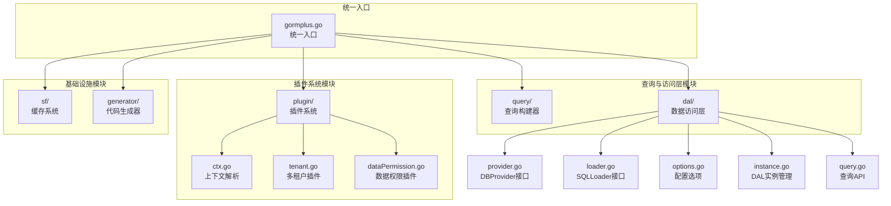
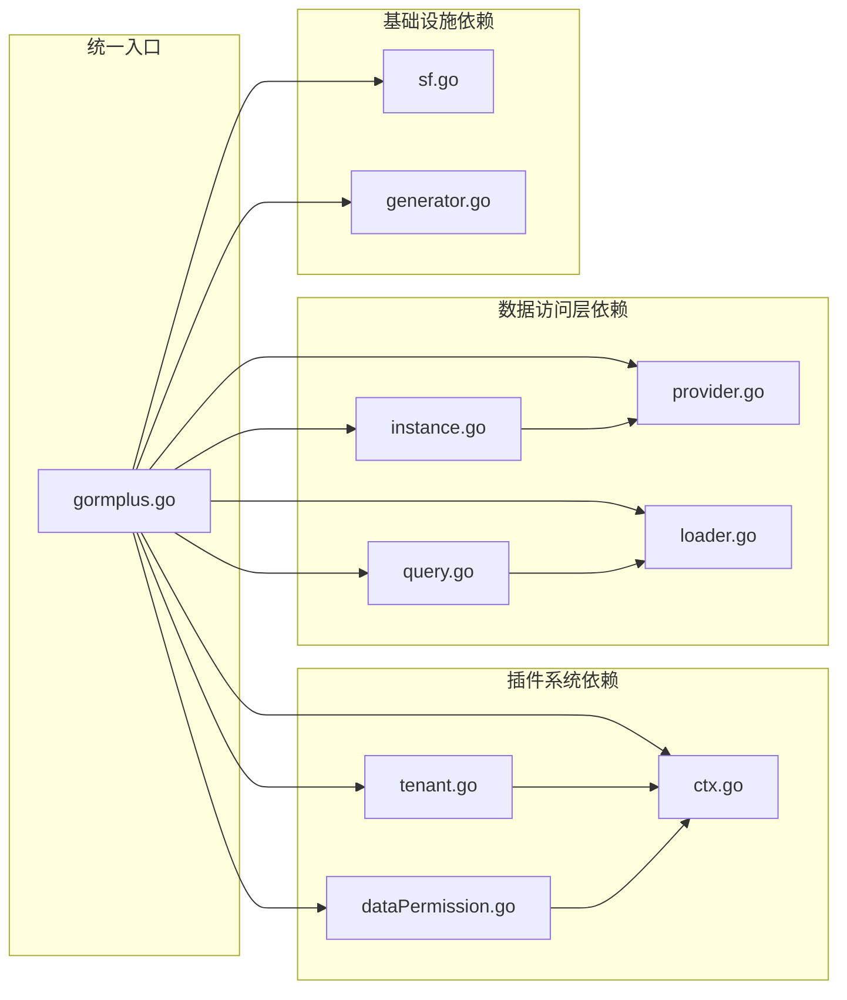

# 模块组织

<cite>
**本文引用的文件**
- [gormplus.go](file://gormplus.go)
- [dal.go](file://dal/dal.go)
- [provider.go](file://dal/provider.go)
- [loader.go](file://dal/loader.go)
- [options.go](file://dal/options.go)
- [instance.go](file://dal/instance.go)
- [query.go](file://dal/query.go)
- [tenant.go](file://plugin/tenant.go)
- [dataPermission.go](file://plugin/dataPermission.go)
- [ctx.go](file://plugin/ctx.go)
- [sf.go](file://sf/sf.go)
- [generator.go](file://generator/generator.go)
- [config.go](file://generator/config.go)
</cite>

## 更新摘要
**变更内容**
- 更新模块化架构说明，反映从 monolithic 结构到完全模块化重构
- 重新定义各功能模块的职责边界和文件组织结构
- 更新模块间依赖关系和交互方式
- 完善模块扩展指南和生命周期管理

## 目录
1. [简介](#简介)
2. [模块化架构概览](#模块化架构概览)
3. [核心模块职责划分](#核心模块职责划分)
4. [模块间依赖关系](#模块间依赖关系)
5. [统一入口协调机制](#统一入口协调机制)
6. [模块扩展与集成指南](#模块扩展与集成指南)
7. [生命周期管理](#生命周期管理)
8. [故障排查与最佳实践](#故障排查与最佳实践)
9. [总结](#总结)

## 简介
本项目已完成从 monolithic 结构到完全模块化架构的重构，采用按功能域划分的独立模块设计。每个功能模块都具有明确的职责边界和独立的文件组织结构，通过统一入口 gormplus 进行聚合导出与协调。模块间通过清晰的接口契约和上下文机制实现松耦合协作，支持 Gin、Go-Zero、Fiber 等多种 Web 框架，具备优秀的可扩展性和可维护性。

## 模块化架构概览
项目采用完全模块化的包结构设计，每个功能域独立组织为一个模块，统一入口负责模块聚合与导出：



**图表来源**
- [gormplus.go](file://gormplus.go)
- [dal.go](file://dal/dal.go)
- [provider.go](file://dal/provider.go)
- [loader.go](file://dal/loader.go)
- [options.go](file://dal/options.go)
- [instance.go](file://dal/instance.go)
- [query.go](file://dal/query.go)
- [tenant.go](file://plugin/tenant.go)
- [dataPermission.go](file://plugin/dataPermission.go)
- [ctx.go](file://plugin/ctx.go)
- [sf.go](file://sf/sf.go)
- [generator.go](file://generator/generator.go)
- [config.go](file://generator/config.go)

## 核心模块职责划分

### 查询构建器模块 (query/)
- **职责**: 提供原生 GORM 链式条件构造器，支持模糊查询、范围查询、条件开关、AND/OR 分组
- **边界**: 仅负责条件拼装，不关心数据源、缓存、插件
- **核心接口**: IQueryBuilder、NewQuery、FindByPage、ScanByPage
- **特点**: Build() 返回原生 *gorm.DB，支持完整 GORM 能力

### 数据访问层模块 (dal/)
- **职责**: SQL 文件化查询，支持位置参数与命名参数、分页、Hook、缓存、事务
- **边界**: 面向 SQL 文件与上下文，不直接暴露 GORM 细节
- **核心组件**: 
  - DBProvider 接口与实现
  - SQLLoader 接口与 EmbedLoader
  - DAL 实例管理与生命周期
  - Query/QueryOne/QueryNamed 等查询 API

### 插件系统模块 (plugin/)
- **职责**: 提供多租户、数据权限、自动填充等插件能力
- **边界**: 通过 GORM Callback 钩子在查询/更新/删除/创建阶段注入条件
- **核心插件**:
  - 多租户插件 (tenant.go): 自动注入租户条件，支持安全策略
  - 数据权限插件 (dataPermission.go): 按角色/部门隔离数据
  - 上下文解析 (ctx.go): 屏蔽框架差异，统一从 Request.Context 读取数据

### 缓存系统模块 (sf/)
- **职责**: SingleFlight + 可插拔缓存，支持内存/Redis 等实现
- **边界**: 缓存接口抽象，实现可替换
- **核心能力**: SF/SFWithTTL/SFNoCache、SFInvalidate、缓存键构建

### 代码生成器模块 (generator/)
- **职责**: 根据数据库表生成 Model/Repository/API/VO/DTO
- **边界**: 仅生成标准化代码，不修改已有自定义代码
- **核心功能**: YAML 配置、模板覆盖、路径解析

**章节来源**
- [gormplus.go](file://gormplus.go)
- [dal.go](file://dal/dal.go)
- [tenant.go](file://plugin/tenant.go)
- [dataPermission.go](file://plugin/dataPermission.go)
- [ctx.go](file://plugin/ctx.go)
- [sf.go](file://sf/sf.go)
- [generator.go](file://generator/generator.go)
- [config.go](file://generator/config.go)

## 模块间依赖关系
模块间通过接口契约实现松耦合协作，统一入口负责模块聚合与导出：



**图表来源**
- [gormplus.go](file://gormplus.go)
- [ctx.go](file://plugin/ctx.go)
- [tenant.go](file://plugin/tenant.go)
- [dataPermission.go](file://plugin/dataPermission.go)
- [provider.go](file://dal/provider.go)
- [loader.go](file://dal/loader.go)
- [instance.go](file://dal/instance.go)
- [query.go](file://dal/query.go)
- [sf.go](file://sf/sf.go)
- [generator.go](file://generator/generator.go)

## 统一入口协调机制
统一入口 gormplus 通过模块化设计实现各功能模块的协调与导出：

### 初始化顺序建议
1. **注册上下文解析器** (RegisterCtxResolver) - gin 项目必须
2. **注册多数据源** (DS.Register) - 外部传入 Dialector
3. **打开 DB** - 多数据源场景也可从 DS.Write/Read 获取
4. **注册插件** - 多租户、数据权限、自动填充、慢查询
5. **注册缓存** (可选) - 默认内存缓存，Redis 示例见注释
6. **优雅退出** - defer gormplus.StopSFCache()、defer gormplus.DS.Close()

### 协调机制
- **接口契约**: 通过 gorm.Plugin 接口、DBProvider 接口等实现模块解耦
- **上下文机制**: 通过 WithName/WithRead/WithWrite 标记数据源与读写意图
- **回调钩子**: 插件通过 GORM Callback 钩子在 DB 层面生效
- **生命周期管理**: 模块初始化 → 运行 → 优雅关闭

**章节来源**
- [gormplus.go](file://gormplus.go)

## 模块扩展与集成指南

### 新增插件模块
```go
// 实现 gorm.Plugin 接口
type MyPlugin struct {
    // 插件配置
}

func (p *MyPlugin) Name() string {
    return "my-plugin"
}

func (p *MyPlugin) Initialize(db *gorm.DB) error {
    // 注册回调钩子
    return db.Callback().Query().Before("gorm:query").Register(p.Name(), p.inject)
}
```

### 新增多数据源模块
```go
// 实现 DBProvider 接口
type MyDBProvider struct {
    // 实现 Get(ctx) *gorm.DB 方法
}

// 注册数据源
gormplus.DS.Register("my-group", DataSourceGroupConfig{
    Master: DataSourceNodeConfig{Dialector: myDialector},
    Slaves: []DataSourceNodeConfig{{Dialector: myDialector}},
})
```

### 新增缓存实现
```go
// 实现 SFCache 接口
type MyCache struct{}

func (c *MyCache) Get(key string) (any, bool) { /* 实现 */ }
func (c *MyCache) Set(key string, val any, ttl time.Duration) { /* 实现 */ }
func (c *MyCache) Del(key string) { /* 实现 */ }

// 注册缓存
gormplus.RegisterCache(&MyCache{})
```

### 新增访问层适配
```go
// 实现 SQLLoader 接口
type MySQLLoader struct{}

func (l *MySQLLoader) Load(file string) (string, error) { /* 实现 */ }
func (l *MySQLLoader) ClearCache() { /* 实现 */ }

// 创建 DAL 实例
dal.NewWithProvider(&MyDBProvider{}, &MySQLLoader{})
```

**章节来源**
- [tenant.go](file://plugin/tenant.go)
- [dataPermission.go](file://plugin/dataPermission.go)
- [ctx.go](file://plugin/ctx.go)
- [provider.go](file://dal/provider.go)
- [loader.go](file://dal/loader.go)
- [sf.go](file://sf/sf.go)

## 生命周期管理

### 模块初始化
- **插件系统**: 通过 db.Use 注册，Initialize 中注册回调钩子
- **数据访问层**: NewDal 创建实例，支持单库/多库/读写分离
- **缓存系统**: RegisterCache 注册自定义缓存实现
- **代码生成器**: Generate 执行生成流程

### 运行时管理
- **上下文传播**: 通过 WithDB 注入 DAL 实例，自动选择数据源
- **Hook 机制**: 支持多个 Hook 按注册顺序执行
- **缓存管理**: 支持主动失效、前缀失效、批量失效

### 优雅关闭
- **数据访问层**: d.Close() 停止后台定时缓存清理 goroutine
- **缓存系统**: gormplus.StopSFCache() 统一关闭入口
- **插件系统**: 通过 GORM 回调机制自然释放

**章节来源**
- [instance.go](file://dal/instance.go)
- [sf.go](file://sf/sf.go)
- [gormplus.go](file://gormplus.go)

## 故障排查与最佳实践

### 常见问题诊断
1. **插件无法读取 ctx 数据**
   - 症状: 多租户/数据权限/自动填充无法读取中间件写入的值
   - 处理: Gin 项目需注册上下文解析器；Go-Zero/Fiber 无需注册

2. **多数据源未注册或未设置默认数据源**
   - 症状: DS.Auto(ctx) 报错未找到数据源名且未设置默认数据源
   - 处理: 注册至少一个数据源组；或手动设置默认数据源

3. **缓存未生效或类型断言失败**
   - 症状: SF 返回类型断言错误或缓存未命中
   - 处理: 确保 args 键值一致且排序稳定；检查 RegisterCache 注册时机

4. **租户条件注入冲突或被拒绝**
   - 症状: 租户字段出现在 OR 条件中被拒绝执行
   - 处理: 调整业务 SQL，避免 OR 中包含租户字段

### 最佳实践建议
- **模块化导入**: 通过统一入口 import，无需逐一引入子包
- **初始化顺序**: 严格遵循推荐的初始化顺序
- **配置管理**: 使用 YAML 配置文件管理代码生成器参数
- **监控告警**: 启用 Debug 日志和 Hook 机制提升可观测性

**章节来源**
- [ctx.go](file://plugin/ctx.go)
- [tenant.go](file://plugin/tenant.go)
- [sf.go](file://sf/sf.go)
- [generator.go](file://generator/generator.go)

## 总结
本项目通过完全模块化的架构重构，实现了查询、访问、插件、多数据源、缓存与代码生成等模块的有机整合。每个模块都具有明确的职责边界和独立的文件组织结构，通过统一入口进行聚合导出与协调。模块间通过接口契约、上下文机制和回调钩子实现松耦合协作，既满足复杂业务场景的需求，又保持了优秀的可扩展性与可维护性。

建议在实际项目中遵循统一入口的初始化顺序与上下文标记规范，充分利用模块化架构的优势，实现更好的代码组织和维护效率。通过模块扩展指南，开发者可以基于现有架构快速添加新的功能模块，进一步丰富系统的功能特性。