# 统一入口点

<cite>
**本文档引用的文件**
- [gormplus.go](file://gormplus.go)
- [gormplus_dal.go](file://gormplus_dal.go)
- [gormplus_datasource.go](file://gormplus_datasource.go)
- [gormplus_executor.go](file://gormplus_executor.go)
- [gormplus_generator.go](file://gormplus_generator.go)
- [gormplus_genwrap.go](file://gormplus_genwrap.go)
- [gormplus_permission.go](file://gormplus_permission.go)
- [gormplus_query.go](file://gormplus_query.go)
- [gormplus_sf.go](file://gormplus_sf.go)
- [gormplus_slowquery.go](file://gormplus_slowquery.go)
- [gormplus_tenant.go](file://gormplus_tenant.go)
- [gormplus_autofill.go](file://gormplus_autofill.go)
- [version.go](file://version.go)
- [go.mod](file://go.mod)
- [README.md](file://README.md)
</cite>

## 更新摘要
**所做更改**
- 更新了统一入口点的组织方式，反映 gormplus.go 从单文件重构为多个专门文件
- 新增了各模块文件的详细说明和功能介绍
- 更新了项目结构图以反映新的文件组织方式
- 完善了初始化流程和模块集成方式的说明
- 增强了各子模块的导入和初始化顺序说明

## 目录
1. [简介](#简介)
2. [项目结构](#项目结构)
3. [核心组件](#核心组件)
4. [架构概览](#架构概览)
5. [详细组件分析](#详细组件分析)
6. [依赖分析](#依赖分析)
7. [性能考虑](#性能考虑)
8. [故障排查指南](#故障排查指南)
9. [结论](#结论)
10. [附录](#附录)

## 简介

GORM Plus 是一个基于 GORM 和 GORM-Gen 的增强扩展包统一入口。它通过单一导入的方式，为开发者提供了完整的数据库访问解决方案，包括查询构建器、数据访问层、插件系统、多数据源管理、缓存系统、代码生成器等功能模块。

### 设计理念

GORM Plus 的统一入口设计理念是"单一职责、模块化集成、零配置导入"。用户只需导入一个包，即可获得所有功能，无需逐一引入子包。这种设计简化了使用复杂度，提高了开发效率。

**更新** 重构后的 gormplus.go 采用模块化设计，将原本集中在单个文件中的功能拆分为多个专门文件，每个文件负责特定的功能模块，提升了代码的可维护性和可读性。

### 核心特性

- **统一入口**：通过单一导入即可使用所有功能模块
- **模块化设计**：查询构建器、数据访问层、插件系统、多数据源管理等独立模块
- **零配置导入**：减少初始化复杂度，提高开发体验
- **插件化架构**：支持多租户、数据权限、自动填充等插件
- **高性能缓存**：内置 SingleFlight + 可插拔缓存机制
- **代码生成**：提供完整的代码生成器，支持多种输出格式

## 项目结构

```mermaid
graph TB
subgraph "统一入口层"
GP[gormplus.go<br/>包文档 + ctx 解析器]
DAL[gormplus_dal.go<br/>SQL 文件化查询]
DS[gormplus_datasource.go<br/>多数据源管理]
EXEC[gormplus_executor.go<br/>查询执行器]
GEN[gormplus_generator.go<br/>代码生成器]
GW[gormplus_genwrap.go<br/>类型安全链式构造器]
PERM[gormplus_permission.go<br/>数据权限插件]
QUERY[gormplus_query.go<br/>原生 gorm 链式查询]
SF[gormplus_sf.go<br/>SingleFlight + 缓存]
SQ[gormplus_slowquery.go<br/>慢查询监控]
TENANT[gormplus_tenant.go<br/>多租户插件]
AUTO[gormplus_autofill.go<br/>自动填充插件]
end
subgraph "核心功能模块"
QUERYMOD[query/<br/>查询构建器]
DALMOD[dal/<br/>数据访问层]
PLUGINMOD[plugin/<br/>插件系统]
DSMOD[datasource/<br/>多数据源管理]
SFMOD[sf/<br/>缓存系统]
GENMOD[generator/<br/>代码生成器]
end
subgraph "外部依赖"
GORM[gorm.io/gorm<br/>核心数据库框架]
GENLIB[gorm.io/gen<br/>类型安全查询]
MYSQL[gorm.io/driver/mysql<br/>MySQL驱动]
end
GP --> QUERYMOD
GP --> DALMOD
GP --> PLUGINMOD
GP --> DSMOD
GP --> SFMOD
GP --> GENMOD
GP --> GORM
GP --> GENLIB
GP --> MYSQL
```

**图表来源**
- [gormplus.go:118-132](file://gormplus.go#L118-L132)
- [go.mod:5-25](file://go.mod#L5-L25)

**章节来源**
- [gormplus.go:1-132](file://gormplus.go#L1-L132)
- [README.md:17-84](file://README.md#L17-L84)

## 核心组件

### 统一入口设计

GORM Plus 的统一入口通过在 `gormplus.go` 文件中导出所有核心功能，实现了"零配置导入"的目标。用户只需导入 `"github.com/kuangshp/gorm-plus"` 即可使用所有功能。

**更新** 重构后的统一入口采用模块化文件组织方式，每个功能模块都有对应的专门文件：

- **gormplus_dal.go**：SQL 文件化查询功能
- **gormplus_datasource.go**：多数据源管理功能  
- **gormplus_executor.go**：查询执行器功能
- **gormplus_generator.go**：代码生成器功能
- **gormplus_genwrap.go**：gorm-gen 类型安全链式构造器
- **gormplus_permission.go**：数据权限插件功能
- **gormplus_query.go**：原生 gorm 链式查询功能
- **gormplus_sf.go**：SingleFlight + 缓存功能
- **gormplus_slowquery.go**：慢查询监控功能
- **gormplus_tenant.go**：多租户插件功能
- **gormplus_autofill.go**：自动填充插件功能

### 模块组织方式

系统采用模块化设计，每个功能模块都有独立的包结构和专门的文件：

1. **数据访问层模块** (`gormplus_dal.go`)：基于 SQL 文件的轻量级 DAL 层
2. **多数据源管理模块** (`gormplus_datasource.go`)：支持一主多从、读写分离
3. **查询执行器模块** (`gormplus_executor.go`)：SF + Cache 统一入口
4. **代码生成器模块** (`gormplus_generator.go`)：支持 Model、Repository、API、VO、DTO 等代码生成
5. **类型安全链式构造器模块** (`gormplus_genwrap.go`)：gorm-gen 扩展条件构建器
6. **数据权限插件模块** (`gormplus_permission.go`)：数据权限自动注入
7. **原生查询构建器模块** (`gormplus_query.go`)：原生 gorm 链式条件构造器
8. **缓存系统模块** (`gormplus_sf.go`)：SingleFlight + 可插拔缓存
9. **慢查询监控模块** (`gormplus_slowquery.go`)：数据库操作监控
10. **多租户插件模块** (`gormplus_tenant.go`)：多租户自动注入
11. **自动填充插件模块** (`gormplus_autofill.go`)：自动填充功能

**章节来源**
- [gormplus.go:118-132](file://gormplus.go#L118-L132)
- [gormplus_dal.go:1-416](file://gormplus_dal.go#L1-L416)
- [gormplus_datasource.go:1-95](file://gormplus_datasource.go#L1-L95)
- [gormplus_executor.go:1-76](file://gormplus_executor.go#L1-L76)
- [gormplus_generator.go:1-34](file://gormplus_generator.go#L1-L34)
- [gormplus_genwrap.go:1-61](file://gormplus_genwrap.go#L1-L61)
- [gormplus_permission.go:1-98](file://gormplus_permission.go#L1-L98)
- [gormplus_query.go:1-87](file://gormplus_query.go#L1-L87)
- [gormplus_sf.go:1-292](file://gormplus_sf.go#L1-L292)
- [gormplus_slowquery.go:1-48](file://gormplus_slowquery.go#L1-L48)
- [gormplus_tenant.go:1-197](file://gormplus_tenant.go#L1-L197)
- [gormplus_autofill.go:1-83](file://gormplus_autofill.go#L1-L83)

## 架构概览

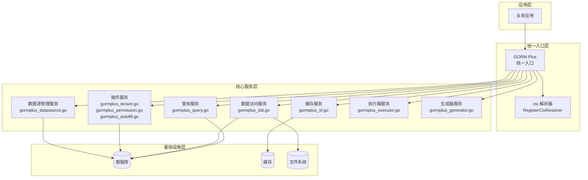

**图表来源**
- [gormplus.go:96-116](file://gormplus.go#L96-L116)
- [gormplus_dal.go:102-104](file://gormplus_dal.go#L102-L104)

## 详细组件分析

### 查询构建器组件

查询构建器是 GORM Plus 的核心功能之一，提供了两种类型的查询构建器：

#### 原生 GORM 链式条件构造器

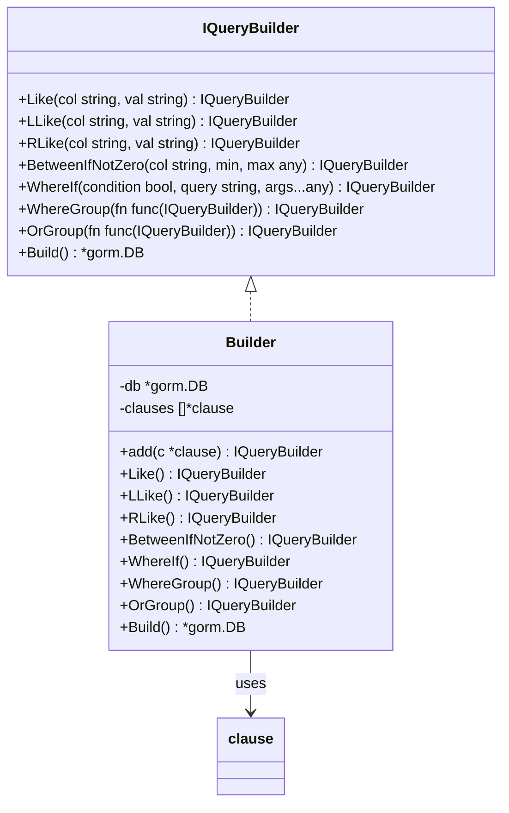

**图表来源**
- [gormplus_query.go:12-14](file://gormplus_query.go#L12-L14)
- [gormplus_query.go:40-42](file://gormplus_query.go#L40-L42)

#### GORM-Gen 类型安全链式构造器

GORM-Gen 扩展条件构建器提供了类型安全的查询构建能力：

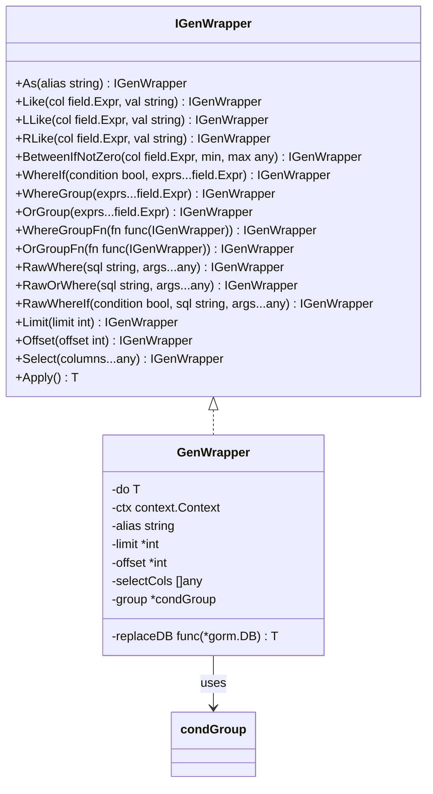

**图表来源**
- [gormplus_genwrap.go:8-11](file://gormplus_genwrap.go#L8-L11)
- [gormplus_genwrap.go:53-55](file://gormplus_genwrap.go#L53-L55)

**章节来源**
- [gormplus_query.go:1-87](file://gormplus_query.go#L1-L87)
- [gormplus_genwrap.go:1-61](file://gormplus_genwrap.go#L1-L61)

### 数据访问层组件

数据访问层提供了基于 SQL 文件的轻量级 DAL（Data Access Layer）：

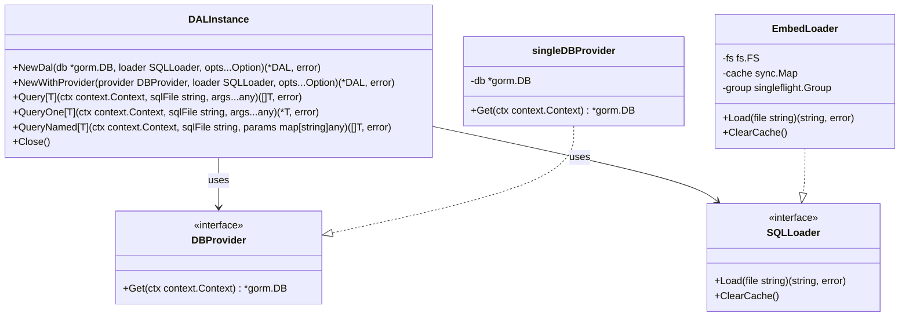

**图表来源**
- [gormplus_dal.go:12-15](file://gormplus_dal.go#L12-L15)
- [gormplus_dal.go:102-104](file://gormplus_dal.go#L102-L104)

**章节来源**
- [gormplus_dal.go:1-416](file://gormplus_dal.go#L1-L416)

### 插件系统组件

插件系统提供了多个可插拔的功能模块：

#### 多租户插件

多租户插件通过 GORM Callback 钩子自动注入租户条件：

```mermaid
classDiagram
class TenantConfig {
+TenantField string
+TenantFields []TenantFieldConfig[T]
+TableFields map[string][]TenantFieldConfig[T]
+AutoInjectJoinTables *bool
+ExcludeJoinTables []string
+JoinTableOverrides []JoinTenantConfig[T]
+AllowGlobalUpdate bool
+AllowGlobalDelete bool
+AllowOverrideTenantID bool
+DuplicatePolicy DuplicateTenantPolicy
+InjectMode InjectMode
+ExcludeTables []string
+GetTenantID func(ctx context.Context) (T, bool)
}
class tenantPlugin {
-cfg TenantConfig[T]
-defaultField []TenantFieldConfig[T]
-tableFields map[string][]TenantFieldConfig[T]
-autoInjectJoin bool
-excludeJoinSet map[string]struct{}
-joinOverrideMap map[string]JoinTenantConfig[T]
-excludeSet map[string]struct{}
+Initialize(db *gorm.DB) error
+injectWhere(db *gorm.DB)
+injectCreate(db *gorm.DB)
+injectJoinWhere(db *gorm.DB, ctx context.Context)
}
tenantPlugin --> TenantConfig : uses
```

**图表来源**
- [gormplus_tenant.go:12-15](file://gormplus_tenant.go#L12-L15)
- [gormplus_tenant.go:105-107](file://gormplus_tenant.go#L105-L107)

#### 数据权限插件

数据权限插件允许业务层自定义数据权限条件：

```mermaid
classDiagram
class DataPermissionConfig {
+InjectMode DataPermissionInjectMode
+ExcludeTables []string
}
class dataPermissionPlugin {
-injectMode DataPermissionInjectMode
-excludeSet map[string]struct{}
+Initialize(db *gorm.DB) error
+inject(db *gorm.DB)
+tableName(db *gorm.DB) string
+isExcluded(table string) bool
}
dataPermissionPlugin --> DataPermissionConfig : uses
```

**图表来源**
- [gormplus_permission.go:12-13](file://gormplus_permission.go#L12-L13)
- [gormplus_permission.go:30-32](file://gormplus_permission.go#L30-L32)

#### 自动填充插件

自动填充插件支持任意字段和自定义 Getter：

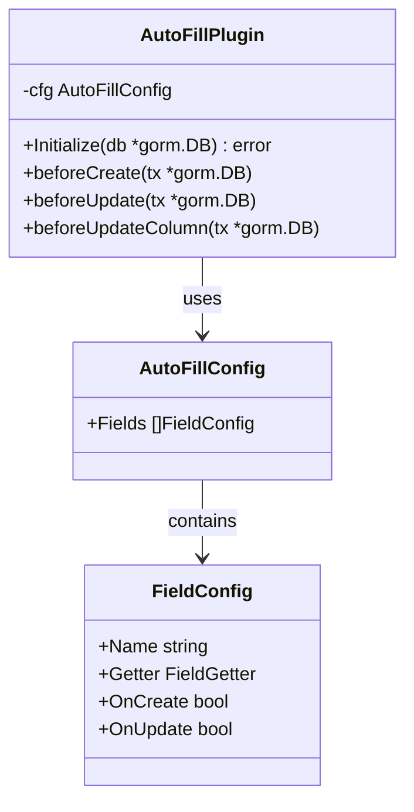

**图表来源**
- [gormplus_autofill.go:7-8](file://gormplus_autofill.go#L7-L8)
- [gormplus_autofill.go:67-69](file://gormplus_autofill.go#L67-L69)

**章节来源**
- [gormplus_tenant.go:1-197](file://gormplus_tenant.go#L1-L197)
- [gormplus_permission.go:1-98](file://gormplus_permission.go#L1-L98)
- [gormplus_autofill.go:1-83](file://gormplus_autofill.go#L1-L83)

### 多数据源管理组件

多数据源管理器支持一主多从、读写分离：

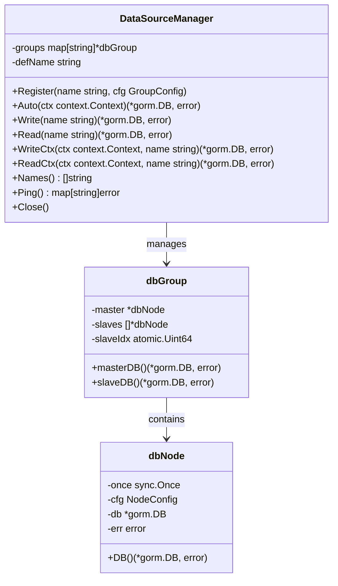

**图表来源**
- [gormplus_datasource.go:9-10](file://gormplus_datasource.go#L9-L10)
- [gormplus_datasource.go:66](file://gormplus_datasource.go#L66)

**章节来源**
- [gormplus_datasource.go:1-95](file://gormplus_datasource.go#L1-L95)

### 缓存系统组件

缓存系统提供了 SingleFlight + 可插拔缓存机制：

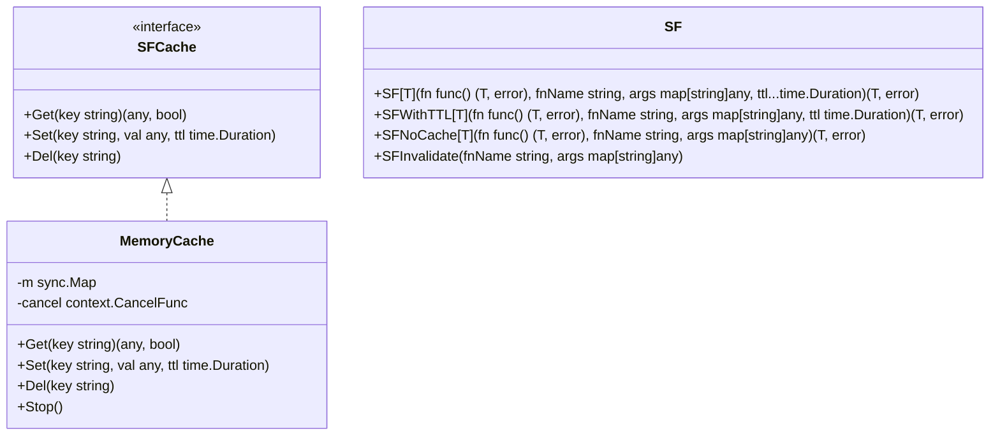

**图表来源**
- [gormplus_sf.go:11-12](file://gormplus_sf.go#L11-L12)
- [gormplus_sf.go:102-104](file://gormplus_sf.go#L102-L104)

**章节来源**
- [gormplus_sf.go:1-292](file://gormplus_sf.go#L1-L292)

### 代码生成器组件

代码生成器支持多种输出格式：

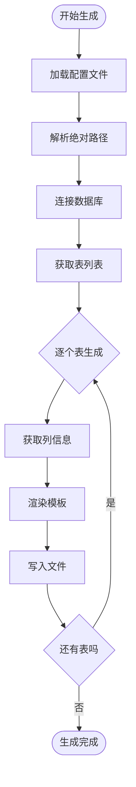

**图表来源**
- [gormplus_generator.go:12-13](file://gormplus_generator.go#L12-L13)
- [gormplus_generator.go:31-33](file://gormplus_generator.go#L31-L33)

**章节来源**
- [gormplus_generator.go:1-34](file://gormplus_generator.go#L1-L34)

### 查询执行器组件

查询执行器提供了 SF + Cache 统一入口：

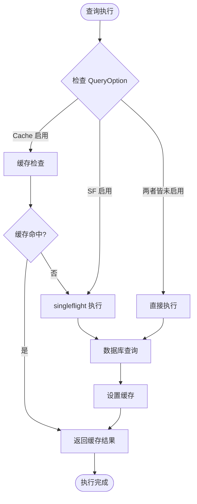

**图表来源**
- [gormplus_executor.go:16-18](file://gormplus_executor.go#L16-L18)
- [gormplus_executor.go:35-42](file://gormplus_executor.go#L35-L42)

**章节来源**
- [gormplus_executor.go:1-76](file://gormplus_executor.go#L1-L76)

## 依赖分析

### 外部依赖关系

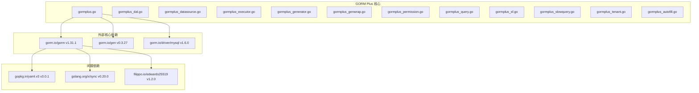

**图表来源**
- [go.mod:5-25](file://go.mod#L5-L25)

### 内部模块依赖

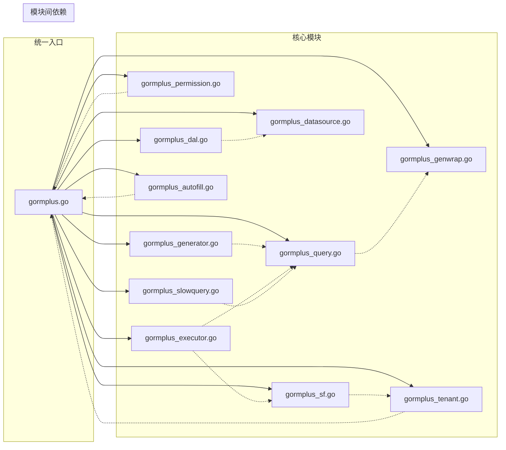

**图表来源**
- [gormplus.go:88-101](file://gormplus.go#L88-L101)

**章节来源**
- [go.mod:1-26](file://go.mod#L1-L26)

## 性能考虑

### 查询构建器性能

查询构建器采用了以下优化策略：

1. **条件跳过机制**：空值条件自动跳过，避免不必要的 SQL 生成
2. **批量条件构建**：支持条件分组，减少 SQL 语句复杂度
3. **类型安全**：通过 GORM-Gen 提供编译时类型检查，减少运行时错误

### 缓存系统性能

缓存系统提供了三层防护：

1. **纯 SingleFlight**：同一瞬间的并发请求只执行一次
2. **缓存层**：TTL 内的重复请求直接返回缓存
3. **主动失效**：写操作后主动清除对应缓存

### 多数据源性能

多数据源管理器采用了懒连接策略：

1. **延迟初始化**：首次读写时才建立数据库连接
2. **连接池优化**：提供生产推荐的连接池配置
3. **读写分离**：自动选择合适的数据库节点

## 故障排查指南

### 常见问题及解决方案

#### 1. 初始化顺序问题

**问题**：插件注册顺序错误导致功能异常

**解决方案**：
```go
// 正确的初始化顺序
func main() {
    // 1. 注册 ctx 解析器
    gormplus.RegisterCtxResolver(...)
    
    // 2. 注册多数据源
    gormplus.DS.Register(...)
    
    // 3. 打开数据库连接
    db, _ := gorm.Open(...)
    
    // 4. 注册插件
    gormplus.RegisterTenant(db, ...)
    gormplus.RegisterDataPermission(db, ...)
    
    // 5. 注册自动填充插件
    db.Use(gormplus.NewAutoFillPlugin(...))
    
    // 6. 注册慢查询监控
    gormplus.RegisterSlowQuery(db, ...)
}
```

#### 2. 缓存配置问题

**问题**：缓存注册时机错误导致无效

**解决方案**：
```go
// 必须在第一次调用 SF 之前注册
func main() {
    // 注册缓存实现
    gormplus.RegisterCache(&RedisSFCache{...})
    
    // 现在可以正常使用 SF
    list, err := gormplus.SF(...)
}
```

#### 3. 多租户配置问题

**问题**：租户条件注入异常

**解决方案**：
```go
// 检查租户 ID 是否正确传递
func TenantMiddleware() gin.HandlerFunc {
    return func(c *gin.Context) {
        tenantID := getTenantIDFromJWT(c)
        ctx := gormplus.WithTenantID(c.Request.Context(), tenantID)
        c.Request = c.Request.WithContext(ctx)
        c.Next()
    }
}
```

**章节来源**
- [gormplus.go:96-116](file://gormplus.go#L96-L116)
- [gormplus_sf.go:102-104](file://gormplus_sf.go#L102-L104)

## 结论

GORM Plus 通过统一入口点的设计，成功地将复杂的数据库访问功能模块化，为开发者提供了一个简洁、高效、功能完整的解决方案。其主要优势包括：

1. **简化使用复杂度**：单一导入即可使用所有功能
2. **模块化设计**：每个功能模块独立，便于维护和扩展
3. **高性能架构**：内置缓存、懒连接等优化策略
4. **插件化扩展**：支持多租户、数据权限等可插拔功能
5. **完善的工具链**：提供代码生成器等开发辅助工具

**更新** 重构后的模块化文件组织方式进一步提升了系统的可维护性和可读性，每个功能模块都有专门的文件负责，便于开发者理解和使用。

通过遵循正确的初始化顺序和配置方式，开发者可以充分利用 GORM Plus 的各项功能，提高开发效率和系统性能。

## 附录

### 初始化最佳实践

#### 基础初始化流程

```go
import (
    "gorm.io/driver/mysql"
    gormplus "github.com/kuangshp/gorm-plus"
)

func main() {
    // 1. 注册上下文解析器
    gormplus.RegisterCtxResolver(func(ctx context.Context) context.Context {
        if ginCtx, ok := ctx.(*gin.Context); ok {
            return ginCtx.Request.Context()
        }
        return ctx
    })

    // 2. 注册多数据源
    gormplus.DS.Register("default", gormplus.DataSourceGroupConfig{
        Master: gormplus.DataSourceNodeConfig{
            Dialector: mysql.Open(dsn),
            Pool: gormplus.DataSourcePoolConfig{
                MaxOpen: 50,
                MaxIdle: 10,
            },
        },
        Slaves: []gormplus.DataSourceNodeConfig{
            {Dialector: mysql.Open(slaveDsn)},
        },
    })

    // 3. 打开数据库连接
    db, _ := gorm.Open(mysql.Open(dsn), &gorm.Config{})

    // 4. 注册插件
    gormplus.RegisterTenant(db, gormplus.TenantConfig[int64]{
        TenantField: "tenant_id",
    })
    
    gormplus.RegisterDataPermission(db, gormplus.DataPermissionConfig{
        ExcludeTables: []string{"sys_config", "sys_dict"},
    })
    
    db.Use(gormplus.NewAutoFillPlugin(gormplus.AutoFillConfig{
        Fields: []gormplus.FieldConfig{
            {Name: "CreatedBy", Getter: gormplus.CtxGetter[int64](gormplus.CtxContextKey1), OnCreate: true},
            {Name: "UpdatedBy", Getter: gormplus.CtxGetter[int64](gormplus.CtxContextKey1), OnCreate: true, OnUpdate: true},
        },
    }))

    // 5. 注册慢查询监控
    gormplus.RegisterSlowQuery(db, gormplus.SlowQueryConfig{
        Threshold: 200 * time.Millisecond,
        Logger: func(ctx context.Context, info gormplus.SlowQueryInfo) {
            log.Printf("[慢查询] cost=%v table=%s sql=%s", info.Duration, info.Table, info.SQL)
        },
    })

    // 6. 注册缓存（可选）
    // gormplus.RegisterCache(&RedisSFCache{rdb: rdb})

    // 7. 优雅退出
    defer gormplus.StopSFCache()
    defer gormplus.DS.Close()
}
```

#### 高级配置示例

```go
// 自定义缓存实现
type RedisSFCache struct {
    rdb    *redis.Client
    prefix string
}

func (c *RedisSFCache) Get(key string) (any, bool) {
    val, err := c.rdb.Get(context.Background(), c.prefix+key).Bytes()
    if err != nil { return nil, false }
    var result any
    if err := json.Unmarshal(val, &result); err != nil { return nil, false }
    return result, true
}

func (c *RedisSFCache) Set(key string, val any, ttl time.Duration) {
    b, _ := json.Marshal(val)
    c.rdb.Set(context.Background(), c.prefix+key, b, ttl)
}

func (c *RedisSFCache) Del(key string) {
    c.rdb.Del(context.Background(), c.prefix+key)
}

// 注册自定义缓存
gormplus.RegisterCache(&RedisSFCache{rdb: rdb, prefix: "myapp:sf:"})
```

**章节来源**
- [README.md:87-153](file://README.md#L87-L153)
- [gormplus.go:96-116](file://gormplus.go#L96-L116)