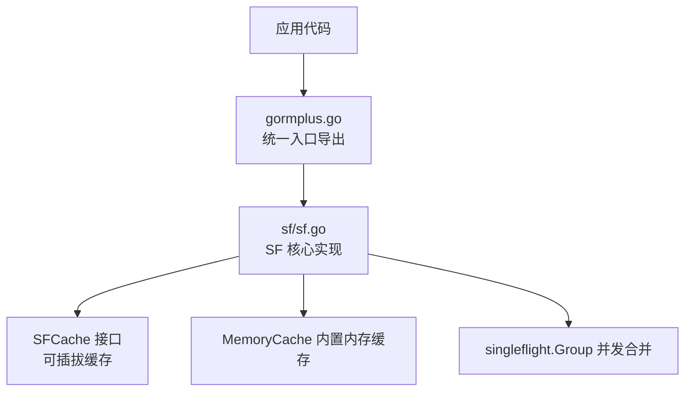
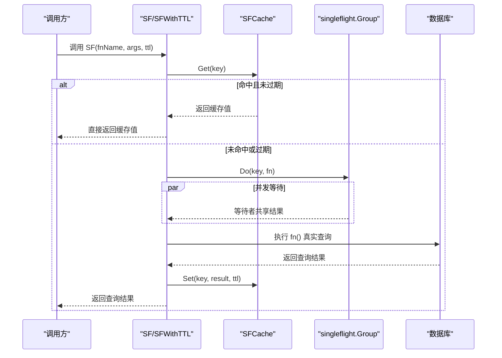
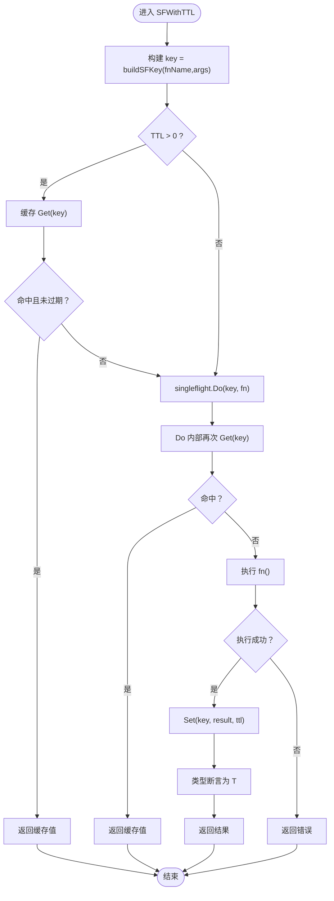
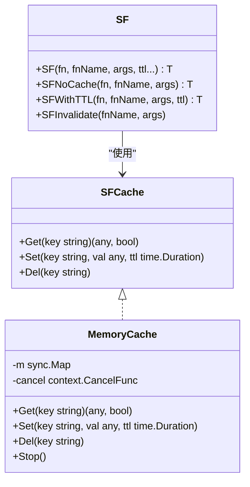
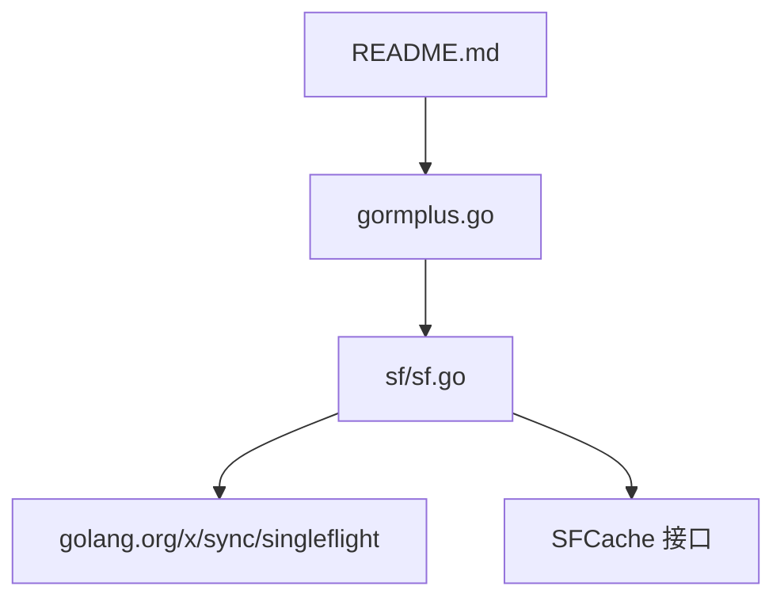

# SF 核心函数

<cite>
**本文引用的文件**
- [sf.go](file://sf/sf.go)
- [gormplus.go](file://gormplus.go)
- [README.md](file://README.md)
- [version.go](file://version.go)
</cite>

## 目录
1. [简介](#简介)
2. [项目结构](#项目结构)
3. [核心组件](#核心组件)
4. [架构总览](#架构总览)
5. [详细组件分析](#详细组件分析)
6. [依赖关系分析](#依赖关系分析)
7. [性能考量](#性能考量)
8. [故障排查指南](#故障排查指南)
9. [结论](#结论)
10. [附录](#附录)

## 简介
本文件面向 SF（SingleFlight + 可插拔缓存）核心函数系列，系统性阐述 SF、SFNoCache、SFWithTTL、SFInvalidate 四个函数的功能差异、使用场景、参数与返回值、类型安全与泛型机制、调用关系与内部实现逻辑、错误处理与异常情况、性能对比与选择建议，并提供丰富的使用示例与最佳实践。

## 项目结构
- SF 核心位于 sf/sf.go，提供缓存接口、内存缓存实现、全局缓存注册、以及 SF 系列函数。
- gormplus.go 对外导出 SF 系列函数与缓存相关能力，作为统一入口。
- README.md 提供使用示例与 TTL 建议。
- version.go 提供版本信息。

图表来源
- [sf.go:1-395](file://sf/sf.go#L1-L395)
- [gormplus.go:348-473](file://gormplus.go#L348-L473)

章节来源
- [sf.go:1-395](file://sf/sf.go#L1-L395)
- [gormplus.go:348-473](file://gormplus.go#L348-L473)
- [README.md:567-641](file://README.md#L567-L641)

## 核心组件
- SFCache 接口：定义 Get/Set/Del 三元缓存能力，支持内存与 Redis 等可插拔实现。
- MemoryCache：内置内存缓存，带后台过期清理 goroutine。
- SF 系列函数：
  - SF：通用封装，支持可选 TTL；未传 TTL 时使用默认 TTL。
  - SFNoCache：纯 singleflight，不缓存，适合对实时性要求高的场景。
  - SFWithTTL：通用封装，手动指定 TTL，是 SF 的底层实现。
  - SFInvalidate：主动失效指定查询的缓存键。
- 全局缓存注册：RegisterCache 注册自定义缓存，getCache 懒初始化内存缓存。
- Key 构建：buildSFKey 将 fnName + args 构建为确定性 key，保证并发安全与一致性。

章节来源
- [sf.go:49-131](file://sf/sf.go#L49-L131)
- [sf.go:133-225](file://sf/sf.go#L133-L225)
- [sf.go:235-349](file://sf/sf.go#L235-L349)
- [sf.go:351-394](file://sf/sf.go#L351-L394)

## 架构总览
SF 通过 singleflight 合并同一 key 的并发请求，并结合可插拔缓存实现“防缓存击穿”。默认使用内存缓存，可通过 RegisterCache 注入 Redis 等实现。

图表来源
- [sf.go:301-349](file://sf/sf.go#L301-L349)

章节来源
- [sf.go:235-349](file://sf/sf.go#L235-L349)

## 详细组件分析

### SF 函数
- 功能：通用 singleflight + 缓存封装，最常用入口。
- 参数：
  - fn：实际查询函数，闭包原封不动放入，类型安全。
  - fnName：查询唯一标识，建议“表名.方法名”，如 “Order.List”。
  - args：影响查询结果的所有参数，map key 自动排序后哈希，顺序无关。
  - ttl：可选，缓存时长；不传时使用默认 TTL；传 0 等价于 SFNoCache。
- 返回值：泛型 T，查询结果；错误时返回 error。
- 类型安全：通过泛型函数 SF[T]，确保返回值类型与闭包一致，避免类型断言风险。
- 默认 TTL：未传 ttl 时使用默认 TTL（5 分钟）。

章节来源
- [sf.go:235-258](file://sf/sf.go#L235-L258)
- [sf.go:46-47](file://sf/sf.go#L46-L47)
- [gormplus.go:408-427](file://gormplus.go#L408-L427)

### SFNoCache 函数
- 功能：纯 singleflight，只合并同一瞬间的并发请求，完成后立即释放，不缓存结果。
- 适用场景：详情接口、余额查询、敏感数据等对实时性要求高的场景。
- 参数：fn、fnName、args，无 TTL。
- 返回值：泛型 T，查询结果；错误时返回 error。

章节来源
- [sf.go:260-273](file://sf/sf.go#L260-L273)
- [gormplus.go:434-446](file://gormplus.go#L434-L446)

### SFWithTTL 函数
- 功能：通用 singleflight + 缓存封装，手动指定 TTL，是 SF 的底层实现。
- 执行流程：
  1) 用 fnName + args 构建确定性 cache key。
  2) TTL>0 时先查缓存，命中则直接返回。
  3) 进入 singleflight Do：同一 key 只有一个 goroutine 真正执行。
  4) Do 内部再查一次缓存（防止等待期间其他 goroutine 已写入）。
  5) 执行 fn()，成功且 TTL>0 时写入缓存。
  6) TTL=0 时立即 Forget，确保下次请求重新执行而不被合并。
  7) 类型断言后返回结果。
- 参数：fn、fnName、args、ttl。
- 返回值：泛型 T，查询结果；错误时返回 error。

图表来源
- [sf.go:301-349](file://sf/sf.go#L301-L349)

章节来源
- [sf.go:293-349](file://sf/sf.go#L293-L349)

### SFInvalidate 函数
- 功能：主动使指定查询的缓存立即失效。
- 使用时机：写操作（Create/Update/Delete）后调用，避免后续读取到旧缓存数据。
- 参数：fnName、args，需与查询时传入的完全一致（key-value 相同，顺序无关）。
- 返回值：无，内部直接调用缓存 Del(key)。

章节来源
- [sf.go:275-291](file://sf/sf.go#L275-L291)
- [gormplus.go:448-460](file://gormplus.go#L448-L460)

### 缓存接口与实现
- SFCache 接口：Get/Set/Del。
- MemoryCache：默认实现，带后台过期清理 goroutine，Stop 停止清理。
- RegisterCache：注册自定义缓存实现，替换默认内存缓存；必须在第一次调用 SF 之前注册，否则已懒初始化的内存缓存不会被替换。
- getCache：未注册时懒初始化内存缓存。

图表来源
- [sf.go:88-131](file://sf/sf.go#L88-L131)
- [sf.go:141-187](file://sf/sf.go#L141-L187)
- [sf.go:251-291](file://sf/sf.go#L251-L291)

章节来源
- [sf.go:88-131](file://sf/sf.go#L88-L131)
- [sf.go:141-187](file://sf/sf.go#L141-L187)
- [sf.go:116-131](file://sf/sf.go#L116-L131)

### 键构建与类型安全
- buildSFKey：将 fnName + args 构建为确定性字符串 key，key 格式包含 fnName 与参数哈希，保证并发安全与一致性。
- marshalSorted：将 map 按 key 字母序排列后序列化为 JSON 字节，确保 args 顺序无关。
- 类型断言：SFWithTTL 最终将 raw.(T) 断言为期望类型，失败时返回类型断言错误。

章节来源
- [sf.go:353-367](file://sf/sf.go#L353-L367)
- [sf.go:369-394](file://sf/sf.go#L369-L394)
- [sf.go:341-347](file://sf/sf.go#L341-L347)

## 依赖关系分析
- SF 系列函数依赖 singleflight.Group 实现并发合并。
- SF 系列函数依赖 SFCache 接口实现缓存读写。
- gormplus.go 作为统一入口，导出 SF 系列函数与缓存相关能力。
- README.md 提供使用示例与 TTL 建议。

图表来源
- [sf.go:3-15](file://sf/sf.go#L3-L15)
- [gormplus.go:348-473](file://gormplus.go#L348-L473)
- [README.md:567-641](file://README.md#L567-L641)

章节来源
- [sf.go:3-15](file://sf/sf.go#L3-L15)
- [gormplus.go:348-473](file://gormplus.go#L348-L473)
- [README.md:567-641](file://README.md#L567-L641)

## 性能考量
- 并发合并：singleflight 有效降低同一时间点的重复查询压力，提升吞吐。
- 缓存命中：TTL 内重复请求直接命中缓存，避免数据库访问。
- 内存缓存：默认实现，零配置，适合单机与开发测试；多实例部署建议使用 Redis 等分布式缓存。
- 过期清理：内存缓存后台 goroutine 每 30 秒扫描一次，删除过期键，防止内存无限增长。
- TTL 选择建议：
  - 列表/统计（允许短暂延迟）：3s ~ 30s
  - 配置/字典（几乎不变）：1min ~ 5min（默认 TTL）
  - 详情/用户实时数据：0（SFNoCache）

章节来源
- [sf.go:189-206](file://sf/sf.go#L189-L206)
- [sf.go:40-47](file://sf/sf.go#L40-L47)
- [README.md:633-639](file://README.md#L633-L639)

## 故障排查指南
- 类型断言失败：SFWithTTL 在最终类型断言时若失败，会返回类型断言错误，检查 fn 返回值类型与泛型 T 是否一致。
- 缓存未生效：确认是否正确传入 args，且 key 构建依赖的参数序列化无误；检查 RegisterCache 是否在第一次调用 SF 之前完成。
- 写后读脏数据：确保在写操作后调用 SFInvalidate，使对应查询缓存失效。
- 内存泄漏：使用内存缓存时，在应用退出时调用 StopSFCache 停止后台清理 goroutine；使用 Redis 等自定义缓存时由用户自行管理生命周期。
- 并发问题：singleflight 已内置 panic 安全，panic 会传播给所有等待者而不会死锁。

章节来源
- [sf.go:341-347](file://sf/sf.go#L341-L347)
- [sf.go:101-114](file://sf/sf.go#L101-L114)
- [sf.go:287-291](file://sf/sf.go#L287-L291)
- [sf.go:217-225](file://sf/sf.go#L217-L225)
- [sf.go:229-233](file://sf/sf.go#L229-L233)

## 结论
- SF：最常用入口，支持可选 TTL，默认使用默认 TTL。
- SFNoCache：对实时性要求高的场景首选，不缓存，仅合并并发。
- SFWithTTL：底层实现，手动指定 TTL，适合需要精确控制缓存时长的场景。
- SFInvalidate：写后读一致性保障，必须与查询时的 fnName、args 保持一致。
- 选择建议：列表/统计使用短 TTL；配置/字典使用默认 TTL；详情/实时数据使用 SFNoCache；多实例部署使用 Redis 缓存。

## 附录

### 函数签名与参数说明
- SF[T](fn func() (T, error), fnName string, args map[string]any, ttl ...time.Duration) (T, error)
  - fn：实际查询函数，闭包原封不动放入，类型安全。
  - fnName：查询唯一标识，建议“表名.方法名”。
  - args：影响查询结果的所有参数，map key 自动排序后哈希，顺序无关。
  - ttl：可选，缓存时长；不传时使用默认 TTL；传 0 等价于 SFNoCache。
- SFNoCache[T](fn func() (T, error), fnName string, args map[string]any) (T, error)
  - 无 TTL 参数，等价于 TTL=0。
- SFWithTTL[T](fn func() (T, error), fnName string, args map[string]any, ttl time.Duration) (T, error)
  - 手动指定 TTL，是 SF 的底层实现。
- SFInvalidate(fnName string, args map[string]any)
  - 主动失效指定查询的缓存键。

章节来源
- [sf.go:251-258](file://sf/sf.go#L251-L258)
- [sf.go:260-273](file://sf/sf.go#L260-L273)
- [sf.go:293-301](file://sf/sf.go#L293-L301)
- [sf.go:287-291](file://sf/sf.go#L287-L291)

### 使用示例与场景
- 带缓存查询（30 秒）：参考 README 中 SF 使用示例。
- 纯 singleflight（不缓存）：参考 README 中 SFNoCache 使用示例。
- 写后失效：参考 README 中 SFInvalidate 使用示例。
- Redis 缓存：参考 README 中 RegisterCache 与 Redis 实现示例。

章节来源
- [README.md:575-593](file://README.md#L575-L593)
- [README.md:597-624](file://README.md#L597-L624)

### 版本信息
- 版本：v1.0.13

章节来源
- [version.go:1-4](file://version.go#L1-L4)