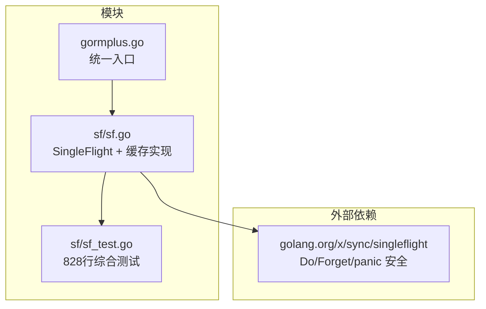
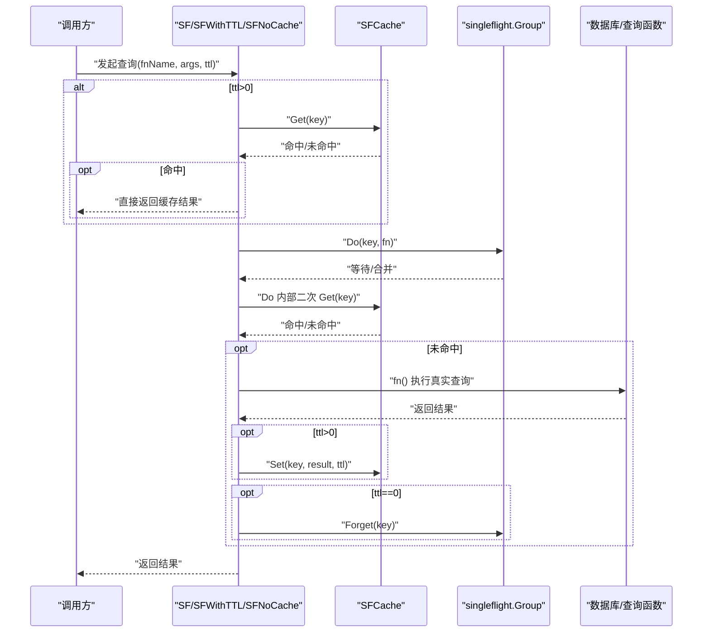
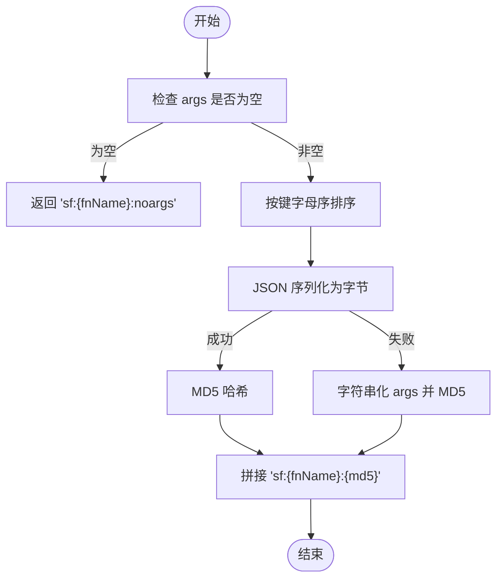
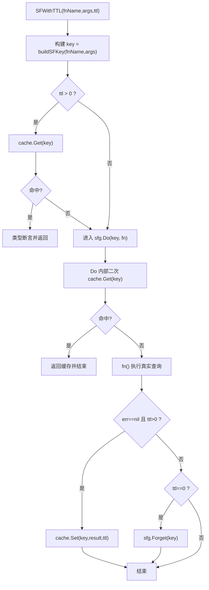
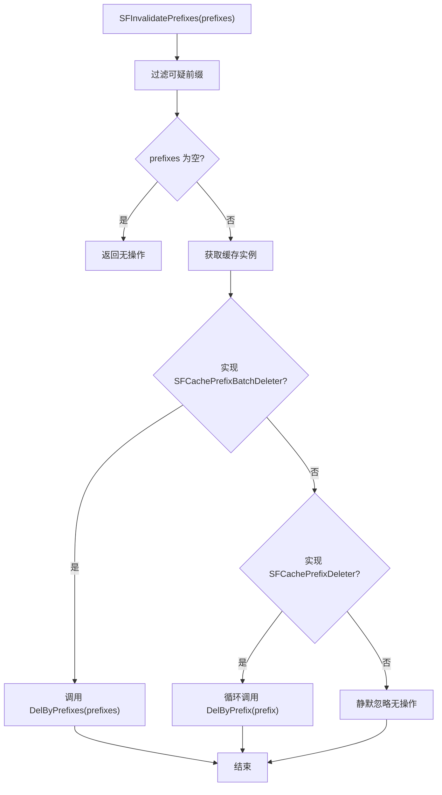
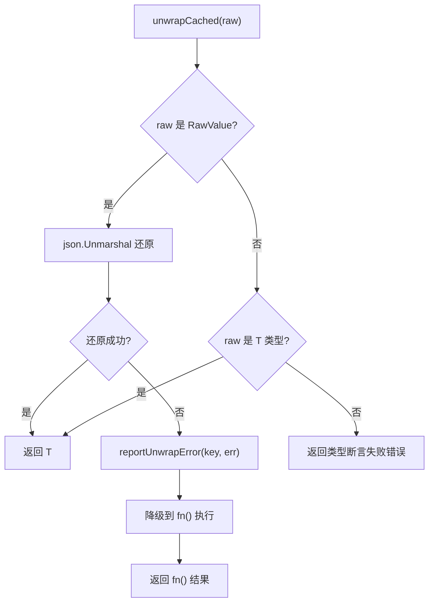
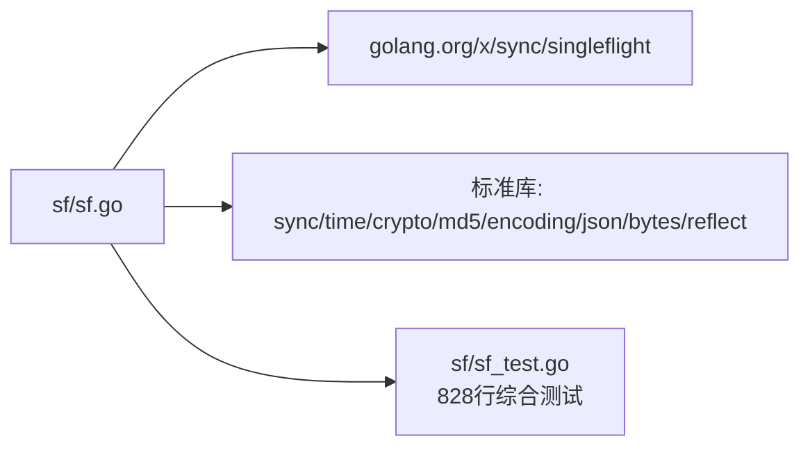

# SingleFlight 并发控制

<cite>
**本文引用的文件**
- [sf.go](file://sf/sf.go)
- [sf_test.go](file://sf/sf_test.go)
- [README.md](file://README.md)
- [gormplus.go](file://gormplus.go)
- [go.mod](file://go.mod)
</cite>

## 更新摘要
**变更内容**
- 新增批量前缀失效机制（SFInvalidatePrefixes）和批量删除接口
- 增强内存缓存的批量操作支持（DelByPrefixes）
- 改进缓存键构建算法和确定性保证
- 新增缓存反序列化观测钩子（OnUnwrapError）
- 扩展测试覆盖至 828 行，涵盖所有新功能
- 增强缓存资源管理（SFCacheCloser 接口）

## 目录
1. [简介](#简介)
2. [项目结构](#项目结构)
3. [核心组件](#核心组件)
4. [架构概览](#架构概览)
5. [详细组件分析](#详细组件分析)
6. [批量操作增强](#批量操作增强)
7. [缓存键构建优化](#缓存键构建优化)
8. [观测性增强](#观测性增强)
9. [依赖分析](#依赖分析)
10. [性能考量](#性能考量)
11. [故障排查指南](#故障排查指南)
12. [结论](#结论)
13. [附录](#附录)

## 简介
本文件系统性阐述 gorm-plus 中的 SingleFlight 并发控制机制，围绕"同一时间点多个并发请求的合并"这一核心目标，解释 SF、SFNoCache、SFInvalidate 等公开 API 的设计与使用，并结合缓存键构建、可插拔缓存、panic 安全与死锁防护等实现细节，给出高并发场景下的最佳实践与性能建议。

**更新** 本版本新增了批量操作支持、增强的内存管理和观测性功能，大幅提升了缓存系统的实用性和可维护性。

## 项目结构
- 单独的 sf 包提供 SingleFlight + 可插拔缓存能力，对外通过 gormplus.go 提供统一入口。
- go.mod 显示依赖 golang.org/x/sync/singleflight，表明直接复用官方库的 Do/Forget 等能力。
- sf_test.go 包含 828 行综合测试，覆盖所有新功能和边界情况。

**图表来源**
- [gormplus.go](file://gormplus.go)
- [sf.go](file://sf/sf.go)
- [sf_test.go](file://sf/sf_test.go)
- [go.mod](file://go.mod)

**章节来源**
- [gormplus.go](file://gormplus.go)
- [sf.go](file://sf/sf.go)
- [sf_test.go](file://sf/sf_test.go)
- [go.mod](file://go.mod)

## 核心组件
- SFCache 接口：可插拔缓存抽象，Get/Set/Del 三元组，支持内存缓存与 Redis/Memcached 等外部缓存。
- MemoryCache：内置内存缓存实现，带后台过期清理 goroutine，支持批量删除操作。
- SF/SFWithTTL/SFNoCache：对外公开的查询封装 API，分别提供带缓存、带 TTL 的缓存封装与纯合并（不缓存）两种模式。
- SFInvalidate/SFInvalidatePrefix/SFInvalidatePrefixes：主动失效接口，支持精确失效、前缀失效和批量前缀失效三种粒度。
- buildSFKey/marshalSorted：确定性缓存键生成，保证 args 顺序无关、稳定可复现。
- OnUnwrapError：缓存反序列化失败观测钩子，提供生产环境可观测性。

**更新** 新增批量操作接口和观测性钩子，提供更精细的缓存控制和监控能力。

**章节来源**
- [sf.go](file://sf/sf.go)

## 架构概览
SingleFlight 的工作流分为"缓存快速路径 + singleflight 合并 + 缓存写入/失效"的组合，既避免重复计算，又在必要时保持数据新鲜度。

**图表来源**
- [sf.go](file://sf/sf.go)

## 详细组件分析

### SFCache 接口与可插拔缓存
- 设计目标：统一缓存访问，便于替换为内存缓存或 Redis/Memcached 等外部缓存。
- 默认行为：未注册时懒初始化内存缓存；注册后所有 SF/SFWithTTL/SFInvalidate 使用同一缓存实例。
- 生命周期：StopSFCache 停止内置内存缓存的后台清理 goroutine；自定义缓存由用户自行管理。

**更新** 新增 SFCachePrefixBatchDeleter 接口，支持批量前缀删除，大幅提升批量失效场景的性能。

**章节来源**
- [sf.go](file://sf/sf.go)

### 内存缓存 MemoryCache
- 特性：基于 sync.Map 的并发安全存储，后台定时扫描过期项并清理。
- 批量操作：新增 DelByPrefixes 方法，支持一次扫描处理多个前缀，避免 N 次扫描的性能开销。
- 适用：单机/开发测试场景，零配置即可使用。
- 退出：StopSFCache 在应用退出时调用，确保 goroutine 正常退出。

**更新** 内存缓存现在支持批量删除操作，性能提升显著，特别适合批量失效场景。

**章节来源**
- [sf.go](file://sf/sf.go)

### 缓存键构建与确定性
- buildSFKey：将 fnName + args 组合为稳定 key，避免 args 顺序导致的 key 泄漏。
- marshalSorted：对 args 的键进行字母序排序后 JSON 序列化，保证 key 的确定性与稳定性。
- fallback：当 JSON 序列化失败时，退化为对 args 的字符串化再做 MD5，确保 key 生成不中断。

**图表来源**
- [sf.go](file://sf/sf.go)

**章节来源**
- [sf.go](file://sf/sf.go)

### SF/SFWithTTL/SFNoCache 与 Do/Forget
- SF/SFWithTTL：先查缓存（TTL>0），命中即返回；否则进入 singleflight.Do 合并执行，Do 内部再次查缓存，避免等待期间其他 goroutine 已写入缓存；执行 fn() 后，若成功且 TTL>0 则写入缓存；若 TTL==0 则调用 Forget 主动释放 key，确保下次请求不再被合并。
- SFNoCache：等价于 TTL==0 的 SFWithTTL，Do 内部执行后立即 Forget，保证实时性。
- Do/Forget：直接复用 golang.org/x/sync/singleflight 的 Do/Forget，具备内置 panic 安全与死锁防护。

**图表来源**
- [sf.go](file://sf/sf.go)

**章节来源**
- [sf.go](file://sf/sf.go)

### SFInvalidate 主动失效
- 作用：写操作后主动删除对应查询的缓存键，避免后续读取到旧数据。
- 使用：参数 args 需与查询时传入的完全一致（key-value 相同，顺序无关）。

**更新** 新增 SFInvalidatePrefixes 批量前缀失效功能，支持一次调用清空多个前缀的缓存，大幅提升批量失效场景的性能。

**章节来源**
- [sf.go](file://sf/sf.go)

### panic 安全与死锁防护
- panic 安全：官方 singleflight.Do 内置 panic 安全，panic 会传播给所有等待者，不会造成死锁。
- 死锁防护：Do 合并同一 key 的并发请求，避免重复计算；Forget 主动释放 key，防止长期占用导致的资源泄漏。

**章节来源**
- [sf.go](file://sf/sf.go)

### API 使用场景与示例路径
- 带缓存查询（30 秒）：参考示例路径 [README.md](file://README.md)，使用 SF 封装查询函数、fnName 与 args、TTL。
- 纯合并（不缓存）：参考示例路径 [README.md](file://README.md)，使用 SFNoCache 适配详情接口、余额等对实时性要求高的场景。
- 主动失效：参考示例路径 [README.md](file://README.md)，在写操作后调用 SFInvalidate/SFInvalidatePrefix/SFInvalidatePrefixes 清理缓存。
- 自定义缓存（Redis）：参考示例路径 [README.md](file://README.md)，实现 SFCache 接口并通过 RegisterCache 注册。

**更新** 新增批量前缀失效的使用示例，特别适用于批量写操作后的缓存清理场景。

**章节来源**
- [README.md](file://README.md)

## 批量操作增强

### 批量前缀删除接口
- SFCachePrefixBatchDeleter：支持批量按前缀删除 key 的可选接口，显著提升批量失效场景的性能。
- SFInvalidatePrefixes：批量前缀失效函数，支持一次调用清空多个前缀的缓存。
- 优先级：优先使用批量接口，未实现时自动降级为循环调用单个接口。

**图表来源**
- [sf.go](file://sf/sf.go)

**章节来源**
- [sf.go](file://sf/sf.go)

### 内存缓存批量删除
- DelByPrefixes：一次扫描处理所有前缀，避免 N 次扫描的性能开销。
- 性能优势：相比循环调用 DelByPrefix，性能提升可达 N 倍。

**章节来源**
- [sf.go](file://sf/sf.go)

## 缓存键构建优化

### 改进的键生成算法
- 确定性保证：通过字母序排序和 JSON 序列化，确保 key 的稳定性和一致性。
- 性能优化：避免 args 顺序导致的 key 泄漏，减少缓存碎片与抖动。
- 兼容性：支持空参数和复杂嵌套结构的稳定序列化。

**章节来源**
- [sf.go](file://sf/sf.go)

## 观测性增强

### OnUnwrapError 钩子机制
- 功能：当 SFWithTTL 还原缓存值失败时被调用，提供生产环境可观测性。
- 触发场景：Redis 里数据格式损坏、缓存里存的类型和业务期望的类型不匹配等。
- 默认行为：err 不为 nil 时，框架会降级到 fn() 重新查 DB，对业务透明。
- 使用场景：上报 metrics、打日志、触发缓存清理等。

**图表来源**
- [sf.go](file://sf/sf.go)

**章节来源**
- [sf.go](file://sf/sf.go)

## 依赖分析
- 外部依赖：golang.org/x/sync/singleflight，提供 Do/Forget/panic 安全等能力。
- 内部依赖：sf 包内部依赖 sync、time、crypto/md5、encoding/json、bytes、reflect 等标准库，以及 golang.org/x/sync/singleflight。

**图表来源**
- [sf.go](file://sf/sf.go)
- [sf_test.go](file://sf/sf_test.go)
- [go.mod](file://go.mod)

**章节来源**
- [go.mod](file://go.mod)
- [sf.go](file://sf/sf.go)
- [sf_test.go](file://sf/sf_test.go)

## 性能考量
- 缓存命中率：TTL>0 时，命中直接返回，避免数据库与查询函数开销；建议根据场景合理设置 TTL。
- 合并效果：同一 key 的并发请求在 Do 内部被合并，仅一个 goroutine 真正执行，显著降低重复计算与数据库压力。
- 缓存键稳定性：通过字母序排序与 JSON 序列化，确保 key 稳定，减少缓存碎片与抖动。
- 内存缓存后台清理：MemoryCache 的后台 goroutine 每 30 秒扫描一次，清理过期项，避免内存膨胀。
- 实时性权衡：SFNoCache/TTL==0 时立即 Forget，确保下次请求重新执行，避免缓存污染。
- **批量操作性能**：SFInvalidatePrefixes 通过批量删除接口，将多次 SCAN 优化为单次批量操作，性能提升显著。
- **观测性开销**：OnUnwrapError 钩子在高频路径执行，实现要尽量快、不阻塞、不 panic。

**更新** 新增批量操作和观测性相关的性能考量。

**章节来源**
- [sf.go](file://sf/sf.go)

## 故障排查指南
- 缓存未生效：确认是否正确传入 fnName 与 args，且 args 键值完全一致；检查 TTL 设置是否为 0（SFNoCache）或大于 0（带缓存）。
- 缓存击穿/穿透：确保 args 键值稳定且顺序无关；对于热点数据，适当缩短 TTL 或采用多级缓存。
- 写后读脏：在写操作后调用 SFInvalidate/SFInvalidatePrefix/SFInvalidatePrefixes 清理缓存；确保 args 与查询时一致。
- panic 导致阻塞：无需担心，官方 singleflight.Do 内置 panic 安全，panic 会传播给所有等待者，不会死锁。
- 内存泄漏：使用 StopSFCache 在应用退出时停止内置内存缓存的后台 goroutine；自定义缓存由用户自行管理生命周期。
- **批量失效异常**：检查自定义缓存是否实现 SFCachePrefixBatchDeleter 接口，未实现时会自动降级为循环调用。
- **缓存反序列化失败**：通过 OnUnwrapError 钩子监控，及时发现并处理缓存数据损坏问题。

**更新** 新增批量操作和观测性相关的故障排查指导。

**章节来源**
- [sf.go](file://sf/sf.go)

## 结论
gorm-plus 的 SingleFlight 实现以 golang.org/x/sync/singleflight 为核心，结合可插拔缓存与确定性缓存键，提供了高效、安全、易用的并发控制方案。通过 SF/SFWithTTL/SFNoCache 与 SFInvalidate/SFInvalidatePrefix/SFInvalidatePrefixes 的组合，既能显著降低重复计算与数据库压力，又能满足不同场景对实时性的需求。

**更新** 本版本的重大增强包括批量操作支持、内存管理优化、观测性增强等功能，大幅提升了缓存系统的实用性和可维护性。建议在高并发场景下合理设置 TTL、及时失效缓存，并根据部署形态选择合适的缓存实现（内存/Redis）。对于批量写操作场景，优先使用 SFInvalidatePrefixes 提升性能。

## 附录
- 统一入口：gormplus.go 对外导出 SF/SFWithTTL/SFNoCache/SFInvalidate/SFInvalidatePrefix/SFInvalidatePrefixes/StopSFCache/RegisterCache 等 API，便于业务侧直接使用。
- 示例路径：README.md 中提供了内存缓存与 Redis 缓存的完整使用示例，可作为快速上手参考。
- **测试覆盖**：sf_test.go 包含 828 行综合测试，涵盖所有新功能和边界情况，确保代码质量和稳定性。

**章节来源**
- [gormplus.go](file://gormplus.go)
- [README.md](file://README.md)
- [sf_test.go](file://sf/sf_test.go)