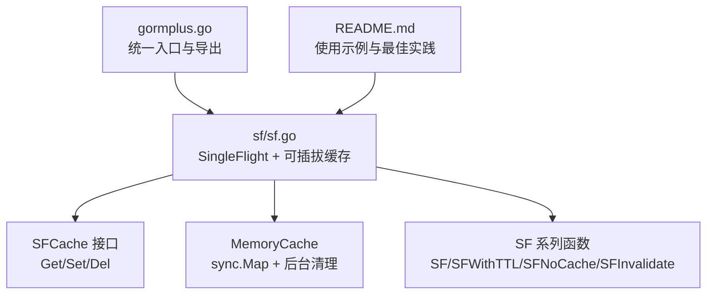
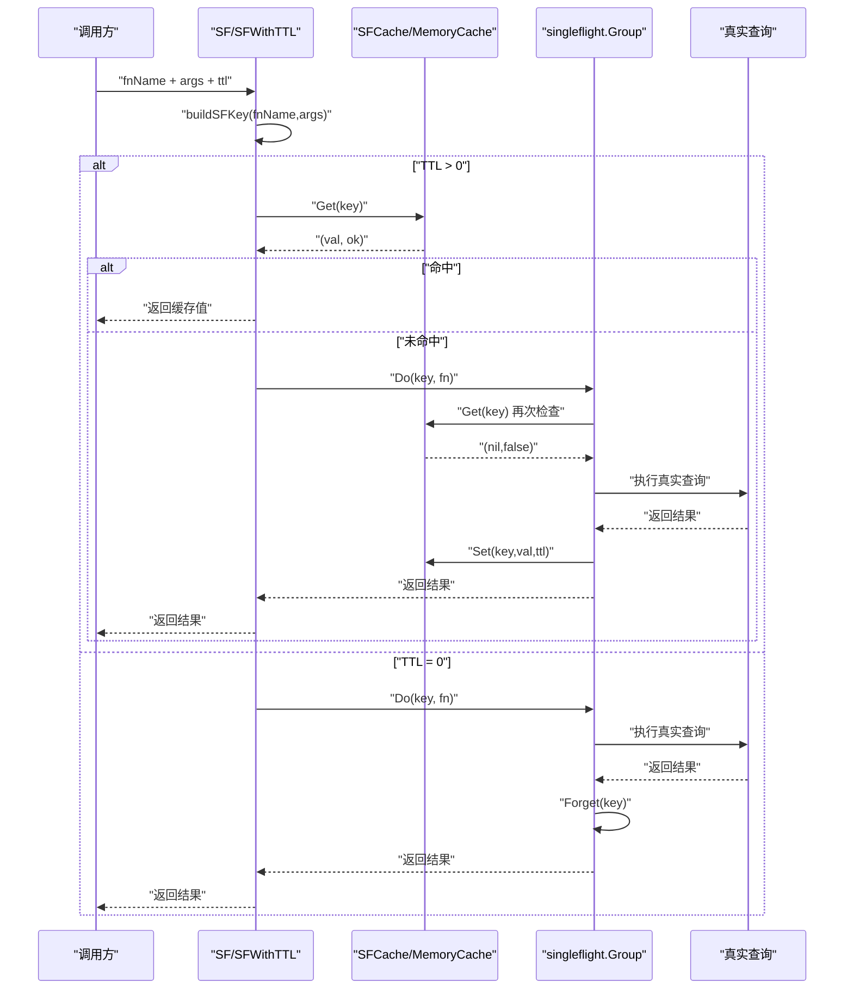
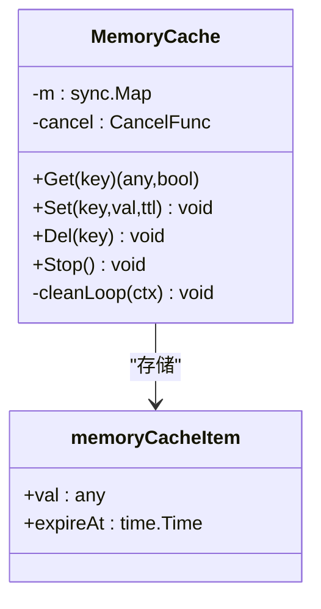
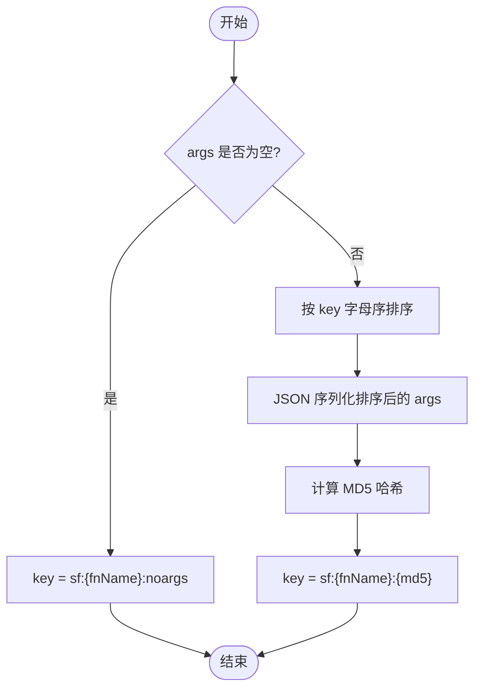
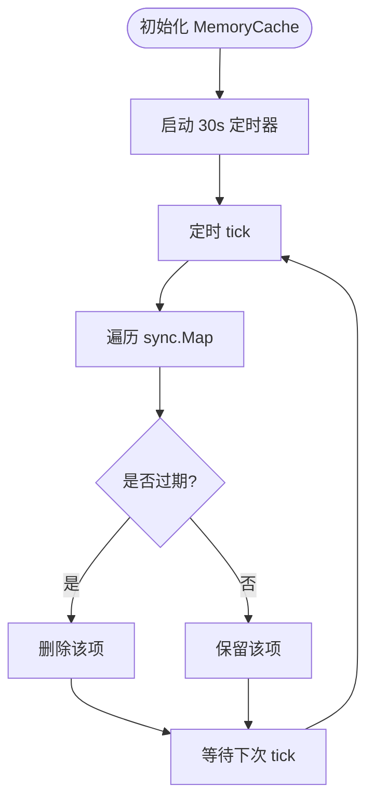
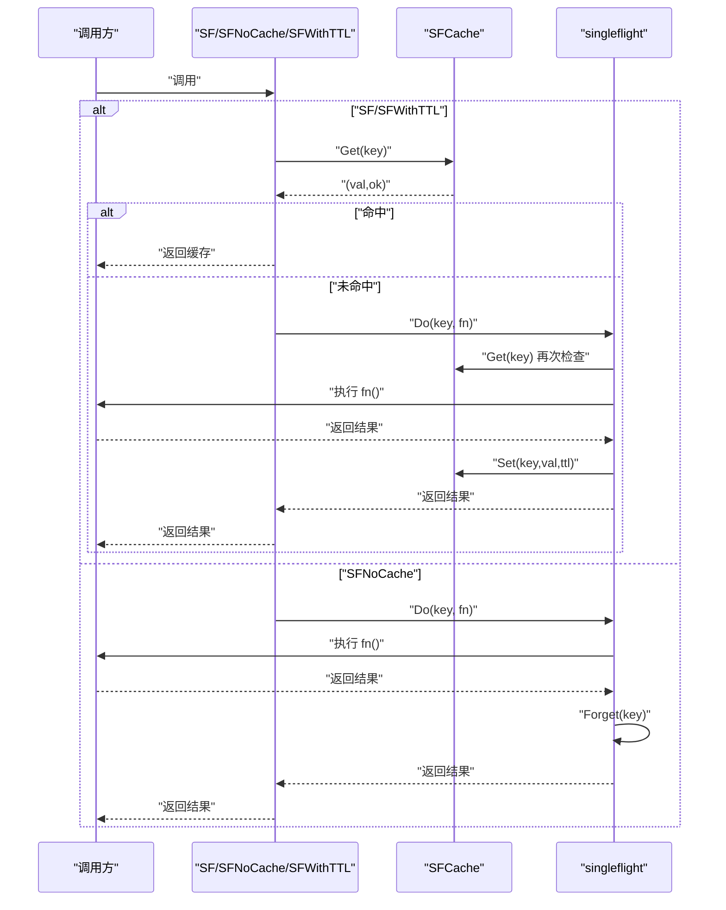
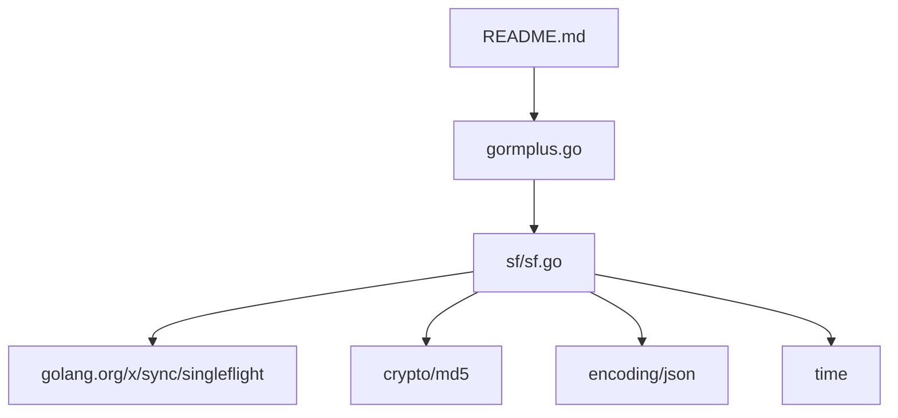

# 内存缓存实现

<cite>
**本文引用的文件**
- [sf.go](file://sf/sf.go)
- [gormplus.go](file://gormplus.go)
- [README.md](file://README.md)
- [go.mod](file://go.mod)
</cite>

## 目录
1. [简介](#简介)
2. [项目结构](#项目结构)
3. [核心组件](#核心组件)
4. [架构概览](#架构概览)
5. [详细组件分析](#详细组件分析)
6. [依赖分析](#依赖分析)
7. [性能考虑](#性能考虑)
8. [故障排查指南](#故障排查指南)
9. [结论](#结论)
10. [附录](#附录)

## 简介
本技术文档聚焦于 gorm-plus 中的内存缓存实现，系统性阐述 MemoryCache 的内部结构、并发安全机制、缓存项存储格式、过期时间管理与后台清理机制，并给出配置选项、性能调优参数、生命周期管理与资源释放、内存使用监控与泄漏防护、以及单元测试与性能测试方法。读者无需深入 Go 并发细节，亦可理解并正确使用该缓存方案。

## 项目结构
- 顶层入口导出统一模块能力，其中包含 SF（SingleFlight + 可插拔缓存）相关 API。
- 缓存实现位于 sf 包，提供 SFCache 接口、默认内存缓存 MemoryCache、全局缓存注册与懒初始化、以及 SF 系列函数。
- README 提供使用示例与最佳实践，包括内存缓存与 Redis 缓存的对比与切换。

图表来源
- [gormplus.go:348-473](file://gormplus.go#L348-L473)
- [sf.go:49-395](file://sf/sf.go#L49-L395)
- [README.md:567-641](file://README.md#L567-L641)

章节来源
- [gormplus.go:348-473](file://gormplus.go#L348-L473)
- [sf.go:49-395](file://sf/sf.go#L49-L395)
- [README.md:567-641](file://README.md#L567-L641)

## 核心组件
- SFCache 接口：定义缓存的统一抽象，包含 Get、Set、Del 三个方法，支持任意实现（默认内存缓存、Redis 等）。
- MemoryCache：默认内存缓存实现，基于 sync.Map 存储键值项，每个项包含值与过期时间戳。
- 全局缓存注册：通过 RegisterCache 注册自定义缓存；若未注册则懒初始化内存缓存。
- SF 系列函数：提供带缓存的查询封装，支持 TTL 控制、纯 singleflight 合并、主动失效等能力。
- 后台清理：内存缓存启动周期性扫描 goroutine，定期清理过期键，避免内存无限增长。

章节来源
- [sf.go:49-131](file://sf/sf.go#L49-L131)
- [sf.go:133-206](file://sf/sf.go#L133-L206)
- [sf.go:235-395](file://sf/sf.go#L235-L395)

## 架构概览
内存缓存的整体工作流如下：
- 业务调用 SF/SFWithTTL/SFNoCache，先构建确定性 key（fnName + 排序后的 args JSON）。
- 若 TTL > 0，先尝试从缓存 Get 命中；命中则直接返回。
- 进入 singleflight.Do 合并并发请求，同一 key 下仅一个 goroutine 真正执行查询。
- Do 内部再次查缓存（防等待期间其他 goroutine 已写入），执行真实查询后写入缓存（TTL > 0）。
- 若 TTL = 0，执行后立即 Forget，确保下次请求重新执行。
- 写操作后可通过 SFInvalidate 主动删除对应 key，避免脏读。

图表来源
- [sf.go:252-349](file://sf/sf.go#L252-L349)
- [sf.go:355-394](file://sf/sf.go#L355-L394)

章节来源
- [sf.go:252-349](file://sf/sf.go#L252-L349)
- [sf.go:355-394](file://sf/sf.go#L355-L394)

## 详细组件分析

### MemoryCache 内部结构与并发安全
- 存储结构：使用 sync.Map 保存键值项，键为字符串，值为 memoryCacheItem 指针。
- 键值项结构：包含 val（任意类型）与 expireAt（过期时间戳）。
- 并发安全：
  - Get/Set/Del 基于 sync.Map 的 Load/Store/Delete，天然并发安全。
  - 清理 goroutine 使用 Range 遍历并删除过期项，保证清理过程的原子性。
- 过期判断：Get 时比较当前时间与 expireAt，过期则删除并返回未命中。

图表来源
- [sf.go:141-144](file://sf/sf.go#L141-L144)
- [sf.go:158-161](file://sf/sf.go#L158-L161)
- [sf.go:189-206](file://sf/sf.go#L189-L206)

章节来源
- [sf.go:141-144](file://sf/sf.go#L141-L144)
- [sf.go:158-161](file://sf/sf.go#L158-L161)
- [sf.go:189-206](file://sf/sf.go#L189-L206)

### 缓存项存储格式与 key 构建
- 存储格式：每个缓存项为 memoryCacheItem，包含任意类型的 val 与过期时间戳 expireAt。
- key 构建：
  - 若 args 为空，key 格式为 "sf:{fnName}:noargs"。
  - 否则将 args 按 key 字母序排序后序列化为 JSON，再计算 MD5，最终 key 为 "sf:{fnName}:{md5}"。
  - 该设计确保 key 的确定性与稳定性，避免参数顺序变化导致的重复缓存。

图表来源
- [sf.go:355-394](file://sf/sf.go#L355-L394)

章节来源
- [sf.go:355-394](file://sf/sf.go#L355-L394)

### 过期时间管理与后台清理机制
- 过期时间：Set 时将 expireAt 设为当前时间 + ttl。
- 清理策略：启动后台 goroutine，每 30 秒扫描一次，遍历所有项，删除过期项。
- 停止机制：StopSFCache 调用取消上下文，清理 goroutine 退出，避免资源泄露。

图表来源
- [sf.go:189-206](file://sf/sf.go#L189-L206)

章节来源
- [sf.go:189-206](file://sf/sf.go#L189-L206)

### SF 系列函数与缓存策略
- SF：默认 TTL 使用 DefaultSFTTL（5 分钟），若传入 0 等价于 SFNoCache。
- SFNoCache：TTL = 0，进入 singleflight 合并，执行后立即 Forget，不写入缓存。
- SFWithTTL：底层实现，先查缓存，再进入 singleflight，执行后按 TTL 写入缓存。
- SFInvalidate：主动删除指定 key，避免写操作后读到旧数据。

图表来源
- [sf.go:252-349](file://sf/sf.go#L252-L349)

章节来源
- [sf.go:252-349](file://sf/sf.go#L252-L349)

### 全局缓存注册与懒初始化
- RegisterCache：在第一次调用 SF 之前注册，替换全局缓存实例。
- getCache：若未注册，懒初始化内存缓存；若已注册则直接使用。
- StopSFCache：仅对 MemoryCache 生效，调用其 Stop 停止后台清理 goroutine。

章节来源
- [sf.go:96-131](file://sf/sf.go#L96-L131)
- [sf.go:208-225](file://sf/sf.go#L208-L225)

### 配置选项与性能调优参数
- 默认 TTL：DefaultSFTTL = 5 分钟，适用于一般列表/统计场景。
- TTL 选择建议：
  - 列表/统计（允许短暂延迟）：3s ~ 30s
  - 配置/字典（几乎不变）：1min ~ 5min
  - 详情/用户实时数据：0 或 SFNoCache
- 缓存清理间隔：内存缓存后台清理固定为 30 秒一次，不可配置。
- 注册自定义缓存：实现 SFCache 接口并通过 RegisterCache 注入，替换默认内存缓存。

章节来源
- [sf.go:46-47](file://sf/sf.go#L46-L47)
- [sf.go:40-44](file://sf/sf.go#L40-L44)
- [sf.go:101-114](file://sf/sf.go#L101-L114)
- [sf.go:59-92](file://sf/sf.go#L59-L92)

### 生命周期管理与资源释放
- 应用退出时调用 StopSFCache，确保内存缓存后台 goroutine 正常退出。
- 使用自定义缓存（如 Redis）时，由用户自行管理连接生命周期，无需调用 StopSFCache。
- MemoryCache 的 Stop 通过取消上下文触发清理 goroutine 退出。

章节来源
- [sf.go:208-225](file://sf/sf.go#L208-L225)
- [README.md:570-574](file://README.md#L570-L574)

### 内存使用监控与内存泄漏防护
- 内存泄漏防护：后台 goroutine 每 30 秒扫描并删除过期项，避免缓存无限增长。
- 内存使用监控：可通过业务侧埋点统计缓存命中率、查询耗时等指标；结合日志与指标系统进行监控。
- 建议：在高并发场景下合理设置 TTL，避免大量短命缓存造成频繁写入；必要时采用分布式缓存（如 Redis）以共享缓存并降低单机内存压力。

章节来源
- [sf.go:189-206](file://sf/sf.go#L189-L206)
- [README.md:633-639](file://README.md#L633-L639)

### 单元测试与性能测试方法
- 单元测试要点：
  - 使用 NewMemoryCache 显式创建内存缓存实例，便于替换默认缓存进行测试。
  - 验证 Get/Set/Del 的基本行为与过期逻辑。
  - 验证 SF 系列函数在不同 TTL 下的行为（命中、合并、失效）。
  - 验证 SFInvalidate 能正确删除缓存。
- 性能测试要点：
  - 基准测试：对比不同 TTL、不同并发度下的吞吐与延迟。
  - 压力测试：模拟高并发场景，观察后台清理 goroutine 的 CPU 占用与内存增长趋势。
  - 建议工具：Go 内置 testing/benchmark、pprof、expvar 等。

章节来源
- [sf.go:146-149](file://sf/sf.go#L146-L149)
- [sf.go:275-291](file://sf/sf.go#L275-L291)

## 依赖分析
- 外部依赖：
  - golang.org/x/sync/singleflight：提供 singleflight 并发合并能力。
  - crypto/md5、encoding/json：用于 key 构建与序列化。
  - time：用于过期时间与后台清理调度。
- 内部依赖：
  - gormplus.go 导出 SF 系列函数与缓存相关 API，供业务使用。
  - README.md 提供使用示例与最佳实践。

图表来源
- [sf.go:3-15](file://sf/sf.go#L3-L15)
- [gormplus.go:348-473](file://gormplus.go#L348-L473)
- [README.md:567-641](file://README.md#L567-L641)

章节来源
- [sf.go:3-15](file://sf/sf.go#L3-L15)
- [gormplus.go:348-473](file://gormplus.go#L348-L473)
- [README.md:567-641](file://README.md#L567-L641)

## 性能考虑
- 并发安全：sync.Map 适合读多写少场景；Get/Set/Del 均为 O(1) 平均复杂度。
- key 构建：排序 + JSON 序列化 + MD5，args 较大时会有一定 CPU 开销；建议控制 args 的规模与层级。
- 后台清理：固定 30 秒扫描一次，对大多数场景足够；若缓存项极多，可考虑分布式缓存或缩短 TTL 降低内存占用。
- singleflight：合并同一瞬间的并发请求，显著减少重复查询；TTL=0 时立即 Forget，避免缓存污染。

章节来源
- [sf.go:189-206](file://sf/sf.go#L189-L206)
- [sf.go:355-394](file://sf/sf.go#L355-L394)

## 故障排查指南
- 问题：缓存命中异常或返回旧数据
  - 检查 args 是否与查询时一致（key 由排序后的 args JSON 构成）。
  - 确认 TTL 设置是否过长，必要时调用 SFInvalidate 主动失效。
- 问题：内存持续增长
  - 检查是否存在大量短 TTL 的高频写入，考虑缩短 TTL 或采用分布式缓存。
  - 确认后台清理 goroutine 是否正常运行（StopSFCache 未被提前调用）。
- 问题：并发场景下偶发重复查询
  - 确认 singleflight 是否生效（同一 key 的并发请求应被合并）。
  - 检查 TTL=0 时是否正确调用了 Forget。

章节来源
- [sf.go:275-291](file://sf/sf.go#L275-L291)
- [sf.go:317-334](file://sf/sf.go#L317-L334)

## 结论
MemoryCache 通过 sync.Map 提供高并发安全的内存缓存，结合 singleflight 有效合并并发请求，配合后台清理 goroutine 防止内存无限增长。其可插拔设计允许无缝切换到 Redis 等分布式缓存。通过合理的 TTL 设置与主动失效策略，可在保证一致性的同时提升查询性能。建议在生产环境中结合监控与压测，持续优化缓存策略与资源配置。

## 附录
- 使用示例与最佳实践参考 README 中的 SF 章节。
- 依赖版本与模块信息参考 go.mod。

章节来源
- [README.md:567-641](file://README.md#L567-L641)
- [go.mod:1-26](file://go.mod#L1-L26)