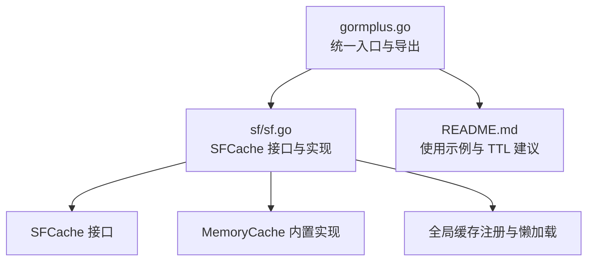
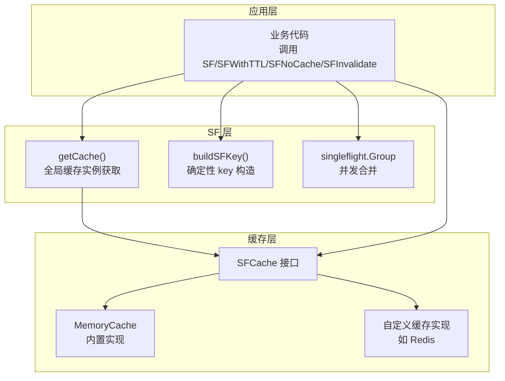
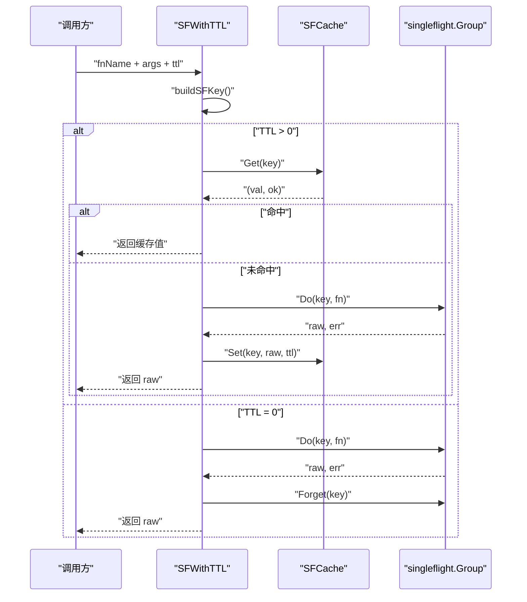
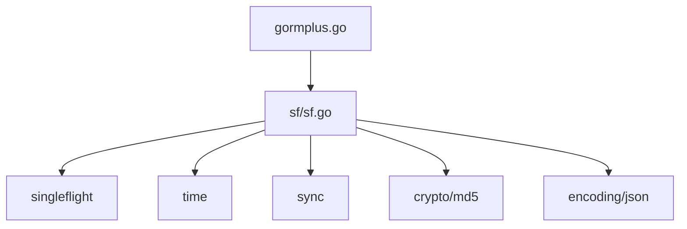

# 可插拔缓存接口

<cite>
**本文引用的文件**
- [gormplus.go](file://gormplus.go)
- [sf.go](file://sf/sf.go)
- [README.md](file://README.md)
</cite>

## 目录
1. [简介](#简介)
2. [项目结构](#项目结构)
3. [核心组件](#核心组件)
4. [架构总览](#架构总览)
5. [详细组件分析](#详细组件分析)
6. [依赖分析](#依赖分析)
7. [性能考虑](#性能考虑)
8. [故障排查指南](#故障排查指南)
9. [结论](#结论)
10. [附录](#附录)

## 简介
本文件围绕“可插拔缓存接口”进行系统化技术文档整理，重点阐述 SFCache 接口的设计理念、核心方法（Get/Set/Del）的实现要求与约束、内存缓存与 Redis 缓存的实现示例、缓存注册机制与全局缓存实例管理、最佳实践与性能优化建议，以及错误处理与异常场景的应对策略。读者可据此在项目中无缝接入自定义缓存后端，并获得与默认内存缓存一致的使用体验。

## 项目结构
- 顶层入口导出统一模块，其中包含 SF（SingleFlight + 可插拔缓存）能力的对外 API。
- 缓存接口与实现位于 sf 包，提供 SFCache 接口、内存缓存实现、全局缓存注册与生命周期管理。
- README 提供了内存缓存与 Redis 缓存的使用示例与 TTL 建议。

图表来源
- [gormplus.go:348-473](file://gormplus.go#L348-L473)
- [sf.go:49-131](file://sf/sf.go#L49-L131)
- [README.md:567-641](file://README.md#L567-L641)

章节来源
- [gormplus.go:348-473](file://gormplus.go#L348-L473)
- [sf.go:49-131](file://sf/sf.go#L49-L131)
- [README.md:567-641](file://README.md#L567-L641)

## 核心组件
- SFCache 接口：定义可插拔缓存的统一能力，包括 Get、Set、Del 三个方法。
- MemoryCache：内置内存缓存实现，提供过期清理与并发安全。
- 全局缓存注册：通过 RegisterCache 注册自定义缓存，getCache 懒初始化默认内存缓存。
- SF 系列函数：SF、SFWithTTL、SFNoCache、SFInvalidate，统一使用全局缓存实例。

章节来源
- [sf.go:88-92](file://sf/sf.go#L88-L92)
- [sf.go:141-182](file://sf/sf.go#L141-L182)
- [sf.go:116-131](file://sf/sf.go#L116-L131)
- [sf.go:252-349](file://sf/sf.go#L252-L349)

## 架构总览
SFCache 作为可插拔缓存抽象，被 SF 查询封装统一消费。默认通过懒加载使用内置内存缓存，也可在应用启动阶段注册自定义缓存（如 Redis）以替换默认实现。写操作后可通过 SFInvalidate 主动失效缓存，保证一致性。

图表来源
- [sf.go:116-131](file://sf/sf.go#L116-L131)
- [sf.go:355-367](file://sf/sf.go#L355-L367)
- [sf.go:233](file://sf/sf.go#L233)
- [sf.go:88-92](file://sf/sf.go#L88-L92)
- [sf.go:141-182](file://sf/sf.go#L141-L182)

## 详细组件分析

### SFCache 接口与约束
- 设计目标：为 SF 查询提供统一的缓存抽象，支持替换为任意后端（内存、Redis、Memcached 等）。
- 核心方法：
  - Get(key string) (any, bool)：命中返回值与 true；未命中或已过期返回 nil 与 false。
  - Set(key string, val any, ttl time.Duration)：写入缓存并在 ttl 到期后自动过期。
  - Del(key string)：主动删除指定 key，供 SFInvalidate 使用。
- 约束与语义：
  - Get 返回值类型应与查询结果类型一致，以便 SFWithTTL 类型断言成功。
  - Set 的 ttl 语义为“绝对过期时间”，到期即视为失效。
  - Del 仅用于主动失效，不保证幂等性（重复删除不报错）。

章节来源
- [sf.go:51-57](file://sf/sf.go#L51-L57)
- [sf.go:88-92](file://sf/sf.go#L88-L92)

### 内置内存缓存 MemoryCache
- 数据结构：基于 sync.Map 存储键值与过期时间，定期扫描清理过期项。
- 生命周期：
  - 启动：创建后台 goroutine，每 30 秒扫描一次。
  - 停止：StopSFCache 调用后取消上下文，停止清理循环。
- 并发安全：Get/Set/Del 均为并发安全；清理过程通过 Range 遍历并删除过期项。
- 适用场景：单机、开发测试、本地验证；多实例部署需使用分布式缓存。

章节来源
- [sf.go:141-182](file://sf/sf.go#L141-L182)
- [sf.go:189-206](file://sf/sf.go#L189-L206)
- [sf.go:217-225](file://sf/sf.go#L217-L225)

### 全局缓存注册与懒加载
- 注册入口：RegisterCache(c SFCache) 仅在首次调用 SF 之前注册有效，否则默认内存缓存已懒初始化。
- 获取策略：getCache() 读锁快速路径判断；若为空则写锁懒初始化内存缓存。
- 退出清理：StopSFCache 仅对内置内存缓存生效；自定义缓存（如 Redis）由用户自行管理生命周期。

章节来源
- [sf.go:101-114](file://sf/sf.go#L101-L114)
- [sf.go:116-131](file://sf/sf.go#L116-L131)
- [sf.go:217-225](file://sf/sf.go#L217-L225)

### SF 查询封装与缓存交互
- SF/SFWithTTL/SFNoCache：统一通过 buildSFKey 生成确定性 key，结合 singleflight 合并并发请求。
- 缓存路径：
  - TTL>0：先查缓存命中直接返回；否则进入 singleflight。
  - TTL=0：仅合并并发，不写入缓存，执行后立即 Forget。
- 类型断言：SFWithTTL 对返回值进行类型断言，失败时返回错误。

图表来源
- [sf.go:252-349](file://sf/sf.go#L252-L349)
- [sf.go:317-334](file://sf/sf.go#L317-L334)
- [sf.go:233](file://sf/sf.go#L233)

章节来源
- [sf.go:252-349](file://sf/sf.go#L252-L349)

### 缓存 key 构建与确定性
- buildSFKey(fnName string, args map[string]any) string：
  - args 为空：返回固定后缀。
  - args 非空：按键名字母序排序后序列化为 JSON，再计算 MD5，最终格式为 “sf:{fnName}:{md5}”。
- 作用：保证相同 fnName 与等价 args（顺序无关）生成相同 key，避免重复计算与缓存穿透。

章节来源
- [sf.go:355-367](file://sf/sf.go#L355-L367)
- [sf.go:370-394](file://sf/sf.go#L370-L394)

### 主动失效 SFInvalidate
- 通过 buildSFKey 生成相同 key，调用缓存 Del 删除对应缓存项。
- 使用场景：写操作后主动失效，避免脏读。

章节来源
- [sf.go:288-291](file://sf/sf.go#L288-L291)

### 内存缓存与 Redis 缓存实现示例
- 内存缓存（默认）：无需配置，直接使用；退出时调用 StopSFCache。
- Redis 缓存：实现 SFCache 接口，注册后所有 SF 调用均使用 Redis；无需 StopSFCache。

章节来源
- [README.md:595-624](file://README.md#L595-L624)
- [gormplus.go:395-398](file://gormplus.go#L395-L398)

## 依赖分析
- 外部依赖：
  - golang.org/x/sync/singleflight：提供并发合并与 panic 安全。
  - crypto/md5、encoding/json：用于 key 构造与序列化。
  - time、sync：用于过期扫描与并发控制。
- 内部依赖：
  - gormplus.go 作为统一入口，导出 SF 系列函数与 RegisterCache/NewMemoryCache 等。
  - sf.go 提供 SFCache 接口、MemoryCache、全局注册与 SF 查询封装。

图表来源
- [sf.go:3-15](file://sf/sf.go#L3-L15)
- [gormplus.go:88-101](file://gormplus.go#L88-L101)

章节来源
- [sf.go:3-15](file://sf/sf.go#L3-L15)
- [gormplus.go:88-101](file://gormplus.go#L88-L101)

## 性能考虑
- 缓存命中路径：TTL>0 时先查缓存，命中直接返回，避免 DB 访问。
- 并发合并：singleflight 将同一瞬间的并发请求合并为一次真实查询，显著降低抖动与压力。
- 内存缓存清理：后台 goroutine 每 30 秒扫描一次，成本低；Redis 等分布式缓存由后端自动过期。
- TTL 选择建议：
  - 列表/统计：3s~30s
  - 配置/字典：1min~5min
  - 详情/实时数据：0（SFNoCache）

章节来源
- [sf.go:252-349](file://sf/sf.go#L252-L349)
- [README.md:633-639](file://README.md#L633-L639)

## 故障排查指南
- 注册时机问题：
  - 必须在首次调用 SF 之前注册缓存，否则默认内存缓存已懒初始化，注册无效。
- 类型断言失败：
  - SFWithTTL 对返回值进行类型断言，失败时返回错误；检查 fn 返回类型与期望类型一致。
- 缓存未生效：
  - 确认 args 与查询时传入完全一致（key/value 相同，顺序无关）。
  - 检查 TTL 是否为 0（SFNoCache 模式不写缓存）。
- Redis 缓存异常：
  - 确认实现 Get/Set/Del 的序列化/反序列化逻辑一致。
  - 检查 key 前缀与过期时间设置是否合理。

章节来源
- [sf.go:101-114](file://sf/sf.go#L101-L114)
- [sf.go:342-347](file://sf/sf.go#L342-L347)
- [sf.go:288-291](file://sf/sf.go#L288-L291)
- [README.md:595-624](file://README.md#L595-L624)

## 结论
SFCache 接口提供了统一、可替换的缓存抽象，结合 SF 查询封装实现了“并发合并 + 缓存”的双重保护。默认内存缓存满足单机与开发场景，Redis 等分布式缓存适用于多实例部署。通过合理的 TTL 与失效策略，可在性能与一致性之间取得平衡。遵循注册时机、类型断言与 key 构造规则，可获得稳定可靠的缓存体验。

## 附录

### 接口规范与约束清单
- Get(key)：命中返回值与 true；未命中或过期返回 nil 与 false。
- Set(key, val, ttl)：写入缓存并在 ttl 到期后过期。
- Del(key)：主动删除指定 key。
- key 构造：fnName + args（字母序排序 + JSON 序列化 + MD5）。
- 注册时机：首次调用 SF 之前。
- TTL 语义：绝对过期时间。

章节来源
- [sf.go:51-57](file://sf/sf.go#L51-L57)
- [sf.go:355-367](file://sf/sf.go#L355-L367)
- [sf.go:101-114](file://sf/sf.go#L101-L114)