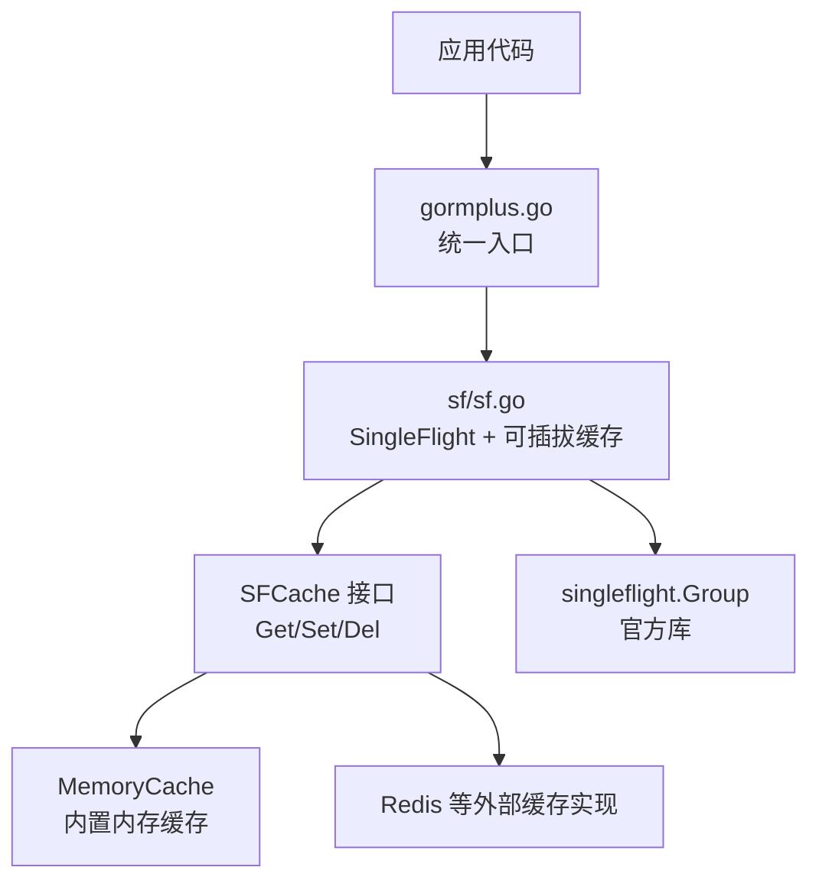
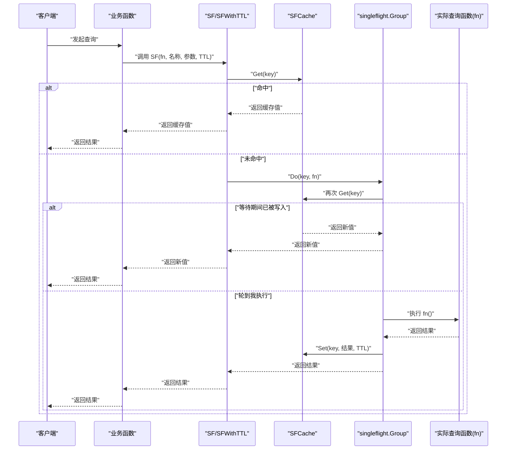
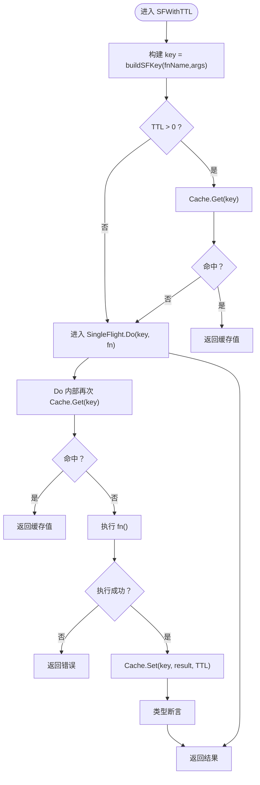
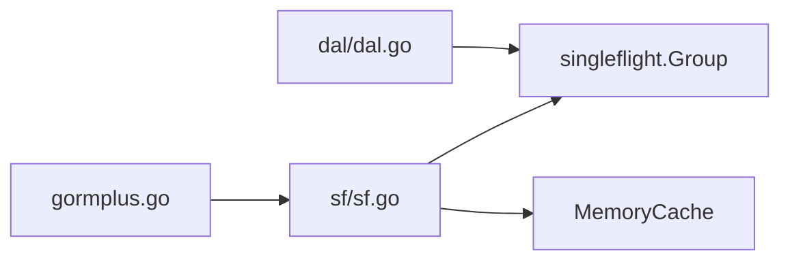

# 缓存系统 (SF)

<cite>
**本文引用的文件**
- [sf.go](file://sf/sf.go)
- [gormplus.go](file://gormplus.go)
- [README.md](file://README.md)
- [dal.go](file://dal/dal.go)
- [dal_test.go](file://dal/dal_test.go)
- [version.go](file://version.go)
</cite>

## 目录
1. [简介](#简介)
2. [项目结构](#项目结构)
3. [核心组件](#核心组件)
4. [架构总览](#架构总览)
5. [详细组件分析](#详细组件分析)
6. [依赖分析](#依赖分析)
7. [性能考虑](#性能考虑)
8. [故障排查指南](#故障排查指南)
9. [结论](#结论)
10. [附录](#附录)

## 简介
本项目提供基于 SingleFlight 的可插拔缓存系统（简称 SF），用于防止缓存击穿与热点查询抖动，支持内存缓存与 Redis 等外部缓存的无缝替换。SF 通过统一的接口抽象，将“并发合并 + 缓存”能力暴露为一组易用的 API，并提供 TTL 控制、主动失效、键生成规则与序列化策略等完整能力，适用于单机与多实例部署场景。

## 项目结构
- 核心模块位于 sf/sf.go，提供缓存接口、内存缓存实现、全局缓存注册、SingleFlight 并发合并与查询封装。
- 统一入口 gormplus.go 将 SF 能力导出为 gormplus 包的公开 API，并提供默认 TTL、注册缓存、停止清理等便捷函数。
- README.md 提供安装、初始化、使用示例与 TTL 建议。
- dal/dal.go 展示了另一个使用 SingleFlight 的缓存场景（SQL 文件加载器），体现 SF 在复杂系统中的复用模式。
- 版本信息位于 version.go。

图表来源
- [sf.go:1-395](file://sf/sf.go#L1-L395)
- [gormplus.go:348-473](file://gormplus.go#L348-L473)

章节来源
- [sf.go:1-395](file://sf/sf.go#L1-L395)
- [gormplus.go:348-473](file://gormplus.go#L348-L473)
- [README.md:567-641](file://README.md#L567-L641)

## 核心组件
- SFCache 接口：定义 Get/Set/Del 三元缓存能力，支持任意实现（默认内存缓存，可替换为 Redis 等）。
- MemoryCache：内置内存缓存实现，带后台过期清理 goroutine。
- RegisterCache：全局注册自定义缓存实现，替换默认内存缓存。
- SF/SFWithTTL/SFNoCache/SFInvalidate：四类查询封装，分别覆盖“带缓存”“带缓存（TTL 显式）”“纯合并（不缓存）”“主动失效”四种典型场景。
- buildSFKey/marshalSorted：确定性键生成与参数序列化，保证 args 顺序无关、哈希稳定。
- singleflight.Group：官方库，提供 panic 安全、Forget、DoChan 等能力，避免死锁与资源泄漏。

章节来源
- [sf.go:51-92](file://sf/sf.go#L51-L92)
- [sf.go:135-225](file://sf/sf.go#L135-L225)
- [sf.go:116-131](file://sf/sf.go#L116-L131)
- [sf.go:237-349](file://sf/sf.go#L237-L349)
- [sf.go:351-394](file://sf/sf.go#L351-L394)
- [sf.go:227-233](file://sf/sf.go#L227-L233)

## 架构总览
SF 的核心思想是“先查缓存，再合并并发”，并在缓存命中时直接返回，未命中时通过 SingleFlight 合并同一 key 的并发请求，避免击穿。

图表来源
- [sf.go:293-349](file://sf/sf.go#L293-L349)

## 详细组件分析

### 1) 缓存接口与可插拔设计
- SFCache 接口：Get/Set/Del 三元能力，约定 key 存在且未过期返回 (value, true)，否则返回 (nil, false)；Set 支持 TTL；Del 用于主动失效。
- 默认实现：MemoryCache，基于 sync.Map 存储，带后台 goroutine 每 30 秒扫描过期键并删除。
- 全局注册：RegisterCache 替换默认缓存，需在首次调用 SF 之前完成注册，否则懒初始化的内存缓存不会被替换。
- 停止清理：StopSFCache 仅对内置内存缓存有效，自定义缓存（如 Redis）由用户自行管理生命周期。

章节来源
- [sf.go:51-92](file://sf/sf.go#L51-L92)
- [sf.go:135-225](file://sf/sf.go#L135-L225)
- [sf.go:116-131](file://sf/sf.go#L116-L131)
- [sf.go:208-225](file://sf/sf.go#L208-L225)

### 2) 键生成与序列化
- buildSFKey：将 fnName 与 args 组合为确定性 key。若 args 为空，使用固定后缀；否则将 args 按 key 字母序排序后 JSON 序列化，再计算 MD5，最终格式为 “sf:{fnName}:{md5}”。
- marshalSorted：对 map 的 key 进行排序，逐项 JSON 序列化，保证 args 顺序无关、哈希稳定，避免因参数顺序不同导致的 key 冲突。
- 作用：确保相同查询参数组合生成相同 key，提升缓存命中率；同时避免因参数顺序变化导致的重复缓存项。

章节来源
- [sf.go:351-394](file://sf/sf.go#L351-L394)

### 3) 查询封装与并发控制
- SF/SFWithTTL：带缓存的查询封装。SF 默认 TTL 为 5 分钟；SFWithTTL 允许显式传入 TTL。
- SFNoCache：纯合并查询，不缓存结果，适合对实时性要求极高的场景（如余额、详情）。
- SFInvalidate：主动失效指定查询的缓存，常用于写操作后刷新缓存，避免脏读。
- 执行流程：
  1) 用 fnName + args 构建 key；
  2) 若 TTL>0 且命中缓存，直接返回；
  3) 进入 SingleFlight.Do，同一 key 只有一个 goroutine 真正执行；
  4) Do 内部再次查缓存（防止等待期间其他 goroutine 已写入）；
  5) 执行 fn()，成功且 TTL>0 时写入缓存；
  6) TTL=0 时调用 Forget，确保下次请求重新执行而不被合并；
  7) 类型断言后返回结果，失败时返回错误。

图表来源
- [sf.go:293-349](file://sf/sf.go#L293-L349)

章节来源
- [sf.go:237-349](file://sf/sf.go#L237-L349)

### 4) 内置内存缓存实现
- 基于 sync.Map 存储缓存项，每 30 秒扫描一次过期键并删除。
- Stop 停止后台清理 goroutine，应在应用退出时调用。
- 优点：零配置、易用、适合单机与测试环境；缺点：多实例部署时无法共享缓存。

章节来源
- [sf.go:135-225](file://sf/sf.go#L135-L225)

### 5) 统一入口与 TTL 建议
- gormplus 包导出 SF/SFWithTTL/SFNoCache/SFInvalidate/StopSFCache/RegisterCache 等 API，便于业务直接使用。
- 默认 TTL：5 分钟；TTL 建议：
  - 列表/统计（允许短暂延迟）：3s ~ 30s
  - 配置/字典（几乎不变）：1min ~ 5min
  - 详情/用户实时数据：0（SFNoCache）

章节来源
- [gormplus.go:348-473](file://gormplus.go#L348-L473)
- [README.md:633-639](file://README.md#L633-L639)

### 6) 与 DAL 的对比与参考
- dal 模块展示了另一种使用 SingleFlight 的场景：SQL 文件加载器的缓存与防击穿，同样采用 Do + 缓存快速路径 + 合并并发的模式。
- 对比意义：SF 更关注“查询结果”的缓存与合并，DAL 更关注“SQL 文本”的缓存与加载。

章节来源
- [dal.go:150-174](file://dal/dal.go#L150-L174)

## 依赖分析
- 外部依赖：golang.org/x/sync/singleflight（官方库，提供 Do/Forget/DoChan/Panic 安全等能力）。
- 内部依赖：gormplus 包对 sf 包的导出与封装；sf 包内部依赖 singleflight 与标准库（sync、time、crypto/md5、encoding/json 等）。
- 耦合度：低耦合。SFCache 接口解耦了缓存实现与业务调用；RegisterCache 提供运行时替换能力。

图表来源
- [sf.go:1-395](file://sf/sf.go#L1-L395)
- [gormplus.go:348-473](file://gormplus.go#L348-L473)
- [dal.go:150-174](file://dal/dal.go#L150-L174)

章节来源
- [sf.go:1-395](file://sf/sf.go#L1-L395)
- [gormplus.go:348-473](file://gormplus.go#L348-L473)
- [dal.go:150-174](file://dal/dal.go#L150-L174)

## 性能考虑
- 缓存命中率优化
  - 参数顺序无关：buildSFKey 已对 args 进行字母序排序与 JSON 序列化，避免因参数顺序不同导致的 key 冲突。
  - TTL 合理设置：根据业务场景选择合适 TTL，减少缓存抖动与过期风暴。
  - 主动失效：写操作后及时调用 SFInvalidate，降低缓存污染概率。
- 并发合并
  - SingleFlight 保证同一 key 的并发请求只执行一次，显著降低 DB 压力。
  - TTL=0 时调用 Forget，避免缓存合并导致的长期合并效应。
- 内存缓存清理
  - 内置内存缓存每 30 秒扫描一次过期键，防止内存无限增长；生产环境可根据负载调整清理频率或改用外部缓存。
- 外部缓存（Redis）
  - 多实例部署推荐使用 Redis 等外部缓存，实现缓存共享与高可用。
  - 建议为 key 添加前缀，避免与其他业务 key 冲突；序列化采用 JSON，注意字段类型与空值处理。

章节来源
- [sf.go:351-394](file://sf/sf.go#L351-L394)
- [sf.go:293-349](file://sf/sf.go#L293-L349)
- [sf.go:189-206](file://sf/sf.go#L189-L206)
- [README.md:595-624](file://README.md#L595-L624)

## 故障排查指南
- 问题：注册缓存后未生效
  - 原因：在首次调用 SF 之后再注册，懒初始化的内存缓存不会被替换。
  - 处理：确保在第一次调用 SF 之前调用 RegisterCache。
- 问题：内存缓存未清理导致内存增长
  - 原因：未调用 StopSFCache 或未启用后台清理。
  - 处理：应用退出时调用 StopSFCache；或在生产环境使用外部缓存（如 Redis）。
- 问题：缓存命中异常或频繁穿透
  - 原因：参数顺序不同导致 key 不同；TTL 设置过短或过长。
  - 处理：确认参数顺序无关（buildSFKey 已处理）；调整 TTL；必要时使用 SFNoCache。
- 问题：写操作后读到旧数据
  - 原因：未调用 SFInvalidate。
  - 处理：在写操作后调用 SFInvalidate，确保 args 与查询时一致。
- 问题：类型断言失败
  - 原因：缓存中的值类型与期望类型不一致。
  - 处理：检查缓存值的序列化与反序列化过程，确保类型一致。

章节来源
- [sf.go:116-131](file://sf/sf.go#L116-L131)
- [sf.go:208-225](file://sf/sf.go#L208-L225)
- [sf.go:341-349](file://sf/sf.go#L341-L349)

## 结论
SF 通过“缓存快速路径 + SingleFlight 并发合并”的设计，在保证高并发稳定性的同时，提供了灵活的可插拔缓存能力。其键生成与序列化策略确保了缓存命中率与一致性；TTL 与主动失效策略满足不同业务场景的需求。结合统一入口 gormplus，业务可零成本接入缓存能力，并在多实例部署中通过外部缓存实现共享与高可用。

## 附录

### A. 配置与使用示例（概览）
- 内存缓存（默认）
  - 直接使用 SF/SFWithTTL/SFNoCache/SFInvalidate；
  - 应用退出时调用 StopSFCache。
- Redis 缓存（多实例部署）
  - 实现 SFCache 接口并调用 RegisterCache；
  - 业务代码无需改动，行为一致。

章节来源
- [README.md:567-641](file://README.md#L567-L641)
- [gormplus.go:385-473](file://gormplus.go#L385-L473)

### B. 版本信息
- 当前版本：v1.0.13

章节来源
- [version.go:1-4](file://version.go#L1-L4)