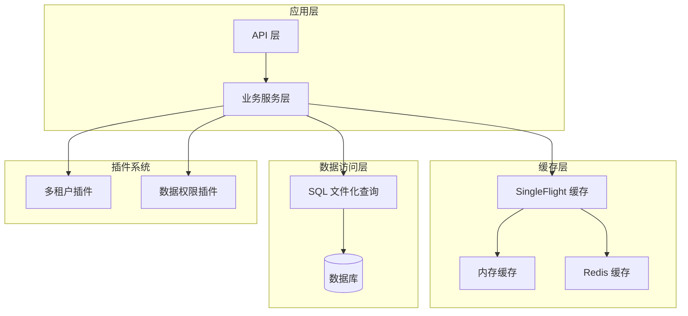
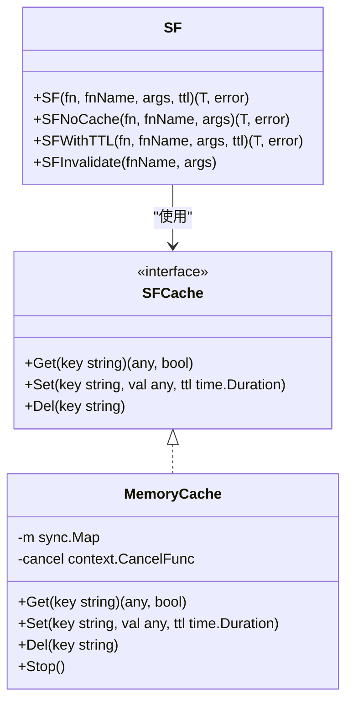
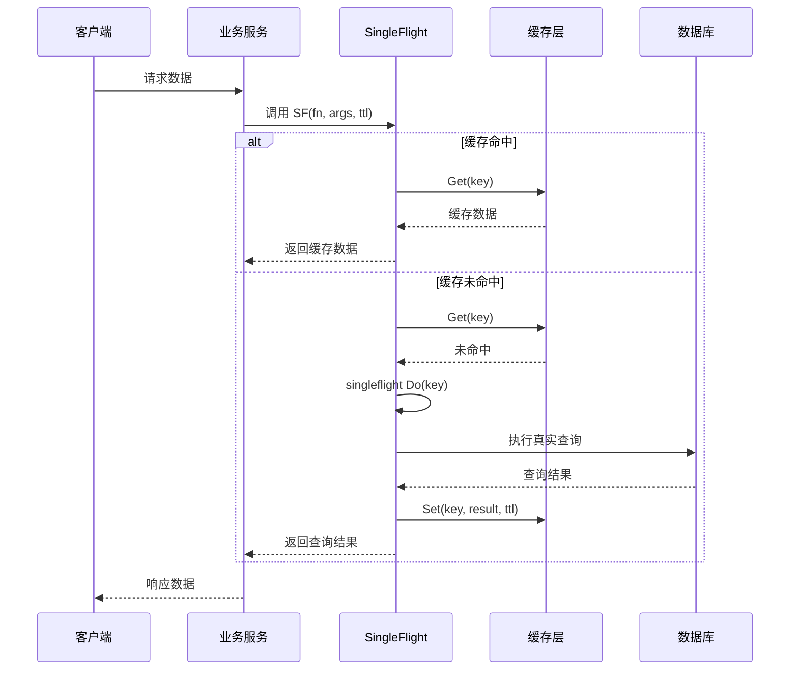
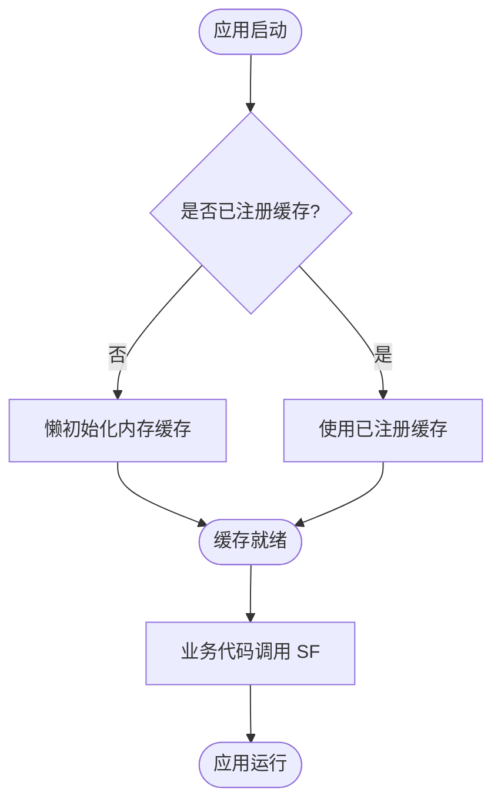
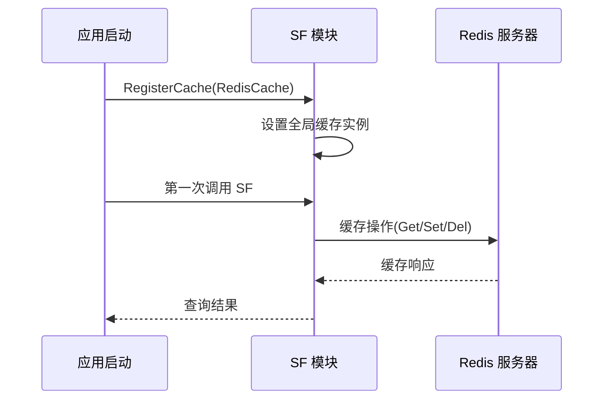
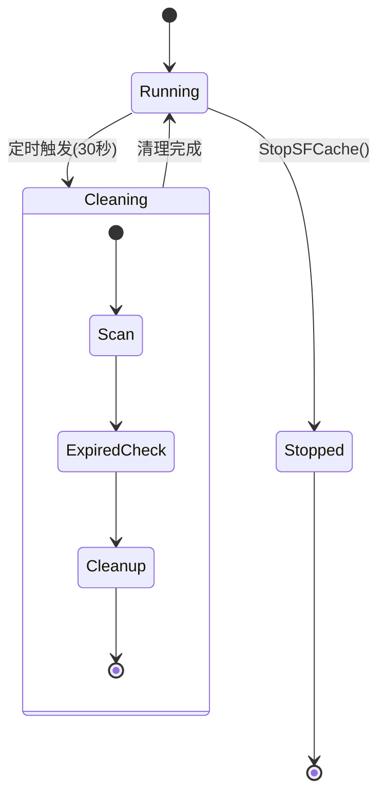
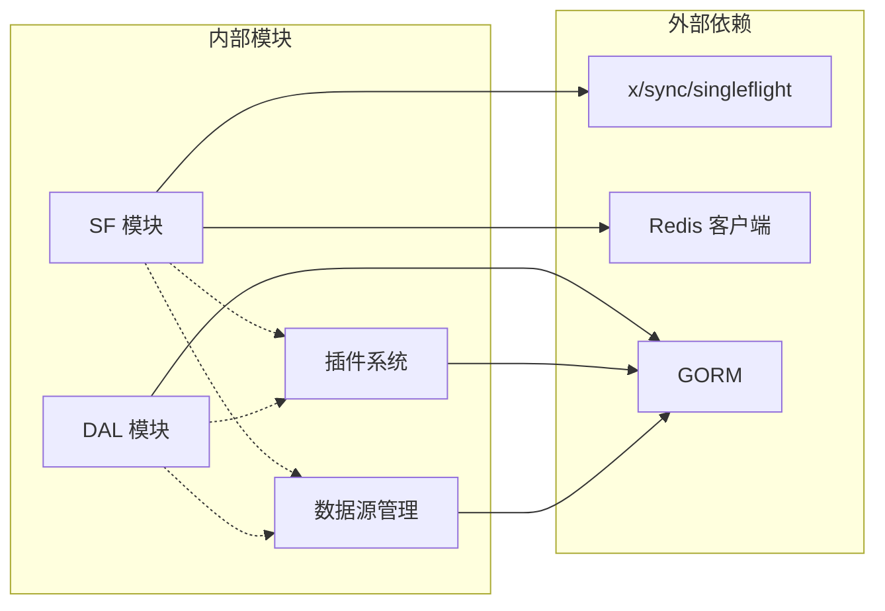

# 缓存配置和管理

<cite>
**本文档引用的文件**
- [README.md](file://README.md)
- [gormplus.go](file://gormplus.go)
- [sf/sf.go](file://sf/sf.go)
- [dal/dal.go](file://dal/dal.go)
- [plugin/tenant.go](file://plugin/tenant.go)
- [plugin/dataPermission.go](file://plugin/dataPermission.go)
- [datasource/manager.go](file://datasource/manager.go)
- [query/slow_query.go](file://query/slow_query.go)
</cite>

## 目录
1. [简介](#简介)
2. [项目结构](#项目结构)
3. [核心组件](#核心组件)
4. [架构概览](#架构概览)
5. [详细组件分析](#详细组件分析)
6. [依赖关系分析](#依赖关系分析)
7. [性能考虑](#性能考虑)
8. [故障排查指南](#故障排查指南)
9. [结论](#结论)

## 简介

本文档为基于 gorm-plus 的缓存配置和管理实用指南，涵盖缓存 TTL 时间选择策略、不同场景的最佳实践、缓存注册和初始化流程、生命周期管理和优雅关闭机制、监控和性能指标收集方法，以及分布式环境下的缓存一致性保证。

## 项目结构

该项目采用模块化设计，缓存相关功能主要集中在以下模块：
- SF（SingleFlight + 可插拔缓存）：提供缓存接口、内存缓存实现、Redis 缓存集成
- DAL（数据访问层）：SQL 文件化查询，支持缓存和单飞机制
- 插件系统：多租户、数据权限等插件与缓存的协同工作
- 数据源管理：多数据源支持，读写分离与缓存的结合



**图表来源**
- [gormplus.go:348-473](file://gormplus.go#L348-L473)
- [sf/sf.go:1-131](file://sf/sf.go#L1-L131)
- [dal/dal.go:1-100](file://dal/dal.go#L1-L100)

**章节来源**
- [README.md:1-80](file://README.md#L1-L80)
- [gormplus.go:1-100](file://gormplus.go#L1-L100)

## 核心组件

### SingleFlight + 可插拔缓存（SF）

SF 模块提供了三层查询保护机制：
1. **纯 SingleFlight**：SFNoCache，合并同一瞬间的并发请求
2. **SingleFlight + 缓存**：SF/SFWithTTL，在缓存基础上增加合并机制
3. **主动失效**：SFInvalidate，写操作后主动清除缓存



**图表来源**
- [sf/sf.go:49-131](file://sf/sf.go#L49-L131)
- [sf/sf.go:133-206](file://sf/sf.go#L133-L206)
- [sf/sf.go:235-350](file://sf/sf.go#L235-L350)

**章节来源**
- [sf/sf.go:1-395](file://sf/sf.go#L1-L395)
- [gormplus.go:348-473](file://gormplus.go#L348-L473)

### 缓存接口和实现

缓存系统采用可插拔设计，支持多种缓存后端：

| 缓存类型 | 实现方式 | 适用场景 | 优点 | 缺点 |
|---------|----------|----------|------|------|
| 内存缓存 | 默认实现，基于 sync.Map | 单机、开发测试 | 零配置、低延迟 | 进程内缓存、重启丢失 |
| Redis 缓存 | 自定义实现，支持前缀 | 多实例部署、缓存共享 | 分布式共享、持久化 | 需要 Redis 依赖 |

**章节来源**
- [sf/sf.go:51-92](file://sf/sf.go#L51-L92)
- [sf/sf.go:133-206](file://sf/sf.go#L133-L206)

## 架构概览

缓存架构采用分层设计，确保高性能和可靠性：



**图表来源**
- [sf/sf.go:293-350](file://sf/sf.go#L293-L350)

## 详细组件分析

### 缓存 TTL 选择策略

根据不同场景选择合适的缓存时长：

| 场景类型 | 推荐 TTL | 选择理由 | 实现方式 |
|---------|----------|----------|----------|
| 列表/统计查询 | 3s ~ 30s | 允许短暂延迟，提高缓存命中率 | SF(fn, args, 30s) |
| 配置/字典数据 | 1min ~ 5min | 基本不变，降低数据库压力 | SF(fn, args, 5min) |
| 详情/实时数据 | 0 或 SFNoCache | 对实时性要求高，不允许缓存 | SFNoCache(fn, args) |

**章节来源**
- [README.md:633-640](file://README.md#L633-L640)

### 缓存注册和初始化流程

#### 内存缓存（默认）



**图表来源**
- [sf/sf.go:116-131](file://sf/sf.go#L116-L131)

#### Redis 缓存注册



**图表来源**
- [sf/sf.go:101-114](file://sf/sf.go#L101-L114)
- [README.md:595-624](file://README.md#L595-L624)

**章节来源**
- [sf/sf.go:94-131](file://sf/sf.go#L94-L131)
- [README.md:567-642](file://README.md#L567-L642)

### 缓存生命周期管理

#### 内存缓存清理



**图表来源**
- [sf/sf.go:189-206](file://sf/sf.go#L189-L206)

#### 优雅关闭机制

应用退出时需要正确关闭缓存资源：

**章节来源**
- [sf/sf.go:184-225](file://sf/sf.go#L184-L225)
- [gormplus.go:462-473](file://gormplus.go#L462-L473)

### 不同场景的缓存最佳实践

#### 列表查询缓存

```go
// 列表查询使用短 TTL 缓存
list, err := gormplus.SF(func() ([]*model.Account, error) {
    var result []*model.Account
    err := gormplus.Query[*model.Account](db, ctx).
        WhereIf(status != 0, "status = ?", status).
        Build().Find(&result)
    return result, err
}, "Account.List", map[string]any{"status": status, "page": pageNum}, 30*time.Second)
```

#### 详情查询缓存

```go
// 详情查询使用 SFNoCache 避免缓存陈旧数据
account, err := gormplus.SFNoCache(func() (*model.Account, error) {
    var a model.Account
    err := db.WithContext(ctx).Where("id = ?", id).First(&a).Error
    return &a, err
}, "Account.Detail", map[string]any{"id": id})
```

#### 配置数据缓存

```go
// 配置数据使用较长 TTL
config, err := gormplus.SF(func() (*Config, error) {
    var cfg Config
    err := db.WithContext(ctx).Where("key = ?", key).First(&cfg).Error
    return &cfg, err
}, "SysConfig.Get", map[string]any{"key": key}, 5*time.Minute)
```

**章节来源**
- [README.md:571-593](file://README.md#L571-L593)

### 分布式环境下的缓存一致性

在分布式环境中，缓存一致性通过以下机制保证：

1. **写操作后主动失效**
```go
// 写操作后主动失效相关缓存
func (s *AccountService) Update(ctx context.Context, id int64) error {
    if err := repo.Update(ctx, id); err != nil { return err }
    gormplus.SFInvalidate("Account.List", map[string]any{"status": 1})
    return nil
}
```

2. **Redis 分布式锁**
```go
// Redis 缓存实现示例
type RedisSFCache struct {
    rdb    *redis.Client
    prefix string
}

func (c *RedisSFCache) Get(key string) (any, bool) {
    val, err := c.rdb.Get(context.Background(), c.prefix+key).Bytes()
    if err != nil { return nil, false }
    var result any
    if err := json.Unmarshal(val, &result); err != nil { return nil, false }
    return result, true
}

func (c *RedisSFCache) Set(key string, val any, ttl time.Duration) {
    b, _ := json.Marshal(val)
    c.rdb.Set(context.Background(), c.prefix+key, b, ttl)
}

func (c *RedisSFCache) Del(key string) {
    c.rdb.Del(context.Background(), c.prefix+key)
}
```

**章节来源**
- [sf/sf.go:275-291](file://sf/sf.go#L275-L291)
- [README.md:595-624](file://README.md#L595-L624)

## 依赖关系分析



**图表来源**
- [sf/sf.go:1-15](file://sf/sf.go#L1-L15)
- [dal/dal.go:71-83](file://dal/dal.go#L71-L83)

**章节来源**
- [sf/sf.go:1-15](file://sf/sf.go#L1-L15)
- [dal/dal.go:71-83](file://dal/dal.go#L71-L83)

## 性能考虑

### 缓存命中率优化

1. **合理的 TTL 设计**
   - 热点数据使用较短 TTL（3-30s）
   - 冷数据使用较长 TTL（1-5min）
   - 实时数据禁用缓存

2. **参数规范化**
   - args 参数按 key 排序后序列化
   - 避免不必要的参数变化

3. **内存使用控制**
   - 内存缓存默认每 30 秒清理过期项
   - Redis 缓存依赖服务器过期机制

### 性能监控指标

建议收集以下关键指标：
- 缓存命中率
- 平均响应时间
- 缓存淘汰次数
- 并发等待时间

**章节来源**
- [sf/sf.go:189-206](file://sf/sf.go#L189-L206)

## 故障排查指南

### 常见问题诊断

#### 缓存不生效

1. **检查缓存注册**
```go
// 确认缓存已正确注册
gormplus.RegisterCache(&RedisSFCache{rdb: rdb, prefix: "myapp:sf:"})
```

2. **验证 TTL 设置**
```go
// 检查 TTL 是否为 0（SFNoCache）
list, err := gormplus.SF(fn, "Query", args, 0) // 等同于 SFNoCache
```

#### 缓存一致性问题

1. **检查写操作后的失效**
```go
// 确保写操作后调用失效
gormplus.SFInvalidate("AffectedQuery", map[string]any{"param": value})
```

2. **验证参数一致性**
```go
// args 必须与查询时完全一致
gormplus.SFInvalidate("Query", map[string]any{"status": 1, "page": 1})
```

#### 性能问题排查

1. **监控慢查询**
```go
gormplus.RegisterSlowQuery(db, gormplus.SlowQueryConfig{
    Threshold: 200 * time.Millisecond,
    Logger: func(ctx context.Context, info gormplus.SlowQueryInfo) {
        log.Printf("[慢查询] cost=%v table=%s sql=%s", 
            info.Duration, info.Table, info.SQL)
    },
})
```

2. **检查缓存命中率**
```go
// 通过日志或监控系统观察缓存效果
```

**章节来源**
- [query/slow_query.go:1-235](file://query/slow_query.go#L1-L235)
- [sf/sf.go:275-291](file://sf/sf.go#L275-L291)

## 结论

gorm-plus 的缓存系统提供了灵活、高效的缓存解决方案。通过合理选择 TTL、正确配置缓存后端、实施主动失效策略，可以在保证数据一致性的同时显著提升系统性能。建议在生产环境中使用 Redis 作为缓存后端，并建立完善的监控和告警机制，确保缓存系统的稳定运行。

关键要点总结：
1. **TTL 选择**：根据数据实时性需求选择合适的缓存时长
2. **缓存后端**：单机使用内存缓存，分布式使用 Redis
3. **一致性保证**：写操作后主动失效相关缓存
4. **监控告警**：建立完整的性能监控和故障预警机制
5. **优雅关闭**：正确管理缓存资源的生命周期