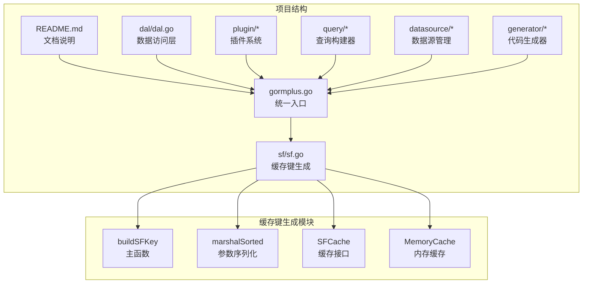
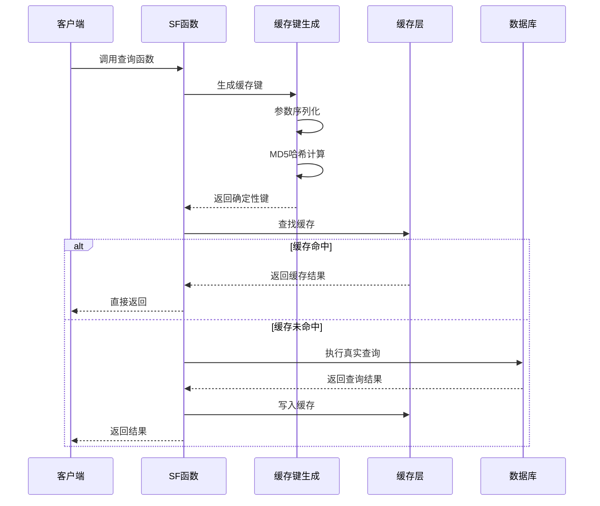
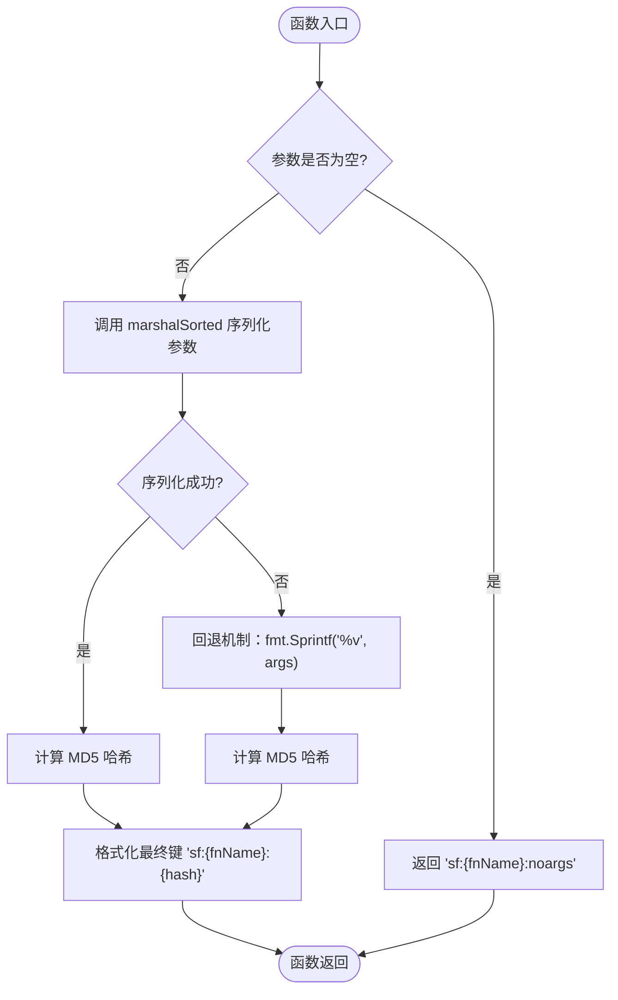
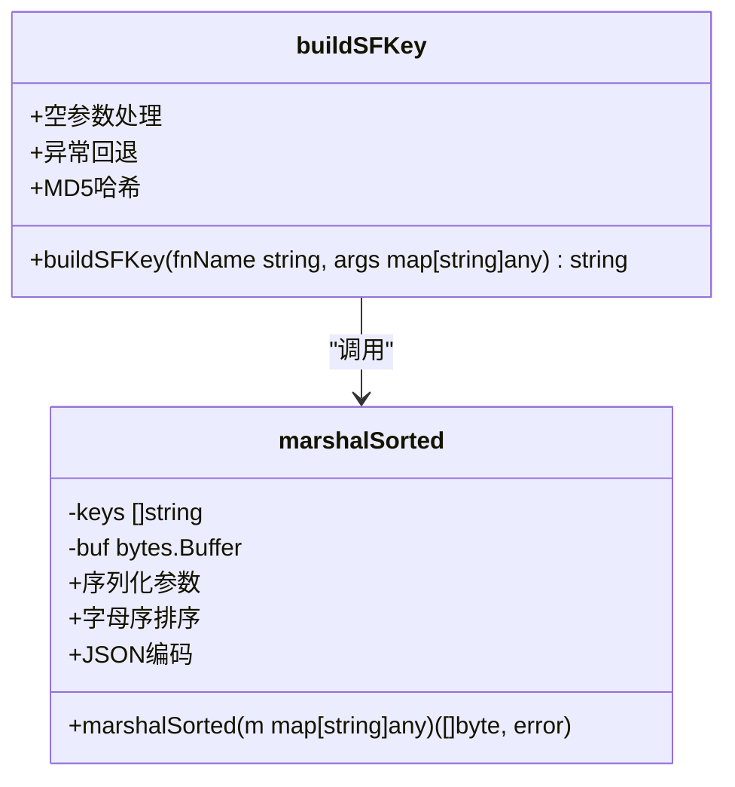
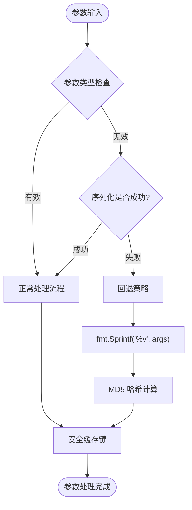
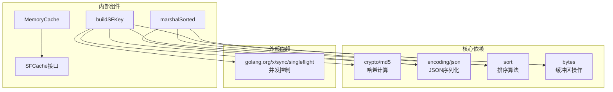
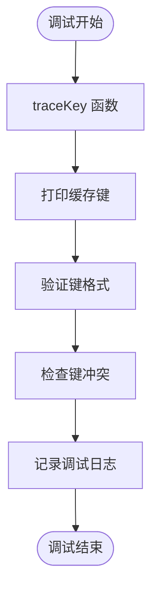

# 缓存键生成机制

<cite>
**本文档引用的文件**
- [sf.go](file://sf/sf.go)
- [gormplus.go](file://gormplus.go)
- [README.md](file://README.md)
</cite>

## 目录
1. [简介](#简介)
2. [项目结构](#项目结构)
3. [核心组件](#核心组件)
4. [架构概览](#架构概览)
5. [详细组件分析](#详细组件分析)
6. [依赖关系分析](#依赖关系分析)
7. [性能考虑](#性能考虑)
8. [故障排除指南](#故障排除指南)
9. [结论](#结论)

## 简介

本文档深入分析了 gorm-plus 项目中的缓存键生成机制，重点围绕 `buildSFKey` 函数的设计原理和算法实现。该机制采用确定性缓存键生成策略，通过函数名和参数序列化、字母序排序和 MD5 哈希计算，确保缓存键的一致性和可靠性。

缓存键生成机制是 SingleFlight + 可插拔缓存系统的核心组成部分，为防止缓存击穿提供了关键保障。该机制支持多种缓存场景，包括纯 SingleFlight 并发控制、带 TTL 的缓存查询，以及主动失效机制。

## 项目结构

gorm-plus 项目采用模块化设计，缓存键生成机制主要位于 `sf` 包中，通过统一入口 `gormplus` 提供给整个应用程序使用。

**图表来源**
- [sf.go:1-394](file://sf/sf.go#L1-L394)
- [gormplus.go:1-1305](file://gormplus.go#L1-L1305)

**章节来源**
- [sf.go:1-394](file://sf/sf.go#L1-L394)
- [gormplus.go:1-1305](file://gormplus.go#L1-L1305)

## 核心组件

### buildSFKey 函数

`buildSFKey` 是缓存键生成的核心函数，负责将函数名和参数转换为确定性的缓存键。该函数采用三层处理策略：

1. **空参数优化**：当参数为空时，直接返回 `sf:{fnName}:noargs` 格式的特殊键
2. **参数序列化**：使用 `marshalSorted` 函数对参数进行字母序排序和 JSON 序列化
3. **MD5 哈希**：对序列化后的参数进行 MD5 哈希计算
4. **异常处理**：当参数序列化失败时，使用回退机制生成哈希键

### marshalSorted 函数

`marshalSorted` 函数实现了参数序列化的核心逻辑，确保参数的确定性表示：

- **键排序**：提取所有键并按字母序排序
- **JSON 序列化**：对每个键和值进行 JSON 序列化
- **格式化输出**：生成标准化的 JSON 对象格式
- **错误处理**：序列化失败时返回错误

### SFCache 接口

SFCache 接口定义了可插拔缓存的标准行为：

- **Get**：获取缓存项，返回值和存在标志
- **Set**：设置缓存项，包含 TTL 参数
- **Del**：删除指定键的缓存项

**章节来源**
- [sf.go:353-394](file://sf/sf.go#L353-L394)

## 架构概览

缓存键生成机制在整个系统架构中扮演着关键角色，通过以下组件协同工作：

**图表来源**
- [sf.go:293-349](file://sf/sf.go#L293-L349)

### 缓存键格式规范

缓存键采用统一的格式规范，确保跨组件的一致性：

- **标准格式**：`sf:{fnName}:{md5(hash)}`
- **空参数格式**：`sf:{fnName}:noargs`
- **函数名要求**：建议使用 "表名.方法名" 的格式
- **参数要求**：map[string]any 类型，键自动排序

**章节来源**
- [sf.go:353-367](file://sf/sf.go#L353-L367)

## 详细组件分析

### buildSFKey 函数详解

**图表来源**
- [sf.go:355-366](file://sf/sf.go#L355-L366)

#### 算法复杂度分析

- **时间复杂度**：O(n log n)，其中 n 为参数数量
  - 键排序：O(n log n)
  - JSON 序列化：O(n)
  - MD5 哈希：O(n)
- **空间复杂度**：O(n)，用于存储排序后的键和序列化缓冲区

#### 参数序列化过程

序列化过程确保参数的确定性表示：

1. **键提取**：从 map 中提取所有键
2. **字母排序**：使用标准库排序算法
3. **JSON 序列化**：对每个键和值进行 JSON 编码
4. **格式化输出**：生成标准化的 JSON 对象

**章节来源**
- [sf.go:353-394](file://sf/sf.go#L353-L394)

### marshalSorted 函数实现

**图表来源**
- [sf.go:369-394](file://sf/sf.go#L369-L394)

#### 错误处理机制

函数实现了完善的错误处理策略：

- **序列化错误**：当参数无法 JSON 序列化时，使用回退机制
- **类型安全**：确保返回值的类型一致性
- **边界情况**：处理空参数和异常参数的特殊情况

**章节来源**
- [sf.go:369-394](file://sf/sf.go#L369-L394)

### 缓存键冲突预防策略

缓存键冲突是分布式系统中的关键问题，该机制通过以下策略预防冲突：

#### 确定性保证

1. **字母序排序**：确保参数键的固定顺序
2. **标准化序列化**：使用 JSON 格式确保序列化一致性
3. **MD5 哈希**：提供固定长度的唯一标识符

#### 最佳实践建议

1. **函数命名规范**：使用 "表名.方法名" 格式
2. **参数一致性**：确保相同查询使用相同的参数顺序
3. **类型稳定性**：避免参数类型的频繁变化
4. **特殊字符处理**：注意参数中特殊字符的处理

**章节来源**
- [sf.go:353-367](file://sf/sf.go#L353-L367)

### 异常参数处理机制

系统提供了完善的异常参数处理机制：

**图表来源**
- [sf.go:359-366](file://sf/sf.go#L359-L366)

#### 空参数处理

空参数场景通过专门的处理逻辑优化：

- **性能优化**：避免不必要的序列化和哈希计算
- **格式统一**：使用 `noargs` 标识符保持格式一致性
- **兼容性保证**：确保空参数查询与其他查询的兼容性

**章节来源**
- [sf.go:356-358](file://sf/sf.go#L356-L358)

## 依赖关系分析

缓存键生成机制的依赖关系相对简洁，主要依赖于标准库和第三方库：

**图表来源**
- [sf.go:3-15](file://sf/sf.go#L3-L15)

### 外部依赖分析

- **crypto/md5**：提供 MD5 哈希计算功能
- **encoding/json**：处理参数的 JSON 序列化
- **golang.org/x/sync/singleflight**：实现并发控制和缓存保护

### 内部组件耦合

缓存键生成机制与缓存系统的耦合度较低，主要通过接口进行交互：

- **SFCache 接口**：定义缓存操作的抽象接口
- **MemoryCache 实现**：提供默认的内存缓存实现
- **可插拔设计**：支持自定义缓存实现

**章节来源**
- [sf.go:1-15](file://sf/sf.go#L1-L15)

## 性能考虑

缓存键生成机制在设计时充分考虑了性能因素：

### 时间复杂度优化

- **排序优化**：使用高效的排序算法 O(n log n)
- **序列化优化**：避免重复的序列化操作
- **哈希优化**：MD5 哈希计算具有固定的性能特征

### 内存使用优化

- **缓冲区复用**：使用 bytes.Buffer 减少内存分配
- **字符串优化**：避免不必要的字符串复制
- **垃圾回收友好**：设计合理的对象生命周期

### 缓存命中率优化

- **参数标准化**：确保相同参数产生相同的键
- **函数名规范**：建议使用有意义的函数名
- **参数最小化**：只包含影响查询结果的参数

## 故障排除指南

### 常见问题诊断

#### 缓存键冲突问题

**症状**：不同查询产生相同的缓存键
**原因**：
- 函数名相同但查询逻辑不同
- 参数键顺序不一致
- 特殊字符处理不当

**解决方案**：
- 使用更具体的函数名
- 确保参数键的固定顺序
- 在函数名中包含更多上下文信息

#### 缓存键生成失败

**症状**：参数序列化失败导致缓存键生成异常
**原因**：
- 参数包含不可序列化的类型
- 循环引用的数据结构
- 复杂的嵌套结构

**解决方案**：
- 简化参数结构
- 使用可序列化的数据类型
- 在调用前验证参数

#### 性能问题

**症状**：缓存键生成导致性能瓶颈
**原因**：
- 参数数量过多
- 复杂的数据结构
- 频繁的缓存键生成

**解决方案**：
- 优化参数结构
- 使用更高效的数据类型
- 实现缓存键的预计算

### 调试和验证方法

#### 缓存键验证

**图表来源**
- [sf.go:353-367](file://sf/sf.go#L353-L367)

#### 调试工具建议

1. **日志记录**：在关键节点添加详细的日志
2. **性能监控**：监控缓存键生成的性能指标
3. **内存分析**：定期分析内存使用情况
4. **缓存统计**：跟踪缓存命中率和失效率

**章节来源**
- [sf.go:353-367](file://sf/sf.go#L353-L367)

## 结论

缓存键生成机制通过 `buildSFKey` 函数实现了确定性的缓存键生成，采用了参数序列化、字母序排序和 MD5 哈希计算的综合策略。该机制具有以下特点：

1. **确定性保证**：通过字母序排序和标准化序列化确保键的一致性
2. **性能优化**：针对空参数和异常情况进行专门优化
3. **容错机制**：提供完善的错误处理和回退策略
4. **可扩展性**：支持自定义缓存实现和插件化设计

该机制为 gorm-plus 提供了可靠的缓存基础，有效防止了缓存击穿问题，提高了系统的整体性能和稳定性。通过遵循最佳实践和适当的调试方法，可以进一步优化缓存键生成的效果。