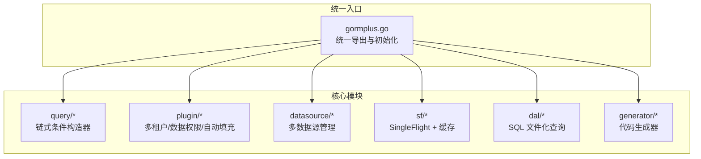
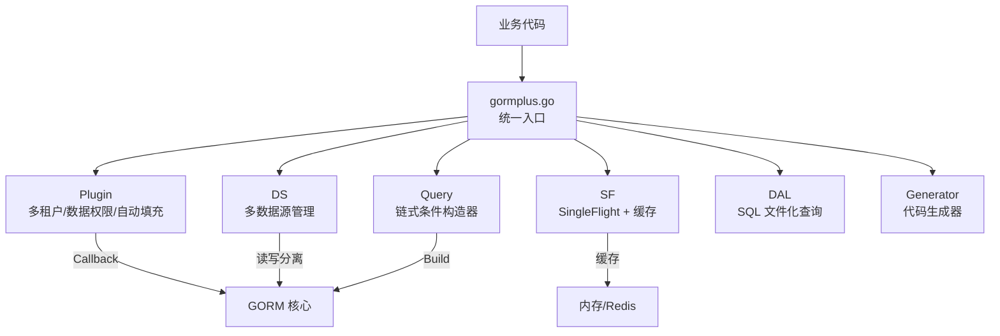
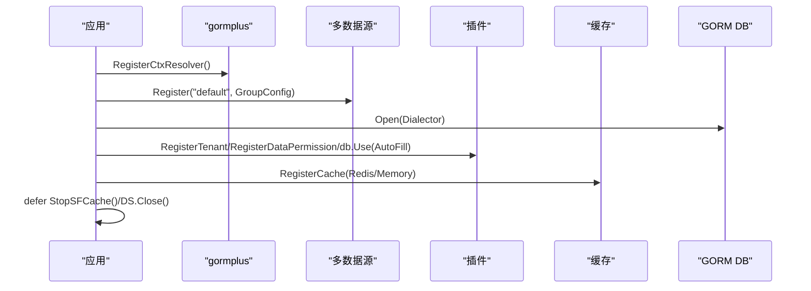
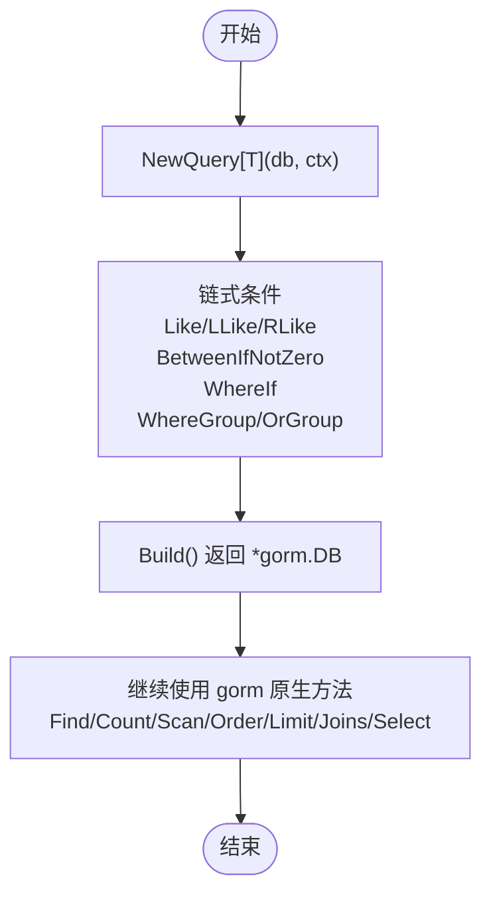
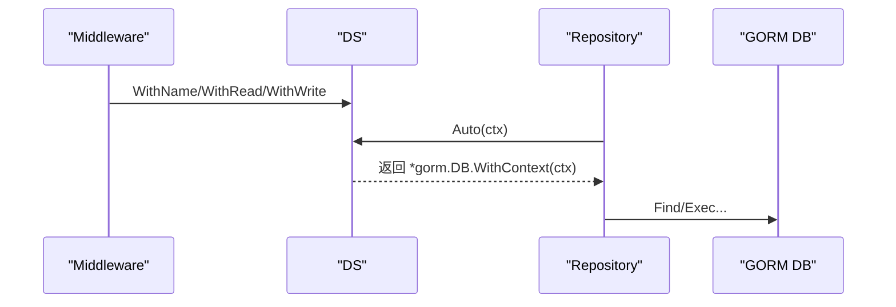
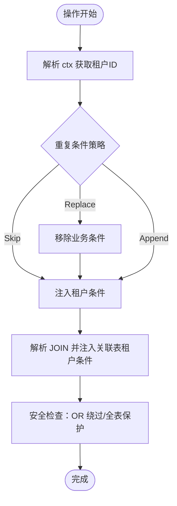
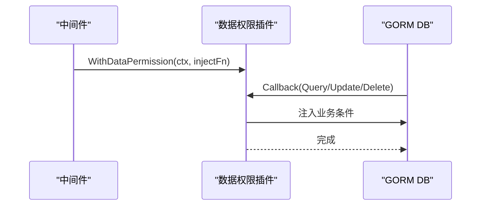
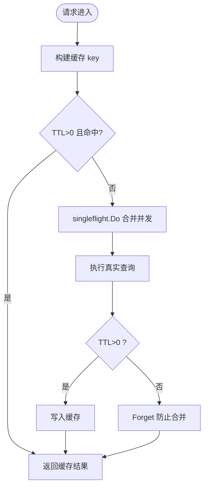
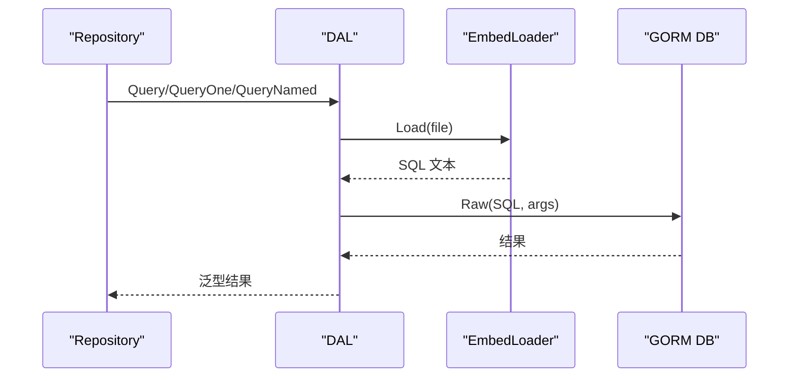
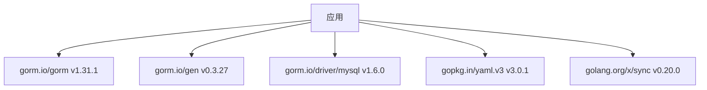

# 项目概述

<cite>
**本文档引用的文件**
- [README.md](file://README.md)
- [gormplus.go](file://gormplus.go)
- [version.go](file://version.go)
- [go.mod](file://go.mod)
- [query/query_builder.go](file://query/query_builder.go)
- [plugin/tenant.go](file://plugin/tenant.go)
- [plugin/dataPermission.go](file://plugin/dataPermission.go)
- [datasource/manager.go](file://datasource/manager.go)
- [sf/sf.go](file://sf/sf.go)
- [dal/dal.go](file://dal/dal.go)
- [generator/generator.go](file://generator/generator.go)
</cite>

## 目录
1. [简介](#简介)
2. [项目结构](#项目结构)
3. [核心组件](#核心组件)
4. [架构总览](#架构总览)
5. [详细组件分析](#详细组件分析)
6. [依赖关系分析](#依赖关系分析)
7. [性能考量](#性能考量)
8. [故障排查指南](#故障排查指南)
9. [结论](#结论)
10. [附录](#附录)

## 简介
GORM Plus 是一个基于 GORM 的增强扩展包，旨在为 Go 语言的数据库访问层提供统一入口、模块化设计与插件化扩展能力。项目围绕“链式条件构造器”“多数据源管理”“多租户与数据权限自动注入”“自动填充插件”“SingleFlight + 可插拔缓存”“慢查询监控”“代码生成器”“SQL 文件化查询（DAL）”等核心能力，形成一套完整的数据库访问解决方案，帮助开发者在复杂业务场景下获得更高的开发效率与运行时稳定性。

与传统 ORM 解决方案相比，GORM Plus 的优势体现在：
- 统一入口管理：通过单一包导出所有功能，降低使用心智负担
- 模块化设计：各功能模块边界清晰、职责单一、可独立启用
- 插件化扩展：基于 GORM Callback 的插件机制，安全可控地扩展数据库操作
- 与框架解耦：通过 ctx 解析器屏蔽不同 Web 框架（gin/go-zero/fiber）的上下文差异
- 生产就绪：提供连接池、健康检查、优雅退出、缓存清理等工程化能力

## 项目结构
项目采用模块化组织，核心模块包括：
- query：原生 GORM 链式条件构造器与泛型分页
- plugin：多租户、数据权限、自动填充等插件
- datasource：多数据源管理（一主多从、读写分离、上下文自动切换）
- sf：SingleFlight + 可插拔缓存（防缓存击穿）
- dal：SQL 文件化查询（embed + 泛型，复杂 SQL 首选）
- generator：基于 gorm-gen 的代码生成器（Model/Repository/API/VO/DTO）

图表来源
- [gormplus.go:1-120](file://gormplus.go#L1-L120)
- [query/query_builder.go:1-50](file://query/query_builder.go#L1-L50)
- [plugin/tenant.go:1-50](file://plugin/tenant.go#L1-L50)
- [datasource/manager.go:1-50](file://datasource/manager.go#L1-L50)
- [sf/sf.go:1-50](file://sf/sf.go#L1-L50)
- [dal/dal.go:1-70](file://dal/dal.go#L1-L70)
- [generator/generator.go:1-50](file://generator/generator.go#L1-L50)

章节来源
- [README.md:17-41](file://README.md#L17-L41)
- [gormplus.go:1-120](file://gormplus.go#L1-L120)

## 核心组件
- 统一入口管理：gormplus.go 提供统一导出，包含 ctx 解析器注册、多数据源管理、链式条件构造器、类型安全链式构造器、SingleFlight + 缓存、多租户/数据权限/自动填充插件、慢查询监控、代码生成器、SQL 文件化查询等。
- 链式条件构造器：query 包提供原生 GORM 扩展条件构造器，支持模糊查询、范围查询、条件开关、AND/OR 分组、Build() 返回原生 *gorm.DB，继续使用所有 GORM 原生方法。
- 多数据源管理：datasource 包支持一主多从、懒连接、连接池独立配置、上下文自动切换、读写分离、健康检查、优雅关闭。
- 插件化扩展：plugin 包通过 GORM Callback 注册 Query/Update/Delete/Create 钩子，实现多租户自动注入、数据权限条件注入、自动填充。
- SingleFlight + 可插拔缓存：sf 包提供纯 singleflight 与 singleflight + 缓存两种保护，支持内存缓存与 Redis 等自定义缓存实现，提供主动失效与后台清理。
- SQL 文件化查询（DAL）：dal 包支持 SQL 文件化管理、位置参数与命名参数、事务支持、分页查询、Hook、缓存清理、多数据源支持。
- 代码生成器：generator 包基于 gorm-gen，支持 Model/Repository/API/VO/DTO 的一键生成，路径解析、模板嵌入、交互式输入等。

章节来源
- [gormplus.go:103-800](file://gormplus.go#L103-L800)
- [query/query_builder.go:46-307](file://query/query_builder.go#L46-L307)
- [datasource/manager.go:15-579](file://datasource/manager.go#L15-L579)
- [plugin/tenant.go:1-1223](file://plugin/tenant.go#L1-L1223)
- [plugin/dataPermission.go:1-339](file://plugin/dataPermission.go#L1-L339)
- [sf/sf.go:17-395](file://sf/sf.go#L17-L395)
- [dal/dal.go:1-1506](file://dal/dal.go#L1-L1506)
- [generator/generator.go:1-1260](file://generator/generator.go#L1-L1260)

## 架构总览
GORM Plus 的架构以“统一入口 + 模块化 + 插件化”为核心设计思想：
- 统一入口：gormplus.go 作为顶层导出，集中暴露所有能力，简化使用者的导入与初始化流程。
- 模块化：各功能模块独立实现，通过 gormplus.go 汇聚，便于按需启用与替换。
- 插件化：基于 GORM Callback 的插件机制，实现多租户、数据权限、自动填充等横切关注点，保证业务代码零改动或最小改动。

图表来源
- [gormplus.go:103-800](file://gormplus.go#L103-L800)
- [plugin/tenant.go:355-381](file://plugin/tenant.go#L355-L381)
- [datasource/manager.go:288-323](file://datasource/manager.go#L288-L323)
- [sf/sf.go:227-349](file://sf/sf.go#L227-L349)

## 详细组件分析

### 统一入口与初始化流程
- ctx 解析器注册：解决 gin 项目直接传 *gin.Context 给 db.WithContext() 时插件无法从 *gin.Context 读取中间件写入的 Request.Context 数据的问题。
- 多数据源注册：通过 Dialector 字段外部传入驱动，支持 MySQL/PostgreSQL/SQLite/SQL Server 等任意 gorm 驱动。
- 插件注册：多租户、数据权限、自动填充、慢查询监控等插件通过 gormplus.RegisterXXX 或 db.Use() 注册。
- 缓存注册：可选的内存缓存或 Redis 等自定义缓存实现，通过 RegisterCache 注入。
- 优雅退出：StopSFCache() 与 DS.Close() 确保资源正确释放。

图表来源
- [gormplus.go:103-125](file://gormplus.go#L103-L125)
- [gormplus.go:155-214](file://gormplus.go#L155-L214)
- [gormplus.go:512-581](file://gormplus.go#L512-L581)
- [gormplus.go:673-748](file://gormplus.go#L673-L748)
- [gormplus.go:783-800](file://gormplus.go#L783-L800)
- [sf/sf.go:101-114](file://sf/sf.go#L101-L114)

章节来源
- [gormplus.go:103-800](file://gormplus.go#L103-L800)
- [README.md:44-110](file://README.md#L44-L110)

### 链式条件构造器（Query）
- 能力概览：模糊查询（Like/LLike/RLike）、范围查询（BetweenIfNotZero）、条件开关（WhereIf）、AND/OR 分组（WhereGroup/OrGroup）、Build() 返回原生 *gorm.DB。
- 泛型分页：FindByPage 与 ScanByPage，分别针对直接映射到 model 与联表/自定义 SELECT 的场景。
- 语法要点：所有扩展方法链式调用，最终 Build() 后可继续使用 gorm 原生方法（Select/Joins/Order/Limit/Find/Count 等）。

图表来源
- [query/query_builder.go:46-145](file://query/query_builder.go#L46-L145)
- [query/query_builder.go:244-307](file://query/query_builder.go#L244-L307)

章节来源
- [query/query_builder.go:46-307](file://query/query_builder.go#L46-L307)
- [README.md:219-284](file://README.md#L219-L284)

### 多数据源管理（DS）
- 核心能力：命名数据源注册、一主多从、懒连接、独立连接池、上下文自动切换、读写分离、健康检查、优雅关闭。
- 上下文标记：WithName/WithRead/WithWrite/IsRead/IsWrite，结合 Middleware 实现 GET 走从库、其他走主库。
- 获取 DB：Auto(ctx) 自动决策数据源与读写；Write/Read/WriteCtx/ReadCtx 显式指定。

图表来源
- [datasource/manager.go:288-323](file://datasource/manager.go#L288-L323)
- [datasource/manager.go:539-579](file://datasource/manager.go#L539-L579)

章节来源
- [datasource/manager.go:15-579](file://datasource/manager.go#L15-L579)
- [README.md:139-216](file://README.md#L139-L216)

### 多租户插件（Tenant）
- 自动注入：Query/Update/Delete/Create 前自动注入租户条件，Create 自动填充租户字段。
- 安全保护：重复条件策略（PolicySkip/PolicyReplace/PolicyAppend）、OR 绕过检测、全表 Update/Delete 保护、AllowGlobalOperation 临时放开、WithOverrideTenantID 覆盖租户 ID、SkipTenant 超管跳过。
- 联表注入：自动解析 JOIN 语句中的关联表与别名，按表配置或默认字段注入租户条件。

图表来源
- [plugin/tenant.go:529-595](file://plugin/tenant.go#L529-L595)
- [plugin/tenant.go:385-482](file://plugin/tenant.go#L385-L482)

章节来源
- [plugin/tenant.go:1-1223](file://plugin/tenant.go#L1-L1223)
- [README.md:331-490](file://README.md#L331-L490)

### 数据权限插件（DataPermission）
- 注入方式：通过 WithDataPermission(ctx, injectFn) 注入业务层的注入函数，插件在 Query/Update/Delete 前自动调用。
- 安全控制：SkipDataPermission 跳过、ExcludeTables 排除表、运行时动态增删排除表。
- 与多租户协作：两者均通过 GORM Callback 注入，互不耦合业务 SQL。

图表来源
- [plugin/dataPermission.go:164-204](file://plugin/dataPermission.go#L164-L204)
- [plugin/dataPermission.go:80-104](file://plugin/dataPermission.go#L80-L104)

章节来源
- [plugin/dataPermission.go:1-339](file://plugin/dataPermission.go#L1-L339)
- [README.md:493-533](file://README.md#L493-L533)

### 自动填充插件（AutoFill）
- 字段配置：支持多字段自动填充，按 Create/Update 时机注入。
- 上下文传递：通过 CtxContextKeyX 与中间件写入的值注入，减少样板代码。
- 与多租户/数据权限协作：自动填充与业务条件注入互不干扰。

章节来源
- [gormplus.go:783-800](file://gormplus.go#L783-L800)
- [README.md:536-564](file://README.md#L536-L564)

### SingleFlight + 可插拔缓存（SF）
- 三层保护：纯 singleflight（SFNoCache）、singleflight + 缓存（SF/SFWithTTL）、主动失效（SFInvalidate）。
- 缓存接口：SFCache 接口可替换默认内存缓存，支持 Redis 等自定义实现。
- TTL 建议：列表/统计 3s~30s；配置/字典 1min~5min；详情/实时 0 或 SFNoCache。

图表来源
- [sf/sf.go:252-349](file://sf/sf.go#L252-L349)
- [sf/sf.go:88-131](file://sf/sf.go#L88-L131)

章节来源
- [sf/sf.go:17-395](file://sf/sf.go#L17-L395)
- [README.md:567-641](file://README.md#L567-L641)

### SQL 文件化查询（DAL）
- 特性：SQL 文件化管理、泛型查询、位置参数与命名参数、事务支持、分页查询、Hook、缓存清理、多数据源支持。
- 加载器：EmbedLoader 基于 fs.FS（embed.FS），支持缓存、并发安全、singleflight 防击穿。
- 生命周期钩子：Before/After 可接入慢 SQL 监控、指标采集、链路追踪等。

图表来源
- [dal/dal.go:594-628](file://dal/dal.go#L594-L628)
- [dal/dal.go:726-762](file://dal/dal.go#L726-L762)
- [dal/dal.go:145-183](file://dal/dal.go#L145-L183)

章节来源
- [dal/dal.go:1-1506](file://dal/dal.go#L1-L1506)
- [README.md:696-800](file://README.md#L696-L800)

### 代码生成器（Generator）
- 能力：Model/Repository/API/VO/DTO 一键生成，模板嵌入、路径解析、交互式输入、goctl 路径探测。
- 模板数据：列信息、字段类型映射、校验规则、包路径解析、结构体命名规范（普通/GoZero）。
- 输出策略：Model 每次重新生成覆盖；Repository/API/VO/DTO 已存在时跳过，避免覆盖自定义代码。

章节来源
- [generator/generator.go:1-1260](file://generator/generator.go#L1-L1260)
- [README.md:662-694](file://README.md#L662-L694)

## 依赖关系分析
- 技术栈：Go 1.25.5，GORM v1.31.1，gorm-gen v0.3.27，驱动依赖通过 Dialector 外部传入，不内置任何驱动。
- 间接依赖：edwards25519、uuid、mysql driver、x/sync、x/tools 等，主要用于加密、工具与构建。

图表来源
- [go.mod:1-26](file://go.mod#L1-L26)

章节来源
- [go.mod:1-26](file://go.mod#L1-L26)
- [version.go:1-4](file://version.go#L1-L4)

## 性能考量
- 连接池：默认 MaxOpen=50、MaxIdle=10、MaxLifetime=30min、MaxIdleTime=10min，适合大多数生产场景。
- 缓存策略：TTL 选择建议：列表/统计 3s~30s；配置/字典 1min~5min；详情/实时 0 或 SFNoCache。
- 读写分离：GET 走从库，写走主库，从库轮询负载均衡，提升读性能。
- 单飞合并：singleflight 防止缓存击穿与热点击穿，减少重复计算与数据库压力。
- SQL 文件化：通过 embed 打包，避免运行时文件依赖，提升部署一致性与查询性能。

## 故障排查指南
- 多租户 OR 绕过：若出现 WHERE (tenant_id = ? OR ...)，插件会拒绝执行，需检查业务条件或使用 SkipTenant/AllowGlobalOperation。
- 全表保护：无业务 WHERE 条件的 Update/Delete 会被拒绝，临时放开使用 AllowGlobalOperation。
- 缓存不生效：确认 RegisterCache 在第一次调用 SF 之前注册；检查 args 与查询时一致；写操作后调用 SFInvalidate。
- 数据源未注册：Auto(ctx) 报错“未找到数据源名且未设置默认数据源”，需注册数据源或设置默认数据源。
- 缓存击穿：使用 SFNoCache 或合理 TTL；必要时使用 RegisterCache 注入 Redis。

章节来源
- [plugin/tenant.go:385-482](file://plugin/tenant.go#L385-L482)
- [sf/sf.go:275-291](file://sf/sf.go#L275-L291)
- [datasource/manager.go:288-323](file://datasource/manager.go#L288-L323)

## 结论
GORM Plus 通过统一入口、模块化设计与插件化扩展，为复杂业务场景提供了稳定、高效、易用的数据库访问解决方案。其核心价值在于：
- 降低学习与使用成本：统一入口与清晰的模块边界
- 提升开发效率：链式条件构造器、代码生成器、SQL 文件化查询
- 增强运行时稳定性：多数据源、缓存、慢查询监控、安全保护
- 与框架解耦：ctx 解析器屏蔽不同 Web 框架差异

## 附录
- 版本信息：v1.0.13
- 安装方式：go get github.com/kuangshp/gorm-plus
- 快速开始：参考 README.md 的安装与快速开始章节

章节来源
- [version.go:1-4](file://version.go#L1-L4)
- [README.md:9-110](file://README.md#L9-L110)