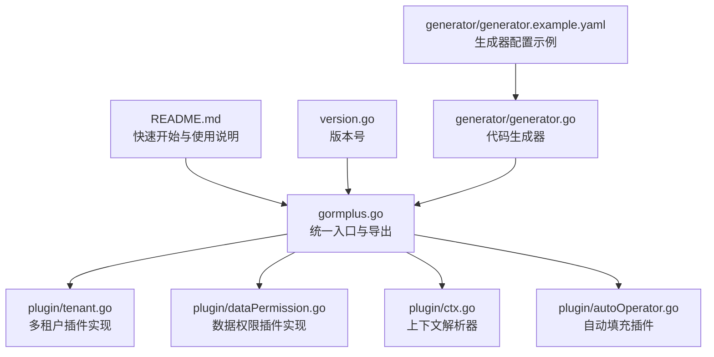
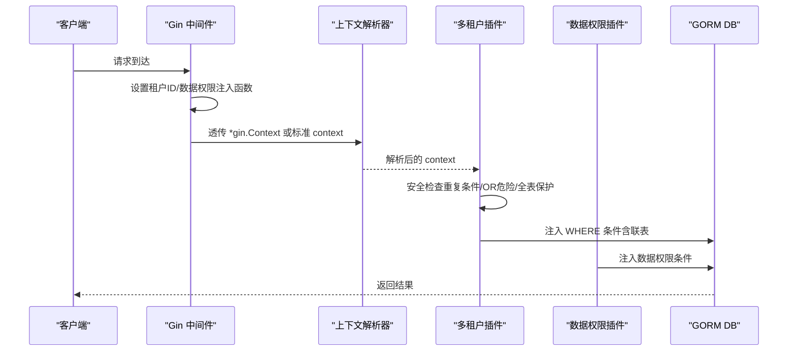
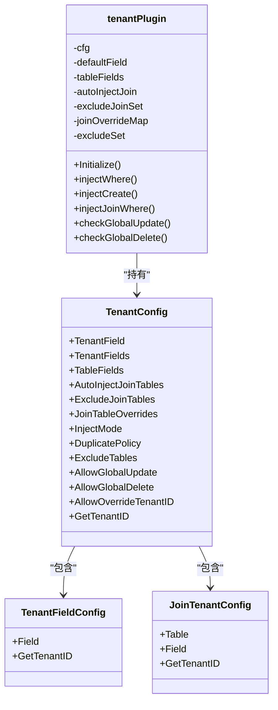
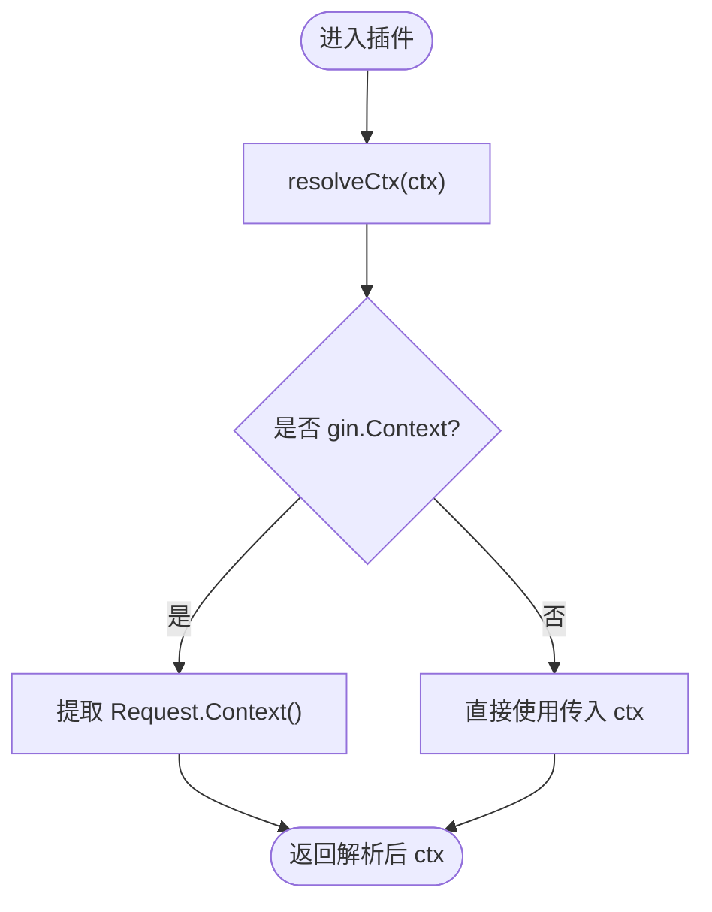
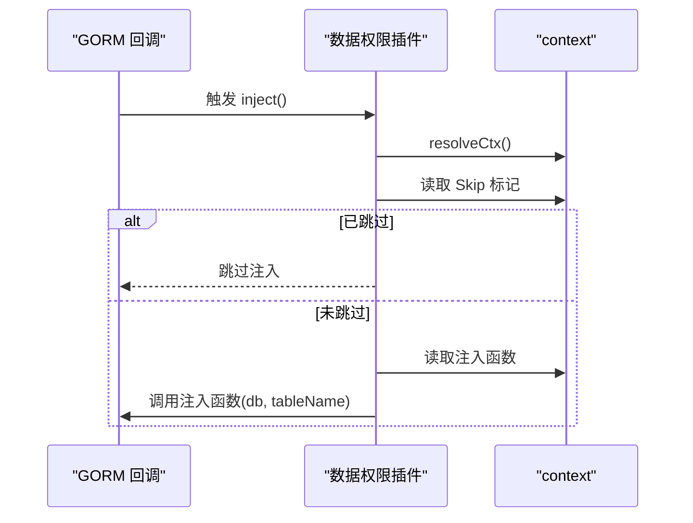
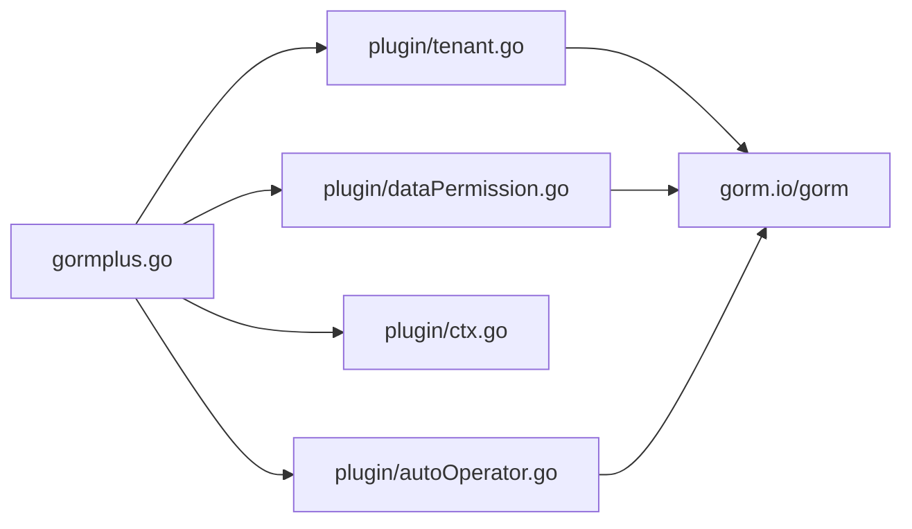

# 多租户安全

<cite>
**本文引用的文件**
- [plugin/tenant.go](file://plugin/tenant.go)
- [plugin/tenant.md](file://plugin/tenant.md)
- [plugin/dataPermission.go](file://plugin/dataPermission.go)
- [plugin/dataPermission.md](file://plugin/dataPermission.md)
- [plugin/ctx.go](file://plugin/ctx.go)
- [plugin/autoOperator.go](file://plugin/autoOperator.go)
- [gormplus.go](file://gormplus.go)
- [README.md](file://README.md)
- [version.go](file://version.go)
- [generator/generator.go](file://generator/generator.go)
- [generator/generator.example.yaml](file://generator/generator.example.yaml)
</cite>

## 目录
1. [简介](#简介)
2. [项目结构](#项目结构)
3. [核心组件](#核心组件)
4. [架构总览](#架构总览)
5. [详细组件分析](#详细组件分析)
6. [依赖分析](#依赖分析)
7. [性能考量](#性能考量)
8. [故障排查指南](#故障排查指南)
9. [结论](#结论)
10. [附录](#附录)

## 简介
本文件面向多租户安全机制的技术文档，聚焦于多租户插件在 GORM 中的自动注入与安全防护实现。重点涵盖：
- 租户条件自动注入机制（Query/Update/Delete/Create）
- 多字段租户支持策略与按表覆盖
- 联表自动注入与别名识别
- 租户ID的获取与验证流程
- 中间件集成方式与上下文解析
- 防跨租户数据泄露的多重安全边界
- 配置项详解与最佳实践
- 常见问题与解决方案

## 项目结构
本项目采用模块化组织，多租户与数据权限作为插件模块集成到统一入口 gormplus 中，便于集中初始化与使用。

图示来源
- [gormplus.go:1-120](file://gormplus.go#L1-L120)
- [plugin/tenant.go:1-120](file://plugin/tenant.go#L1-L120)
- [plugin/dataPermission.go:1-120](file://plugin/dataPermission.go#L1-L120)
- [plugin/ctx.go:1-44](file://plugin/ctx.go#L1-L44)
- [plugin/autoOperator.go:1-120](file://plugin/autoOperator.go#L1-L120)
- [README.md:1-120](file://README.md#L1-L120)
- [version.go:1-4](file://version.go#L1-L4)
- [generator/generator.go:1-120](file://generator/generator.go#L1-L120)
- [generator/generator.example.yaml:1-17](file://generator/generator.example.yaml#L1-L17)

章节来源
- [README.md:17-110](file://README.md#L17-L110)
- [gormplus.go:103-125](file://gormplus.go#L103-L125)

## 核心组件
- 多租户插件（TenantPlugin）
  - 注册点：在 gorm 的 Query/Update/Delete/Create 回调阶段注入租户条件
  - 安全策略：重复条件跳过、OR危险条件拒绝、全表保护
  - 多字段与按表覆盖：支持同一表多租户字段、不同表不同字段
  - 联表注入：自动解析 JOIN 别名，按表覆盖字段
- 上下文解析器（CtxResolver）
  - 屏蔽框架差异，兼容 gin/go-zero/fiber
- 数据权限插件（DataPermissionPlugin）
  - 业务侧注入函数，按角色/部门等维度注入数据范围条件
- 自动填充插件（AutoFillPlugin）
  - Create/Update 时自动填充操作人等字段（与多租户配合）

章节来源
- [plugin/tenant.go:338-381](file://plugin/tenant.go#L338-L381)
- [plugin/ctx.go:16-44](file://plugin/ctx.go#L16-L44)
- [plugin/dataPermission.go:128-162](file://plugin/dataPermission.go#L128-L162)
- [plugin/autoOperator.go:140-208](file://plugin/autoOperator.go#L140-L208)

## 架构总览
多租户安全架构围绕“回调钩子 + 上下文解析 + 安全检查”展开，形成从中间件到数据库层的端到端隔离。

图示来源
- [plugin/tenant.go:529-595](file://plugin/tenant.go#L529-L595)
- [plugin/dataPermission.go:164-204](file://plugin/dataPermission.go#L164-L204)
- [plugin/ctx.go:37-44](file://plugin/ctx.go#L37-L44)

## 详细组件分析

### 多租户插件（TenantPlugin）
- 注入时机与范围
  - Query/Update/Delete：Before 钩子注入 WHERE 条件
  - Create：Before 钩子反射填充结构体字段
  - 联表：解析 Joins 子句，自动识别别名并注入
- 安全边界
  - 重复条件策略：PolicySkip（默认）、PolicyReplace、PolicyAppend
  - OR 危险检测：一旦发现租户字段出现在 OR 条件中，直接拒绝执行
  - 全表保护：未携带业务 WHERE 条件的 Update/Delete 直接报错
  - 覆盖与跳过：AllowOverrideTenantID、WithOverrideTenantID、SkipTenant
- 配置项与优先级
  - TenantField/TenantFields/TableFields：字段与按表覆盖
  - AutoInjectJoinTables/ExcludeJoinTables/JoinTableOverrides：联表注入策略
  - InjectMode/DuplicatePolicy/ExcludeTables/AllowGlobalUpdate/AllowGlobalDelete/AllowOverrideTenantID
- 上下文与租户ID解析
  - 默认从 WithTenantID 写入的值解析
  - 可自定义 GetTenantID 或按表覆盖
  - 支持覆盖租户ID（需开启 AllowOverrideTenantID）

图示来源
- [plugin/tenant.go:239-336](file://plugin/tenant.go#L239-L336)
- [plugin/tenant.go:340-349](file://plugin/tenant.go#L340-L349)

章节来源
- [plugin/tenant.go:145-188](file://plugin/tenant.go#L145-L188)
- [plugin/tenant.go:239-336](file://plugin/tenant.go#L239-L336)
- [plugin/tenant.go:529-595](file://plugin/tenant.go#L529-L595)
- [plugin/tenant.go:644-713](file://plugin/tenant.go#L644-L713)
- [plugin/tenant.go:809-865](file://plugin/tenant.go#L809-L865)
- [plugin/tenant.go:940-953](file://plugin/tenant.go#L940-L953)

### 上下文解析器（CtxResolver）
- 目标：屏蔽 gin/go-zero/fiber 等框架的 ctx 类型差异
- 机制：注册解析器，resolveCtx 在插件读取 ctx 前统一转换
- 用法：gin 项目必须注册；go-zero/fiber 无需注册

图示来源
- [plugin/ctx.go:16-44](file://plugin/ctx.go#L16-L44)

章节来源
- [plugin/ctx.go:16-44](file://plugin/ctx.go#L16-L44)
- [README.md:114-135](file://README.md#L114-L135)

### 数据权限插件（DataPermissionPlugin）
- 注入时机：Query/Update/Delete（Create 通常无需）
- 注入方式：通过 WithDataPermission 写入的注入函数，在回调中调用
- 跳过机制：SkipDataPermission 标记后跳过注入
- 排除表：支持运行时动态增删

图示来源
- [plugin/dataPermission.go:164-204](file://plugin/dataPermission.go#L164-L204)
- [plugin/dataPermission.go:106-126](file://plugin/dataPermission.go#L106-L126)

章节来源
- [plugin/dataPermission.go:128-204](file://plugin/dataPermission.go#L128-L204)
- [plugin/dataPermission.md:1-50](file://plugin/dataPermission.md#L1-L50)

### 自动填充插件（AutoFillPlugin）
- 作用：Create/Update 时自动填充字段（如操作人、时间戳等）
- 与多租户协作：可在中间件中将操作人信息写入 context，自动填充插件读取并写入

章节来源
- [plugin/autoOperator.go:140-208](file://plugin/autoOperator.go#L140-L208)
- [README.md:536-563](file://README.md#L536-L563)

## 依赖分析
- 模块耦合
  - gormplus 作为统一入口，导出多租户/数据权限/自动填充等插件
  - 插件内部通过 gorm 的 Callback 钩子实现，不直接依赖业务代码
- 外部依赖
  - gorm.io/gorm、gorm.io/gen 等
- 潜在风险
  - 业务代码直接拼接原生 SQL 并包含 OR 与租户字段，可能触发安全拒绝
  - 未注册 ctx 解析器导致 gin 项目无法读取中间件注入的值

图示来源
- [gormplus.go:88-101](file://gormplus.go#L88-L101)
- [plugin/tenant.go:131-141](file://plugin/tenant.go#L131-L141)
- [plugin/dataPermission.go:3-10](file://plugin/dataPermission.go#L3-L10)
- [plugin/autoOperator.go:3-8](file://plugin/autoOperator.go#L3-L8)

章节来源
- [gormplus.go:88-101](file://gormplus.go#L88-L101)

## 性能考量
- 注入成本
  - PolicyAppend 不扫描现有条件，性能最优，但可能产生重复条件
  - PolicySkip/PolicyReplace 需要解析 WHERE 表达式，略增 CPU 开销
- 联表注入
  - 自动解析 JOIN 别名，避免手写重复条件，减少业务层负担
- 全表保护
  - 通过拒绝无业务条件的 Update/Delete，避免误操作带来的额外 IO

章节来源
- [plugin/tenant.go:180-188](file://plugin/tenant.go#L180-L188)
- [plugin/tenant.go:644-713](file://plugin/tenant.go#L644-L713)
- [plugin/tenant.go:809-865](file://plugin/tenant.go#L809-L865)

## 故障排查指南
- 症状：WHERE 条件重复或未生效
  - 检查 DuplicatePolicy 与业务 WHERE 是否冲突
  - 使用 PolicySkip（默认）避免重复；必要时使用 PolicyReplace 强制覆盖
- 症状：SQL 报错“检测到租户字段出现在 OR 条件中”
  - 业务层不要在 OR 分支中包含租户字段
  - 如确需跨租户查询，使用 SkipTenant
- 症状：Update/Delete 被拒绝
  - 为 Update/Where 添加业务 WHERE 条件
  - 或使用 AllowGlobalOperation 临时放开
- 症状：gin 项目读不到中间件注入的租户ID
  - 确认已注册 RegisterCtxResolver
- 症状：联表查询未注入租户条件
  - 检查 AutoInjectJoinTables/ExcludeJoinTables/JoinTableOverrides 配置
- 症状：覆盖租户ID无效
  - 确认 AllowOverrideTenantID=true，并使用 WithOverrideTenantID

章节来源
- [plugin/tenant.go:385-482](file://plugin/tenant.go#L385-L482)
- [plugin/tenant.go:823-865](file://plugin/tenant.go#L823-L865)
- [plugin/tenant.go:1139-1222](file://plugin/tenant.go#L1139-L1222)
- [plugin/ctx.go:16-44](file://plugin/ctx.go#L16-L44)
- [plugin/tenant.md:1-30](file://plugin/tenant.md#L1-L30)

## 结论
多租户插件通过“回调钩子 + 上下文解析 + 安全检查”的组合，实现了对租户隔离的强约束与易用性兼顾。结合数据权限插件与自动填充插件，可构建从中间件到数据库层的完整安全边界。合理配置字段策略、联表覆盖与安全策略，是保障系统安全与性能的关键。

## 附录

### 配置项与用法示例（摘要）
- TenantConfig
  - TenantField/TenantFields/TableFields：单字段/多字段/按表覆盖
  - AutoInjectJoinTables/ExcludeJoinTables/JoinTableOverrides：联表注入策略
  - InjectMode/DuplicatePolicy/ExcludeTables/AllowGlobalUpdate/AllowGlobalDelete/AllowOverrideTenantID/GetTenantID
- 中间件集成
  - gin：注册 RegisterCtxResolver；在中间件中使用 WithTenantID/WithDataPermission 等
  - go-zero/fiber：直接传标准 context
- 安全开关
  - SkipTenant：超管跳过
  - AllowGlobalOperation：临时放开全表保护
  - WithOverrideTenantID：覆盖租户ID（需 AllowOverrideTenantID=true）

章节来源
- [plugin/tenant.go:239-336](file://plugin/tenant.go#L239-L336)
- [plugin/tenant.md:1-30](file://plugin/tenant.md#L1-L30)
- [plugin/dataPermission.go:106-126](file://plugin/dataPermission.go#L106-L126)
- [plugin/dataPermission.md:1-50](file://plugin/dataPermission.md#L1-L50)
- [plugin/ctx.go:16-44](file://plugin/ctx.go#L16-L44)
- [gormplus.go:512-661](file://gormplus.go#L512-L661)