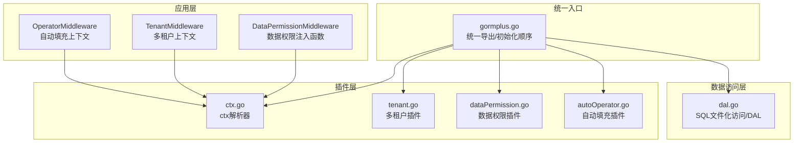
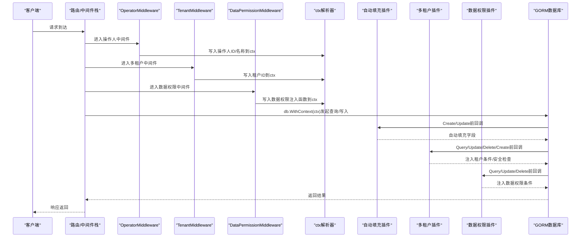
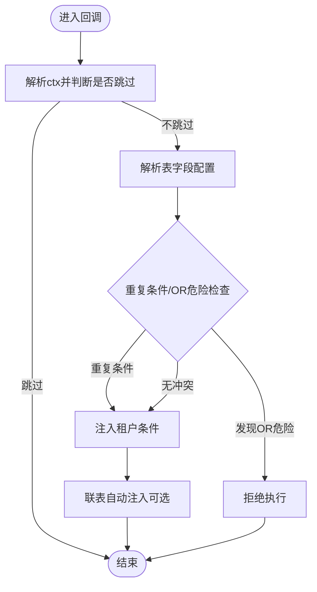
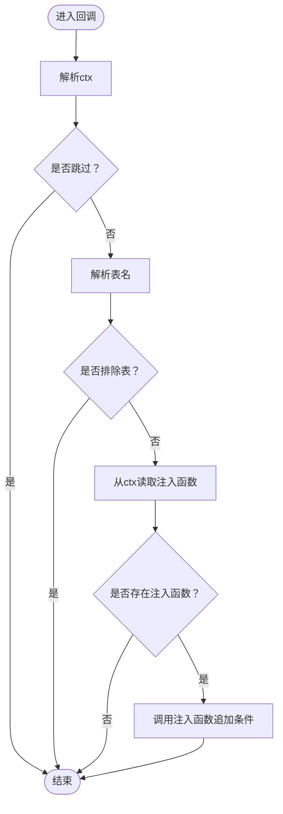
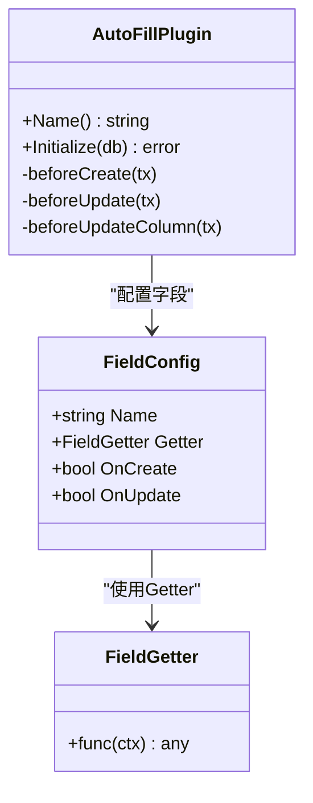
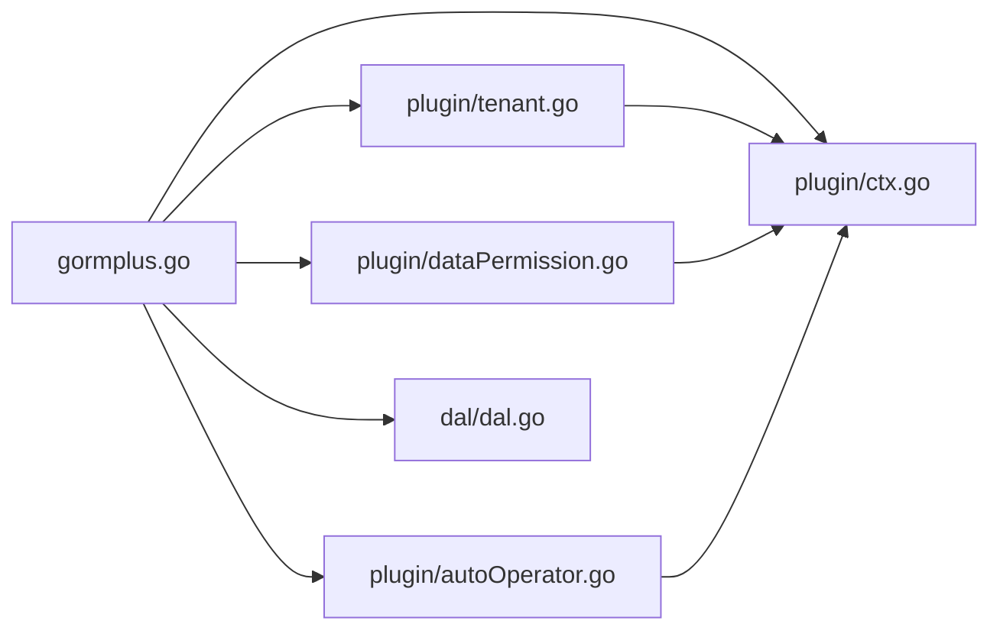

# 安全最佳实践

<cite>
**本文引用的文件**
- [README.md](file://README.md)
- [gormplus.go](file://gormplus.go)
- [plugin/tenant.go](file://plugin/tenant.go)
- [plugin/dataPermission.go](file://plugin/dataPermission.go)
- [plugin/autoOperator.go](file://plugin/autoOperator.go)
- [plugin/ctx.go](file://plugin/ctx.go)
- [plugin/tenant.md](file://plugin/tenant.md)
- [plugin/dataPermission.md](file://plugin/dataPermission.md)
- [plugin/autoOperator.md](file://plugin/autoOperator.md)
- [dal/dal.go](file://dal/dal.go)
- [dal/dal_test.go](file://dal/dal_test.go)
- [generator/example_test.go](file://generator/example_test.go)
- [version.go](file://version.go)
- [go.mod](file://go.mod)
</cite>

## 目录
1. [简介](#简介)
2. [项目结构](#项目结构)
3. [核心组件](#核心组件)
4. [架构总览](#架构总览)
5. [详细组件分析](#详细组件分析)
6. [依赖关系分析](#依赖关系分析)
7. [性能考量](#性能考量)
8. [故障排查指南](#故障排查指南)
9. [结论](#结论)
10. [附录](#附录)

## 简介
本指南围绕企业级应用安全，系统梳理多租户、数据权限、自动填充等安全机制的协同策略，结合插件注册顺序、中间件集成顺序、安全配置优先级，给出可落地的安全架构设计建议。文档同时覆盖常见安全威胁与防护策略、安全配置检查清单、应急响应流程与恢复策略，并提供合规性与行业标准的实施要点，帮助团队在保证业务效率的同时，构建稳健、可审计、可追溯的安全体系。

## 项目结构
该项目以“统一入口 + 插件化 + 中间件”为核心组织方式：
- 统一入口模块负责聚合导出、初始化顺序与全局配置
- 插件模块提供多租户、数据权限、自动填充等安全能力
- 中间件负责在请求链路上注入上下文信息（租户ID、操作人、数据权限注入函数等）
- DAL模块提供SQL文件化访问层，支持Hook与缓存，便于审计与监控
- 代码生成器与数据源管理器支撑工程化与多数据源能力

图表来源
- [gormplus.go:22-85](file://gormplus.go#L22-L85)
- [plugin/ctx.go:16-44](file://plugin/ctx.go#L16-L44)
- [plugin/tenant.go:1-140](file://plugin/tenant.go#L1-L140)
- [plugin/dataPermission.go:1-127](file://plugin/dataPermission.go#L1-L127)
- [plugin/autoOperator.go:1-120](file://plugin/autoOperator.go#L1-L120)
- [dal/dal.go:1-120](file://dal/dal.go#L1-L120)

章节来源
- [README.md:17-41](file://README.md#L17-L41)
- [gormplus.go:22-85](file://gormplus.go#L22-L85)

## 核心组件
- 上下文解析器（ctx解析器）：屏蔽不同Web框架（gin/go-zero/fiber）的ctx差异，确保插件能从Request.Context读取中间件写入的信息
- 多租户插件：在Query/Update/Delete/Create前自动注入租户条件，支持多字段、联表自动注入、重复条件策略、OR危险条件拒绝、全表保护
- 数据权限插件：在Callback阶段调用业务侧注入函数，按角色/部门/组织范围注入数据权限条件，支持排除表、跳过模式
- 自动填充插件：在Create/Update前自动填充操作人、时间、来源等字段，支持多字段、自定义Getter、UpdateColumn路径兼容
- DAL模块：SQL文件化管理、命名参数、分页、Hook、缓存、事务、多数据源支持
- 代码生成器：Model/Repository/API/VO/DTO一键生成，减少手写风险

章节来源
- [plugin/ctx.go:16-44](file://plugin/ctx.go#L16-L44)
- [plugin/tenant.go:1-140](file://plugin/tenant.go#L1-L140)
- [plugin/dataPermission.go:1-127](file://plugin/dataPermission.go#L1-L127)
- [plugin/autoOperator.go:1-120](file://plugin/autoOperator.go#L1-L120)
- [dal/dal.go:1-120](file://dal/dal.go#L1-L120)
- [generator/example_test.go:7-35](file://generator/example_test.go#L7-L35)

## 架构总览
下图展示请求在中间件与插件之间的流转，以及各安全机制的协同工作方式。

图表来源
- [gormplus.go:52-85](file://gormplus.go#L52-L85)
- [plugin/ctx.go:16-44](file://plugin/ctx.go#L16-L44)
- [plugin/tenant.go:355-381](file://plugin/tenant.go#L355-L381)
- [plugin/dataPermission.go:140-162](file://plugin/dataPermission.go#L140-L162)
- [plugin/autoOperator.go:190-208](file://plugin/autoOperator.go#L190-L208)

## 详细组件分析

### 多租户插件（自动注入）
- 注入时机：Query/Update/Delete/Create前的gorm回调
- 注入策略：
  - 单字段/多字段/按表覆盖
  - 联表自动注入（别名识别）、排除公共表、覆盖特定表字段
  - 重复条件策略：跳过/替换/追加
  - OR危险条件拒绝：检测租户字段出现在OR中直接拒绝
  - 全表保护：禁止无业务条件的全表Update/Delete
- 超管与覆盖：
  - 跳过模式：SkipTenant
  - 临时放开：AllowGlobalOperation
  - 覆盖租户ID：WithOverrideTenantID（需开启AllowOverrideTenantID）

图表来源
- [plugin/tenant.go:385-482](file://plugin/tenant.go#L385-L482)
- [plugin/tenant.go:529-595](file://plugin/tenant.go#L529-L595)
- [plugin/tenant.go:644-713](file://plugin/tenant.go#L644-L713)

章节来源
- [plugin/tenant.go:1-140](file://plugin/tenant.go#L1-L140)
- [plugin/tenant.go:355-381](file://plugin/tenant.go#L355-L381)
- [plugin/tenant.go:385-482](file://plugin/tenant.go#L385-L482)
- [plugin/tenant.go:529-595](file://plugin/tenant.go#L529-L595)
- [plugin/tenant.go:644-713](file://plugin/tenant.go#L644-L713)
- [plugin/tenant.md:1-30](file://plugin/tenant.md#L1-L30)

### 数据权限插件（按角色/部门隔离）
- 注入时机：Query/Update/Delete前回调
- 注入方式：从ctx读取业务侧注入函数，直接追加条件（底层Statement.Where）
- 排除表：支持运行时动态增删
- 跳过模式：SkipDataPermission（超管/统计/内部任务）

图表来源
- [plugin/dataPermission.go:164-204](file://plugin/dataPermission.go#L164-L204)
- [plugin/dataPermission.go:229-266](file://plugin/dataPermission.go#L229-L266)

章节来源
- [plugin/dataPermission.go:1-127](file://plugin/dataPermission.go#L1-L127)
- [plugin/dataPermission.go:164-204](file://plugin/dataPermission.go#L164-L204)
- [plugin/dataPermission.md:1-50](file://plugin/dataPermission.md#L1-L50)

### 自动填充插件（创建/更新人、来源等）
- 注入时机：Create/Update前回调，兼容UpdateColumn路径
- 字段配置：Name/Getter/OnCreate/OnUpdate
- Getter：内置CtxGetter/OperatorGetter，支持自定义Getter
- UpdateSimple路径：通过clause.Set追加，避免SetColumn失效

图表来源
- [plugin/autoOperator.go:180-208](file://plugin/autoOperator.go#L180-L208)
- [plugin/autoOperator.go:210-275](file://plugin/autoOperator.go#L210-L275)
- [plugin/autoOperator.go:277-309](file://plugin/autoOperator.go#L277-L309)

章节来源
- [plugin/autoOperator.go:1-120](file://plugin/autoOperator.go#L1-L120)
- [plugin/autoOperator.go:180-208](file://plugin/autoOperator.go#L180-L208)
- [plugin/autoOperator.go:210-275](file://plugin/autoOperator.go#L210-L275)
- [plugin/autoOperator.md:1-102](file://plugin/autoOperator.md#L1-L102)

### 上下文解析器（屏蔽框架差异）
- 作用：解决gin项目直接传*gin.Context导致插件无法读取Request.Context的问题
- 使用：gin项目注册，go-zero/fiber无需注册

章节来源
- [plugin/ctx.go:16-44](file://plugin/ctx.go#L16-L44)
- [plugin/ctx.go:16-44](file://plugin/ctx.go#L16-L44)

### DAL模块（SQL文件化访问）
- SQL文件化：通过embed打包，DBA审核、版本管理、复杂SQL首选
- 参数：位置参数?与命名参数@name
- Hook：慢SQL监控、指标采集、链路追踪
- 缓存：SQL加载缓存+singleflight防击穿
- 多数据源：通过WithDB注入，调用方无感知

章节来源
- [dal/dal.go:1-120](file://dal/dal.go#L1-L120)
- [dal/dal.go:572-628](file://dal/dal.go#L572-L628)
- [dal/dal.go:693-762](file://dal/dal.go#L693-L762)
- [dal/dal_test.go:1-120](file://dal/dal_test.go#L1-L120)

## 依赖关系分析
- 统一入口模块聚合导出，定义初始化顺序与全局配置
- 插件模块依赖gorm回调机制，在Query/Update/Delete/Create前注入安全条件
- 中间件负责在请求链路中写入ctx，屏蔽框架差异
- DAL模块依赖gorm与Hook机制，支持审计与监控

图表来源
- [gormplus.go:88-101](file://gormplus.go#L88-L101)
- [plugin/tenant.go:1-140](file://plugin/tenant.go#L1-L140)
- [plugin/dataPermission.go:1-127](file://plugin/dataPermission.go#L1-L127)
- [plugin/autoOperator.go:1-120](file://plugin/autoOperator.go#L1-L120)
- [plugin/ctx.go:16-44](file://plugin/ctx.go#L16-L44)
- [dal/dal.go:1-120](file://dal/dal.go#L1-L120)

章节来源
- [gormplus.go:88-101](file://gormplus.go#L88-L101)
- [go.mod:1-26](file://go.mod#L1-L26)

## 性能考量
- 插件回调在gorm内部执行，属于轻量逻辑，对整体性能影响有限
- 多租户重复条件策略可选择PolicyAppend以降低扫描成本，但需确保业务侧不手动注入重复条件
- 自动填充仅在Create/Update前回调，字段数量可控，性能开销较小
- DAL模块的SQL加载缓存与singleflight可有效降低首次请求延迟与缓存击穿风险
- 建议在生产环境启用Hook进行慢SQL监控，及时发现热点SQL

章节来源
- [plugin/tenant.go:155-188](file://plugin/tenant.go#L155-L188)
- [plugin/autoOperator.go:277-309](file://plugin/autoOperator.go#L277-L309)
- [dal/dal.go:150-174](file://dal/dal.go#L150-L174)

## 故障排查指南
- 多租户条件未生效
  - 检查是否注册ctx解析器（gin项目）
  - 检查中间件是否正确写入租户ID
  - 检查重复条件策略与OR危险条件
  - 检查是否误用AllowGlobalOperation或SkipTenant
- 数据权限未生效
  - 检查中间件是否正确写入注入函数
  - 检查是否命中排除表
  - 检查是否误用SkipDataPermission
- 自动填充字段为空
  - 检查中间件是否正确写入Getter所需ctx值
  - 检查字段名与Getter配置是否匹配
  - 检查UpdateColumn路径是否正确处理
- SQL性能问题
  - 启用Hook进行慢SQL监控
  - 检查DAL缓存是否命中
  - 优化复杂SQL与索引

章节来源
- [plugin/tenant.go:385-482](file://plugin/tenant.go#L385-L482)
- [plugin/dataPermission.go:164-204](file://plugin/dataPermission.go#L164-L204)
- [plugin/autoOperator.go:210-275](file://plugin/autoOperator.go#L210-L275)
- [dal/dal.go:188-221](file://dal/dal.go#L188-L221)

## 结论
通过将多租户、数据权限、自动填充三大安全机制与中间件、上下文解析器、SQL文件化访问层有机结合，可在不侵入业务代码的前提下实现强隔离、可审计、可追溯的企业级安全体系。遵循本文提供的初始化顺序、中间件集成顺序与安全配置优先级，配合完善的监控与审计，可显著降低安全风险并提升系统的可维护性与可扩展性。

## 附录

### 安全架构设计建议
- 身份认证与授权
  - 使用JWT/OAuth2进行身份认证，中间件解析令牌并写入ctx
  - 授权控制通过数据权限插件按角色/部门/组织范围注入条件
- 数据隔离
  - 多租户插件默认启用，禁止无业务条件的全表操作
  - 联表自动注入租户条件，避免遗漏
- 自动化与可追溯
  - 自动填充插件统一记录创建/更新人、来源等元数据
  - DAL模块支持Hook与命名参数，便于审计与复盘
- 监控与告警
  - 启用慢SQL监控与指标采集
  - 建立异常SQL与越权访问的告警机制

### 常见安全威胁与防护策略
- SQL注入
  - 使用GORM链式条件构造器或参数化查询，避免原生SQL拼接
  - DAL模块支持命名参数，降低参数顺序错误风险
- XSS攻击
  - 前端渲染时进行HTML转义，后端输出严格控制
- CSRF攻击
  - 使用CSRF Token与SameSite Cookie策略
- 权限提升
  - 多租户与数据权限双重保障，避免越权访问
  - 超管操作使用SkipTenant/SkipDataPermission并严格审计

### 安全配置检查清单
- 环境配置
  - ctx解析器：gin项目必须注册
  - 多租户：启用全表保护、合理配置重复条件策略
  - 数据权限：排除表清单与注入函数逻辑清晰
  - 自动填充：字段配置与Getter正确
  - DAL：Hook启用、缓存清理策略、命名参数使用
- 代码审查
  - SQL文件化管理，DBA审核
  - 回调逻辑不包含敏感信息
  - 中间件顺序与职责清晰
- 渗透测试
  - 验证多租户隔离边界
  - 验证数据权限注入有效性
  - 验证自动填充字段完整性
- 安全监控
  - 慢SQL监控与告警
  - 异常访问与越权尝试记录与告警

### 应急响应流程与恢复策略
- 应急响应流程
  - 发现异常：快速定位SQL与调用链
  - 隔离影响：临时跳过数据权限/多租户（仅限紧急）
  - 修复与验证：修复SQL/配置，回归测试
  - 恢复与复盘：恢复安全策略，形成改进措施
- 恢复策略
  - 通过AllowGlobalOperation临时放行（仅限批量任务）
  - 通过SkipTenant/SkipDataPermission进行特权操作并严格审计
  - 通过AddExcludeTable/AddDataPermissionExcludeTable临时调整排除表（需尽快恢复）

### 合规性与行业标准
- 数据最小化与可追溯：自动填充记录操作人、来源等元数据
- 数据隔离与访问控制：多租户与数据权限双重保障
- 审计与日志：Hook记录慢SQL与异常访问
- 代码质量：SQL文件化、参数化、DBA审核

章节来源
- [README.md:43-110](file://README.md#L43-L110)
- [gormplus.go:22-85](file://gormplus.go#L22-L85)
- [plugin/tenant.go:385-482](file://plugin/tenant.go#L385-L482)
- [plugin/dataPermission.go:164-204](file://plugin/dataPermission.go#L164-L204)
- [plugin/autoOperator.go:210-275](file://plugin/autoOperator.go#L210-L275)
- [dal/dal.go:188-221](file://dal/dal.go#L188-L221)