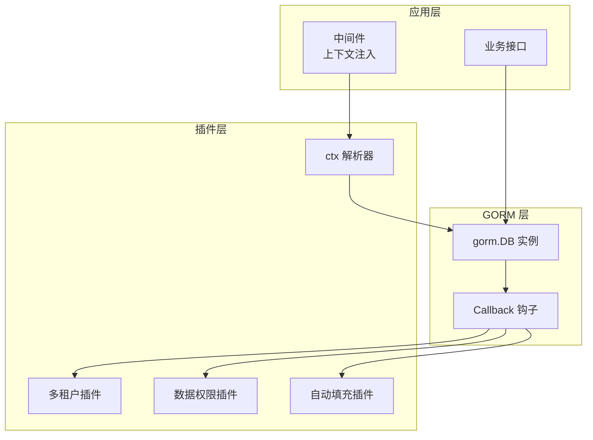
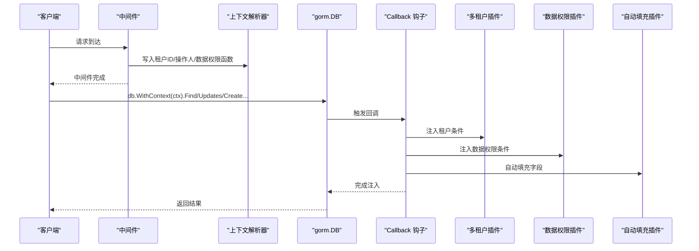
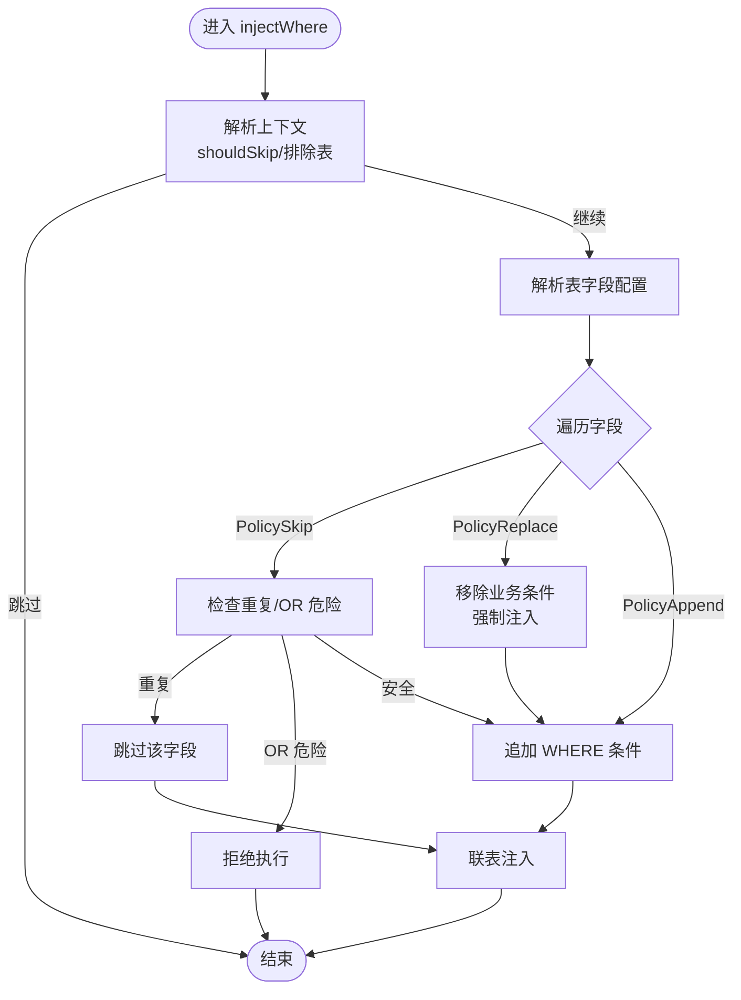
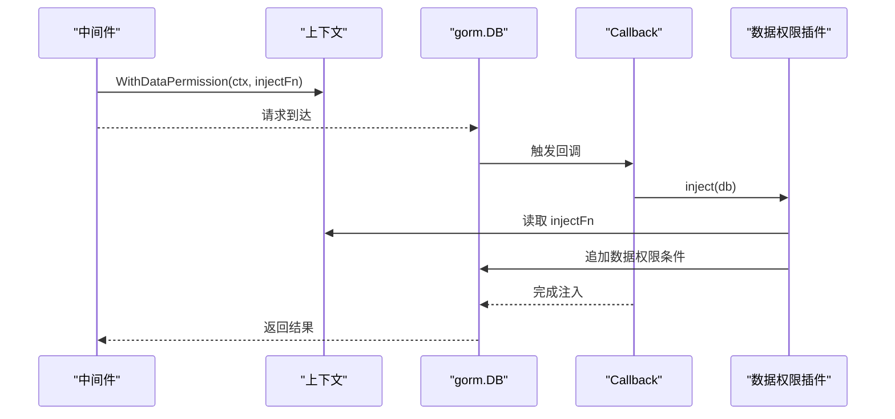
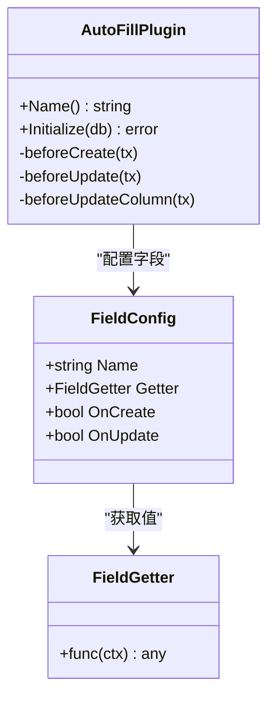
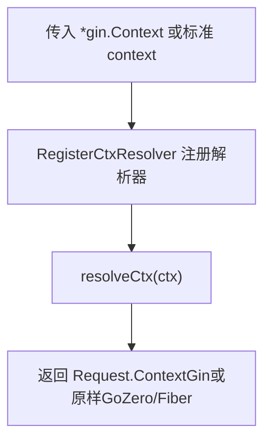
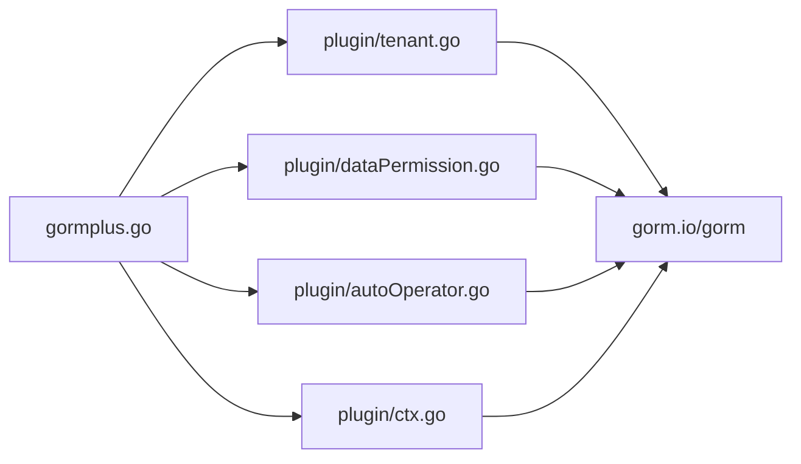

# 安全机制

<cite>
**本文档引用的文件**
- [plugin/tenant.go](file://plugin/tenant.go)
- [plugin/dataPermission.go](file://plugin/dataPermission.go)
- [plugin/autoOperator.go](file://plugin/autoOperator.go)
- [plugin/ctx.go](file://plugin/ctx.go)
- [gormplus.go](file://gormplus.go)
- [README.md](file://README.md)
- [go.mod](file://go.mod)
- [version.go](file://version.go)
</cite>

## 目录
1. [简介](#简介)
2. [项目结构](#项目结构)
3. [核心组件](#核心组件)
4. [架构总览](#架构总览)
5. [详细组件分析](#详细组件分析)
6. [依赖分析](#依赖分析)
7. [性能考量](#性能考量)
8. [故障排查指南](#故障排查指南)
9. [结论](#结论)
10. [附录](#附录)

## 简介
本项目为企业级安全机制的综合实现，围绕多租户隔离、数据权限控制与自动填充三大核心安全能力，提供可配置、可扩展、可审计的自动化安全策略。通过 GORM Callback 钩子在查询、更新、删除、创建等生命周期阶段自动注入安全条件，结合中间件上下文传递与运行时动态配置，实现“零侵入”的数据安全边界。

- 多租户安全：自动注入租户条件、联表自动注入、重复条件与 OR 绕过防护、全表操作保护、覆盖租户 ID 与超管跳过。
- 数据权限：基于上下文的条件注入、复杂权限逻辑支持、排除表配置。
- 自动填充：创建人/更新人自动写入、字段配置与 Getter 安全机制。
- 安全最佳实践：中间件集成、权限验证、数据隔离、漏洞防护与合规要求。

## 项目结构
- plugin：安全插件集合（多租户、数据权限、自动填充、上下文解析器）
- gormplus：统一入口，导出插件注册与便捷 API
- query：原生链式条件构造器、慢查询监控等周边能力
- dal：SQL 文件化查询（可选）
- generator：代码生成器（可选）

图表来源
- [plugin/ctx.go:1-44](file://plugin/ctx.go#L1-L44)
- [plugin/tenant.go:355-381](file://plugin/tenant.go#L355-L381)
- [plugin/dataPermission.go:140-162](file://plugin/dataPermission.go#L140-L162)
- [plugin/autoOperator.go:190-208](file://plugin/autoOperator.go#L190-L208)

章节来源
- [README.md:17-41](file://README.md#L17-L41)
- [go.mod:1-26](file://go.mod#L1-L26)

## 核心组件
- 多租户插件：在 Query/Update/Delete/Create 前自动注入租户条件，支持单字段/多字段/按表覆盖、联表自动注入、重复条件策略、OR 绕过拒绝、全表保护、覆盖租户 ID 与超管跳过。
- 数据权限插件：通过中间件注入函数在 Query/Update/Delete 前追加数据范围条件，支持排除表、运行时动态维护。
- 自动填充插件：在 Create/Update 前自动填充创建人/更新人等字段，支持多字段、多 Getter、UpdateColumn 兼容路径。
- 上下文解析器：屏蔽 Gin/GoZero/Fiber 等框架差异，统一从 Request.Context 读取中间件注入的值。

章节来源
- [plugin/tenant.go:239-336](file://plugin/tenant.go#L239-L336)
- [plugin/dataPermission.go:108-126](file://plugin/dataPermission.go#L108-L126)
- [plugin/autoOperator.go:120-138](file://plugin/autoOperator.go#L120-L138)
- [plugin/ctx.go:7-35](file://plugin/ctx.go#L7-L35)

## 架构总览
多租户与数据权限通过 GORM Callback 在 SQL 构造阶段注入 WHERE 条件；自动填充在 Create/Update 前写入字段值；上下文解析器保证中间件与插件之间的数据一致性。

图表来源
- [plugin/tenant.go:355-381](file://plugin/tenant.go#L355-L381)
- [plugin/dataPermission.go:140-162](file://plugin/dataPermission.go#L140-L162)
- [plugin/autoOperator.go:190-208](file://plugin/autoOperator.go#L190-L208)
- [plugin/ctx.go:37-43](file://plugin/ctx.go#L37-L43)

## 详细组件分析

### 多租户插件（Tenant）
- 注入时机：Query/Update/Delete/Before、Create/Before
- 注入方式：支持 ModeScopes/ModeWhere（底层一致），默认 ModeScopes
- 多字段支持：TenantField/TenantFields/TableFields 三级优先级，按表覆盖
- 联表自动注入：解析 JOIN 子句与别名，自动为关联表注入租户条件，支持 ExcludeJoinTables 与 JoinTableOverrides
- 安全策略：
  - 重复条件策略：PolicySkip（默认）、PolicyReplace、PolicyAppend
  - OR 绕过拒绝：检测租户字段出现在 OR 条件中直接拒绝执行
  - 全表保护：默认禁止无业务条件的 Update/Delete，可通过 AllowGlobalUpdate/AllowGlobalDelete 或 AllowGlobalOperation 临时放开
  - 覆盖租户 ID：AllowOverrideTenantID=true 时，WithOverrideTenantID 可覆盖中间件注入的租户 ID
  - 超管跳过：SkipTenant 完全跳过租户过滤
- 运行时维护：AddExcludeTable/RemoveExcludeTable/ExcludedTables 动态维护排除表

图表来源
- [plugin/tenant.go:529-595](file://plugin/tenant.go#L529-L595)
- [plugin/tenant.go:644-713](file://plugin/tenant.go#L644-L713)
- [plugin/tenant.go:385-482](file://plugin/tenant.go#L385-L482)

章节来源
- [plugin/tenant.go:145-188](file://plugin/tenant.go#L145-L188)
- [plugin/tenant.go:239-336](file://plugin/tenant.go#L239-L336)
- [plugin/tenant.go:529-595](file://plugin/tenant.go#L529-L595)
- [plugin/tenant.go:644-713](file://plugin/tenant.go#L644-L713)
- [plugin/tenant.go:809-865](file://plugin/tenant.go#L809-L865)
- [plugin/tenant.go:1030-1068](file://plugin/tenant.go#L1030-L1068)
- [plugin/tenant.go:1085-1130](file://plugin/tenant.go#L1085-L1130)

### 数据权限插件（DataPermission）
- 注入时机：Query/Update/Delete/Before
- 注入方式：统一使用 db.Statement.Where（ModeScopes/ModeWhere 语义一致）
- 条件来源：中间件通过 WithDataPermission(ctx, fn) 注入，fn(db, tableName) 决定追加何种条件
- 排除表：ExcludeTables 精确匹配，支持运行时 Add/Remove/ExcludedTables 快照
- 跳过机制：SkipDataPermission(ctx) 跳过数据权限过滤

图表来源
- [plugin/dataPermission.go:164-204](file://plugin/dataPermission.go#L164-L204)
- [plugin/dataPermission.go:231-249](file://plugin/dataPermission.go#L231-L249)
- [plugin/dataPermission.go:282-316](file://plugin/dataPermission.go#L282-L316)

章节来源
- [plugin/dataPermission.go:108-126](file://plugin/dataPermission.go#L108-L126)
- [plugin/dataPermission.go:164-204](file://plugin/dataPermission.go#L164-L204)
- [plugin/dataPermission.go:231-249](file://plugin/dataPermission.go#L231-L249)
- [plugin/dataPermission.go:282-316](file://plugin/dataPermission.go#L282-L316)

### 自动填充插件（AutoFill）
- 注册：db.Use(NewAutoFillPlugin(AutoFillConfig{Fields: [...]})
- 字段配置：Name 支持结构体字段名或列名，Getter 支持内置 CtxGetter/OperatorGetter 或自定义
- 注入时机：Create/Before、Update/Before、UpdateColumn/Before（兼容 SkipHooks 路径）
- UpdateSimple 兼容：通过 clause.Set 追加赋值，避免 SetColumn 在 SkipHooks 下失效
- 多字段：支持同时填充多个字段，Create/Update 分别控制 OnCreate/OnUpdate

图表来源
- [plugin/autoOperator.go:140-180](file://plugin/autoOperator.go#L140-L180)
- [plugin/autoOperator.go:190-208](file://plugin/autoOperator.go#L190-L208)
- [plugin/autoOperator.go:210-275](file://plugin/autoOperator.go#L210-L275)
- [plugin/autoOperator.go:285-309](file://plugin/autoOperator.go#L285-L309)

章节来源
- [plugin/autoOperator.go:120-138](file://plugin/autoOperator.go#L120-L138)
- [plugin/autoOperator.go:190-208](file://plugin/autoOperator.go#L190-L208)
- [plugin/autoOperator.go:210-275](file://plugin/autoOperator.go#L210-L275)
- [plugin/autoOperator.go:285-309](file://plugin/autoOperator.go#L285-L309)

### 上下文解析器（CtxResolver）
- 作用：屏蔽 Gin/GoZero/Fiber 等框架差异，统一从 Request.Context 读取中间件注入的值
- 注册：RegisterCtxResolver(fn)，仅需在 Gin 项目注册一次
- 使用：resolveCtx(ctx) 在插件内部统一解析

图表来源
- [plugin/ctx.go:16-35](file://plugin/ctx.go#L16-L35)
- [plugin/ctx.go:37-43](file://plugin/ctx.go#L37-L43)

章节来源
- [plugin/ctx.go:7-35](file://plugin/ctx.go#L7-L35)
- [plugin/ctx.go:37-43](file://plugin/ctx.go#L37-L43)

## 依赖分析
- gorm-plus 作为统一入口，导出插件注册与便捷 API，内部委托 plugin 包实现具体功能
- 插件依赖 gorm.io/gorm 的 Callback 机制与 clause 构造
- 依赖关系图

图表来源
- [gormplus.go:88-101](file://gormplus.go#L88-L101)
- [plugin/tenant.go:131-141](file://plugin/tenant.go#L131-L141)
- [plugin/dataPermission.go:3-10](file://plugin/dataPermission.go#L3-L10)
- [plugin/autoOperator.go:3-8](file://plugin/autoOperator.go#L3-L8)
- [plugin/ctx.go:3](file://plugin/ctx.go#L3)

章节来源
- [gormplus.go:88-101](file://gormplus.go#L88-L101)
- [go.mod:5-10](file://go.mod#L5-L10)

## 性能考量
- 多租户注入策略：
  - PolicySkip：扫描现有 WHERE 条件，避免重复注入，OR 危险拒绝，兼顾安全与性能
  - PolicyReplace：先移除业务条件再注入，强制隔离，适合严格场景
  - PolicyAppend：不检查直接追加，性能最优，但可能产生重复条件
- 联表注入：仅在 AutoInjectJoinTables=true 且存在 JOIN 时触发，解析别名，避免对无关联表的查询造成额外开销
- 数据权限：注入函数由业务层实现，插件仅调用，避免在插件层实现复杂 SQL
- 自动填充：Create/Update 前注入，仅对有 Schema 的结构体有效，避免原生 SQL 的无 Schema 场景

[本节为通用性能讨论，不直接分析具体文件]

## 故障排查指南
- 租户条件未生效
  - 检查是否注册了 ctx 解析器（Gin 项目必须）
  - 确认中间件是否正确写入 WithTenantID/WithOverrideTenantID/SkipTenant
  - 检查重复条件策略与 OR 危险检测
- 全表 Update/Delete 被拒绝
  - 添加业务 WHERE 条件或使用 AllowGlobalOperation 临时放开
  - 如需永久放开，配置 AllowGlobalUpdate/AllowGlobalDelete
- 联表未注入租户条件
  - 检查 AutoInjectJoinTables/ExcludeJoinTables/JoinTableOverrides 配置
  - 确认 JOIN 子句与别名解析
- 数据权限条件未生效
  - 检查中间件是否调用 WithDataPermission 注入函数
  - 确认表名是否在 ExcludeTables 中
- 自动填充字段未写入
  - 检查 FieldConfig 的 Name/Getter/OnCreate/OnUpdate 配置
  - 确认中间件是否正确写入操作人上下文

章节来源
- [plugin/tenant.go:823-865](file://plugin/tenant.go#L823-L865)
- [plugin/tenant.go:385-482](file://plugin/tenant.go#L385-L482)
- [plugin/dataPermission.go:164-204](file://plugin/dataPermission.go#L164-L204)
- [plugin/autoOperator.go:210-275](file://plugin/autoOperator.go#L210-L275)

## 结论
本项目通过多租户、数据权限与自动填充三大插件，结合上下文解析器与 GORM Callback 钩子，在不侵入业务代码的前提下实现了企业级数据安全边界。其设计强调：
- 安全优先：重复条件策略、OR 绕过拒绝、全表保护、覆盖与跳过机制
- 灵活配置：多字段、按表覆盖、联表注入、排除表、运行时动态维护
- 易用集成：统一入口、中间件集成、上下文屏蔽框架差异
- 可审计与可扩展：清晰的配置与日志输出，便于合规与运维

[本节为总结性内容，不直接分析具体文件]

## 附录

### 安全配置最佳实践
- 中间件集成
  - Gin：注册 ctx 解析器，中间件写入 WithTenantID/WithDataPermission/操作人上下文
  - GoZero/Fiber：无需注册解析器，直接传标准 context
- 权限验证
  - 多租户：默认 PolicySkip，严格场景使用 PolicyReplace
  - 数据权限：按角色/部门/组织层级构建复杂条件，避免硬编码
- 数据隔离
  - ExcludeTables/ExcludeJoinTables 精准控制例外表
  - 联表注入与别名解析确保跨表隔离
- 漏洞防护
  - 禁止 OR 绕过：避免租户字段出现在 OR 条件中
  - 全表保护：默认拒绝无业务条件的 Update/Delete
  - 覆盖与跳过：仅在特权接口使用 WithOverrideTenantID/SkipTenant
- 合规要求
  - 记录慢查询与异常操作，便于审计
  - 使用 SQL 文件化查询（DAL）便于 DBA 审核与版本管理

章节来源
- [README.md:44-110](file://README.md#L44-L110)
- [plugin/tenant.go:385-482](file://plugin/tenant.go#L385-L482)
- [plugin/dataPermission.go:164-204](file://plugin/dataPermission.go#L164-L204)
- [plugin/autoOperator.go:190-208](file://plugin/autoOperator.go#L190-L208)