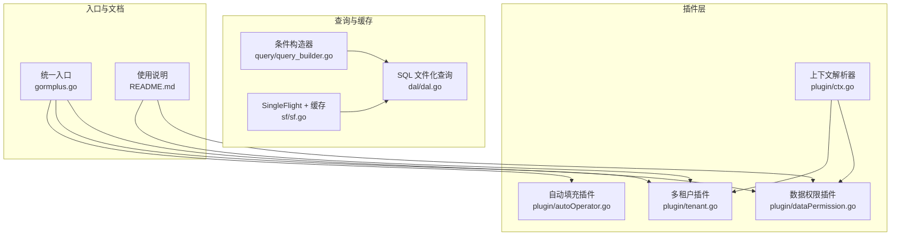
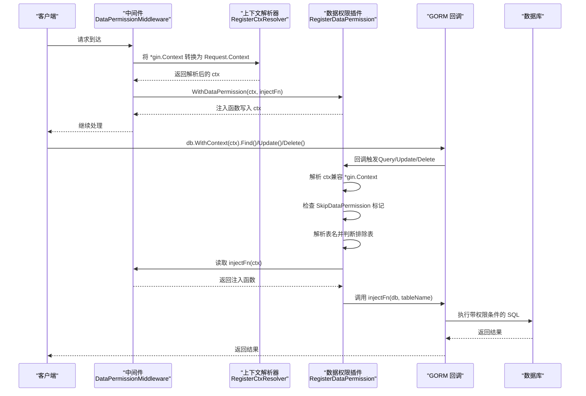
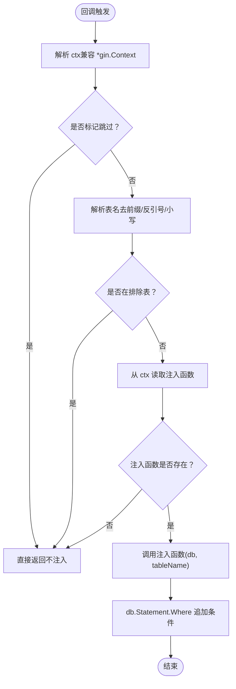
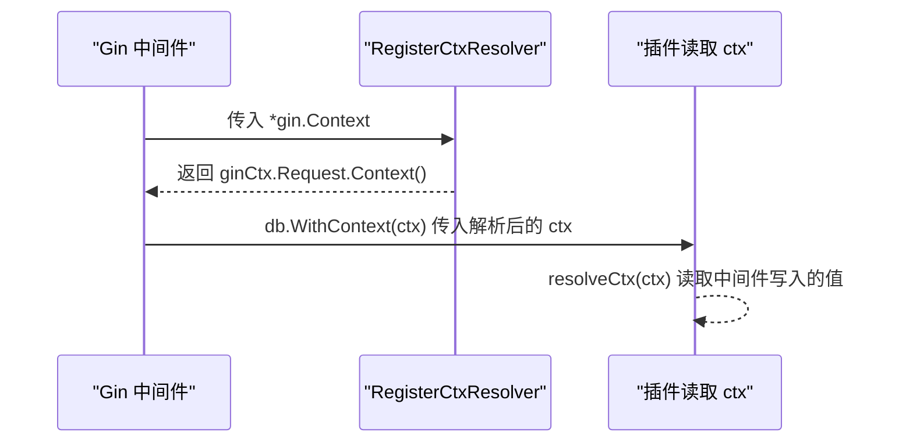
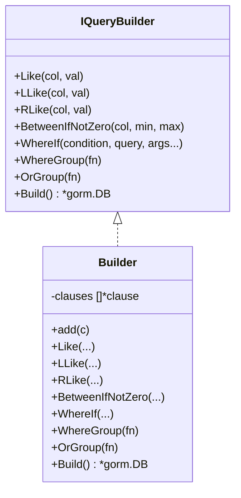
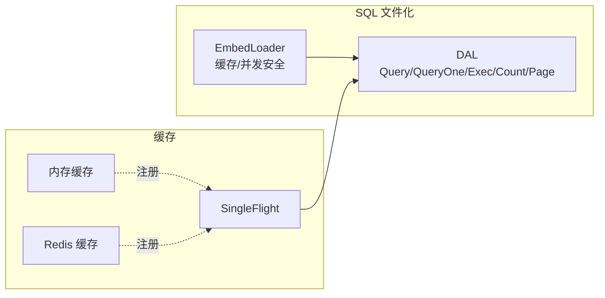
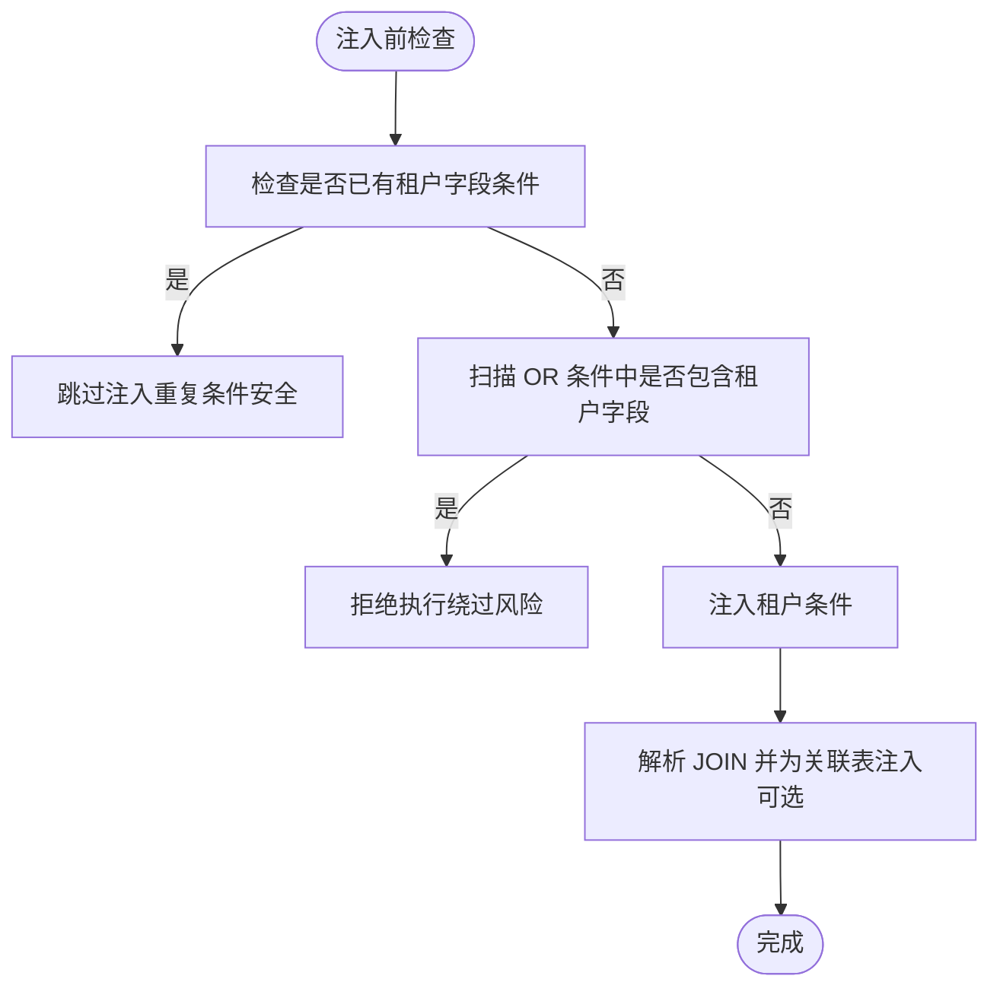
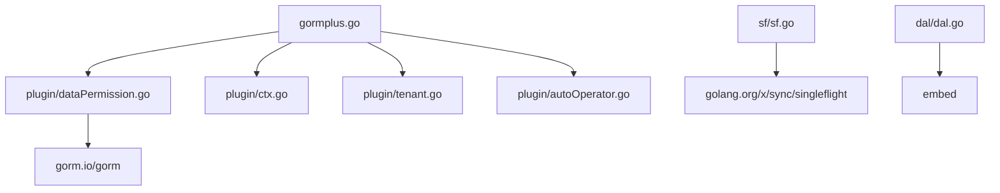

# 数据权限安全

<cite>
**本文引用的文件**
- [plugin/dataPermission.go](file://plugin/dataPermission.go)
- [plugin/dataPermission.md](file://plugin/dataPermission.md)
- [plugin/ctx.go](file://plugin/ctx.go)
- [gormplus.go](file://gormplus.go)
- [README.md](file://README.md)
- [sf/sf.go](file://sf/sf.go)
- [dal/dal.go](file://dal/dal.go)
- [dal/dal_test.go](file://dal/dal_test.go)
- [plugin/tenant.go](file://plugin/tenant.go)
- [plugin/tenant.md](file://plugin/tenant.md)
- [plugin/autoOperator.go](file://plugin/autoOperator.go)
- [query/query_builder.go](file://query/query_builder.go)
- [go.mod](file://go.mod)
</cite>

## 目录
1. [简介](#简介)
2. [项目结构](#项目结构)
3. [核心组件](#核心组件)
4. [架构总览](#架构总览)
5. [详细组件分析](#详细组件分析)
6. [依赖分析](#依赖分析)
7. [性能考量](#性能考量)
8. [故障排查指南](#故障排查指南)
9. [结论](#结论)
10. [附录](#附录)

## 简介
本文件围绕“数据权限安全”主题，系统梳理基于上下文的数据权限控制实现，涵盖权限规则的动态加载与验证、复杂权限逻辑支持、排除表配置的安全考量；阐述权限数据的存储与管理方式、权限缓存机制与权限变更的实时生效策略；给出权限配置最佳实践（权限模型设计、继承关系、组合规则）；说明如何防止权限绕过与越权访问（SQL 过滤器安全实现、权限白名单机制、审计日志记录）；并提供权限测试与验证的方法论。

## 项目结构
该项目以 gorm-plus 为核心扩展包，提供多租户、数据权限、自动填充、条件构造器、SQL 文件化查询、缓存、慢查询监控、代码生成等能力。数据权限安全机制主要由 plugin/dataPermission.go 提供，结合上下文解析器 plugin/ctx.go 与 gormplus.go 统一入口进行注册与使用。

**图表来源**
- [plugin/dataPermission.go:1-339](file://plugin/dataPermission.go#L1-L339)
- [plugin/ctx.go:1-44](file://plugin/ctx.go#L1-L44)
- [plugin/tenant.go:1-800](file://plugin/tenant.go#L1-L800)
- [plugin/autoOperator.go:1-309](file://plugin/autoOperator.go#L1-L309)
- [query/query_builder.go:1-307](file://query/query_builder.go#L1-L307)
- [dal/dal.go:1-800](file://dal/dal.go#L1-L800)
- [sf/sf.go:1-395](file://sf/sf.go#L1-L395)
- [gormplus.go:1-800](file://gormplus.go#L1-L800)
- [README.md:1-800](file://README.md#L1-L800)

**章节来源**
- [gormplus.go:1-800](file://gormplus.go#L1-L800)
- [README.md:1-800](file://README.md#L1-L800)

## 核心组件
- 数据权限插件：在 gorm 的 Query/Update/Delete 钩子中注入业务定义的权限条件，支持排除表、运行时动态增删排除表、跳过权限控制等。
- 上下文解析器：解决不同 Web 框架（如 gin）传入 *gin.Context 时插件无法读取中间件写入的 Request.Context 的问题。
- 条件构造器：提供链式条件拼装能力，支持 WhereIf/分组/范围等，便于在业务层构造复杂权限条件。
- SQL 文件化查询与缓存：通过 EmbedLoader 缓存 SQL、SingleFlight 防击穿、可插拔缓存（内存/Redis）提升性能与一致性。
- 多租户插件：提供租户隔离的参考实现，包含 OR 绕过检测、全表保护等安全策略，可借鉴其安全设计思路。

**章节来源**
- [plugin/dataPermission.go:1-339](file://plugin/dataPermission.go#L1-L339)
- [plugin/ctx.go:1-44](file://plugin/ctx.go#L1-L44)
- [query/query_builder.go:1-307](file://query/query_builder.go#L1-L307)
- [dal/dal.go:1-800](file://dal/dal.go#L1-L800)
- [sf/sf.go:1-395](file://sf/sf.go#L1-L395)
- [plugin/tenant.go:1-800](file://plugin/tenant.go#L1-L800)

## 架构总览
数据权限安全的整体工作流如下：Web 框架中间件将权限注入函数写入 context；gormplus 注册上下文解析器，屏蔽框架差异；数据权限插件在 gorm 回调阶段读取 context，解析表名，判断排除表，再调用业务注入函数追加 WHERE 条件；最终在数据库层面实现数据权限隔离。

**图表来源**
- [plugin/dataPermission.go:140-204](file://plugin/dataPermission.go#L140-L204)
- [plugin/ctx.go:37-43](file://plugin/ctx.go#L37-L43)
- [plugin/dataPermission.md:17-35](file://plugin/dataPermission.md#L17-L35)
- [README.md:493-532](file://README.md#L493-L532)

**章节来源**
- [plugin/dataPermission.go:140-204](file://plugin/dataPermission.go#L140-L204)
- [plugin/ctx.go:37-43](file://plugin/ctx.go#L37-L43)
- [plugin/dataPermission.md:17-35](file://plugin/dataPermission.md#L17-L35)
- [README.md:493-532](file://README.md#L493-L532)

## 详细组件分析

### 数据权限插件（核心）
- 注册与初始化：在 gorm 的 Query/Update/Delete 钩子中注册回调，确保所有读写操作自动注入权限条件。
- 注入流程：解析 ctx（兼容 *gin.Context）、检查跳过标记、解析表名、判断排除表、读取业务注入函数、调用注入函数追加 WHERE 条件。
- 排除表管理：支持静态配置与运行时动态增删，线程安全；提供排除表快照查询，便于调试。
- 注入方式：底层统一使用 db.Statement.Where 注入，兼容 ModeScopes/ModeWhere 语义差异。
- 跳过机制：提供 SkipDataPermission，用于超管查看全量数据、内部统计、定时任务等特权场景。

**图表来源**
- [plugin/dataPermission.go:169-204](file://plugin/dataPermission.go#L169-L204)
- [plugin/dataPermission.go:206-227](file://plugin/dataPermission.go#L206-L227)
- [plugin/dataPermission.go:282-316](file://plugin/dataPermission.go#L282-L316)

**章节来源**
- [plugin/dataPermission.go:140-204](file://plugin/dataPermission.go#L140-L204)
- [plugin/dataPermission.go:206-227](file://plugin/dataPermission.go#L206-L227)
- [plugin/dataPermission.go:282-316](file://plugin/dataPermission.go#L282-L316)

### 上下文解析器（关键）
- 目标：解决 gin 项目直接传 *gin.Context 给 db.WithContext() 时，插件无法从 *gin.Context 读取到中间件写入 Request.Context() 数据的问题。
- 机制：注册全局 ctx 解析器，resolveCtx 统一转换；业务代码可直接传 *gin.Context，无需手动 c.Request.Context()。

**图表来源**
- [plugin/ctx.go:31-43](file://plugin/ctx.go#L31-L43)
- [gormplus.go:105-125](file://gormplus.go#L105-L125)

**章节来源**
- [plugin/ctx.go:31-43](file://plugin/ctx.go#L31-L43)
- [gormplus.go:105-125](file://gormplus.go#L105-L125)

### 条件构造器（支撑）
- 提供 Like/LLike/RLike、BetweenIfNotZero、WhereIf、WhereGroup/OrGroup 等链式能力，便于在业务层构造复杂权限条件。
- Build 后返回原生 *gorm.DB，可继续使用 Find/Count/Joins 等。

**图表来源**
- [query/query_builder.go:66-145](file://query/query_builder.go#L66-L145)
- [query/query_builder.go:164-242](file://query/query_builder.go#L164-L242)

**章节来源**
- [query/query_builder.go:66-145](file://query/query_builder.go#L66-L145)
- [query/query_builder.go:164-242](file://query/query_builder.go#L164-L242)

### SQL 文件化查询与缓存（性能与一致性）
- SQL 文件化：通过 EmbedLoader 缓存 SQL，支持位置参数与命名参数，支持预热与定时清理。
- 缓存：SingleFlight 防击穿，可插拔缓存（默认内存缓存，支持 Redis），提供 SF/SFWithTTL/SFNoCache/SFInvalidate。
- 与数据权限协同：可在查询前通过条件构造器拼装权限条件，再交由 DAL 执行，或直接使用 db.WithContext(ctx)。

**图表来源**
- [dal/dal.go:139-182](file://dal/dal.go#L139-L182)
- [dal/dal.go:594-628](file://dal/dal.go#L594-L628)
- [sf/sf.go:50-131](file://sf/sf.go#L50-L131)
- [sf/sf.go:235-350](file://sf/sf.go#L235-L350)

**章节来源**
- [dal/dal.go:139-182](file://dal/dal.go#L139-L182)
- [dal/dal.go:594-628](file://dal/dal.go#L594-L628)
- [sf/sf.go:50-131](file://sf/sf.go#L50-L131)
- [sf/sf.go:235-350](file://sf/sf.go#L235-L350)

### 多租户插件（安全设计参考）
- 安全保护：重复条件跳过、OR 绕过检测、禁止无业务条件的全表 Update/Delete。
- 联表自动注入：解析 JOIN 子句，自动为关联表注入租户条件，支持别名识别与覆盖配置。
- 动态排除：支持运行时动态维护排除表。

**图表来源**
- [plugin/tenant.go:385-482](file://plugin/tenant.go#L385-L482)
- [plugin/tenant.go:644-713](file://plugin/tenant.go#L644-L713)

**章节来源**
- [plugin/tenant.go:385-482](file://plugin/tenant.go#L385-L482)
- [plugin/tenant.go:644-713](file://plugin/tenant.go#L644-L713)

### 自动填充插件（辅助）
- 通过 context key 将操作人信息写入，自动填充创建/更新字段，减少业务代码侵入。
- 与数据权限配合：中间件将操作人信息写入 context，数据权限注入函数可据此构造权限条件。

**章节来源**
- [plugin/autoOperator.go:140-309](file://plugin/autoOperator.go#L140-L309)

## 依赖分析
- 模块依赖：gorm-plus 通过 gormplus.go 统一导出各模块；插件层依赖 gorm；缓存层依赖 golang.org/x/sync/singleflight；SQL 文件化查询依赖 embed。
- 关键依赖：
  - gorm.io/gorm：回调钩子、Statement、Clauses 等。
  - golang.org/x/sync/singleflight：并发合并与防击穿。
  - embed：SQL 文件打包进二进制。

**图表来源**
- [gormplus.go:88-101](file://gormplus.go#L88-L101)
- [go.mod:5-25](file://go.mod#L5-L25)

**章节来源**
- [gormplus.go:88-101](file://gormplus.go#L88-L101)
- [go.mod:5-25](file://go.mod#L5-L25)

## 性能考量
- 单一注入点：所有 Query/Update/Delete 操作在回调阶段统一注入，避免业务分散处理带来的遗漏。
- 缓存策略：默认内存缓存，支持 Redis；TTL 选择建议：列表/统计 3s~30s，配置/字典 1min~5min，详情/实时 0（SFNoCache）。
- SQL 缓存：EmbedLoader 缓存 SQL，支持定时清理，降低启动时延与内存占用。
- 并发控制：SingleFlight 合并同一瞬间的并发请求，避免缓存穿透与数据库压力。

**章节来源**
- [sf/sf.go:46-47](file://sf/sf.go#L46-L47)
- [sf/sf.go:235-350](file://sf/sf.go#L235-L350)
- [dal/dal.go:150-174](file://dal/dal.go#L150-L174)
- [dal/dal.go:502-519](file://dal/dal.go#L502-L519)

## 故障排查指南
- 无法读取中间件写入的 context 值
  - 确认已注册上下文解析器；若使用 gin，必须注册；go-zero/fiber 无需注册。
  - 检查中间件是否将注入函数写入 c.Request.Context()，而非 c。
- 注入条件未生效
  - 确认已注册数据权限插件；检查是否标记 SkipDataPermission；确认表名是否在排除表中。
  - 使用 DataPermissionExcludedTables 快照排查排除表配置。
- 权限绕过风险
  - 参考多租户插件的 OR 绕过检测与全表保护策略，确保业务层不直接拼接 OR 且不进行无业务条件的全表操作。
- 缓存一致性
  - 写操作后调用 SFInvalidate 主动失效；或使用 SFNoCache 保证实时性。

**章节来源**
- [plugin/ctx.go:31-43](file://plugin/ctx.go#L31-L43)
- [plugin/dataPermission.go:169-204](file://plugin/dataPermission.go#L169-L204)
- [plugin/dataPermission.go:318-338](file://plugin/dataPermission.go#L318-L338)
- [plugin/tenant.go:385-482](file://plugin/tenant.go#L385-L482)
- [sf/sf.go:275-291](file://sf/sf.go#L275-L291)

## 结论
数据权限安全机制通过“中间件注入 + 插件回调 + 排除表 + 跳过标记”的组合，实现了基于上下文的动态权限控制，并在 gorm 回调阶段统一注入，确保业务代码零改动。结合条件构造器、SQL 文件化查询与缓存体系，既能满足复杂权限逻辑，又能保障性能与一致性。多租户插件的安全设计（OR 绕过检测、全表保护）为数据权限安全提供了可借鉴的实现范式。

## 附录

### 最佳实践清单
- 权限模型设计
  - 明确“谁对什么资源拥有何种权限”，抽象为注入函数签名与上下文键值。
  - 将权限注入函数与业务解耦，注入函数仅负责追加 WHERE 条件。
- 权限继承与组合
  - 通过条件构造器的 WhereIf/WhereGroup/OrGroup 组合复杂权限逻辑。
  - 将“本人”“部门”“子部门”“角色相关部门”等维度拆分为可复用片段，按需组合。
- 排除表配置
  - 将公共表（如配置表、字典表）加入排除表，避免不必要的权限注入。
  - 使用运行时动态增删排除表，支持灰度与紧急调整。
- 跳过与特权
  - 仅在受控的特权接口中使用 SkipDataPermission，避免滥用。
- 缓存与一致性
  - 列表/统计使用带 TTL 的缓存；详情/实时使用 SFNoCache。
  - 写操作后主动失效相关缓存，避免脏读。
- 审计与可观测性
  - 结合慢查询监控与日志记录，对异常访问与高风险 SQL 进行告警。
  - 在中间件与插件层埋点，记录权限注入与排除表命中情况。

### 测试与验证方法论
- 单元测试
  - 使用 mockLoader 与内存数据库（SQLite）验证 SQL 加载、参数绑定、分页与缓存。
  - 验证条件构造器链式拼装与 Build 后的 SQL 生成。
- 集成测试
  - 模拟 gin 中间件写入 context，验证数据权限插件回调是否正确注入条件。
  - 验证排除表、跳过标记、运行时增删排除表的行为。
- 性能测试
  - 使用 SF/SFWithTTL/SFNoCache 对热点接口进行并发压测，观察缓存命中率与延迟。
  - 对 SQL 文件化查询进行预热与缓存清理测试。

**章节来源**
- [dal/dal_test.go:123-177](file://dal/dal_test.go#L123-L177)
- [dal/dal_test.go:268-321](file://dal/dal_test.go#L268-L321)
- [dal/dal_test.go:447-501](file://dal/dal_test.go#L447-L501)
- [sf/sf.go:235-350](file://sf/sf.go#L235-L350)