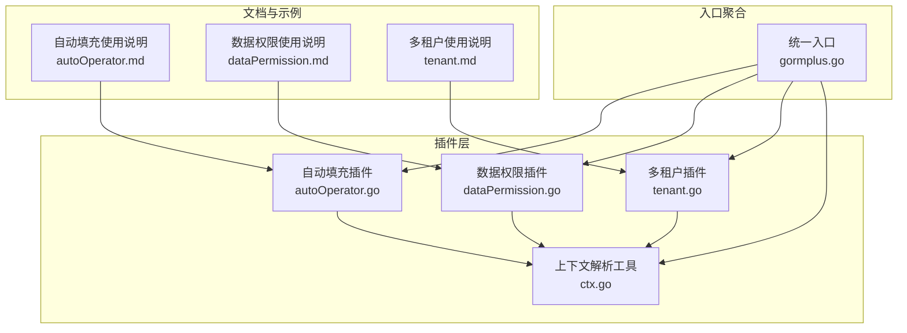
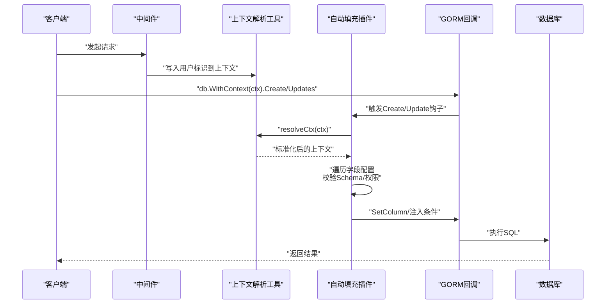
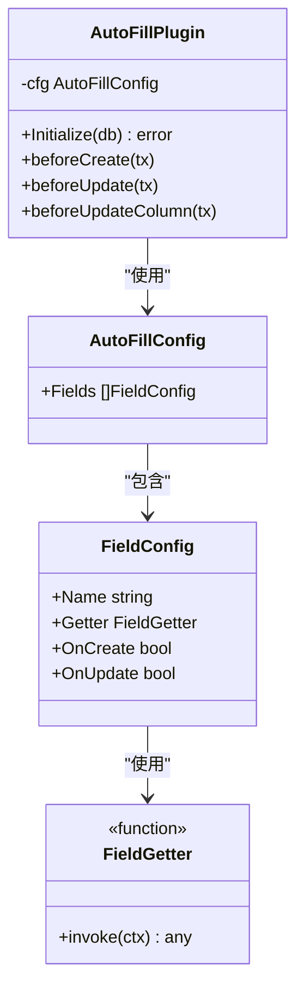
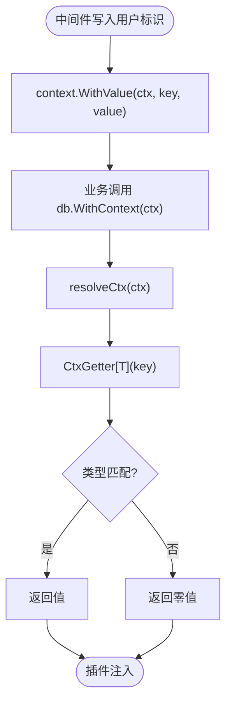
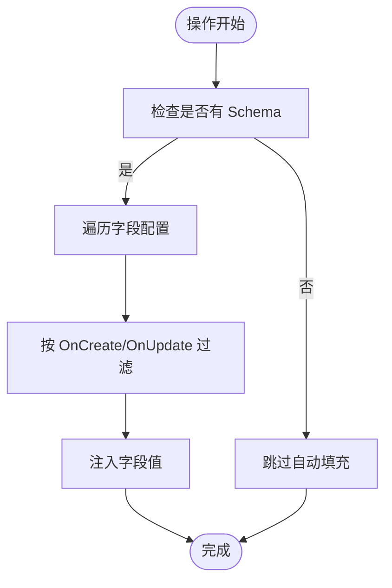
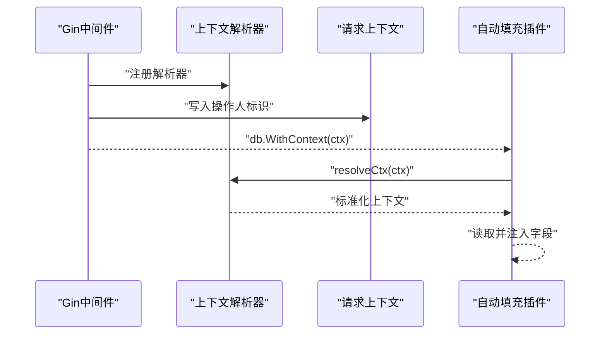
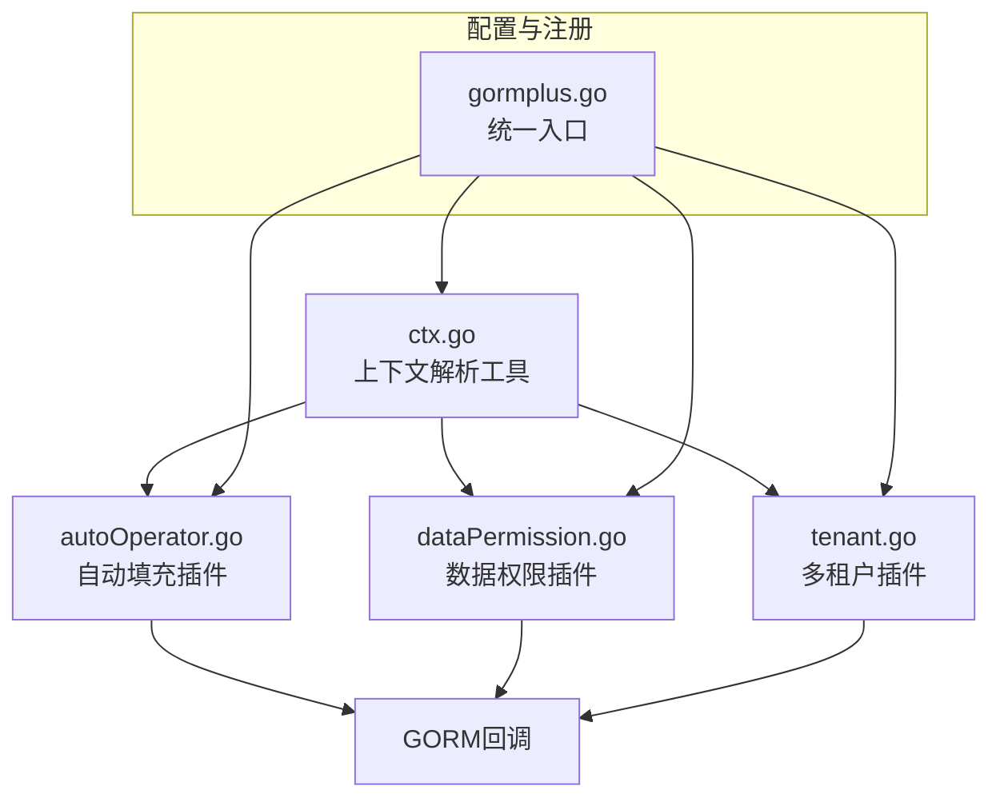

# 自动填充安全

<cite>
**本文档引用的文件**
- [autoOperator.go](file://plugin/autoOperator.go)
- [ctx.go](file://plugin/ctx.go)
- [dataPermission.go](file://plugin/dataPermission.go)
- [tenant.go](file://plugin/tenant.go)
- [autoOperator.md](file://plugin/autoOperator.md)
- [dataPermission.md](file://plugin/dataPermission.md)
- [tenant.md](file://plugin/tenant.md)
- [gormplus.go](file://gormplus.go)
- [dal_test.go](file://dal/dal_test.go)
</cite>

## 目录
1. [简介](#简介)
2. [项目结构](#项目结构)
3. [核心组件](#核心组件)
4. [架构概览](#架构概览)
5. [详细组件分析](#详细组件分析)
6. [依赖分析](#依赖分析)
7. [性能考虑](#性能考虑)
8. [故障排查指南](#故障排查指南)
9. [结论](#结论)
10. [附录](#附录)

## 简介
本文件聚焦于自动填充安全机制的技术文档，系统阐述以下方面：
- 自动填充插件的安全特性：创建人/更新人自动写入的安全保障、字段配置与获取器的安全机制
- Context 中用户信息提取与验证流程：防止恶意篡改用户标识的方法
- 自动填充字段的权限控制：只读字段保护、敏感字段过滤、批量操作的安全处理
- 中间件集成的安全配置示例：用户认证、会话管理、令牌验证
- 防止自动填充被恶意利用：输入验证、字段白名单、操作审计
- 安全测试与漏洞扫描建议

## 项目结构
本仓库围绕 GORM 插件生态提供多租户、数据权限、自动填充等能力。自动填充安全相关的核心位于 plugin 目录，入口聚合位于 gormplus.go。

**图表来源**
- [autoOperator.go:1-309](file://plugin/autoOperator.go#L1-L309)
- [dataPermission.go:1-339](file://plugin/dataPermission.go#L1-L339)
- [tenant.go:1-1223](file://plugin/tenant.go#L1-L1223)
- [ctx.go:1-44](file://plugin/ctx.go#L1-L44)
- [gormplus.go:1-1305](file://gormplus.go#L1-L1305)

**章节来源**
- [gormplus.go:1-1305](file://gormplus.go#L1-L1305)

## 核心组件
- 自动填充插件：在 Create/Update 钩子中根据配置自动写入字段值，支持多字段、多框架上下文解析。
- 上下文解析工具：统一处理 *gin.Context 等框架特定上下文，保证中间件写入的用户标识可被读取。
- 数据权限插件：在查询/更新/删除前注入数据范围条件，支持跳过与排除表。
- 多租户插件：在查询/更新/删除/创建前注入租户隔离条件，具备 OR 绕过检测与全表保护。

**章节来源**
- [autoOperator.go:140-309](file://plugin/autoOperator.go#L140-L309)
- [ctx.go:7-44](file://plugin/ctx.go#L7-L44)
- [dataPermission.go:128-204](file://plugin/dataPermission.go#L128-L204)
- [tenant.go:338-595](file://plugin/tenant.go#L338-L595)

## 架构概览
自动填充安全的整体流程：中间件在请求上下文中写入用户标识，插件通过上下文解析工具读取，结合字段配置在 GORM 钩子阶段自动写入数据库字段。多租户与数据权限插件在同一流程中提供额外的安全边界。

**图表来源**
- [autoOperator.go:190-275](file://plugin/autoOperator.go#L190-L275)
- [ctx.go:37-43](file://plugin/ctx.go#L37-L43)
- [gormplus.go:812-827](file://gormplus.go#L812-L827)

## 详细组件分析

### 自动填充插件安全机制
- 字段配置与获取器
  - 支持按结构体字段名或数据库列名配置，插件通过 GORM Schema 自动解析。
  - Getter 支持内置 OperatorGetter 与自定义函数，类型不匹配时返回零值，避免注入非法类型。
- 上下文解析与类型安全
  - 通过全局解析器统一处理 *gin.Context 等框架上下文，避免直接传入框架上下文导致读取不到中间件写入的值。
  - CtxGetter 在读取时进行类型断言，类型不符返回零值，防止类型混淆攻击。
- 钩子阶段注入
  - Create 前：仅 OnCreate=true 的字段写入。
  - Update 前：OnUpdate=true 的字段写入；针对 UpdateSimple/UpdateColumn 路径分别处理，避免 SetColumn 失效。
  - 无 Schema 的原生 SQL 跳过自动填充，避免误注入。
- 字段白名单与权限控制
  - 仅在配置中声明的字段才会被写入，形成天然白名单。
  - 通过 OnCreate/OnUpdate 控制写入时机，避免在更新时写入创建者字段。
  - 与多租户/数据权限插件配合，可在注入前检查 Schema 与上下文有效性。

**图表来源**
- [autoOperator.go:140-185](file://plugin/autoOperator.go#L140-L185)
- [autoOperator.go:120-138](file://plugin/autoOperator.go#L120-L138)
- [autoOperator.go:91-118](file://plugin/autoOperator.go#L91-L118)
- [autoOperator.go:37-40](file://plugin/autoOperator.go#L37-L40)

**章节来源**
- [autoOperator.go:37-74](file://plugin/autoOperator.go#L37-L74)
- [autoOperator.go:91-118](file://plugin/autoOperator.go#L91-L118)
- [autoOperator.go:120-138](file://plugin/autoOperator.go#L120-L138)
- [autoOperator.go:190-275](file://plugin/autoOperator.go#L190-L275)
- [autoOperator.go:279-309](file://plugin/autoOperator.go#L279-L309)

### 上下文解析与用户标识提取
- 解析器注册
  - 程序启动时注册框架特定解析器，如 Gin 将 *gin.Context 转换为 Request.Context。
  - 标准上下文框架（如 go-zero/fiber）无需注册。
- 用户标识提取
  - 中间件在请求上下文中写入用户标识（如操作人 ID、姓名等）。
  - 插件通过 CtxGetter 读取，类型不匹配返回零值，避免注入非预期类型。
- 防篡改机制
  - Getter 仅读取已注册 key 的值，未注册 key 返回零值。
  - 通过 resolveCtx 统一解析，避免框架差异导致读取失败。

**图表来源**
- [ctx.go:7-44](file://plugin/ctx.go#L7-L44)
- [autoOperator.go:55-74](file://plugin/autoOperator.go#L55-L74)

**章节来源**
- [ctx.go:7-44](file://plugin/ctx.go#L7-L44)
- [autoOperator.go:55-74](file://plugin/autoOperator.go#L55-L74)

### 权限控制与安全边界
- 只读字段保护
  - 通过 OnCreate/OnUpdate 精准控制写入时机，避免在更新时写入创建者字段。
- 敏感字段过滤
  - 仅在配置中声明的字段会被自动填充，形成白名单；未配置字段不会被写入。
- 批量操作安全
  - Create/Update 钩子在 SkipHooks=false 时生效；UpdateColumn/SkipHooks=true 路径通过直接写入 Dest map 或退回 SetColumn，避免遗漏。
- 与多租户/数据权限协同
  - 多租户插件在注入前检测 OR 条件与重复条件，防止绕过租户隔离。
  - 数据权限插件在 Query/Update/Delete 前注入业务条件，支持跳过与排除表。

**图表来源**
- [autoOperator.go:210-275](file://plugin/autoOperator.go#L210-L275)
- [autoOperator.go:279-283](file://plugin/autoOperator.go#L279-L283)

**章节来源**
- [autoOperator.go:210-275](file://plugin/autoOperator.go#L210-L275)
- [tenant.go:383-461](file://plugin/tenant.go#L383-L461)
- [dataPermission.go:164-204](file://plugin/dataPermission.go#L164-L204)

### 中间件集成与安全配置示例
- Gin 中间件
  - 注册上下文解析器，将 *gin.Context 转换为 Request.Context。
  - 在中间件中写入操作人 ID、姓名等标识到上下文。
- Go-Zero 中间件
  - 从 JWT payload 中读取用户标识，写入固定 key 的上下文。
- Echo/Fiber 中间件
  - 通过 UserContext 传递标准上下文，插件自动解析。

**图表来源**
- [autoOperator.md:1-102](file://plugin/autoOperator.md#L1-L102)
- [dataPermission.md:1-50](file://plugin/dataPermission.md#L1-L50)
- [tenant.md:1-30](file://plugin/tenant.md#L1-L30)

**章节来源**
- [autoOperator.md:1-102](file://plugin/autoOperator.md#L1-L102)
- [dataPermission.md:1-50](file://plugin/dataPermission.md#L1-L50)
- [tenant.md:1-30](file://plugin/tenant.md#L1-L30)

### 防止自动填充被恶意利用
- 输入验证
  - Getter 仅读取已注册 key 的值，类型不匹配返回零值，避免注入非法类型。
- 字段白名单
  - 仅在配置中声明的字段会被写入，未配置字段不会被自动填充。
- 操作审计
  - 结合多租户/数据权限插件，自动注入创建者/更新者与租户/数据范围条件，便于审计。
- 防绕过与全表保护
  - 多租户插件检测 OR 条件与重复条件，拒绝潜在绕过。
  - 全表 Update/Delete 默认拒绝，需显式允许。

**章节来源**
- [autoOperator.go:55-74](file://plugin/autoOperator.go#L55-L74)
- [tenant.go:383-461](file://plugin/tenant.go#L383-L461)
- [tenant.go:527-595](file://plugin/tenant.go#L527-L595)

## 依赖分析
自动填充插件与其他安全插件的协作关系：上下文解析工具为所有插件提供统一的上下文访问；多租户与数据权限插件在 GORM 钩子阶段注入安全条件，自动填充插件在相同阶段写入用户标识字段。

**图表来源**
- [ctx.go:7-44](file://plugin/ctx.go#L7-L44)
- [autoOperator.go:190-208](file://plugin/autoOperator.go#L190-L208)
- [dataPermission.go:140-162](file://plugin/dataPermission.go#L140-L162)
- [tenant.go:355-381](file://plugin/tenant.go#L355-L381)
- [gormplus.go:103-125](file://gormplus.go#L103-L125)

**章节来源**
- [gormplus.go:103-125](file://gormplus.go#L103-L125)

## 性能考虑
- 自动填充仅在有 Schema 的操作中生效，原生 SQL 与无 Schema 情况跳过，避免不必要的处理。
- UpdateSimple/UpdateColumn 路径采用针对性注入策略，减少重复写入与无效操作。
- 上下文解析器仅做一次转换，避免重复解析带来的性能损耗。

**章节来源**
- [autoOperator.go:279-309](file://plugin/autoOperator.go#L279-L309)
- [ctx.go:37-43](file://plugin/ctx.go#L37-L43)

## 故障排查指南
- 中间件未生效
  - 确认已注册上下文解析器（Gin 项目必须）。
  - 确认中间件在 db.WithContext(ctx) 之前写入了用户标识。
- 字段未写入
  - 检查字段配置是否包含 OnCreate/OnUpdate。
  - 确认字段名与数据库列名一致，或通过 GORM Schema 正确解析。
- 类型不匹配
  - Getter 返回零值表示类型不匹配，检查中间件写入的类型与 Getter 期望类型一致。
- 多租户/数据权限冲突
  - 检查是否存在 OR 条件或重复租户条件，插件会拒绝潜在绕过。

**章节来源**
- [autoOperator.go:55-74](file://plugin/autoOperator.go#L55-L74)
- [tenant.go:383-461](file://plugin/tenant.go#L383-L461)
- [dataPermission.go:164-204](file://plugin/dataPermission.go#L164-L204)

## 结论
自动填充安全机制通过“字段白名单 + 上下文解析 + 钩子阶段注入”的组合，实现了创建人/更新人自动写入的安全保障。配合多租户与数据权限插件，形成从用户标识提取、字段注入到访问边界的完整安全闭环。建议在生产环境中：
- 始终注册上下文解析器（Gin 项目）
- 严格控制字段配置与 Getter 类型
- 与多租户/数据权限插件协同启用
- 建立完善的中间件认证与会话管理

## 附录
- 安全测试建议
  - 单元测试：覆盖字段配置、Getter 类型断言、上下文解析器、钩子注入路径。
  - 集成测试：模拟中间件写入不同类型的用户标识，验证自动填充行为。
  - 漏洞扫描：重点检查 OR 绕过、重复条件、全表操作等风险点。
- 参考示例
  - 自动填充使用示例：[autoOperator.md:1-102](file://plugin/autoOperator.md#L1-L102)
  - 数据权限使用示例：[dataPermission.md:1-50](file://plugin/dataPermission.md#L1-L50)
  - 多租户使用示例：[tenant.md:1-30](file://plugin/tenant.md#L1-L30)

**章节来源**
- [autoOperator.md:1-102](file://plugin/autoOperator.md#L1-L102)
- [dataPermission.md:1-50](file://plugin/dataPermission.md#L1-L50)
- [tenant.md:1-30](file://plugin/tenant.md#L1-L30)
- [dal_test.go:1-1149](file://dal/dal_test.go#L1-L1149)