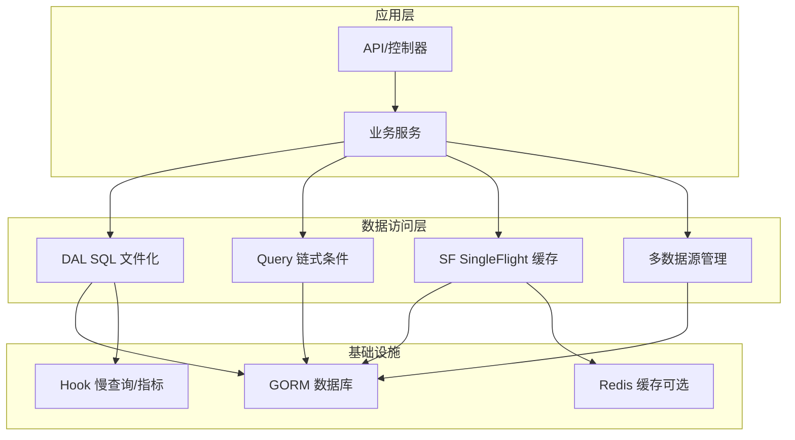
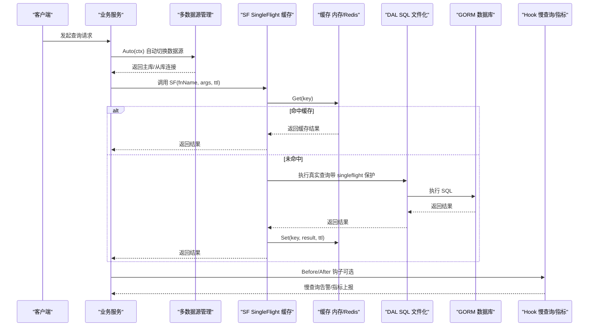
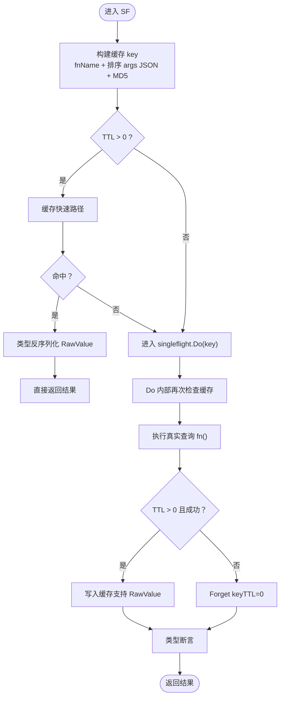
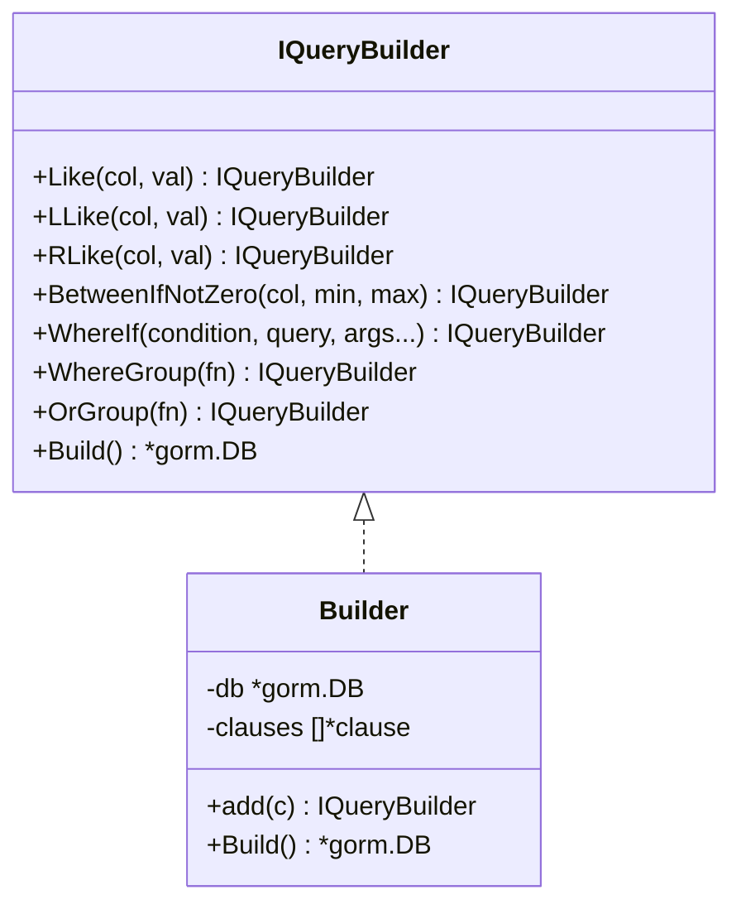
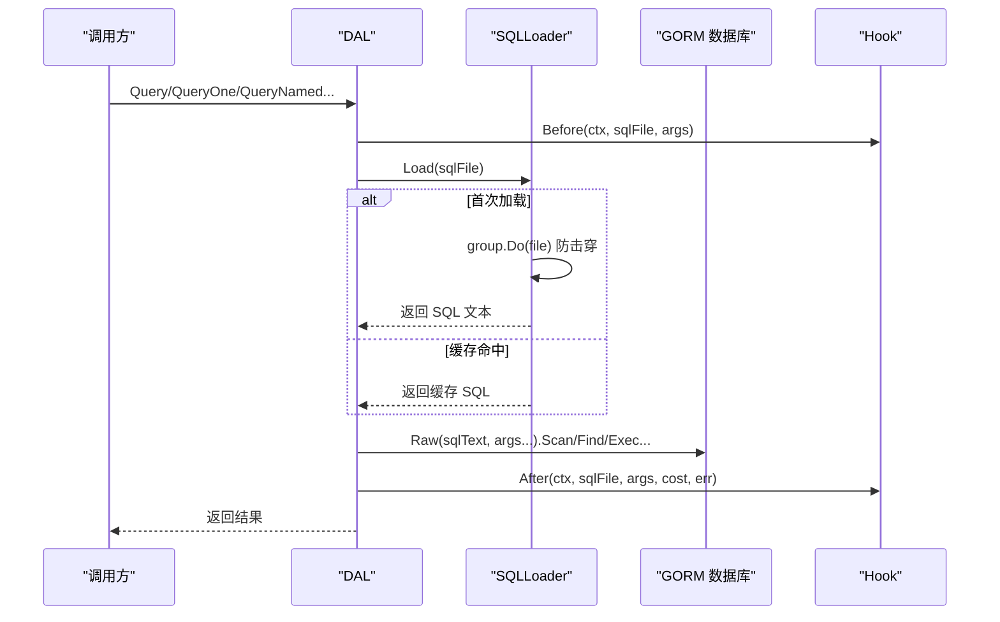
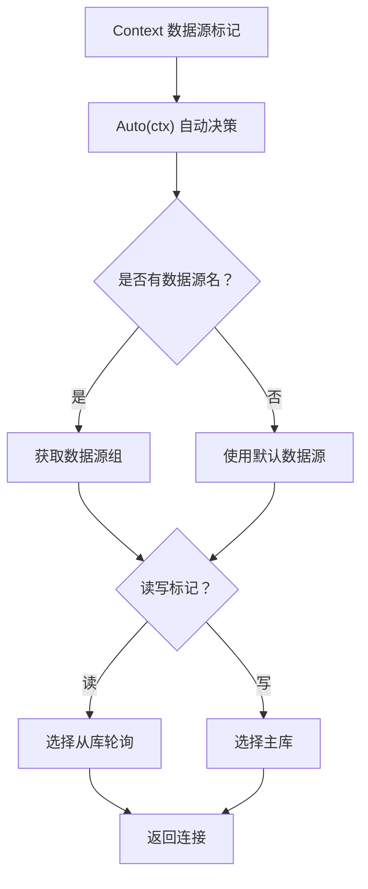
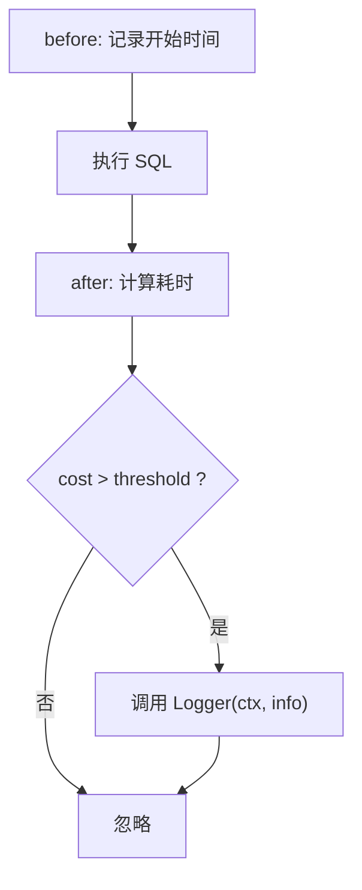
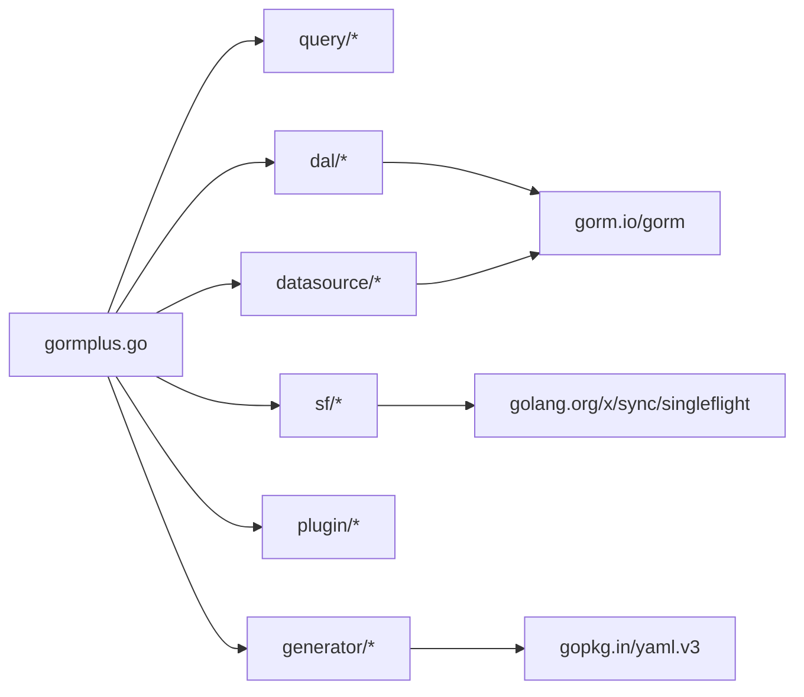

# 性能优化

<cite>
**本文引用的文件**
- [sf/sf.go](file://sf/sf.go)
- [query/query_builder.go](file://query/query_builder.go)
- [query/utils.go](file://query/utils.go)
- [query/slow_query.go](file://query/slow_query.go)
- [dal/dal.go](file://dal/dal.go)
- [dal/instance.go](file://dal/instance.go)
- [dal/loader.go](file://dal/loader.go)
- [datasource/manager.go](file://datasource/manager.go)
- [gormplus.go](file://gormplus.go)
- [plugin/dataPermission.go](file://plugin/dataPermission.go)
- [plugin/tenant.go](file://plugin/tenant.go)
- [plugin/autoOperator.go](file://plugin/autoOperator.go)
- [generator/generator.go](file://generator/generator.go)
- [generator/config.go](file://generator/config.go)
- [go.mod](file://go.mod)
- [README.md](file://README.md)
</cite>

## 目录
1. [简介](#简介)
2. [项目结构](#项目结构)
3. [核心组件](#核心组件)
4. [架构总览](#架构总览)
5. [详细组件分析](#详细组件分析)
6. [依赖分析](#依赖分析)
7. [性能考量](#性能考量)
8. [故障排查指南](#故障排查指南)
9. [结论](#结论)
10. [附录](#附录)

## 简介
本指南围绕 gorm-plus 仓库中的性能优化主题，系统讲解以下内容：
- SingleFlight 缓存系统（SF）的实现原理、使用方法与缓存清理策略
- 查询构建器（Query）的性能优化技巧（索引利用、查询计划优化、批量操作）
- DAL 层的性能优化策略（SQL 文件化管理、事务优化、连接池配置）
- 多数据源管理的增强特性（自动切换、读写分离、连接池优化）
- 性能监控与调优工具（慢查询监控、Hook 生命周期钩子）
- 内存使用优化、CPU 利用率提升、网络延迟降低的具体建议
- 不同场景下的性能优化策略与最佳实践

## 项目结构
该项目采用模块化设计，核心模块包括：
- query：原生 gorm 链式条件构造器与泛型分页
- dal：SQL 文件化查询（embed + 泛型）、事务、Hook、缓存清理
- sf：SingleFlight + 可插拔缓存（防缓存击穿）
- datasource：多数据源管理（读写分离、自动切换、连接池优化）
- plugin：多租户、数据权限、自动填充等插件
- generator：基于 YAML 的代码生成器（Model/Repository/API/VO/DTO）

**图表来源**
- [dal/dal.go:1-14](file://dal/dal.go#L1-L14)
- [query/query_builder.go:46-64](file://query/query_builder.go#L46-L64)
- [sf/sf.go:236-349](file://sf/sf.go#L236-L349)
- [datasource/manager.go:15-25](file://datasource/manager.go#L15-L25)
- [gormplus.go:348-473](file://gormplus.go#L348-L473)

**章节来源**
- [README.md:17-41](file://README.md#L17-L41)
- [go.mod:1-26](file://go.mod#L1-L26)

## 核心组件
- SingleFlight 缓存（sf）：提供缓存 + singleflight 合并并发请求，支持内存/Redis 等可插拔缓存，带后台过期清理与主动失效
- 查询构建器（query）：链式条件拼装、模糊/范围/分组查询、泛型分页、工具函数
- DAL 层（dal）：SQL 文件化管理、命名/位置参数、事务、Hook、缓存清理、预热
- 多数据源管理（datasource）：自动切换、读写分离、连接池独立配置、健康检查
- 慢查询监控（query.slow_query）：基于 gorm Callback 的慢 SQL 监控插件
- 插件（plugin）：多租户、数据权限、自动填充等安全与便利插件

**章节来源**
- [sf/sf.go:17-47](file://sf/sf.go#L17-L47)
- [query/query_builder.go:66-145](file://query/query_builder.go#L66-L145)
- [dal/dal.go:1-14](file://dal/dal.go#L1-L14)
- [datasource/manager.go:15-25](file://datasource/manager.go#L15-L25)
- [query/slow_query.go:13-58](file://query/slow_query.go#L13-L58)
- [plugin/tenant.go:1-15](file://plugin/tenant.go#L1-L15)
- [plugin/dataPermission.go:1-10](file://plugin/dataPermission.go#L1-L10)

## 架构总览
下图展示性能相关的关键交互：业务层通过 Query/DAL/SF/DS 访问数据库，SF 提供缓存与 singleflight 合并，DAL 提供 SQL 文件化与 Hook，多数据源管理提供自动切换与读写分离，慢查询监控插件在回调阶段统计耗时并输出。

**图表来源**
- [sf/sf.go:302-349](file://sf/sf.go#L302-L349)
- [datasource/manager.go:288-323](file://datasource/manager.go#L288-L323)
- [dal/dal.go:594-628](file://dal/dal.go#L594-L628)
- [query/slow_query.go:104-161](file://query/slow_query.go#L104-L161)

## 详细组件分析

### SingleFlight 缓存（SF）详解
- 设计目标
  - 防缓存击穿：同一时刻多个并发请求只执行一次真实查询，其余等待共享结果
  - 可插拔缓存：默认内存缓存，支持 Redis/Memcached 等替换
  - 主动失效：写操作后主动清除对应缓存键，避免脏读
- 关键机制
  - 缓存键构建：fnName + 排序后的 args JSON，MD5 哈希，保证 key 稳定
  - 两次缓存检查：进入 singleflight 前与 Do 内部二次检查，避免等待期间被其他 goroutine 写入导致重复执行
  - TTL 控制：TTL>0 写入缓存；TTL=0 使用 SFNoCache，立即 Forget，不合并
  - 注册缓存：全局注册一次，替换默认内存缓存；退出时停止内置内存缓存后台清理
  - RawValue 协议：支持外部缓存（如 Redis）的类型安全反序列化
- 使用建议
  - 列表/统计：3s~30s
  - 配置/字典：1min~5min
  - 详情/实时数据：0（SFNoCache）
  - 写操作后：调用 SFInvalidate 主动失效

**图表来源**
- [sf/sf.go:618-677](file://sf/sf.go#L618-L677)
- [sf/sf.go:679-712](file://sf/sf.go#L679-L712)

**章节来源**
- [sf/sf.go:236-349](file://sf/sf.go#L236-L349)
- [sf/sf.go:408-473](file://sf/sf.go#L408-L473)

### 查询构建器（Query）性能优化
- 条件拼装
  - Like/LLike/RLike：右侧模糊可利用前缀索引，优先使用 RLike
  - BetweenIfNotZero：任一边界为零值时跳过，避免无效范围
  - WhereIf：条件成立才拼装，减少无谓条件
  - WhereGroup/OrGroup：括号分组，保证语义正确
- 分页与扫描
  - FindByPage/ScanByPage：先 Count 再 Limit/Offset，避免全表扫描
  - ScanByPage：联表/自定义字段映射场景使用 Scan，避免 Find 的结构体映射开销
- 工具函数
  - isZeroVal：统一判断零值，避免空字符串/零值误触发条件

**图表来源**
- [query/query_builder.go:66-145](file://query/query_builder.go#L66-L145)
- [query/query_builder.go:165-221](file://query/query_builder.go#L165-L221)

**章节来源**
- [query/query_builder.go:66-145](file://query/query_builder.go#L66-L145)
- [query/utils.go:6-43](file://query/utils.go#L6-L43)

### DAL 层性能优化
- SQL 文件化管理
  - 通过 //go:embed 将 SQL 打包进二进制，便于 DBA 审核、版本管理
  - 支持位置参数（?）与命名参数（@name），命名参数适合参数较多的场景
  - singleflight 防击穿：首次加载时使用 singleflight 避免并发击穿
- 泛型查询与分页
  - Query/QueryOne/QueryNamed/QueryOneNamed：类型安全，减少手动断言
  - QueryPage/QueryPageNamed：count SQL 自动推导（count_ 前缀），减少重复 SQL
- 事务与执行
  - WithTx/TxQuery/TxQueryOne/TxQueryNamed/TxCount/TxExec：事务内执行，保证一致性
- Hook 与缓存清理
  - WithHook：可注册慢查询/指标/链路追踪等 Hook
  - WithCacheCleanup：定时清理 SQL 缓存，防止内存无限增长
  - Preload：应用启动时预热 SQL，避免首请求延迟

**图表来源**
- [dal/dal.go:594-628](file://dal/dal.go#L594-L628)
- [dal/loader.go:53-77](file://dal/loader.go#L53-L77)
- [dal/instance.go:237-254](file://dal/instance.go#L237-L254)

**章节来源**
- [dal/dal.go:569-762](file://dal/dal.go#L569-L762)
- [dal/dal.go:763-829](file://dal/dal.go#L763-L829)
- [dal/dal.go:831-975](file://dal/dal.go#L831-L975)
- [dal/dal.go:977-1115](file://dal/dal.go#L977-L1115)
- [dal/dal.go:1124-1444](file://dal/dal.go#L1124-L1444)
- [dal/loader.go:17-86](file://dal/loader.go#L17-L86)
- [dal/instance.go:17-259](file://dal/instance.go#L17-L259)

### 多数据源管理（DS）性能优化
- 自动切换与读写分离
  - Auto(ctx) 根据 context 自动决定数据源和读写类型
  - WithRead/WithWrite 标记读写意图，自动选择主库或从库
  - 从库轮询负载均衡，无从库时自动 fallback 主库
- 连接池优化
  - 独立连接池配置，支持生产推荐默认值
  - MaxOpen=50、MaxIdle=10、MaxLifetime=30min、MaxIdleTime=10min
  - 懒连接：首次 Write/Read 时才建立连接，启动不阻塞
- 健康检查与优雅关闭
  - Ping() 检查所有数据源节点连通性
  - Close() 关闭所有数据库连接，应用退出时调用

**图表来源**
- [datasource/manager.go:288-323](file://datasource/manager.go#L288-L323)
- [datasource/manager.go:163-169](file://datasource/manager.go#L163-L169)

**章节来源**
- [datasource/manager.go:15-579](file://datasource/manager.go#L15-L579)

### 慢查询监控（SlowQuery）
- 基于 gorm Callback，在 Query/Create/Update/Delete/Row/Raw 全部操作类型注册 before/after 钩子
- 超过阈值（默认 200ms）触发 Logger，支持接入 zap/logrus 等
- info.SQL 通过 Dialector.Explain 生成完整 SQL（已替换 ?），可直接 EXPLAIN 分析

**图表来源**
- [query/slow_query.go:104-161](file://query/slow_query.go#L104-L161)

**章节来源**
- [query/slow_query.go:13-83](file://query/slow_query.go#L13-L83)

### 插件（多租户/数据权限/自动填充）
- 多租户插件：自动注入 WHERE 条件，支持多字段、联表自动注入、安全策略（重复条件跳过、OR 绕过拒绝、全表保护）
- 数据权限插件：业务层注入函数，插件在回调阶段自动追加条件，支持跳过与动态排除表
- 自动填充插件：自动填充创建/更新字段，支持多种 Getter 函数，减少样板代码

**章节来源**
- [plugin/tenant.go:338-595](file://plugin/tenant.go#L338-L595)
- [plugin/dataPermission.go:128-204](file://plugin/dataPermission.go#L128-L204)
- [plugin/autoOperator.go:140-309](file://plugin/autoOperator.go#L140-L309)

## 依赖分析
- 外部依赖
  - gorm.io/gorm：ORM 核心
  - gorm.io/gen：类型安全链式构造器扩展
  - golang.org/x/sync：singleflight
  - gopkg.in/yaml.v3：代码生成器配置
- 内部模块耦合
  - gormplus.go 作为统一入口，导出 query/dal/sf/datasource/plugin/generator 等模块
  - SF 与 DAL 均依赖 golang.org/x/sync/singleflight
  - DAL 依赖 gorm 与 Hook 生命周期
  - 多数据源管理独立于其他模块，通过 context 传递数据源信息

**图表来源**
- [gormplus.go:88-101](file://gormplus.go#L88-L101)
- [go.mod:5-25](file://go.mod#L5-L25)

**章节来源**
- [go.mod:1-26](file://go.mod#L1-L26)
- [gormplus.go:88-101](file://gormplus.go#L88-L101)

## 性能考量
- 并发控制与缓存
  - 使用 SF 防止缓存击穿，合理设置 TTL，写操作后主动失效
  - 内存缓存默认启用，退出时调用 StopSFCache；Redis 模式由用户自行管理生命周期
  - RawValue 协议确保外部缓存的类型安全反序列化
- 查询优化
  - 优先使用 RLike（右侧模糊）利用前缀索引
  - 使用 BetweenIfNotZero 避免无效范围
  - WhereIf/WhereGroup/OrGroup 精准拼装条件，减少不必要的 OR
  - 分页使用 FindByPage/ScanByPage，先 Count 再 Limit/Offset
- SQL 文件化与缓存
  - 使用 DAL 的 SQL 文件化管理，结合 WithCacheCleanup 定时清理，避免内存膨胀
  - 启动时 Preload 预热 SQL，降低首请求延迟
  - EmbedLoader 使用 singleflight 防击穿，避免并发加载 SQL 文件
- 多数据源与连接池
  - 使用 Auto(ctx) 自动切换数据源，结合 WithRead/WithWrite 实现读写分离
  - 连接池配置建议：MaxOpen=50、MaxIdle=10、MaxLifetime=30min、MaxIdleTime=10min
  - 懒连接机制避免启动时建立连接，提高启动速度
- 监控与诊断
  - 注册慢查询监控，阈值建议 200ms~500ms，接入日志/指标系统
  - Hook 生命周期用于埋点与链路追踪

**章节来源**
- [sf/sf.go:40-47](file://sf/sf.go#L40-L47)
- [query/query_builder.go:87-107](file://query/query_builder.go#L87-L107)
- [dal/dal.go:265-281](file://dal/dal.go#L265-L281)
- [dal/dal.go:463-492](file://dal/dal.go#L463-L492)
- [datasource/manager.go:163-169](file://datasource/manager.go#L163-L169)
- [query/slow_query.go:73-83](file://query/slow_query.go#L73-L83)
- [README.md:189-194](file://README.md#L189-L194)

## 故障排查指南
- 缓存未生效或命中异常
  - 检查 args 是否一致（key 由排序后的 args JSON 构建）
  - 写操作后是否调用 SFInvalidate
  - TTL 设置是否合理（详情/实时数据建议 0）
  - RawValue 反序列化失败时检查 OnUnwrapError 钩子
- 缓存内存泄漏
  - 启用 WithCacheCleanup 定时清理；退出时调用 StopSFCache（内存缓存）
- SQL 首请求延迟
  - 使用 Preload 预热；或在启动阶段执行一次 Query/QueryNamed
  - 检查 EmbedLoader 的 singleflight 防击穿机制
- 多数据源切换问题
  - 检查 WithName/WithRead/WithWrite 是否正确设置
  - 使用 DS.Auto(ctx) 验证数据源选择逻辑
  - 检查连接池配置是否合理
- 慢查询定位
  - 注册慢查询监控，阈值调低至 200ms，观察 Logger 输出
  - 将 info.SQL 复制到数据库客户端执行 EXPLAIN 分析
- 多租户/数据权限导致的错误
  - OR 条件中出现租户字段会被拒绝，检查业务 SQL
  - 全表 Update/Delete 被拒绝时，添加业务 WHERE 条件或临时放开 AllowGlobalOperation

**章节来源**
- [sf/sf.go:275-291](file://sf/sf.go#L275-L291)
- [dal/dal.go:265-281](file://dal/dal.go#L265-L281)
- [datasource/manager.go:288-323](file://datasource/manager.go#L288-L323)
- [query/slow_query.go:104-161](file://query/slow_query.go#L104-L161)
- [plugin/tenant.go:384-482](file://plugin/tenant.go#L384-L482)

## 结论
通过 SF 缓存、Query 构建器、DAL SQL 文件化、多数据源管理与 Hook 监控，以及多租户/数据权限等插件，gorm-plus 提供了完善的性能优化与可观测性能力。实践中应结合场景合理设置 TTL、利用前缀索引、批量事务与连接池配置，并通过慢查询监控持续优化查询计划与索引设计。多数据源管理的自动切换与读写分离进一步提升了系统的可扩展性与可靠性。

## 附录
- 代码生成器配置示例与路径解析
  - generator.yaml：数据库与输出路径配置
  - LoadConfig：从 YAML 加载配置
  - 路径解析：resolveConfigPaths 将相对路径解析为绝对路径，确保跨目录运行一致性

**章节来源**
- [generator/config.go:10-31](file://generator/config.go#L10-L31)
- [generator/config.go:33-46](file://generator/config.go#L33-L46)
- [generator/generator.go:37-68](file://generator/generator.go#L37-L68)