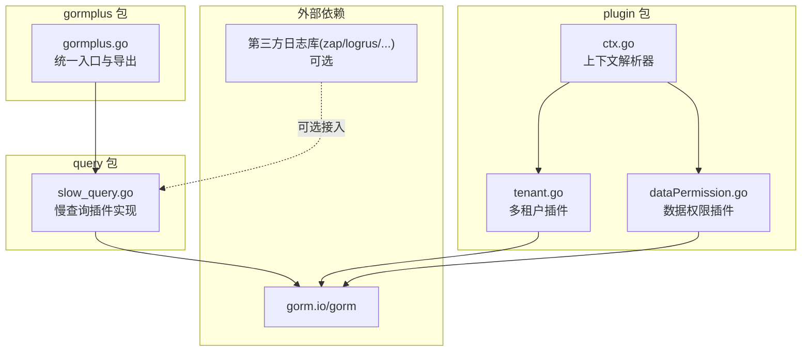
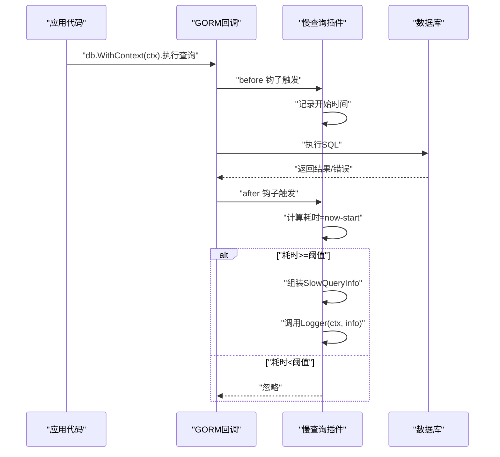
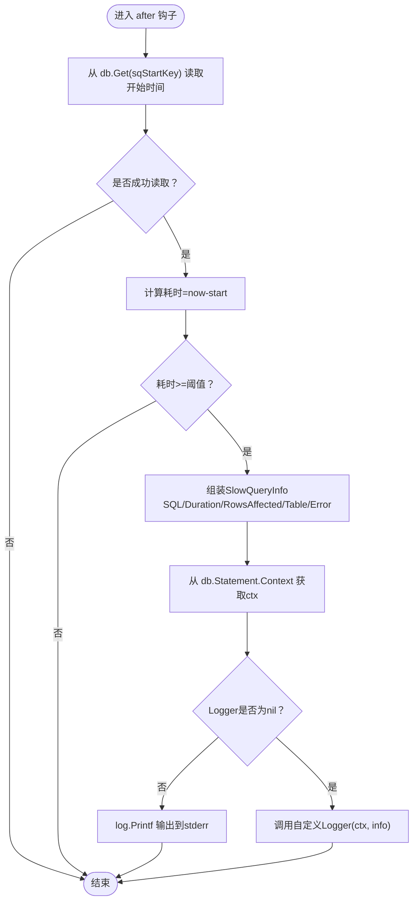
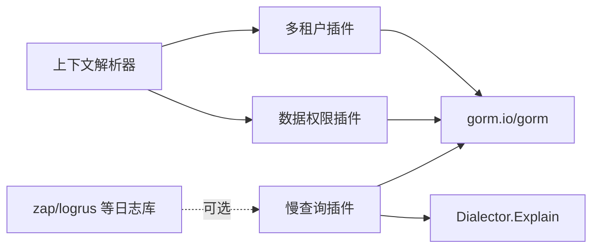

# 慢查询监控

<cite>
**本文引用的文件**   
- [query/slow_query.go](file://query/slow_query.go)
- [gormplus.go](file://gormplus.go)
- [plugin/tenant.go](file://plugin/tenant.go)
- [plugin/dataPermission.go](file://plugin/dataPermission.go)
- [plugin/ctx.go](file://plugin/ctx.go)
- [README.md](file://README.md)
- [go.mod](file://go.mod)
</cite>

## 目录
1. [简介](#简介)
2. [项目结构](#项目结构)
3. [核心组件](#核心组件)
4. [架构总览](#架构总览)
5. [详细组件分析](#详细组件分析)
6. [依赖关系分析](#依赖关系分析)
7. [性能考量](#性能考量)
8. [故障排查指南](#故障排查指南)
9. [结论](#结论)
10. [附录](#附录)

## 简介
本文件面向“慢查询监控”功能，系统性阐述其工作原理、实现机制、配置方法与最佳实践。重点包括：
- 基于 GORM 回调钩子的实现机制
- SQL 执行时间检测算法
- 阈值配置与日志输出机制
- SlowQueryConfig 配置项详解
- SlowQueryInfo 字段说明
- 与多租户插件、数据权限插件的兼容性
- 不同日志框架（标准库、zap、logrus）的集成方案
- 性能优化建议与监控指标设置指南

## 项目结构
围绕慢查询监控的核心文件位于 query 包，入口通过 gormplus 包对外导出。插件间通过 GORM 回调机制协同工作，上下文解析器统一屏蔽框架差异。

图表来源
- [query/slow_query.go:1-235](file://query/slow_query.go#L1-L235)
- [gormplus.go:839-874](file://gormplus.go#L839-L874)
- [plugin/tenant.go:1-1223](file://plugin/tenant.go#L1-L1223)
- [plugin/dataPermission.go:1-339](file://plugin/dataPermission.go#L1-L339)
- [plugin/ctx.go:1-44](file://plugin/ctx.go#L1-L44)

章节来源
- [query/slow_query.go:1-235](file://query/slow_query.go#L1-L235)
- [gormplus.go:839-874](file://gormplus.go#L839-L874)
- [plugin/tenant.go:1-1223](file://plugin/tenant.go#L1-L1223)
- [plugin/dataPermission.go:1-339](file://plugin/dataPermission.go#L1-L339)
- [plugin/ctx.go:1-44](file://plugin/ctx.go#L1-L44)

## 核心组件
- 慢查询插件（gorm-plus:slow_query）
  - 通过注册 before/after 钩子，在 SQL 执行前后记录时间并计算耗时
  - 超过阈值时调用自定义 Logger，或默认输出到标准库日志
- 配置对象（SlowQueryConfig）
  - Threshold：阈值，0 时自动设为默认 200ms
  - Logger：自定义日志函数，接收 ctx 与 SlowQueryInfo
- 信息对象（SlowQueryInfo）
  - SQL：已替换占位符的实际 SQL，便于 EXPLAIN
  - Duration：实际执行耗时
  - RowsAffected：影响/返回行数
  - Table：主表名
  - Error：执行错误（慢查询与错误可同时发生）

章节来源
- [query/slow_query.go:59-83](file://query/slow_query.go#L59-L83)
- [query/slow_query.go:91-109](file://query/slow_query.go#L91-L109)
- [query/slow_query.go:113-161](file://query/slow_query.go#L113-L161)

## 架构总览
慢查询监控通过 GORM 回调在 Query/Create/Update/Delete/Row/Raw 六类操作上注册 before/after 钩子，before 记录开始时间，after 计算耗时并触发日志。

图表来源
- [query/slow_query.go:113-161](file://query/slow_query.go#L113-L161)
- [query/slow_query.go:163-234](file://query/slow_query.go#L163-L234)

## 详细组件分析

### 慢查询插件实现（基于 GORM 回调）
- 注册点
  - 在 Query/Create/Update/Delete/Row/Raw 六类操作上分别注册 before/after 钩子
  - before 钩子将开始时间写入 db.Set(sqStartKey, now)
  - after 钩子从 db.Get(sqStartKey) 读取并计算耗时
- 耗时检测算法
  - 读取开始时间后，计算 time.Since(start)
  - 与阈值比较，低于阈值直接返回
  - 超过阈值时构造 SlowQueryInfo 并调用 Logger
- SQL 生成
  - 使用 db.Dialector.Explain(db.Statement.SQL.String(), db.Statement.Vars...)
  - 生成已替换占位符的完整 SQL，可直接复制到客户端执行与 EXPLAIN 分析
- 上下文透传
  - 从 db.Statement.Context 获取 ctx，便于透传 traceID 等链路信息
- 默认日志
  - Logger 为 nil 时，使用标准库 log.Printf 输出到 stderr

图表来源
- [query/slow_query.go:113-161](file://query/slow_query.go#L113-L161)

章节来源
- [query/slow_query.go:113-161](file://query/slow_query.go#L113-L161)
- [query/slow_query.go:163-234](file://query/slow_query.go#L163-L234)

### 配置项 SlowQueryConfig
- Threshold
  - 单位为时间，超过阈值才触发日志
  - 零值自动设为 200ms
  - 生产环境建议 200ms~500ms
- Logger
  - 函数签名：func(ctx context.Context, info SlowQueryInfo)
  - ctx 来自 db.WithContext(ctx)，可透传 traceID 等
  - 为 nil 时使用标准库 log 输出到 stderr

章节来源
- [query/slow_query.go:73-83](file://query/slow_query.go#L73-L83)
- [query/slow_query.go:104-109](file://query/slow_query.go#L104-L109)

### SlowQueryInfo 字段说明
- SQL：已替换 ? 的完整 SQL，可直接复制执行
- Duration：实际执行耗时
- RowsAffected：影响/返回行数
- Table：主表名（来自 gorm Statement.Table）
- Error：执行错误（慢查询与错误可同时发生）

章节来源
- [query/slow_query.go:59-71](file://query/slow_query.go#L59-L71)

### 与多租户插件的兼容性
- 注册顺序无要求，二者互不干扰
- 多租户插件在 Query/Update/Delete/Create 前注入 WHERE 条件，慢查询插件在 SQL 执行后检测耗时
- 两者均通过 GORM 回调机制工作，互不影响

章节来源
- [query/slow_query.go:53-53](file://query/slow_query.go#L53-L53)
- [plugin/tenant.go:355-381](file://plugin/tenant.go#L355-L381)

### 与数据权限插件的兼容性
- 数据权限插件在 Query/Update/Delete 前注入条件，慢查询插件在 SQL 执行后检测耗时
- 二者通过不同阶段的回调协作，互不冲突

章节来源
- [plugin/dataPermission.go:140-162](file://plugin/dataPermission.go#L140-L162)
- [query/slow_query.go:53-53](file://query/slow_query.go#L53-L53)

### 上下文解析器与 traceID 透传
- 通过 RegisterCtxResolver 注册框架特定的 ctx 解析器
- 业务代码可直接传 *gin.Context，无需手动 c.Request.Context()
- Logger 中可从 ctx 读取 traceID 等链路信息

章节来源
- [plugin/ctx.go:16-43](file://plugin/ctx.go#L16-L43)
- [gormplus.go:103-125](file://gormplus.go#L103-L125)

### 日志框架集成方案
- 标准库日志（默认）
  - Logger 为 nil 时，使用 log.Printf 输出到 stderr
- zap（推荐生产环境）
  - 在 Logger 中使用 zap.L().Warn(...) 输出，字段包含 cost/table/sql/rows/error
- logrus
  - 在 Logger 中使用 logrus.WithFields(...) 输出，字段同上
- traceID 透传
  - 从 ctx 读取 traceID，加入日志字段，便于链路追踪

章节来源
- [query/slow_query.go:19-50](file://query/slow_query.go#L19-L50)
- [query/slow_query.go:154-160](file://query/slow_query.go#L154-L160)
- [gormplus.go:843-866](file://gormplus.go#L843-L866)

## 依赖关系分析
- 慢查询插件依赖 GORM 回调机制与 Dialector.Explain
- 与其他插件（多租户、数据权限）通过 GORM 回调协同
- 日志框架为可选依赖，通过 Logger 函数注入

图表来源
- [query/slow_query.go:10-11](file://query/slow_query.go#L10-L11)
- [plugin/tenant.go:138-141](file://plugin/tenant.go#L138-L141)
- [plugin/dataPermission.go:9-10](file://plugin/dataPermission.go#L9-L10)
- [plugin/ctx.go:31-43](file://plugin/ctx.go#L31-L43)

章节来源
- [query/slow_query.go:10-11](file://query/slow_query.go#L10-L11)
- [plugin/tenant.go:138-141](file://plugin/tenant.go#L138-L141)
- [plugin/dataPermission.go:9-10](file://plugin/dataPermission.go#L9-L10)
- [plugin/ctx.go:31-43](file://plugin/ctx.go#L31-L43)

## 性能考量
- 钩子开销
  - 每次 SQL 执行增加一次时间读取与比较，开销极低
  - 仅在超过阈值时进行日志输出，避免高频日志噪声
- 阈值设置
  - 开发环境可设较低阈值（如 100ms），生产环境建议 200ms~500ms
  - 避免将阈值设为 0，以免触发过多日志
- SQL 生成成本
  - Explain 会替换占位符生成完整 SQL，对复杂 SQL 有一定成本
  - 建议仅在超过阈值时生成，插件已保证仅在必要时调用
- 日志输出
  - Logger 中的序列化与 IO 成本应尽量降低
  - 建议使用结构化日志（zap）并控制字段数量

[本节为通用指导，不直接分析具体文件]

## 故障排查指南
- 未触发日志
  - 检查 Threshold 是否过大
  - 确认 Logger 是否为 nil（为 nil 时仅输出到 stderr）
- SQL 未替换占位符
  - 确保使用 gorm 的原生 SQL 构造方式
  - 检查 db.Dialector.Explain 是否可用
- traceID 透传失败
  - 确认已注册 RegisterCtxResolver
  - 确认中间件已将 traceID 写入 ctx，并在 db.WithContext(ctx) 时传递
- 与多租户/数据权限冲突
  - 二者均通过回调工作，互不干扰
  - 如出现异常，检查回调注册顺序与业务 SQL 的 WHERE 条件

章节来源
- [query/slow_query.go:53-57](file://query/slow_query.go#L53-L57)
- [plugin/ctx.go:16-43](file://plugin/ctx.go#L16-L43)

## 结论
慢查询监控通过轻量的 GORM 回调钩子实现，具备以下优势：
- 覆盖全面：Query/Create/Update/Delete/Row/Raw 全部操作类型
- 高效低成本：仅在超阈值时输出日志
- 易集成：支持标准库与主流日志库（zap/logrus）
- 可扩展：通过 Logger 透传 traceID 等链路信息
- 兼容性好：与多租户、数据权限插件互不干扰

建议在生产环境合理设置阈值，结合结构化日志与链路追踪，持续优化慢查询。

[本节为总结，不直接分析具体文件]

## 附录

### 配置示例路径
- 标准库日志（默认）
  - [query/slow_query.go:21-24](file://query/slow_query.go#L21-L24)
- zap 集成
  - [query/slow_query.go:26-38](file://query/slow_query.go#L26-L38)
  - [gormplus.go:845-857](file://gormplus.go#L845-L857)
- logrus 集成
  - [query/slow_query.go:26-38](file://query/slow_query.go#L26-L38)
- traceID 透传
  - [query/slow_query.go:40-49](file://query/slow_query.go#L40-L49)
  - [gormplus.go:859-866](file://gormplus.go#L859-L866)

### 与多租户/数据权限的兼容性说明
- 与多租户插件
  - [query/slow_query.go:53-53](file://query/slow_query.go#L53-L53)
  - [plugin/tenant.go:355-381](file://plugin/tenant.go#L355-L381)
- 与数据权限插件
  - [plugin/dataPermission.go:140-162](file://plugin/dataPermission.go#L140-L162)

### 依赖声明
- gorm.io/gorm
- gorm.io/driver/mysql（示例驱动）
- 其他日志库（zap/logrus）为可选依赖

章节来源
- [go.mod:5-10](file://go.mod#L5-L10)