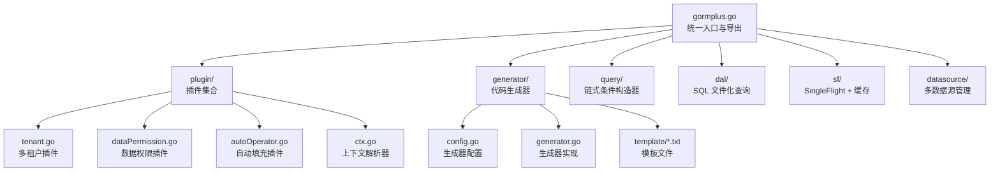
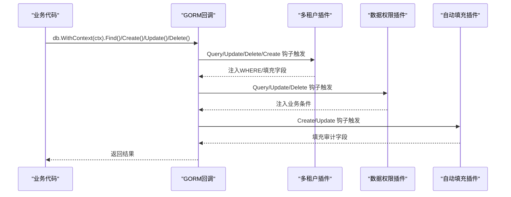
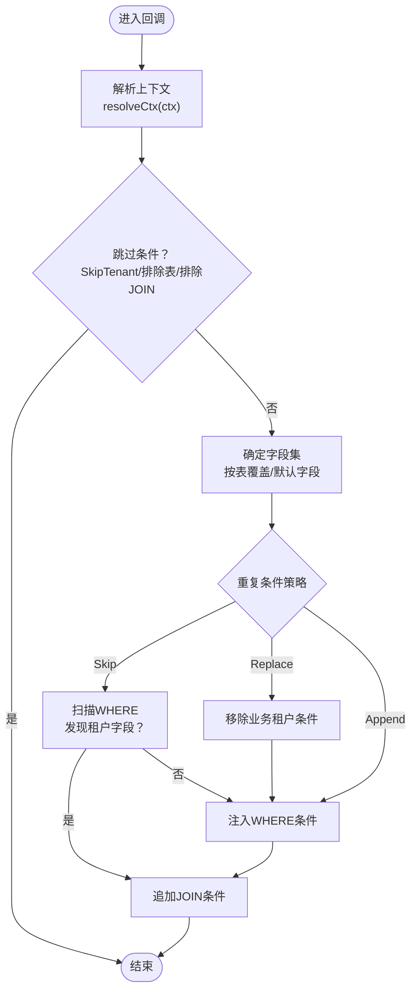
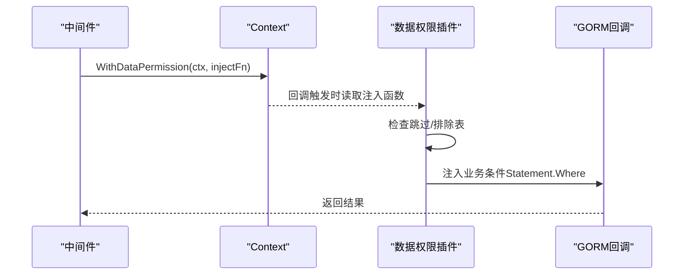
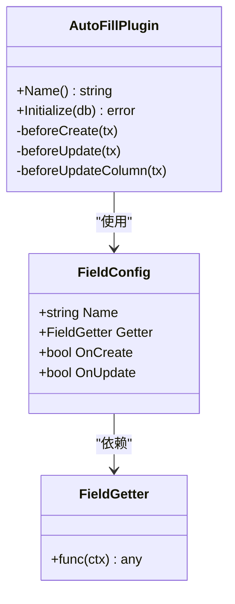
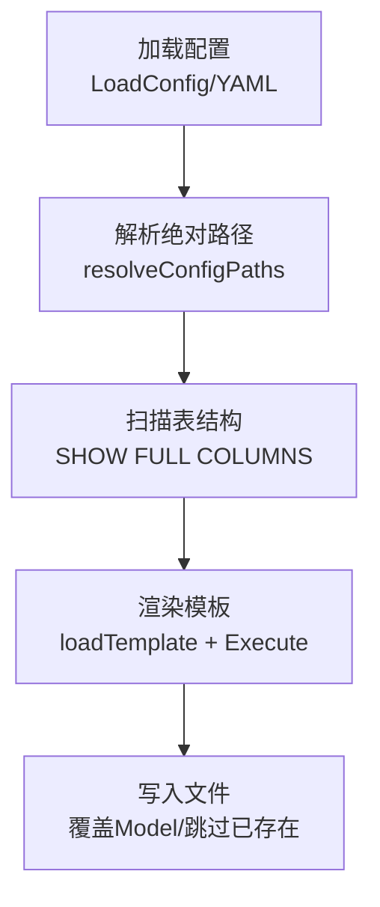
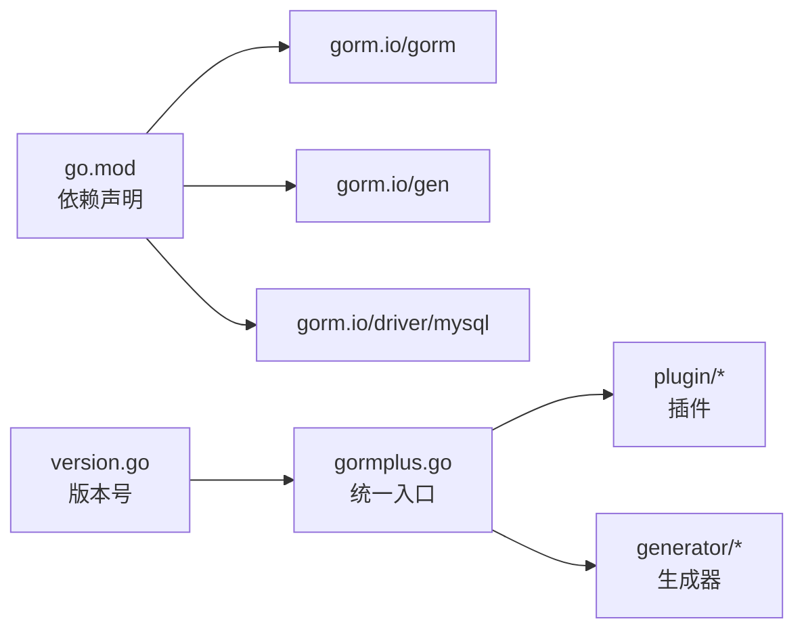

# 扩展开发

<cite>
**本文引用的文件**
- [README.md](file://README.md)
- [gormplus.go](file://gormplus.go)
- [version.go](file://version.go)
- [go.mod](file://go.mod)
- [plugin/tenant.go](file://plugin/tenant.go)
- [plugin/dataPermission.go](file://plugin/dataPermission.go)
- [plugin/autoOperator.go](file://plugin/autoOperator.go)
- [plugin/ctx.go](file://plugin/ctx.go)
- [plugin/tenant.md](file://plugin/tenant.md)
- [plugin/dataPermission.md](file://plugin/dataPermission.md)
- [plugin/autoOperator.md](file://plugin/autoOperator.md)
- [generator/config.go](file://generator/config.go)
- [generator/generator.go](file://generator/generator.go)
- [generator/example_test.go](file://generator/example_test.go)
- [generator/generator.example.yaml](file://generator/generator.example.yaml)
- [generator/template/api_template.txt](file://generator/template/api_template.txt)
- [generator/template/dto_template.txt](file://generator/template/dto_template.txt)
- [generator/template/vo_template.txt](file://generator/template/vo_template.txt)
</cite>

## 目录
1. [简介](#简介)
2. [项目结构](#项目结构)
3. [核心组件](#核心组件)
4. [架构总览](#架构总览)
5. [详细组件分析](#详细组件分析)
6. [依赖关系分析](#依赖关系分析)
7. [性能考量](#性能考量)
8. [故障排查指南](#故障排查指南)
9. [结论](#结论)
10. [附录](#附录)

## 简介
本指南面向希望基于现有插件架构开发自定义插件的开发者，涵盖以下主题：
- 基于 GORM 回调机制的插件开发与注册流程
- 插件生命周期管理与上下文解析
- 最佳实践：接口设计、错误处理、配置管理、测试策略
- 实战示例：多租户、数据权限等插件功能
- 代码生成器扩展：自定义模板与生成规则
- 插件兼容性与版本管理策略
- 发布与维护建议

## 项目结构
该项目采用模块化组织，核心能力集中在 gormplus 统一入口，插件位于 plugin 目录，代码生成器位于 generator 目录，其他辅助模块如 query、dal、sf、datasource 等分布在相应包中。

图表来源
- [gormplus.go](file://gormplus.go)
- [plugin/tenant.go](file://plugin/tenant.go)
- [plugin/dataPermission.go](file://plugin/dataPermission.go)
- [plugin/autoOperator.go](file://plugin/autoOperator.go)
- [plugin/ctx.go](file://plugin/ctx.go)
- [generator/config.go](file://generator/config.go)
- [generator/generator.go](file://generator/generator.go)

章节来源
- [README.md](file://README.md)
- [gormplus.go](file://gormplus.go)

## 核心组件
- 统一入口与导出：gormplus.go 提供插件注册、上下文解析、多数据源、缓存、查询、生成器等统一 API。
- 插件体系：tenant、dataPermission、autoOperator 三大插件均通过 gorm 回调钩子在 Query/Update/Delete/Create 前后注入条件或填充字段。
- 上下文解析：ctx.go 提供全局解析器，屏蔽 gin/go-zero/fiber 等框架差异。
- 代码生成器：generator 提供 YAML 配置、模板加载、类型映射、交互式输入等能力，支持 API/DTO/VO/Repository/Mapper 等多产物生成。

章节来源
- [gormplus.go](file://gormplus.go)
- [plugin/ctx.go](file://plugin/ctx.go)
- [generator/config.go](file://generator/config.go)
- [generator/generator.go](file://generator/generator.go)

## 架构总览
GORM 插件通过回调钩子在 ORM 生命周期的关键节点介入，实现“零侵入”的横切能力。插件注册后，所有经 db.WithContext(ctx) 的操作都会自动携带上下文信息，从而实现多租户、数据权限、自动填充等功能。

图表来源
- [plugin/tenant.go](file://plugin/tenant.go)
- [plugin/dataPermission.go](file://plugin/dataPermission.go)
- [plugin/autoOperator.go](file://plugin/autoOperator.go)

## 详细组件分析

### 多租户插件（tenant）
- 工作原理
  - 在 Query/Update/Delete/Create 前注册钩子，自动注入租户条件或填充租户字段。
  - 支持单字段、多字段、按表覆盖、联表自动注入、安全策略（重复条件跳过/替换、OR 绕过拒绝、全表保护）。
- 关键点
  - 注册：RegisterTenant(db, cfg) 或 NewTenantPlugin(cfg).Initialize(db)
  - 上下文：WithTenantID(ctx, tenantID)、SkipTenant(ctx)、AllowGlobalOperation(ctx)、WithOverrideTenantID(ctx, tenantID)
  - 配置：TenantField/TenantFields/TableFields、AutoInjectJoinTables/ExcludeJoinTables/JoinTableOverrides、DuplicatePolicy、AllowGlobalUpdate/Delete、AllowOverrideTenantID、InjectMode、ExcludeTables、GetTenantID
- 安全策略
  - PolicySkip：默认，发现已有租户 AND 条件跳过注入；检测 OR 危险条件直接拒绝。
  - PolicyReplace：先移除业务条件，再注入 ctx 值，同样检测 OR 危险。
  - PolicyAppend：不检查直接追加，性能最优但可能重复。
- 联表注入
  - 自动解析 JOIN 别名，按表覆盖字段名；可排除公共表；可关闭自动注入。

图表来源
- [plugin/tenant.go](file://plugin/tenant.go)

章节来源
- [plugin/tenant.go](file://plugin/tenant.go)
- [plugin/tenant.md](file://plugin/tenant.md)

### 数据权限插件（dataPermission）
- 工作原理
  - 通过中间件将注入函数写入 ctx，插件在 Query/Update/Delete 前读取并注入业务条件。
  - 支持排除表、跳过开关、注入方式（ModeScopes/ModeWhere，底层均为 Statement.Where）。
- 关键点
  - 注册：RegisterDataPermission(db, cfg) 或 NewDataPermissionPlugin(cfg)
  - 上下文：WithDataPermission(ctx, fn)、SkipDataPermission(ctx)
  - 配置：InjectMode、ExcludeTables
  - 运行时增删排除表：AddDataPermissionExcludeTable/RemoveDataPermissionExcludeTable/ExcludedTables

图表来源
- [plugin/dataPermission.go](file://plugin/dataPermission.go)

章节来源
- [plugin/dataPermission.go](file://plugin/dataPermission.go)
- [plugin/dataPermission.md](file://plugin/dataPermission.md)

### 自动填充插件（autoOperator）
- 工作原理
  - 在 Create/Update 前注册钩子，依据 FieldConfig 与 Getter 从 ctx 填充字段。
  - 支持多字段、多 Getter、UpdateColumn/Simple 等路径适配。
- 关键点
  - 注册：db.Use(NewAutoFillPlugin(cfg))
  - Getter：CtxGetter[T](key)、OperatorGetter[T]()、自定义 Getter
  - 配置：FieldConfig{Name, Getter, OnCreate, OnUpdate}
  - 路径适配：beforeCreate/beforeUpdate/beforeUpdateColumn
- 上下文解析
  - 通过全局解析器兼容 gin/go-zero/fiber 等框架。

图表来源
- [plugin/autoOperator.go](file://plugin/autoOperator.go)

章节来源
- [plugin/autoOperator.go](file://plugin/autoOperator.go)
- [plugin/autoOperator.md](file://plugin/autoOperator.md)

### 上下文解析器（ctx）
- 作用
  - 屏蔽 gin/go-zero/fiber 等框架差异，确保插件能从 ctx 中读取中间件写入的值。
- 使用
  - gin 项目：RegisterCtxResolver(func(ctx) context.Context)
  - go-zero/fiber：无需注册，直接传标准 context 即可。

章节来源
- [plugin/ctx.go](file://plugin/ctx.go)

### 代码生成器（generator）
- 配置
  - Config：数据库连接、输出路径、包名等。
  - 支持 YAML 加载与路径解析（相对路径解析为项目根目录绝对路径）。
- 模板
  - 内嵌模板：api_template、dto_template、vo_template、repository_template、repository_gen_template、mapper_template。
  - 模板加载优先级：文件系统 > 内嵌模板。
- 产物
  - Model、Repository、API、DTO、VO、Mapper 等，支持交互式输入与表筛选。
- 类型映射
  - 根据 SQL 类型映射 Go 类型，针对 API/DTO/VO 有差异化规则。

图表来源
- [generator/config.go](file://generator/config.go)
- [generator/generator.go](file://generator/generator.go)

章节来源
- [generator/config.go](file://generator/config.go)
- [generator/generator.go](file://generator/generator.go)
- [generator/example_test.go](file://generator/example_test.go)
- [generator/generator.example.yaml](file://generator/generator.example.yaml)
- [generator/template/api_template.txt](file://generator/template/api_template.txt)
- [generator/template/dto_template.txt](file://generator/template/dto_template.txt)
- [generator/template/vo_template.txt](file://generator/template/vo_template.txt)

## 依赖关系分析
- 版本与依赖
  - go.mod 指定 Go 版本与 gorm 生态依赖，包括 gorm.io/gorm、gorm.io/gen、gorm.io/driver/mysql 等。
  - 版本号在 version.go 中集中维护。
- 模块间耦合
  - gormplus 作为统一入口，聚合各模块 API 并导出。
  - 插件模块依赖 gorm 回调机制，彼此解耦，通过 ctx 通信。
  - 生成器模块独立于插件，仅依赖 gorm 连接与模板引擎。

图表来源
- [go.mod](file://go.mod)
- [version.go](file://version.go)
- [gormplus.go](file://gormplus.go)

章节来源
- [go.mod](file://go.mod)
- [version.go](file://version.go)
- [gormplus.go](file://gormplus.go)

## 性能考量
- 回调钩子
  - 插件在关键回调 Before 阶段注入，尽量避免昂贵计算；必要时使用缓存或延迟计算。
- JOIN 自动注入
  - 默认启用，解析 JOIN 别名；对公共表可配置排除，减少不必要的条件注入。
- 自动填充
  - 仅在 Create/Update 前触发，字段数量有限；UpdateColumn/Simple 路径做了适配，避免重复注入。
- 生成器
  - 模板加载优先文件系统，便于本地覆盖；类型映射与注释处理在内存完成，I/O 为主。

## 故障排查指南
- gin 项目上下文读取不到中间件值
  - 现象：插件无法从 ctx 读取值。
  - 处理：注册 ctx 解析器，将 *gin.Context 转换为 Request.Context。
  - 参考：RegisterCtxResolver 与 resolveCtx。
- 租户条件注入冲突或绕过
  - 现象：业务代码手动写入租户条件导致重复或 OR 绕过。
  - 处理：调整 DuplicatePolicy；PolicySkip 默认安全；PolicyReplace 强制覆盖；PolicyAppend 性能最优但需确保业务不写租户条件。
- 全表 Update/Delete 被拒绝
  - 现象：无业务 WHERE 条件的整表操作被拒绝。
  - 处理：临时使用 AllowGlobalOperation；或在配置中允许 AllowGlobalUpdate/AllowGlobalDelete。
- 数据权限未生效
  - 现象：中间件注入函数未写入 ctx 或被跳过。
  - 处理：确认 WithDataPermission(ctx, fn) 已在中间件设置；检查排除表；必要时使用 SkipDataPermission。
- 生成器模板未生效
  - 现象：自定义模板未覆盖内嵌模板。
  - 处理：确保模板文件存在于指定路径；模板加载优先文件系统；检查路径解析与包名。

章节来源
- [plugin/ctx.go](file://plugin/ctx.go)
- [plugin/tenant.go](file://plugin/tenant.go)
- [plugin/dataPermission.go](file://plugin/dataPermission.go)
- [generator/generator.go](file://generator/generator.go)

## 结论
本项目通过统一入口与模块化插件，提供了稳定、可扩展的 GORM 增强能力。基于回调机制的插件设计使得多租户、数据权限、自动填充等功能可零侵入地融入业务流程；代码生成器则进一步提升开发效率。遵循本文最佳实践与兼容性策略，可安全地扩展更多插件与生成规则。

## 附录

### 插件开发最佳实践
- 接口设计
  - 保持最小 API 面，通过配置对象承载复杂选项。
  - 提供 RegisterXxx 与 NewXxxPlugin 两种注册方式，兼顾易用性与灵活性。
- 错误处理
  - 在回调中通过 db.AddError(err) 报错，确保事务一致性。
  - 对危险条件（如 OR 中出现租户字段）直接拒绝，避免安全风险。
- 配置管理
  - 将默认值与策略分离；提供运行时动态增删排除表的能力。
  - 对路径与包名进行解析与校验，避免相对路径导致的不确定性。
- 测试策略
  - 回调钩子测试：构造 gorm.DB 与 Statement，验证注入逻辑。
  - 上下文解析测试：模拟 gin/go-zero/fiber 场景，验证 resolveCtx。
  - 生成器测试：对比渲染前后产物，确保模板与类型映射正确。

### 插件兼容性与版本管理
- 版本号集中维护：version.go，便于统一升级与追踪。
- 依赖锁定：go.mod 明确 gorm 生态版本，避免不兼容升级。
- 插件命名空间：插件 Name() 返回带泛型类型的唯一标识，避免冲突。
- 配置向后兼容：保留兼容常量与默认值，逐步淘汰旧字段。

### 发布与维护建议
- 发布前
  - 更新版本号与变更日志；确保 README 示例与最新 API 一致。
  - 覆盖关键插件与生成器的集成测试。
- 发布后
  - 监控常见问题与报错；提供快速修复与降级方案。
  - 保持依赖更新节奏，关注 gorm 生态的破坏性变更。