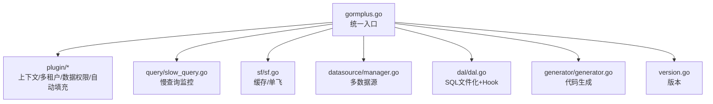
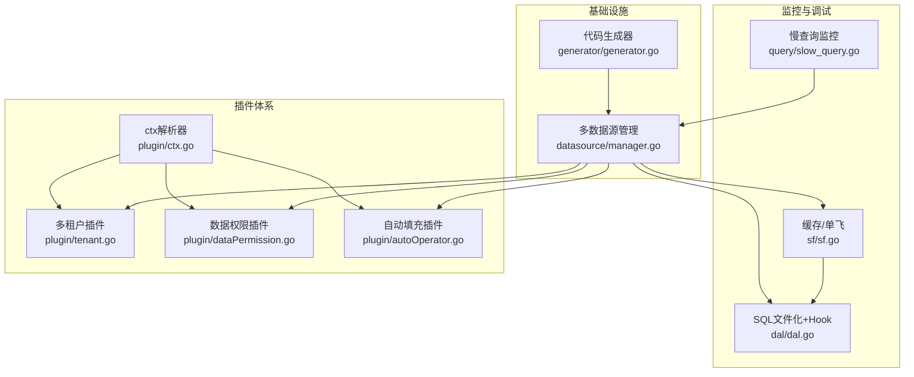
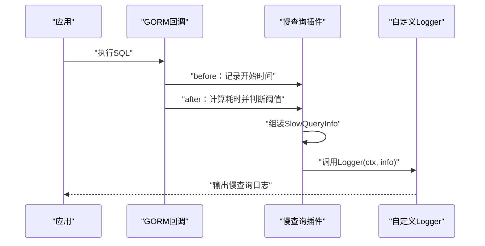
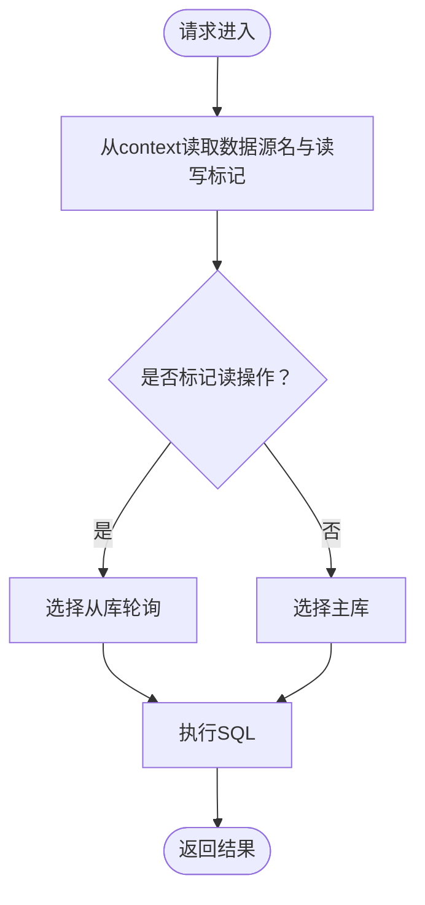
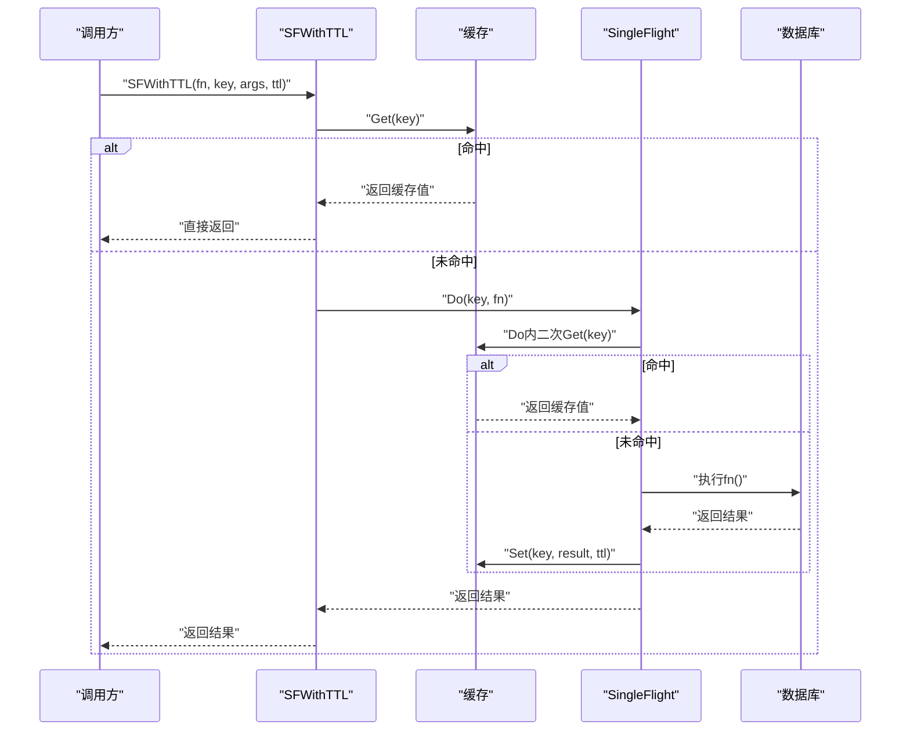
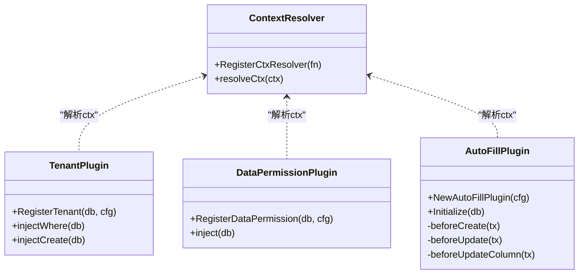
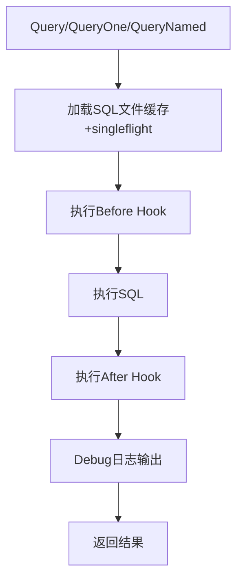
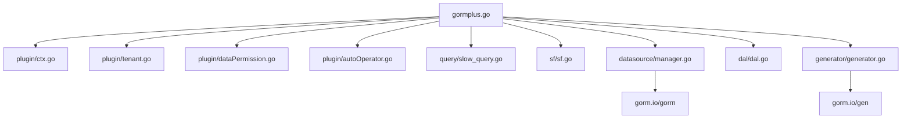

# 监控与调试

<cite>
**本文引用的文件**
- [README.md](file://README.md)
- [gormplus.go](file://gormplus.go)
- [version.go](file://version.go)
- [plugin/ctx.go](file://plugin/ctx.go)
- [plugin/tenant.go](file://plugin/tenant.go)
- [plugin/dataPermission.go](file://plugin/dataPermission.go)
- [plugin/autoOperator.go](file://plugin/autoOperator.go)
- [query/slow_query.go](file://query/slow_query.go)
- [sf/sf.go](file://sf/sf.go)
- [datasource/manager.go](file://datasource/manager.go)
- [dal/dal.go](file://dal/dal.go)
- [generator/generator.go](file://generator/generator.go)
- [go.mod](file://go.mod)
</cite>

## 目录
1. [简介](#简介)
2. [项目结构](#项目结构)
3. [核心组件](#核心组件)
4. [架构概览](#架构概览)
5. [详细组件分析](#详细组件分析)
6. [依赖分析](#依赖分析)
7. [性能考虑](#性能考虑)
8. [故障排查指南](#故障排查指南)
9. [结论](#结论)
10. [附录](#附录)

## 简介
本技术指南围绕 gorm-plus 的监控与调试能力，系统讲解如何设置与配置各类监控指标（慢查询、数据库连接状态、缓存命中率等），以及如何使用调试工具（SQL 执行跟踪、Context 信息追踪、插件状态检查）进行问题定位。文档还提供常见问题的诊断方法与解决方案，涵盖性能瓶颈识别、内存泄漏检测、并发问题排查等，并给出生产环境监控最佳实践与告警配置建议。

## 项目结构
项目采用模块化设计，核心模块包括：
- 上层统一入口：gormplus.go，提供统一导出与初始化顺序说明
- 插件体系：ctx、tenant、dataPermission、autoOperator
- 监控与调试：slow_query（慢查询）、sf（SingleFlight + 可插拔缓存）、dal（Hook + Debug）
- 多数据源管理：datasource/manager.go
- 代码生成器：generator
- 版本信息：version.go

图表来源
- [gormplus.go:1-1305](file://gormplus.go#L1-L1305)
- [plugin/ctx.go:1-44](file://plugin/ctx.go#L1-L44)
- [plugin/tenant.go:1-1223](file://plugin/tenant.go#L1-L1223)
- [plugin/dataPermission.go:1-339](file://plugin/dataPermission.go#L1-L339)
- [plugin/autoOperator.go:1-309](file://plugin/autoOperator.go#L1-L309)
- [query/slow_query.go:1-235](file://query/slow_query.go#L1-L235)
- [sf/sf.go:1-395](file://sf/sf.go#L1-L395)
- [datasource/manager.go:1-579](file://datasource/manager.go#L1-L579)
- [dal/dal.go:1-1506](file://dal/dal.go#L1-L1506)
- [generator/generator.go:1-1260](file://generator/generator.go#L1-L1260)
- [version.go:1-4](file://version.go#L1-L4)

章节来源
- [README.md:1-891](file://README.md#L1-L891)
- [gormplus.go:1-1305](file://gormplus.go#L1-L1305)

## 核心组件
- 慢查询监控：基于 gorm Callback 钩子，在 Query/Create/Update/Delete/Row/Raw 全操作类型上记录耗时，超过阈值触发自定义 Logger，支持透传 traceID 等链路信息。
- 多数据源管理：支持一主多从、懒连接、连接池独立配置、自动切换（通过 context 决定数据源与读写）、健康检查、优雅关闭。
- SingleFlight + 可插拔缓存：提供纯 singleflight 与带缓存两种保护，支持内存缓存与 Redis 等自定义缓存实现，内置后台过期清理 goroutine。
- 插件体系：ctx 解析器屏蔽框架差异；多租户与数据权限插件自动注入条件并提供安全保护；自动填充插件从 context 注入字段值。
- DAL：SQL 文件化管理，支持位置参数与命名参数、分页、事务、Debug 日志、Hook（慢 SQL、Prometheus、链路追踪等）、SQL 缓存与 singleflight 防击穿。
- 代码生成器：基于 gorm-gen，支持 Model/Repository/API/VO/DTO/Mapper 等多产物生成，模板可覆盖。

章节来源
- [query/slow_query.go:1-235](file://query/slow_query.go#L1-L235)
- [datasource/manager.go:1-579](file://datasource/manager.go#L1-L579)
- [sf/sf.go:1-395](file://sf/sf.go#L1-L395)
- [plugin/ctx.go:1-44](file://plugin/ctx.go#L1-L44)
- [plugin/tenant.go:1-1223](file://plugin/tenant.go#L1-L1223)
- [plugin/dataPermission.go:1-339](file://plugin/dataPermission.go#L1-L339)
- [plugin/autoOperator.go:1-309](file://plugin/autoOperator.go#L1-L309)
- [dal/dal.go:1-1506](file://dal/dal.go#L1-L1506)
- [generator/generator.go:1-1260](file://generator/generator.go#L1-L1260)

## 架构概览
下图展示监控与调试相关模块之间的交互关系与职责分工。

图表来源
- [query/slow_query.go:1-235](file://query/slow_query.go#L1-L235)
- [sf/sf.go:1-395](file://sf/sf.go#L1-L395)
- [dal/dal.go:1-1506](file://dal/dal.go#L1-L1506)
- [plugin/ctx.go:1-44](file://plugin/ctx.go#L1-L44)
- [plugin/tenant.go:1-1223](file://plugin/tenant.go#L1-L1223)
- [plugin/dataPermission.go:1-339](file://plugin/dataPermission.go#L1-L339)
- [plugin/autoOperator.go:1-309](file://plugin/autoOperator.go#L1-L309)
- [datasource/manager.go:1-579](file://datasource/manager.go#L1-L579)
- [generator/generator.go:1-1260](file://generator/generator.go#L1-L1260)

## 详细组件分析

### 慢查询监控（SlowQuery）
- 工作机制：通过 gorm Callback 钩子在 Query/Create/Update/Delete/Row/Raw 全操作类型前后记录时间，计算耗时并判断是否超过阈值，超过则调用自定义 Logger。
- 配置要点：
  - Threshold：慢查询阈值，默认 200ms；为 0 时自动设为 200ms。
  - Logger：自定义日志函数，可透传 traceID 等链路信息；为 nil 时使用标准库 log 输出。
  - 与多租户插件互不干扰，可同时使用。
- 输出信息：SQL（已替换 ? 为实际参数值，可直接 EXPLAIN）、耗时、影响/返回行数、主表名、错误信息。
- 使用建议：生产环境建议阈值 200ms~500ms；结合链路追踪系统（如 OpenTelemetry）透传 traceID。

图表来源
- [query/slow_query.go:113-234](file://query/slow_query.go#L113-L234)

章节来源
- [query/slow_query.go:1-235](file://query/slow_query.go#L1-L235)
- [README.md:643-661](file://README.md#L643-L661)

### 多数据源管理（DataSourceManager）
- 核心能力：命名数据源注册（一主多从）、懒连接、独立连接池配置、自动切换（通过 context 决定数据源与读写）、健康检查、优雅关闭。
- 连接池默认推荐值：MaxOpen=50、MaxIdle=10、MaxLifetime=30min、MaxIdleTime=10min。
- 自动切换规则：从 context 读取数据源名与读写标记，读标记走从库（轮询，无从库 fallback 主库），写标记走主库。
- 健康检查：Ping 返回 "name:role" → error 映射，nil 表示正常。
- 优雅退出：Close 关闭所有数据源连接。

图表来源
- [datasource/manager.go:288-323](file://datasource/manager.go#L288-L323)

章节来源
- [datasource/manager.go:1-579](file://datasource/manager.go#L1-L579)
- [README.md:139-216](file://README.md#L139-L216)

### SingleFlight + 可插拔缓存（SF）
- 三层保护：纯 singleflight（SFNoCache）、singleflight + 可插拔缓存（SF/SFWithTTL）、主动失效（SFInvalidate）。
- 缓存接口：SFCache，支持 Get/Set/Del；默认内存缓存，可通过 RegisterCache 注入 Redis 等实现。
- 默认 TTL：5 分钟；TTL=0 等价于 SFNoCache。
- 关键流程：先查缓存（命中则直接返回），否则进入 singleflight Do，内部再次查缓存，执行查询后写入缓存（TTL>0），TTL=0 时立即 Forget。
- 内置内存缓存：后台 goroutine 每 30 秒扫描过期，StopSFCache 优雅停止。

图表来源
- [sf/sf.go:252-349](file://sf/sf.go#L252-L349)

章节来源
- [sf/sf.go:1-395](file://sf/sf.go#L1-L395)
- [README.md:567-641](file://README.md#L567-L641)

### 插件体系（Context/多租户/数据权限/自动填充）
- Context 解析器：屏蔽 gin/go-zero/fiber 框架差异，解决 ctx 解析问题。
- 多租户插件：自动注入租户条件，支持多字段、按表覆盖、联表自动注入、安全保护（重复条件策略、OR 绕过检测、全表保护）。
- 数据权限插件：注入业务层定义的条件，支持跳过、排除表、动态排除表管理。
- 自动填充插件：从 context 中读取字段值并自动填充到 Create/Update 操作。

图表来源
- [plugin/ctx.go:1-44](file://plugin/ctx.go#L1-L44)
- [plugin/tenant.go:338-800](file://plugin/tenant.go#L338-L800)
- [plugin/dataPermission.go:128-266](file://plugin/dataPermission.go#L128-L266)
- [plugin/autoOperator.go:140-309](file://plugin/autoOperator.go#L140-L309)

章节来源
- [plugin/ctx.go:1-44](file://plugin/ctx.go#L1-L44)
- [plugin/tenant.go:1-1223](file://plugin/tenant.go#L1-L1223)
- [plugin/dataPermission.go:1-339](file://plugin/dataPermission.go#L1-L339)
- [plugin/autoOperator.go:1-309](file://plugin/autoOperator.go#L1-L309)
- [README.md:114-136](file://README.md#L114-L136)
- [README.md:331-490](file://README.md#L331-L490)
- [README.md:493-533](file://README.md#L493-L533)
- [README.md:536-564](file://README.md#L536-L564)

### DAL（SQL 文件化 + Hook + Debug）
- SQL 文件化：通过 //go:embed 打包 SQL，支持位置参数（?）与命名参数（@name），分页查询、事务、Debug 日志、Hook。
- Hook：Before/After 生命周期钩子，可用于慢 SQL 监控、Prometheus 指标采集、链路追踪等。
- Debug：开启后打印 SQL 文件路径、耗时、SQL 文本、参数、错误；返回零行时打印 [WARN]。
- SQL 缓存与 singleflight：加载 SQL 文件时缓存并使用 singleflight 防击穿；可配置定时清理。

图表来源
- [dal/dal.go:594-800](file://dal/dal.go#L594-L800)

章节来源
- [dal/dal.go:1-1506](file://dal/dal.go#L1-L1506)
- [README.md:696-800](file://README.md#L696-L800)

### 代码生成器（Generator）
- 基于 gorm-gen，支持 Model/Repository/API/VO/DTO/Mapper 等多产物生成。
- 模板可覆盖，路径解析基于项目根目录（go.mod）。
- 支持命令行交互与批量生成。

章节来源
- [generator/generator.go:1-1260](file://generator/generator.go#L1-L1260)
- [README.md:662-694](file://README.md#L662-L694)

## 依赖分析
- 模块依赖：gormplus.go 导出各子模块；各子模块相互独立，通过 gorm 插件机制与回调集成。
- 外部依赖：gorm.io/gorm、gorm.io/gen、驱动（mysql/postgres/sqlite/sqlserver 等）通过 NodeConfig.Dialector 注入，不内置任何驱动。
- 版本信息：Version = "v1.0.13"。

图表来源
- [gormplus.go:88-101](file://gormplus.go#L88-L101)
- [go.mod:5-25](file://go.mod#L5-L25)
- [version.go:1-4](file://version.go#L1-L4)

章节来源
- [gormplus.go:1-1305](file://gormplus.go#L1-L1305)
- [go.mod:1-26](file://go.mod#L1-L26)
- [version.go:1-4](file://version.go#L1-L4)

## 性能考虑
- 慢查询阈值：建议生产环境阈值 200ms~500ms，避免噪声；结合链路追踪透传 traceID。
- 缓存策略：列表/统计类建议 3s~30s；配置/字典类建议 1min~5min；详情/实时数据建议 0 或 SFNoCache。
- 连接池：生产推荐 MaxOpen=50、MaxIdle=10、MaxLifetime=30min、MaxIdleTime=10min。
- 并发保护：优先使用 SF/SFWithTTL，避免缓存击穿；写操作后及时 SFInvalidate。
- SQL 文件化：启用 Debug 仅限开发/测试环境；生产环境建议通过 Hook 采集指标而非 Debug 日志。

## 故障排查指南
- 慢查询定位
  - 启用慢查询监控，观察阈值与日志输出；结合 traceID 定位具体请求。
  - 使用 info.SQL（已替换 ?）直接在数据库客户端执行，进行 EXPLAIN 分析。
- Context 信息追踪
  - 确认已注册 ctx 解析器（gin 项目必须）；检查中间件是否正确写入 ctx。
  - 多租户/数据权限插件均依赖 resolveCtx 解析框架特定 ctx。
- 插件状态检查
  - 多租户：检查重复条件策略（PolicySkip/PolicyReplace/PolicyAppend）、OR 危险条件检测、全表保护。
  - 数据权限：确认排除表列表、注入函数是否正确写入 ctx。
  - 自动填充：确认 context key 是否正确写入、Getter 是否返回预期值。
- 数据库连接问题
  - 使用 DS.Ping() 检查主从库连通性；关注 MaxOpen/MaxIdle/MaxLifetime 设置。
  - 懒连接：首次 Write/Read 时才建立连接，避免启动阻塞。
- 缓存问题
  - 写操作后调用 SFInvalidate 主动失效；检查缓存实现（内存/Redis）与 TTL 设置。
  - 内置内存缓存：StopSFCache 优雅停止后台 goroutine。
- 并发问题
  - 使用 SF/SFNoCache 合并同一瞬间的并发请求；避免缓存击穿。
  - 检查自定义缓存实现的并发安全与一致性。
- 内存泄漏检测
  - 关注内置内存缓存的后台 goroutine；生产环境建议使用 Redis 等持久化缓存。
  - 检查 SQL 文件缓存清理（WithCacheCleanup）与 Debug 日志输出。

章节来源
- [query/slow_query.go:19-58](file://query/slow_query.go#L19-L58)
- [plugin/ctx.go:16-35](file://plugin/ctx.go#L16-L35)
- [plugin/tenant.go:383-526](file://plugin/tenant.go#L383-L526)
- [plugin/dataPermission.go:164-204](file://plugin/dataPermission.go#L164-L204)
- [plugin/autoOperator.go:35-74](file://plugin/autoOperator.go#L35-L74)
- [datasource/manager.go:394-430](file://datasource/manager.go#L394-L430)
- [sf/sf.go:184-225](file://sf/sf.go#L184-L225)
- [dal/dal.go:265-282](file://dal/dal.go#L265-L282)

## 结论
gorm-plus 提供了完善的监控与调试能力：慢查询监控、多数据源管理、SingleFlight + 可插拔缓存、插件体系（Context/多租户/数据权限/自动填充）、SQL 文件化与 Hook、代码生成器。通过合理配置阈值、缓存策略与连接池参数，并结合链路追踪与指标采集，可在生产环境中高效定位与解决性能与稳定性问题。

## 附录
- 初始化顺序（摘自 README）：ctx 解析器 → 多数据源 → DB 打开 → 多租户/数据权限/自动填充 → 慢查询监控 → 缓存（可选） → 优雅退出。
- 版本信息：Version = "v1.0.13"。

章节来源
- [README.md:22-85](file://README.md#L22-L85)
- [version.go:1-4](file://version.go#L1-L4)