# 高级特性

<cite>
**本文引用的文件**
- [gormplus.go](file://gormplus.go)
- [version.go](file://version.go)
- [README.md](file://README.md)
- [query/slow_query.go](file://query/slow_query.go)
- [plugin/tenant.go](file://plugin/tenant.go)
- [plugin/dataPermission.go](file://plugin/dataPermission.go)
- [plugin/autoOperator.go](file://plugin/autoOperator.go)
- [plugin/ctx.go](file://plugin/ctx.go)
- [sf/sf.go](file://sf/sf.go)
- [datasource/manager.go](file://datasource/manager.go)
- [dal/dal.go](file://dal/dal.go)
- [generator/config.go](file://generator/config.go)
- [generator/generator.go](file://generator/generator.go)
- [generator/generator.example.yaml](file://generator/generator.example.yaml)
</cite>

## 目录
1. [简介](#简介)
2. [项目结构](#项目结构)
3. [核心组件](#核心组件)
4. [架构总览](#架构总览)
5. [详细组件分析](#详细组件分析)
6. [依赖分析](#依赖分析)
7. [性能考虑](#性能考虑)
8. [故障排查指南](#故障排查指南)
9. [结论](#结论)
10. [附录](#附录)

## 简介
本文件面向企业级应用场景，系统性梳理 gorm-plus 的高级特性与企业级能力，重点覆盖：
- 慢查询监控与告警接入
- 多租户与数据权限安全保护机制
- 性能优化策略（SingleFlight + 可插拔缓存、SQL 文件化、连接池与读写分离）
- 高级配置项与最佳实践
- 生产环境部署与运维要点
- 故障排查与问题诊断
- 扩展开发与自定义能力

## 项目结构
项目采用模块化设计，统一入口导出各子模块能力，便于按需启用与组合使用。

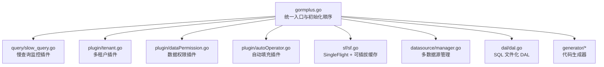

图表来源
- [gormplus.go:1-120](file://gormplus.go#L1-L120)
- [query/slow_query.go:1-120](file://query/slow_query.go#L1-L120)
- [plugin/tenant.go:1-120](file://plugin/tenant.go#L1-L120)
- [plugin/dataPermission.go:1-120](file://plugin/dataPermission.go#L1-L120)
- [plugin/autoOperator.go:1-120](file://plugin/autoOperator.go#L1-L120)
- [sf/sf.go:1-120](file://sf/sf.go#L1-L120)
- [datasource/manager.go:1-120](file://datasource/manager.go#L1-L120)
- [dal/dal.go:1-120](file://dal/dal.go#L1-L120)
- [generator/config.go:1-47](file://generator/config.go#L1-L47)

章节来源
- [gormplus.go:1-120](file://gormplus.go#L1-L120)
- [README.md:17-41](file://README.md#L17-L41)

## 核心组件
- 慢查询监控：基于 gorm Callback 钩子，对 Query/Create/Update/Delete/Row/Raw 全类操作进行耗时统计与阈值告警，支持接入任意日志系统。
- 多租户插件：自动注入租户条件，支持多字段、按表覆盖、联表自动注入、安全策略（重复条件跳过/替换、OR 绕过拒绝、全表更新/删除保护）。
- 数据权限插件：通过中间件注入条件函数，在回调阶段自动追加数据范围限制，支持排除表与动态维护。
- 自动填充插件：在 Create/Update 前自动填充审计字段，支持多字段与自定义 Getter。
- SingleFlight + 可插拔缓存：提供纯合并并发（SFNoCache）、带缓存（SF/SFWithTTL）、主动失效（SFInvalidate）三层保护，支持内存/Redis 等缓存实现。
- 多数据源管理：支持一主多从、懒连接、连接池独立配置、自动读写分离、健康检查与优雅关闭。
- SQL 文件化 DAL：将 SQL 独立管理，支持位置/命名参数、分页、事务、Hook、缓存与清理。
- 代码生成器：基于 YAML 配置生成 Model/Repository/API/VO/DTO/Mapper，支持预热与路径解析。

章节来源
- [gormplus.go:7-86](file://gormplus.go#L7-L86)
- [query/slow_query.go:13-109](file://query/slow_query.go#L13-L109)
- [plugin/tenant.go:1-129](file://plugin/tenant.go#L1-L129)
- [plugin/dataPermission.go:106-249](file://plugin/dataPermission.go#L106-L249)
- [plugin/autoOperator.go:120-185](file://plugin/autoOperator.go#L120-L185)
- [sf/sf.go:17-131](file://sf/sf.go#L17-L131)
- [datasource/manager.go:15-148](file://datasource/manager.go#L15-L148)
- [dal/dal.go:1-69](file://dal/dal.go#L1-L69)
- [generator/config.go:10-47](file://generator/config.go#L10-L47)

## 架构总览
整体架构围绕“统一入口 + 插件化 + 可插拔缓存 + 多数据源 + SQL 文件化”的思路设计，既保证易用性，又满足企业级生产需求。

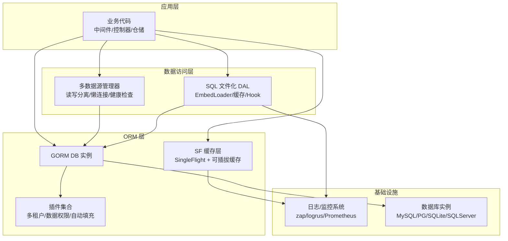

图表来源
- [gormplus.go:22-85](file://gormplus.go#L22-L85)
- [datasource/manager.go:28-148](file://datasource/manager.go#L28-L148)
- [sf/sf.go:17-131](file://sf/sf.go#L17-L131)
- [dal/dal.go:185-282](file://dal/dal.go#L185-L282)

## 详细组件分析

### 慢查询监控（SlowQuery）
- 工作原理：通过 gorm Callback 在每次 SQL 执行前后记录时间，超过阈值触发自定义 Logger，支持透传 traceID。
- 配置要点：阈值建议 200ms~500ms；Logger 为空时使用标准库输出；与多租户/其他插件可共存。
- 告警接入：将 Logger 指向业务日志系统（如 zap），记录耗时、表名、SQL、影响行数、错误信息。

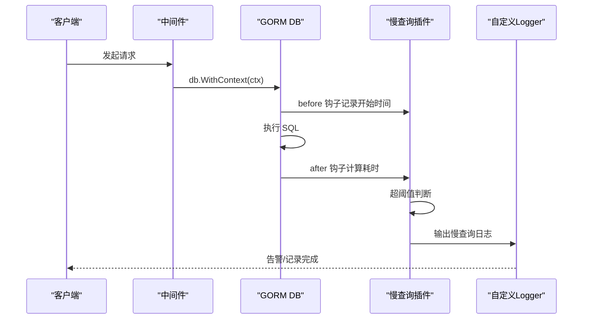

图表来源
- [query/slow_query.go:113-234](file://query/slow_query.go#L113-L234)

章节来源
- [query/slow_query.go:13-109](file://query/slow_query.go#L13-L109)
- [query/slow_query.go:113-234](file://query/slow_query.go#L113-L234)

### 多租户插件（Tenant）
- 安全保护：
  - 重复条件策略：PolicySkip（默认）跳过注入；PolicyReplace 强制替换；PolicyAppend 直接追加。
  - OR 绕过拒绝：检测租户字段出现在 OR 条件中直接拒绝执行。
  - 全表保护：默认禁止无业务条件的 Update/Delete，可通过 AllowGlobalUpdate/AllowGlobalDelete 或 AllowGlobalOperation 临时放开。
- 高级配置：
  - 单字段/多字段/按表覆盖三种注入方式，支持联表自动注入与别名识别。
  - 支持覆盖租户 ID（需开启 AllowOverrideTenantID）与超管跳过（SkipTenant）。
- 运行时维护：支持动态添加/移除排除表，查询当前排除表快照。

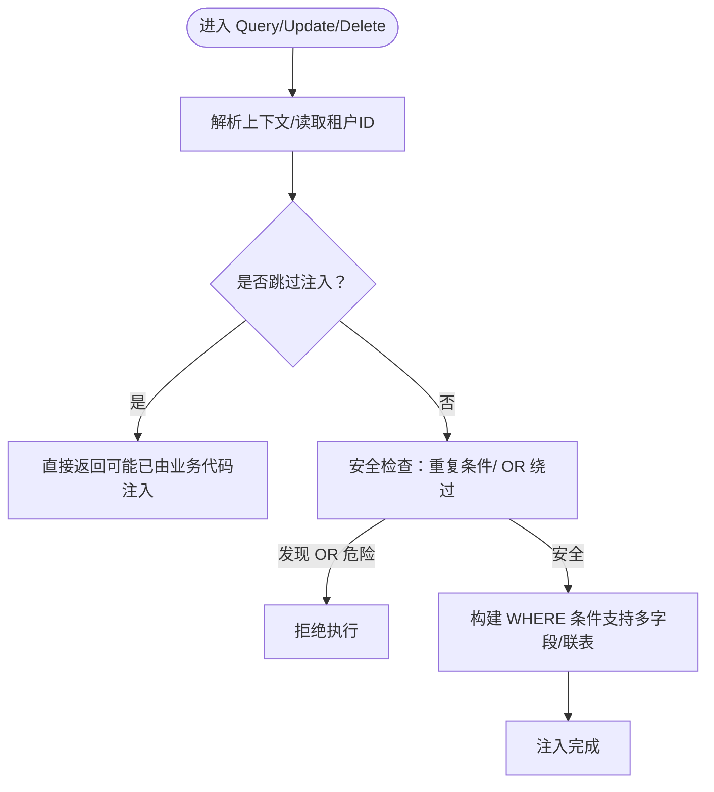

图表来源
- [plugin/tenant.go:384-482](file://plugin/tenant.go#L384-L482)
- [plugin/tenant.go:528-595](file://plugin/tenant.go#L528-L595)

章节来源
- [plugin/tenant.go:143-336](file://plugin/tenant.go#L143-L336)
- [plugin/tenant.go:384-482](file://plugin/tenant.go#L384-L482)
- [plugin/tenant.go:528-595](file://plugin/tenant.go#L528-L595)

### 数据权限插件（DataPermission）
- 注入方式：通过 WithDataPermission 注入条件函数，插件在回调阶段自动调用，支持排除表与动态维护。
- 安全策略：默认注入模式与 ModeWhere 底层一致（Statement.Where），db.Scopes 在回调阶段无效。
- 使用建议：在鉴权中间件中根据用户角色/部门/岗位等生成注入函数，避免硬编码 SQL。

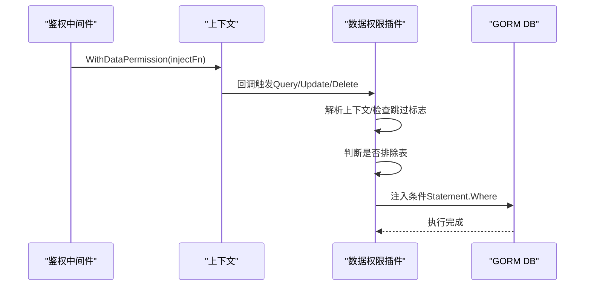

图表来源
- [plugin/dataPermission.go:140-204](file://plugin/dataPermission.go#L140-L204)
- [plugin/dataPermission.go:231-266](file://plugin/dataPermission.go#L231-L266)

章节来源
- [plugin/dataPermission.go:106-249](file://plugin/dataPermission.go#L106-L249)
- [plugin/dataPermission.go:231-266](file://plugin/dataPermission.go#L231-L266)

### 自动填充插件（AutoFill）
- 字段配置：支持多字段、Create/Update 开关、自定义 Getter。
- 上下文解析：通过 RegisterCtxResolver 屏蔽框架差异，兼容 gin/go-zero/fiber。
- 使用场景：审计字段（创建人/更新人/创建人姓名/更新人姓名）等自动化填充。

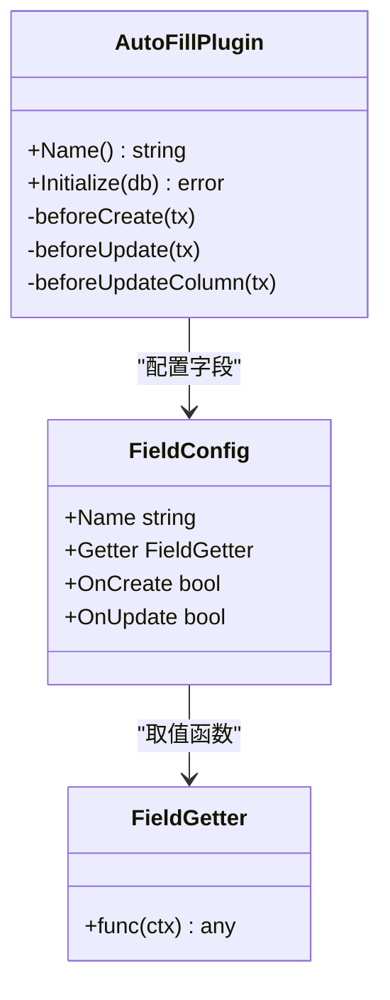

图表来源
- [plugin/autoOperator.go:140-208](file://plugin/autoOperator.go#L140-L208)
- [plugin/autoOperator.go:120-185](file://plugin/autoOperator.go#L120-L185)

章节来源
- [plugin/autoOperator.go:120-185](file://plugin/autoOperator.go#L120-L185)
- [plugin/ctx.go:16-44](file://plugin/ctx.go#L16-L44)

### SingleFlight + 可插拔缓存（SF）
- 三层保护：
  - SFNoCache：纯合并并发，不缓存结果，适合实时性要求高的场景。
  - SF/SFWithTTL：合并并发 + 缓存，TTL 内命中直接返回，支持内存/Redis 等缓存实现。
  - SFInvalidate：写操作后主动失效，避免脏读。
- 缓存键：fnName + 排序后的 args JSON，MD5 哈希，保证幂等与一致性。
- 退出清理：StopSFCache 停止内存缓存后台 goroutine；自定义缓存（如 Redis）由用户自行管理。

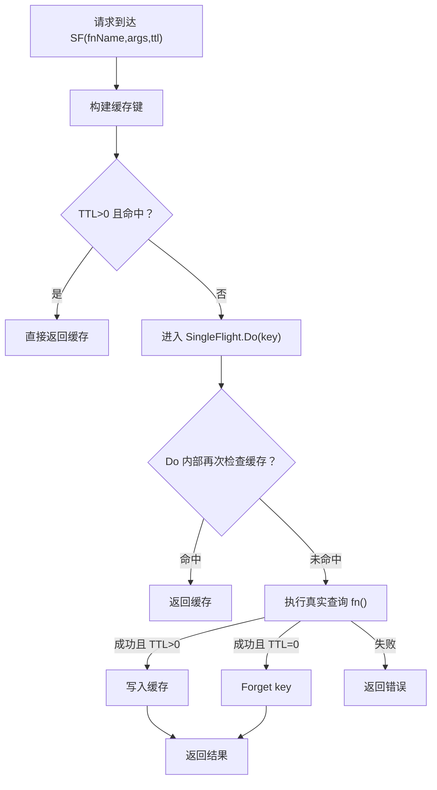

图表来源
- [sf/sf.go:292-350](file://sf/sf.go#L292-L350)
- [sf/sf.go:351-395](file://sf/sf.go#L351-L395)

章节来源
- [sf/sf.go:17-131](file://sf/sf.go#L17-L131)
- [sf/sf.go:292-350](file://sf/sf.go#L292-L350)
- [sf/sf.go:351-395](file://sf/sf.go#L351-L395)

### 多数据源管理（DS）
- 能力概览：命名数据源、一主多从、懒连接、独立连接池、自动读写分离、健康检查、优雅关闭。
- 连接池默认值：MaxOpen=50、MaxIdle=10、MaxLifetime=30min、MaxIdleTime=10min。
- 使用建议：在中间件中通过 WithName/WithRead/WithWrite 标记上下文，Repository 层统一通过 DS.Auto(ctx) 获取 DB。

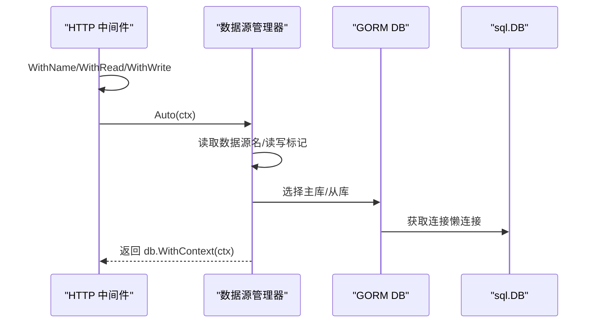

图表来源
- [datasource/manager.go:286-333](file://datasource/manager.go#L286-L333)
- [datasource/manager.go:454-513](file://datasource/manager.go#L454-L513)

章节来源
- [datasource/manager.go:15-148](file://datasource/manager.go#L15-L148)
- [datasource/manager.go:286-333](file://datasource/manager.go#L286-L333)
- [datasource/manager.go:454-513](file://datasource/manager.go#L454-L513)

### SQL 文件化 DAL
- 特性：SQL 文件化、泛型查询、位置/命名参数、分页、事务、Hook、缓存与定时清理。
- 初始化：通过 embed.FS 将 SQL 打包进二进制，支持 WithDebug/WithHook/WithCacheCleanup。
- 多数据源：通过 WithDB 注入上下文，调用方无需感知数据源切换。

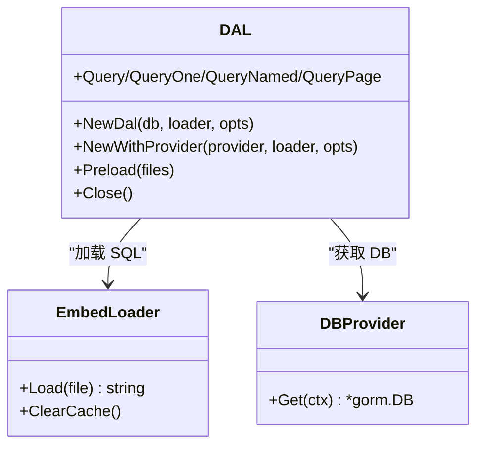

图表来源
- [dal/dal.go:284-431](file://dal/dal.go#L284-L431)
- [dal/dal.go:114-183](file://dal/dal.go#L114-L183)

章节来源
- [dal/dal.go:1-69](file://dal/dal.go#L1-L69)
- [dal/dal.go:114-183](file://dal/dal.go#L114-L183)
- [dal/dal.go:284-431](file://dal/dal.go#L284-L431)

### 代码生成器（Generator）
- 配置：YAML 配置项包含数据库连接与输出路径，支持包名与模板路径。
- 能力：Model/Repository/API/VO/DTO/Mapper 一键生成，支持预热与路径解析。
- 最佳实践：生成后将 Mapper 等文件迁移到目标目录并修正 import 路径。

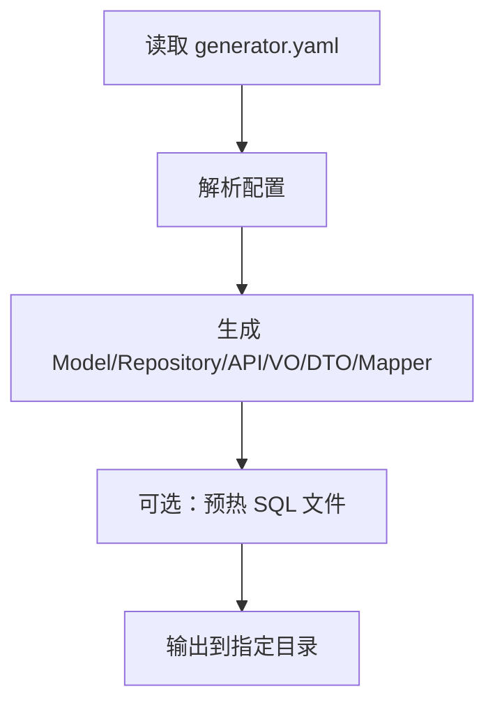

图表来源
- [generator/config.go:10-47](file://generator/config.go#L10-L47)
- [generator/generator.go:37-68](file://generator/generator.go#L37-L68)
- [generator/generator.example.yaml:1-17](file://generator/generator.example.yaml#L1-L17)

章节来源
- [generator/config.go:10-47](file://generator/config.go#L10-L47)
- [generator/generator.go:37-68](file://generator/generator.go#L37-L68)
- [generator/generator.example.yaml:1-17](file://generator/generator.example.yaml#L1-L17)

## 依赖分析
- 组件耦合：
  - gormplus 统一入口聚合各模块，插件通过 gorm.Callback 钩子工作，彼此独立可组合。
  - SF 与 DAL 均使用 singleflight 防击穿，但职责不同：SF 面向查询合并与缓存，DAL 面向 SQL 文件缓存与 Hook。
  - DS 与 DAL 可配合使用：DS 提供 DB，DAL 提供 SQL 文件化访问。
- 外部依赖：
  - gorm.io/gorm、gorm.io/driver（MySQL/PG/SQLite/SQLServer 通过 Dialector 注入）
  - golang.org/x/sync/singleflight
  - zap/logrus（通过自定义 Logger 接入）

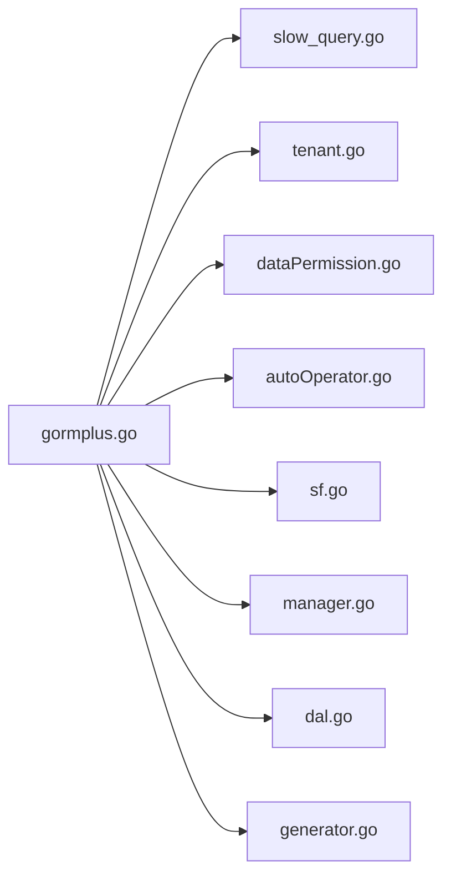

图表来源
- [gormplus.go:88-101](file://gormplus.go#L88-L101)
- [query/slow_query.go:4-11](file://query/slow_query.go#L4-L11)
- [plugin/tenant.go:131-141](file://plugin/tenant.go#L131-L141)
- [plugin/dataPermission.go:3-10](file://plugin/dataPermission.go#L3-L10)
- [plugin/autoOperator.go:3-8](file://plugin/autoOperator.go#L3-L8)
- [sf/sf.go:14](file://sf/sf.go#L14)
- [datasource/manager.go:11](file://datasource/manager.go#L11)
- [dal/dal.go:82](file://dal/dal.go#L82)
- [generator/generator.go:16-20](file://generator/generator.go#L16-L20)

章节来源
- [gormplus.go:88-101](file://gormplus.go#L88-L101)

## 性能考虑
- 连接池与读写分离
  - 默认连接池：MaxOpen=50、MaxIdle=10、MaxLifetime=30min、MaxIdleTime=10min；建议结合 CPU 核数与 QPS 调整。
  - 读写分离：GET 走从库，其他走主库；从库轮询，无从库时回退主库。
- 缓存策略
  - 列表/统计：TTL 3s~30s；配置/字典：TTL 1min~5min；详情/实时：TTL=0 或 SFNoCache。
  - 缓存键：fnName + 排序 args JSON，MD5 哈希，避免重复计算。
- SQL 文件化
  - 通过 embed.FS 打包 SQL，减少运行时 IO；支持缓存清理定时器，防止内存膨胀。
- 并发保护
  - SF/SFNoCache/SFInvalidate 三段式保护，避免缓存击穿与脏读。
- 日志与监控
  - 慢查询阈值建议 200ms~500ms，接入业务日志系统，结合 traceID 追踪。

章节来源
- [datasource/manager.go:163-169](file://datasource/manager.go#L163-L169)
- [sf/sf.go:40-47](file://sf/sf.go#L40-L47)
- [sf/sf.go:292-350](file://sf/sf.go#L292-L350)
- [dal/dal.go:265-282](file://dal/dal.go#L265-L282)
- [query/slow_query.go:73-83](file://query/slow_query.go#L73-L83)

## 故障排查指南
- 慢查询定位
  - 检查阈值设置与 Logger 输出；确认 SQL 已替换参数，可直接 EXPLAIN 分析。
  - 结合 traceID 定位请求链路。
- 多租户/数据权限
  - 若出现 OR 绕过导致拒绝执行，检查业务 SQL 是否包含租户字段与 OR 同时出现。
  - 使用 SkipTenant/SkipDataPermission 仅限特权场景，避免误用。
  - 动态排除表维护：AddExcludeTable/RemoveExcludeTable/ExcludedTables。
- 缓存一致性
  - 写操作后务必调用 SFInvalidate，确保后续读取最新数据。
  - 内存缓存退出时调用 StopSFCache；自定义缓存（Redis）由用户自行管理生命周期。
- 数据源与连接
  - 使用 DS.Ping() 检查连通性；健康检查失败时关注网络/认证/超时。
  - 确认 WithName/WithRead/WithWrite 标记正确，避免误走主库/从库。
- SQL 文件化
  - 初始化时通过 Preload 预热 SQL，尽早暴露路径错误。
  - WithCacheCleanup 定时清理缓存，避免内存持续增长。

章节来源
- [query/slow_query.go:19-58](file://query/slow_query.go#L19-L58)
- [plugin/tenant.go:436-468](file://plugin/tenant.go#L436-L468)
- [plugin/dataPermission.go:268-338](file://plugin/dataPermission.go#L268-L338)
- [sf/sf.go:275-291](file://sf/sf.go#L275-L291)
- [sf/sf.go:208-225](file://sf/sf.go#L208-L225)
- [datasource/manager.go:394-430](file://datasource/manager.go#L394-L430)
- [dal/dal.go:463-492](file://dal/dal.go#L463-L492)
- [dal/dal.go:265-282](file://dal/dal.go#L265-L282)

## 结论
gorm-plus 通过“统一入口 + 插件化 + 可插拔缓存 + 多数据源 + SQL 文件化”的架构，为企业级应用提供了完善的高级特性与安全保护机制。结合合理的阈值与缓存策略、严格的租户与数据权限控制、以及完善的监控与排障手段，可在保证性能的同时确保数据隔离与一致性。

## 附录
- 版本信息：v1.0.13
- 初始化顺序（参考）：ctx 解析器 → 多数据源 → 打开 DB → 多租户 → 数据权限 → 自动填充 → 慢查询 → 优雅退出

章节来源
- [version.go:1-4](file://version.go#L1-L4)
- [gormplus.go:22-85](file://gormplus.go#L22-L85)