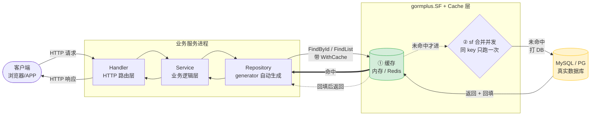
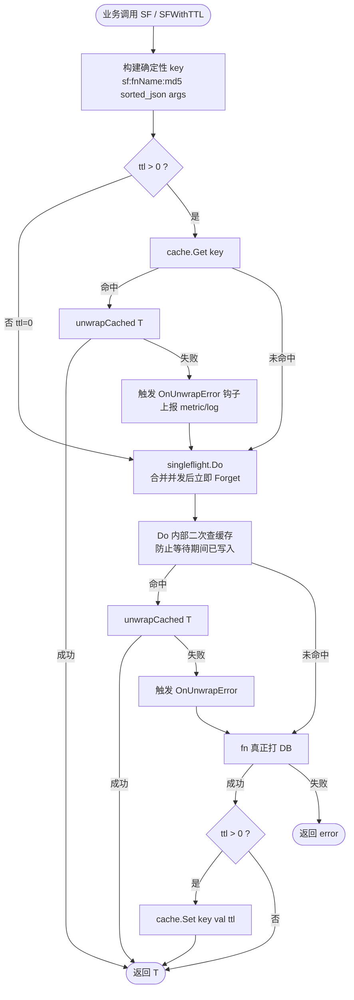

# gorm-plus

基于 [gorm](https://gorm.io) 和 [gorm-gen](https://github.com/go-gorm/gen) 的增强扩展包。

**核心能力：** 链式条件构造器 · gorm-gen 类型安全扩展 · 多租户自动注入 · 数据权限自动注入 · 自动填充插件 · 多数据源管理（任意驱动）· SingleFlight 可插拔缓存 · 慢查询监控 · 代码生成器

---

## 安装

```bash
go get github.com/kuangshp/gorm-plus
```

---

## 目录结构

```
gorm-plus/
├── gormplus.go                  # 包文档 + ctx 解析器（顶层入口）
├── gormplus_datasource.go       # 多数据源管理转发
├── gormplus_query.go            # 原生 gorm 链式查询转发（IQueryBuilder/Query）
├── gormplus_genwrap.go          # gorm-gen 类型安全链式转发（IGenWrapper/GenWrap）
├── gormplus_sf.go               # SingleFlight + 缓存转发（含 RawValue、批量失效等）
├── gormplus_executor.go         # 查询执行器（ExecuteQuery/ExecutePage/BuildArgs）
├── gormplus_tenant.go           # 多租户插件转发
├── gormplus_permission.go       # 数据权限插件转发
├── gormplus_autofill.go         # 自动填充插件转发
├── gormplus_slowquery.go        # 慢查询监控转发
├── gormplus_generator.go        # 代码生成器入口转发
├── gormplus_dal.go              # DAL（SQL 文件化）转发
├── version.go
│
├── query/                       # 原生 gorm 与 gorm-gen 链式构造器
│   ├── query_builder.go         # IQueryBuilder：原生 gorm 链式条件
│   ├── gen_wrapper.go           # IGenWrapper：gorm-gen 类型安全链式
│   ├── query_option.go          # QueryOption / WithCache / WithCacheArgs 等
│   ├── query_executor.go        # ExecuteQuery / ExecutePage（sf+cache 装饰器）
│   ├── slow_query.go            # 慢查询监控 gorm 插件
│   └── utils.go
│
├── sf/                          # SingleFlight + 可插拔缓存
│   ├── sf.go                    # 核心：SFCache 接口、RawValue 协议、内存缓存
│   └── sf_test.go               # 34 个测试用例（含 Redis 路径回归）
│
├── dal/                         # SQL 文件化查询（embed + 泛型）
│   ├── dal.go                   # 包文档
│   ├── instance.go              # DAL / NewDal / 全局 defaultDAL
│   ├── provider.go              # DBProvider
│   ├── loader.go                # SQLLoader / EmbedLoader
│   ├── options.go               # Option / WithDebug 等
│   ├── hook.go                  # Hook 接口
│   ├── query.go                 # Query / QueryOne / Count / Page
│   ├── tx.go                    # WithTx / TxQuery / TxExec
│   ├── must.go                  # MustExec / MustQueryOne
│   ├── debug.go                 # debug 日志
│   └── dal_test.go              # 47 个测试用例
│
├── plugin/                      # GORM 插件集合
│   ├── ctx.go                   # ctx 解析器（屏蔽 gin / go-zero / fiber 差异）
│   ├── tenant.go                # 多租户插件（多字段、多表、JOIN 别名识别）
│   ├── dataPermission.go        # 数据权限插件
│   └── autoOperator.go          # 自动填充插件（创建人、更新时间等）
│
├── datasource/                  # 多数据源管理
│   └── manager.go               # 任意 gorm 驱动 / 主从 / 读写分离
│
└── generator/                   # 代码生成器
    ├── generator.go             # 主逻辑
    ├── config.go                # YAML 配置
    ├── generator.example.yaml
    └── template/                # 代码模板
        ├── repository_gen_template.txt   # 自动生成（含缓存失效）
        ├── repository_template.txt       # 用户可改
        ├── api_template.txt
        ├── base_api_template.txt
        ├── dto_template.txt
        ├── vo_template.txt
        └── mapper_template.txt
```

> **顶层 `gormplus_*.go` 文件**只做类型别名 + 函数转发，把分包的 API 聚合到 `gormplus` 命名空间，业务方一律用 `gormplus.XXX` 调用，不需要直接 import 子包（`sf` / `query` / `plugin` / `dal` 等）。

---

## 快速开始

```go
import (
"gorm.io/driver/mysql"   // 按需替换为 postgres / sqlite / sqlserver
gormplus "github.com/kuangshp/gorm-plus"
)

func main() {
// ① ctx 解析器（gin 项目必须注册；go-zero / fiber 跳过）
gormplus.RegisterCtxResolver(func(ctx context.Context) context.Context {
if ginCtx, ok := ctx.(*gin.Context); ok {
return ginCtx.Request.Context()
}
return ctx
})

// ② 多数据源（Dialector 外部传入，不内置任何驱动）
gormplus.DS.Register("default", gormplus.DataSourceGroupConfig{
Master: gormplus.DataSourceNodeConfig{
Dialector: mysql.Open("root:pwd@tcp(master:3306)/mydb?charset=utf8mb4&parseTime=True"),
Pool:      gormplus.DataSourcePoolConfig{MaxOpen: 50, MaxIdle: 10},
},
Slaves: []gormplus.DataSourceNodeConfig{
{Dialector: mysql.Open("root:pwd@tcp(slave:3306)/mydb?charset=utf8mb4&parseTime=True")},
},
})

// ③ 打开 DB
db, _ := gorm.Open(mysql.Open(dsn), &gorm.Config{})

// ④ 多租户插件
gormplus.RegisterTenant(db, gormplus.TenantConfig[int64]{
TenantField:   "tenant_id",
ExcludeTables: []string{"sys_config", "sys_dict"},
})

// ⑤ 数据权限插件
gormplus.RegisterDataPermission(db, gormplus.DataPermissionConfig{
ExcludeTables: []string{"sys_config", "sys_dict"},
})

// ⑥ 自动填充插件
db.Use(gormplus.NewAutoFillPlugin(gormplus.AutoFillConfig{
Fields: []gormplus.FieldConfig{
{Name: "CreatedBy", Getter: gormplus.CtxGetter[int64](gormplus.CtxContextKey1), OnCreate: true},
{Name: "UpdatedBy", Getter: gormplus.CtxGetter[int64](gormplus.CtxContextKey1), OnCreate: true, OnUpdate: true},
},
}))

// ⑦ 慢查询监控
gormplus.RegisterSlowQuery(db, gormplus.SlowQueryConfig{
Threshold: 200 * time.Millisecond,
Logger: func(ctx context.Context, info gormplus.SlowQueryInfo) {
log.Printf("[慢查询] cost=%v table=%s sql=%s", info.Duration, info.Table, info.SQL)
},
})

// ⑧ 优雅退出
defer gormplus.StopSFCache()
defer gormplus.DS.Close()

r := gin.New()
r.Use(OperatorMiddleware(), TenantMiddleware(), DataPermissionMiddleware())
r.Run(":8080")
}
```

---

## 一、ctx 解析器

插件读取 ctx 数据前先调用解析器，屏蔽不同框架的 ctx 类型差异。

| 框架 | 是否需要注册 | 业务代码传 ctx |
|------|------------|--------------|
| gin | **必须注册** | `db.WithContext(c)` 直接传 `*gin.Context` |
| go-zero | 无需注册 | `db.WithContext(r.Context())` |
| fiber | 无需注册 | `db.WithContext(c.UserContext())` |

```go
gormplus.RegisterCtxResolver(func(ctx context.Context) context.Context {
if ginCtx, ok := ctx.(*gin.Context); ok {
return ginCtx.Request.Context()
}
return ctx
})

// 注册后可直接传 *gin.Context，无需手动 c.Request.Context()
db.WithContext(c).Find(&list)
dao.Entity.WithContext(c).Find()
```

---

## 二、多数据源管理

不内置任何驱动依赖，通过 `Dialector` 字段外部传入，支持任意 gorm 驱动。

### 注册数据源

```go
// MySQL
import "gorm.io/driver/mysql"
gormplus.DS.Register("default", gormplus.DataSourceGroupConfig{
Master: gormplus.DataSourceNodeConfig{
Dialector: mysql.Open("root:pwd@tcp(master:3306)/mydb?charset=utf8mb4&parseTime=True"),
Pool:      gormplus.DataSourcePoolConfig{MaxOpen: 50, MaxIdle: 10},
},
Slaves: []gormplus.DataSourceNodeConfig{
{Dialector: mysql.Open("root:pwd@tcp(slave1:3306)/mydb?charset=utf8mb4&parseTime=True")},
{Dialector: mysql.Open("root:pwd@tcp(slave2:3306)/mydb?charset=utf8mb4&parseTime=True")},
},
})

// PostgreSQL
import "gorm.io/driver/postgres"
gormplus.DS.Register("pg", gormplus.DataSourceGroupConfig{
Master: gormplus.DataSourceNodeConfig{
Dialector: postgres.Open("host=localhost user=root password=pwd dbname=mydb port=5432 sslmode=disable"),
},
})

// SQLite（适合单元测试）
import "gorm.io/driver/sqlite"
gormplus.DS.Register("test", gormplus.DataSourceGroupConfig{
Master: gormplus.DataSourceNodeConfig{Dialector: sqlite.Open(":memory:")},
})

// 多数据源混用
gormplus.DS.Register("analytics", gormplus.DataSourceGroupConfig{
Master: gormplus.DataSourceNodeConfig{Dialector: postgres.Open(analyticsDSN)},
})
```

### 中间件标记读写

```go
func DSMiddleware(name string) gin.HandlerFunc {
return func(c *gin.Context) {
ctx := gormplus.DSWithName(c.Request.Context(), name)
if c.Request.Method == http.MethodGet {
ctx = gormplus.DSWithRead(ctx)  // GET → 从库
} else {
ctx = gormplus.DSWithWrite(ctx) // 其他 → 主库
}
c.Request = c.Request.WithContext(ctx)
c.Next()
}
}
```

### Repository 层获取 DB

```go
// 推荐：Auto 自动读取 context 决定数据源和读写
func (r *OrderRepo) List(ctx context.Context) ([]*Order, error) {
db, err := gormplus.DS.Auto(ctx)
if err != nil { return nil, err }
var list []*Order
return list, db.WithContext(ctx).Find(&list).Error
}

// 显式指定
db, err := gormplus.DS.Write("default")              // 主库
db, err := gormplus.DS.Read("default")               // 从库
db, err := gormplus.DS.WriteCtx(ctx, "analytics")    // 指定数据源主库

// 健康检查
results := gormplus.DS.Ping()
// map[string]error{"default:master": nil, "default:slave0": nil}
```

---

## 三、原生 gorm 链式条件构造器（Query）

```go
// 分页列表查询
built := gormplus.Query[*model.Account](db, ctx).
LLike("username", username).                        // 空时自动跳过
WhereIf(status != 0, "status = ?", status).         // false 时跳过
BetweenIfNotZero("created_at", startTime, endTime). // 任一零值时跳过
WhereIf(len(ids) > 0, "dept_id IN ?", ids).
Build()
var total int64
built.Count(&total)
built.Order("created_at DESC").Limit(pageSize).Offset((page-1)*pageSize).Find(&list)

// 泛型分页（一步到位）
list, total, err := gormplus.FindByPage[*model.Account](
gormplus.Query[*model.Account](db, ctx).
LLike("username", username).
WhereIf(status != 0, "status = ?", status).
Build().Order("created_at DESC"),
pageNum, pageSize,
)

// 联表 + 映射到 VO（用 ScanByPage）
type AccountVO struct {
ID       int64  `json:"id"`
Username string `json:"username"`
DeptName string `json:"deptName"`
}
list, total, err := gormplus.ScanByPage[AccountVO](
gormplus.Query[*model.Account](db, ctx).
LLike("a.username", username).
Build().
Select("a.id", "a.username", "d.name AS dept_name").
Joins("LEFT JOIN sys_dept d ON d.id = a.dept_id").
Order("a.created_at DESC"),
pageNum, pageSize,
)

// AND 分组：WHERE (username LIKE '%kw%' OR email LIKE '%kw%')
gormplus.Query[*model.Account](db, ctx).
WhereGroup(func(q gormplus.IQueryBuilder) {
q.Like("username", keyword).
WhereIf(true, "email LIKE ?", "%"+keyword+"%")
}).Build().Find(&list)

// OR 分组：WHERE status = 1 OR (role = 99 AND org_id = 10)
gormplus.Query[*model.Account](db, ctx).
WhereIf(true, "status = ?", 1).
OrGroup(func(q gormplus.IQueryBuilder) {
q.WhereIf(role != 0, "role = ?", role).
WhereIf(orgID != 0, "org_id = ?", orgID)
}).Build().Find(&list)
```

| 方法 | 说明 |
|------|------|
| `Like / LLike / RLike` | 模糊查询，值为空自动跳过 |
| `BetweenIfNotZero` | 范围查询，任一零值跳过 |
| `WhereIf(cond, sql, args...)` | 条件成立时追加 AND |
| `WhereGroup(fn)` | AND 括号分组 |
| `OrGroup(fn)` | OR 括号分组 |
| `RawWhere / RawOrWhere / RawWhereIf` | 原生 SQL 条件 |
| `Build()` | 返回 `*gorm.DB` |

---

## 四、gorm-gen 类型安全链式构造器（GenWrap）

```go
// 基础查询
list, err := gormplus.GenWrap(dao.AccountEntity.WithContext(ctx)).
LLike(dao.AccountEntity.Username, username).
WhereIf(status != 0, dao.AccountEntity.Status.Eq(status)).
Apply().
Order(dao.AccountEntity.CreatedAt.Desc()).
Limit(pageSize).Offset((page-1)*pageSize).
Find()

// 联表查询（使用别名）
list, err := gormplus.GenWrap(dao.AccountEntity.WithContext(ctx)).
As("a").
RawWhere("a.username LIKE ?", "%"+username+"%").
WhereIf(status != 0, dao.AccountEntity.Status.Eq(status)).
Apply().
Select(dao.AccountEntity.ID, dao.AccountEntity.Username).
Find()

// AND 简单分组：WHERE (status = 1 AND role = 2)
gormplus.GenWrap(dao.AccountEntity.WithContext(ctx)).
WhereGroup(dao.AccountEntity.Status.Eq(1), dao.AccountEntity.Role.Eq(2)).
Apply().Find()

// AND 函数分组（组内可用 WhereIf / Like 等完整能力）
// => WHERE (username LIKE '%admin' AND status = 1)
gormplus.GenWrap(dao.AccountEntity.WithContext(ctx)).
WhereGroupFn(func(w gormplus.IGenWrapper[dao.IAccountEntityDo]) {
w.LLike(dao.AccountEntity.Username, username).
WhereIf(status != 0, dao.AccountEntity.Status.Eq(status))
}).Apply().Find()

// OR 函数分组：WHERE status = 1 OR (username LIKE '%admin' AND role = 99)
gormplus.GenWrap(dao.AccountEntity.WithContext(ctx)).
WhereIf(true, dao.AccountEntity.Status.Eq(1)).
OrGroupFn(func(w gormplus.IGenWrapper[dao.IAccountEntityDo]) {
w.LLike(dao.AccountEntity.Username, username).
WhereIf(role != 0, dao.AccountEntity.Role.Eq(role))
}).Apply().Find()
```

---

## 五、多租户插件（自动注入）

注册一次，所有数据库操作自动注入租户条件，业务代码零改动。

### 用法一：单字段（向后兼容）

```go
gormplus.RegisterTenant(db, gormplus.TenantConfig[int64]{
TenantField:   "tenant_id",
ExcludeTables: []string{"sys_config", "sys_dict", "sys_menu"},
})

// 中间件写入
func TenantMiddleware() gin.HandlerFunc {
return func(c *gin.Context) {
tenantID := int64(1001) // 从 JWT 解析
ctx := gormplus.WithTenantID(c.Request.Context(), tenantID)
c.Request = c.Request.WithContext(ctx)
c.Next()
}
}

// 业务代码零改动
db.WithContext(ctx).Find(&list)      // WHERE `tenant_id` = 1001
db.WithContext(ctx).Create(&account) // 自动填充 tenant_id 字段
```

### 用法二：同一张表注入多个租户字段

```go
gormplus.RegisterTenant(db, gormplus.TenantConfig[int64]{
TenantFields: []gormplus.TenantFieldConfig[int64]{
{Field: "tenant_id"}, // 使用默认 WithTenantID 写入的值
{Field: "org_id", GetTenantID: func(ctx context.Context) (int64, bool) {
id, ok := ctx.Value("orgID").(int64)
return id, ok && id != 0
}},
},
})

// 中间件同时写入两个值
ctx := gormplus.WithTenantID(c.Request.Context(), int64(1001))
ctx  = context.WithValue(ctx, "orgID", int64(200))

// 生成：WHERE `tenant_id` = 1001 AND `org_id` = 200
```

### 用法三：不同表用不同字段名

```go
gormplus.RegisterTenant(db, gormplus.TenantConfig[int64]{
TenantField: "tenant_id", // 兜底字段
TableFields: map[string][]gormplus.TenantFieldConfig[int64]{
"sys_contract": {{Field: "company_id"}},          // 改用 company_id
"sys_order": {                                    // 同时注入两个字段
{Field: "tenant_id"},
{Field: "org_id", GetTenantID: orgGetter},
},
"sys_log": {}, // 空 slice = 跳过该表
},
ExcludeTables: []string{"sys_config", "sys_dict"},
})

// 查询 sys_contract：WHERE `company_id` = 1001
// 查询 sys_order：  WHERE `tenant_id` = 1001 AND `org_id` = 200
// 查询 sys_log：    无租户条件（跳过）
// 查询其他表：      WHERE `tenant_id` = 1001（兜底）
```

### 联表查询（JOIN 自动注入，别名自动识别）

```go
// 零配置，直接写 JOIN，关联表和别名自动处理
db.WithContext(ctx).
Table("sys_order a").
Joins("LEFT JOIN sys_order_item b ON b.order_id = a.id").
Joins("LEFT JOIN sys_user u ON u.id = a.user_id").
Find(&list)
// 自动生成：
// WHERE `a`.`tenant_id` = 1001
//   AND `b`.`tenant_id` = 1001   ← 别名 b 自动识别
//   AND `u`.`tenant_id` = 1001   ← 别名 u 自动识别

// 排除不需要租户过滤的公共关联表
gormplus.RegisterTenant(db, gormplus.TenantConfig[int64]{
TenantField:       "tenant_id",
ExcludeJoinTables: []string{"sys_dict", "sys_config"},
})

// 关联表字段名不同时覆盖（仅需配置差异部分）
gormplus.RegisterTenant(db, gormplus.TenantConfig[int64]{
TenantField: "tenant_id",
JoinTableOverrides: []gormplus.JoinTenantConfig[int64]{
{Table: "sys_contract_detail", Field: "company_id"},
},
})

// 关闭 JOIN 自动注入
falseVal := false
gormplus.RegisterTenant(db, gormplus.TenantConfig[int64]{
TenantField:          "tenant_id",
AutoInjectJoinTables: &falseVal,
})
```

### 安全保护

```go
// ① 默认禁止无业务条件的全表 Update / Delete
db.WithContext(ctx).Model(&Account{}).Updates(map[string]any{"status": 0})
// Error: tenant: 禁止无业务条件的全表 Update（表: account）

// 加业务条件才允许
db.WithContext(ctx).Model(&Account{}).Where("dept_id = ?", deptID).Updates(...)

// 临时放开（批量任务、数据迁移）
ctx = gormplus.AllowGlobalOperation(ctx)
db.WithContext(ctx).Model(&Account{}).Updates(map[string]any{"status": 0})

// 配置层永久放开
gormplus.RegisterTenant(db, gormplus.TenantConfig[int64]{
TenantField:       "tenant_id",
AllowGlobalUpdate: true,
AllowGlobalDelete: true,
})

// ② 重复条件策略（默认 PolicySkip）
gormplus.RegisterTenant(db, gormplus.TenantConfig[int64]{
TenantField:     "tenant_id",
DuplicatePolicy: gormplus.PolicySkip,    // 默认：已有 AND 条件时跳过注入
// DuplicatePolicy: gormplus.PolicyReplace, // 强制替换为 ctx 中的值
// DuplicatePolicy: gormplus.PolicyAppend,  // 直接追加不检查
})

// ③ OR 危险条件自动拒绝
db.WithContext(ctx).Where("tenant_id = ? OR status = 1", 9999).Find(&list)
// Error: tenant: 检测到租户字段 "tenant_id" 出现在 OR 条件中，已拒绝执行
```

### 覆盖租户 ID / 超管跳过

```go
// 覆盖租户 ID（需开启 AllowOverrideTenantID）
gormplus.RegisterTenant(db, gormplus.TenantConfig[int64]{
TenantField:           "tenant_id",
AllowOverrideTenantID: true,
})
ctx = gormplus.WithOverrideTenantID(ctx, int64(2002))
db.WithContext(ctx).Find(&list) // WHERE tenant_id = 2002

// 超管跳过所有租户过滤
ctx = gormplus.SkipTenant(ctx)
db.WithContext(ctx).Find(&all) // 无任何租户条件

// 动态维护排除表
gormplus.AddExcludeTable[int64](db, "log_audit")
gormplus.RemoveExcludeTable[int64](db, "sys_dict")
tables, _ := gormplus.ExcludedTables[int64](db)
```

---

## 六、数据权限插件

注入逻辑由业务层定义，插件不耦合任何业务 SQL。

```go
// 注册
gormplus.RegisterDataPermission(db, gormplus.DataPermissionConfig{
ExcludeTables: []string{"sys_config", "sys_dict", "sys_menu"},
})

// 中间件定义注入函数
func DataPermissionMiddleware() gin.HandlerFunc {
return func(c *gin.Context) {
claims, err := jwt.ParseToken(c.GetHeader("Authorization"))
if err != nil { c.Next(); return }
injectFn := func(db *gorm.DB, tableName string) {
switch claims.DataScope {
case "2": // 本角色相关部门
db.Where(tableName+".create_by IN (SELECT sys_user.user_id FROM sys_role_dept LEFT JOIN sys_user ON sys_user.dept_id = sys_role_dept.dept_id WHERE sys_role_dept.role_id = ?)", claims.RoleId)
case "3": // 本部门
db.Where(tableName+".create_by IN (SELECT user_id FROM sys_user WHERE dept_id = ?)", claims.DeptId)
case "4": // 本部门及子部门
db.Where(tableName+".create_by IN (SELECT user_id FROM sys_user WHERE dept_id IN (SELECT dept_id FROM sys_dept WHERE dept_path LIKE ?))", "%/"+strconv.FormatInt(claims.DeptId, 10)+"/%")
case "5": // 仅本人
db.Where(tableName+".create_by = ?", claims.UserId)
}
}
ctx := gormplus.WithDataPermission(c.Request.Context(), injectFn)
c.Request = c.Request.WithContext(ctx)
c.Next()
}
}

// 业务代码零改动
db.WithContext(ctx).Find(&list) // 自动注入数据权限条件

// 超管跳过
ctx = gormplus.SkipDataPermission(ctx)
db.WithContext(ctx).Find(&allData)
```

---

## 七、自动填充插件

```go
// 中间件写入操作人信息
func OperatorMiddleware() gin.HandlerFunc {
return func(c *gin.Context) {
claims, _ := jwt.ParseToken(c.GetHeader("Authorization"))
ctx := context.WithValue(c.Request.Context(), gormplus.CtxContextKey1, claims.UserID)   // 操作人 ID
ctx  = context.WithValue(ctx,                 gormplus.CtxContextKey2, claims.Username) // 操作人姓名
c.Request = c.Request.WithContext(ctx)
c.Next()
}
}

// 注册插件
db.Use(gormplus.NewAutoFillPlugin(gormplus.AutoFillConfig{
Fields: []gormplus.FieldConfig{
{Name: "CreatedBy",   Getter: gormplus.CtxGetter[int64](gormplus.CtxContextKey1),  OnCreate: true},
{Name: "UpdatedBy",   Getter: gormplus.CtxGetter[int64](gormplus.CtxContextKey1),  OnCreate: true, OnUpdate: true},
{Name: "CreatedName", Getter: gormplus.CtxGetter[string](gormplus.CtxContextKey2), OnCreate: true},
{Name: "UpdatedName", Getter: gormplus.CtxGetter[string](gormplus.CtxContextKey2), OnCreate: true, OnUpdate: true},
},
}))

// 业务代码零改动
db.WithContext(ctx).Create(&account)              // CreatedBy / CreatedName 自动填充
db.WithContext(ctx).Model(&account).Updates(data) // UpdatedBy / UpdatedName 自动填充
```

---

## 八、SingleFlight + 可插拔缓存（SF）

### 它解决什么问题

业务里经常遇到这几个场景：

- **缓存击穿**：热 key 失效瞬间大量请求同时打 DB
- **重复查询**：同一秒内同样的查询打了 100 次 DB
- **缓存一致性**：写完数据库后旧缓存还在

SF（SingleFlight + Cache）一次解决：同一瞬间并发请求合并成一次、结果按 TTL 缓存、写操作支持精确/前缀失效。

### 查询流程图

#### 整体链路:从前端请求到数据库

业务方最常关心的是:**一个请求进来,sf+cache 在哪里、命中和未命中时分别走什么路径**。

执行顺序遵循 go-zero `sqlc.CachedConn` 模式:**先查缓存(外层),未命中才进 singleflight(内层)**——命中场景零开销,未命中场景由 sf 合并并发请求保护数据库。



阅读要点:

- **缓存命中(粗实线)**:请求进来直接命中缓存返回,**根本不进 singleflight、不打 DB**。同一秒来 100 个相同请求都走这条路
- **缓存未命中**:才进入 singleflight,把 N 个并发请求合并成 1 次去打 DB,其余 N-1 个等待并共享结果(防缓存击穿)
- **回填**:DB 查回的数据 `cache.Set` 后,下一次同 key 请求直接命中缓存
- **写操作(Create/Update/Delete)**:模板自动调 `invalidateWriteCaches` 把缓存前缀清掉,下次读会重新打 DB → 回填缓存

#### sf 内部细节：cache.Get → singleflight → DB

放大上图的 "sf 合并并发" 节点——`gormplus.SF` / `SFWithTTL` 在一次查询里实际干了什么：



关键设计点：

- **装饰器顺序**：cache 在外、sf 在内（同 go-zero 的 `sqlc.CachedConn`）。并发请求先被 sf 合并，再由这一次去查 cache，避免缓存击穿
- **key 顺序无关**：args 用 `marshalSorted` 按 key 字典序排序后 md5，传入顺序不影响最终 key
- **TTL=0 等价于 SFNoCache**：纯合并并发，不缓存，立即 Forget（适合实时数据）
- **类型还原 unwrapCached**：内存缓存走 `raw.(T)`，Redis 走 `json.Unmarshal(RawValue, &t)`，业务代码完全无感

### 方式一：内存缓存（默认，零配置）

```go
// 无需任何配置，懒加载内存缓存
defer gormplus.StopSFCache() // 退出时停掉后台清理 goroutine

// ① 带缓存（30 秒）
list, err := gormplus.SF(func() ([]*model.Account, error) {
    var result []*model.Account
    err := gormplus.Query[*model.Account](db, ctx).
        WhereIf(status != 0, "status = ?", status).
        Build().Find(&result)
    return result, err
}, "Account.List", map[string]any{"status": status, "page": pageNum}, 30*time.Second)

// ② 纯 singleflight（不缓存，只合并并发，适合余额、详情等实时数据）
account, err := gormplus.SFNoCache(func() (*model.Account, error) {
    var a model.Account
    err := db.WithContext(ctx).Where("id = ?", id).First(&a).Error
    return &a, err
}, "Account.Detail", map[string]any{"id": id})

// ③ 写后失效（精确失效，args 必须和查询时一致）
gormplus.SFInvalidate("Account.FindById", map[string]any{"id": id})
```

### 方式二：Redis 缓存（多实例部署推荐）

⚠️ **重要**：Redis 缓存的 `Get` 必须返回 `gormplus.RawValue(b)` 而不是反序列化后的 `any`，否则 sf 包内部的类型断言会失败，导致缓存命中率永远为 0（业务无感知，但每次都打 DB）。

```go
import (
    "context"
    "encoding/json"
    "time"

    "github.com/redis/go-redis/v9"
    gormplus "github.com/kuangshp/gorm-plus"
)

// 实现 SFCache 接口（Get / Set / Del 必选）+ 三个可选接口
type RedisSFCache struct {
    rdb    *redis.Client
    prefix string
}

// 必选：Get 返回 RawValue 让框架自动反序列化到业务期望的类型 T
func (c *RedisSFCache) Get(key string) (any, bool) {
    b, err := c.rdb.Get(context.Background(), c.prefix+key).Bytes()
    if err != nil {
        return nil, false
    }
    return gormplus.RawValue(b), true   // ← 关键：用 RawValue 包装字节流
}

// 必选：Set 把任意 T 序列化为 []byte 写入 Redis
func (c *RedisSFCache) Set(key string, val any, ttl time.Duration) {
    b, err := json.Marshal(val)
    if err != nil {
        return
    }
    c.rdb.Set(context.Background(), c.prefix+key, b, ttl)
}

// 必选：精确删除
func (c *RedisSFCache) Del(key string) {
    c.rdb.Del(context.Background(), c.prefix+key)
}

// 可选 ①：实现 SFCachePrefixDeleter 支持前缀失效（SFInvalidatePrefix 需要）
//        用 SCAN 而非 KEYS，避免阻塞 Redis 集群
func (c *RedisSFCache) DelByPrefix(prefix string) {
    ctx := context.Background()
    var cursor uint64
    for {
        keys, next, err := c.rdb.Scan(ctx, cursor, c.prefix+prefix+"*", 500).Result()
        if err != nil {
            return
        }
        if len(keys) > 0 {
            c.rdb.Del(ctx, keys...)
        }
        cursor = next
        if cursor == 0 {
            break
        }
    }
}

// 可选 ②：实现 SFCachePrefixBatchDeleter 支持批量前缀失效（性能优化，强烈推荐）
//        一次 pipeline 处理多个前缀，比循环调用 DelByPrefix 快 N 倍
//        generator 模板里的 invalidateWriteCaches 会一次清 11 个前缀
func (c *RedisSFCache) DelByPrefixes(prefixes []string) {
    ctx := context.Background()
    pipe := c.rdb.Pipeline()
    for _, prefix := range prefixes {
        var cursor uint64
        for {
            keys, next, err := c.rdb.Scan(ctx, cursor, c.prefix+prefix+"*", 500).Result()
            if err != nil {
                break
            }
            if len(keys) > 0 {
                pipe.Del(ctx, keys...)
            }
            cursor = next
            if cursor == 0 {
                break
            }
        }
    }
    _, _ = pipe.Exec(ctx)
}

// 可选 ③：实现 SFCacheCloser，让 StopSFCache 自动关闭 Redis 客户端
func (c *RedisSFCache) Close() error {
    return c.rdb.Close()
}

// ===== 启动时注册（强制只能调用一次，重复会 panic）=====
func main() {
    rdb := redis.NewClient(&redis.Options{Addr: "localhost:6379"})
    gormplus.RegisterCache(&RedisSFCache{rdb: rdb, prefix: "myapp:sf:"})
    defer gormplus.StopSFCache() // 自动调用 Close 关闭 Redis 客户端

    // 业务代码与内存缓存完全一致，无需任何改动
    list, err := gormplus.SF(fn, "Account.List", args, 30*time.Second)
}
```

| 维度 | 内存缓存（默认） | Redis 缓存 |
|---|---|---|
| 配置 | 零配置 | 启动期 `RegisterCache` 一次 |
| 适用 | 单机、开发测试 | 多实例部署、缓存共享 |
| 退出清理 | `defer StopSFCache()` | 同左（自动调用 Close） |
| 业务代码 | 完全一样 | 完全一样 |
| 前缀失效 | 内置支持 | 需实现 `DelByPrefix` |
| 批量失效 | 内置支持 | 推荐实现 `DelByPrefixes` |

### 主动失效：精确 vs 前缀

| API | 何时用 | 示例 |
|---|---|---|
| `SFInvalidate(fnName, args)` | args 完全可预知（如 FindById） | `gormplus.SFInvalidate("user.FindById", gormplus.BuildArgs("id", 1))` |
| `SFInvalidatePrefix(fnName)` | args 不可穷举（如 FindList、Count，Where 条件千变万化） | `gormplus.SFInvalidatePrefix("user.FindList")` |
| `SFInvalidatePrefixes(fnNames)` | 一次清多个方法（generator 模板用） | 见下文 |

**前缀失效安全保护**：`fnName` 为空字符串或不含点号且短于 3 字符的可疑前缀会被静默拒绝，避免误清全部缓存。

```go
// ① 精确失效：FindById 更新后
repo.UpdateById(ctx, id, ...)
gormplus.SFInvalidate("user.FindById", gormplus.BuildArgs("id", id))

// ② 前缀失效：删一条记录后，列表/统计缓存全清
repo.DeleteById(ctx, id)
gormplus.SFInvalidatePrefix("user.FindList")
gormplus.SFInvalidatePrefix("user.FindPage")
gormplus.SFInvalidatePrefix("user.Count")

// ③ 批量前缀失效（推荐，Redis 场景下一次 pipeline 处理）
gormplus.SFInvalidatePrefixes([]string{
    "user.FindList",
    "user.FindPage",
    "user.Count",
    "user.Exists",
})

// ④ 一把清整张表（注意尾部要带点号，避免误伤 user_role 等前缀相同的表）
gormplus.SFInvalidatePrefix("user.")
```

### generator 模板自动失效

代码生成器产出的 Repository 在写操作后**自动失效缓存**，业务方无需手动调用：

| 写操作 | 自动失效范围 |
|---|---|
| `Create` / `CreateBatch` | List / Page / Count / Exists 等 11 个前缀（一次批量） |
| `UpdateById` / `UpdateMapById` | 同上 + 该 ID 的 FindById 精确失效 |
| `DeleteById` / `DeleteByIdList` | 同上 + 该 ID 的 FindById 精确失效 |
| 条件 `Update/Delete`（不知道影响哪些 ID） | 整张表所有缓存按前缀失效（保守策略） |

生成的代码里有两个辅助方法：

```go
// invalidateWriteCaches 失效所有受写操作影响的缓存（List/Page/Count/Exists 全部前缀）。
// 用 SFInvalidatePrefixes 批量接口，Redis 场景下一次 pipeline 完成。
func (r *defaultUserRepository) invalidateWriteCaches() {
    gormplus.SFInvalidatePrefixes([]string{
        "user.FindList", "user.FindListByWrapper",
        "user.FindPage", "user.FindPageByWrapper",
        "user.FindByIdList",
        "user.FindOne", "user.FindOneWrapper",
        "user.Count", "user.CountByWrapper",
        "user.Exists", "user.ExistsByWrapper",
    })
}

// invalidateAllTableCaches 失效整张表所有缓存（条件 Update/Delete 用）。
func (r *defaultUserRepository) invalidateAllTableCaches() {
    gormplus.SFInvalidatePrefix("user.")
}
```

### 列表/分页查询：必须显式声明 cache args

主键查询（`FindById`、`FindByIdList`）框架自动把主键写进 args，cache key 全局唯一。但 **`FindList` / `FindPage` / `FindOne` / `Count` / `Exists` 这些方法的 Where 条件是 `gen.Condition` 接口类型，无法稳定序列化**——必须用 `WithCacheArgs` 把影响查询的参数显式声明出来，否则会出现 **不同 Where 命中同一 cache key 串数据** 的脏读问题。

```go
// ❌ 危险：两次查询条件不同但 cache key 相同 → 串数据
repo.FindList(ctx, query.Query().Where(...).WithCache(5*time.Minute).Build())

// ✅ 正确：显式声明所有影响查询的参数
repo.FindList(ctx, query.Query().
    Where(dao.User.Status.Eq(status), dao.User.UserID.Eq(userId)).
    WithCache(5*time.Minute).
    WithCacheArgs("status", status, "user_id", userId).   // ← 关键
    Build())

// ✅ 从 HTTP DTO 灌入（多个 Args 会自动合并）
repo.FindPage(ctx, page, size, query.Query().
    Where(buildConditions(req)...).
    WithCache(30*time.Second).
    WithCacheArgs("user_id", userId).         // service 层贡献
    WithCacheArgsMap(req.ToMap()).            // handler 层贡献
    Build())
```

### 缓存反序列化失败的观测

Redis 数据被外部改坏、跨版本结构变更等场景下，缓存反序列化会失败。框架默认**降级到 DB**，对业务透明——但这意味着缓存悄悄失效却没人知道。注入观测钩子可监控：

```go
gormplus.SetCacheUnwrapErrorHandler(func(key string, err error) {
    zap.L().Warn("cache unwrap failed",
        zap.String("key", key),
        zap.Error(err),
    )
    metrics.CacheUnwrapErrors.Inc()
})
```

钩子会在高频路径执行，要尽量快、不阻塞。钩子内 panic 会被框架吞掉，不影响主流程。

### 缓存 TTL 建议

| 场景 | 推荐 TTL | API |
|---|---|---|
| 列表 / 统计查询 | 3s ~ 30s | `WithCache(30*time.Second)` |
| 配置 / 字典数据（几乎不变） | 1min ~ 5min | `WithCache(5*time.Minute)` |
| 详情 / 实时数据（用户余额等） | 0 | `WithSingleFlight(0)` 或 `SFNoCache` |

### 注册期 vs 运行期：RegisterCache / ForceReplaceCache

```go
// 启动期注册一次（强制幂等保护，重复调用会 panic）
gormplus.RegisterCache(redisCache)

// 测试隔离 / 运维灰度切换缓存层（带数据丢失风险，慎用）
func TestXxx(t *testing.T) {
    gormplus.ForceReplaceCache(gormplus.NewMemoryCache())
    defer gormplus.StopSFCache()
    // ... 测试逻辑
}
```

## 九、慢查询监控

```go
gormplus.RegisterSlowQuery(db, gormplus.SlowQueryConfig{
Threshold: 200 * time.Millisecond, // 超过此阈值记录，0 时自动设为 200ms
Logger: func(ctx context.Context, info gormplus.SlowQueryInfo) {
zap.L().Warn("慢查询",
zap.Duration("cost",  info.Duration),
zap.String("table",   info.Table),
zap.String("sql",     info.SQL),       // 已替换 ?，可直接 EXPLAIN
zap.Int64("rows",     info.RowsAffected),
zap.Error(info.Error),
)
},
})
```

---

## 十、代码生成器

```yaml
# generator.yaml
host: localhost
port: 3306
username: root
password: your_password
database: your_database
out_path: ./dal/query
model_pkg_path: ./dal/model
repo_path: ./dal/repository
api_path: ./api/desc
vo_path: ./api/vo
dto_path: ./api/dto
package: your_package
```

```go
cfg, err := gormplus.LoadGeneratorConfig("./generator.yaml")
if err != nil { log.Fatal(err) }

if err := gormplus.Generate(cfg); err != nil {
log.Fatal(err)
}
// 运行后提示输入表名：
// - 输入表名：只生成该表的 Model / Repository / API / VO / DTO
// - 直接回车：生成所有表的 Model（其他文件不生成）
```

> **注意**：数据模型（Model）每次都会重新生成覆盖；Repository / API / VO / DTO 文件已存在时自动跳过，不会覆盖已有的自定义代码。

---

## 十一、DAL — SQL 文件化查询

不同于链式条件构造器，DAL 模块将 SQL 完整写在独立 `.sql` 文件中，
通过 `//go:embed` 打包进二进制，天然支持复杂 SQL、DBA 审核、版本管理。

### 推荐目录结构

```
your-project/
└── query/dal/
    ├── init.go       ← embed 声明 + 初始化（调用方编写）
    └── rawsql/
        ├── account/
        │   ├── list.sql
        │   ├── page.sql
        │   ├── count_page.sql
        │   └── find_by_id.sql
        └── order/
            ├── page.sql
            └── count_page.sql
```

### 初始化

```go
// init.go（embed 必须在调用方包内声明）
package yourpkg

import (
	"embed"
	"io/fs"
	"log"
	"time"
	gormplus "github.com/kuangshp/gorm-plus"
)

//go:embed rawsql
var SQLFS embed.FS

func InitDAL(db *gorm.DB) {
	sub, _ := fs.Sub(SQLFS, "rawsql") // 可选,写上这个在下面的时候"account/find_by_id.sql"不需要加rawsql
	d, err := gormplus.NewDal(
		db,
		gormplus.NewEmbedLoader(sub),
		gormplus.WithDALDebug(true),                  // 开发环境开启
		gormplus.WithDALCacheCleanup(30*time.Minute), // 可选
	)
	if err != nil {
		log.Fatal(err)
	}
	defer d.Close() // 程序退出时停止后台 goroutine
}
```

### 单数据源使用

```go
// 查询多条（位置参数 ?）
rows, err := gormplus.DALQuery[AccountVO](ctx, "account/list.sql", 1, 10, 0)

// 查询单条（位置参数 ?）
account, err := gormplus.DALQueryOne[AccountVO](ctx, "account/find_by_id.sql", 123)
if err != nil { return err }
if account == nil { return errors.New("账号不存在") }

// 命名参数查询（@name）
rows, err := gormplus.DALQueryNamed[AccountVO](ctx, "account/search.sql", map[string]any{
"username": "张", "status": 1, "limit": 10, "offset": 0,
})

// 分页查询（count SQL 自动推导：page.sql → count_page.sql）
result, err := gormplus.DALQueryPage[AccountVO](
ctx, "account/page.sql",
[]any{1},      // 业务过滤参数，同时传给 count SQL
[]any{10, 0},  // 分页参数（LIMIT, OFFSET），仅传给数据 SQL
)
// result.List — 当页数据  result.Total — 总条数

// 命名参数分页
result, err := gormplus.DALQueryPageNamed[OrderVO](ctx, "order/page.sql", map[string]any{
"account_id": 123, "status": 1, "limit": 10, "offset": 0,
})

// 执行（INSERT / UPDATE / DELETE）
err := gormplus.DALExec(ctx, "account/disable.sql", 123)

// 执行并返回影响行数
res, err := gormplus.DALExecAffected(ctx, "account/update_status.sql", 0, 123)
if res.RowsAffected == 0 { return errors.New("记录不存在") }

// 查询数量
total, err := gormplus.DALCount(ctx, "account/count_page.sql", 1)
```

### SQL 文件示例

```sql
-- rawsql/account/page.sql（位置参数 ?）
SELECT id, username, status, created_at
FROM   account
WHERE  status = ? AND deleted_at IS NULL
ORDER BY created_at DESC LIMIT ? OFFSET ?

-- rawsql/account/count_page.sql（与 page.sql 过滤条件完全一致，去掉分页）
SELECT COUNT(*) FROM account WHERE status = ? AND deleted_at IS NULL

-- rawsql/account/search.sql（命名参数 @name，空值/-1 表示不过滤）
SELECT id, username, status FROM account
WHERE deleted_at IS NULL
  AND (@username = ''  OR username LIKE CONCAT('%', @username, '%'))
  AND (@status  = -1  OR status   = @status)
ORDER BY created_at DESC LIMIT @limit OFFSET @offset
```

### 事务

```go
err := gormplus.DALWithTx(ctx, func(tx *gorm.DB) error {
// 加锁查库存（FOR UPDATE）
stock, err := gormplus.DALTxQueryOne[StockVO](ctx, tx, "stock/find_for_update.sql", productID)
if err != nil { return err }
if stock == nil || stock.Quantity < qty { return errors.New("库存不足") }

// 扣库存
if err := gormplus.DALTxExec(ctx, tx, "stock/deduct.sql", qty, productID, qty); err != nil {
return err
}
// 创建订单
return gormplus.DALTxExec(ctx, tx, "order/insert.sql", accountID, productID, qty, amount, orderNo)
})
```

### 多数据源

```go
// 初始化第二个数据源
reportSub, _ := fs.Sub(reportSQLFS, "rawsql")
reportDAL, _ := gormplus.NewDal(reportDB, gormplus.NewEmbedLoader(reportSub))

// 请求入口注入一次，后续写法完全不变
ctx = gormplus.WithDALDB(ctx, reportDAL)
rows, err := gormplus.DALQuery[ReportVO](ctx, "report/monthly.sql", 2024)
```

### Hook（慢 SQL 监控）

```go
type SlowDALHook struct{ Threshold time.Duration }

func (h *SlowDALHook) Before(ctx context.Context, sqlFile string, args []any) {}
func (h *SlowDALHook) After(ctx context.Context, sqlFile string, args []any, cost time.Duration, err error) {
if cost > h.Threshold {
log.Printf("[慢SQL] file=%s cost=%s", sqlFile, cost)
}
}

d, err := gormplus.NewDal(db, gormplus.NewEmbedLoader(sub),
gormplus.WithDALDebug(true),
gormplus.WithDALHook(&SlowDALHook{Threshold: 200 * time.Millisecond}),
)
```

| 函数 | 说明 |
|------|------|
| `NewDal` | 初始化全局默认 DAL 实例，返回句柄（用于 Close） |
| `NewDalWithProvider` | 使用自定义 DBProvider（读写分离、多租户） |
| `WithDALDB` | 将指定实例注入 context，多数据源切换 |
| `DALPreload` | 预热 SQL 缓存，启动时校验路径 |
| `DALQuery[T]` | 查询多条（位置参数 ?） |
| `DALQueryOne[T]` | 查询单条（位置参数 ?） |
| `DALQueryNamed[T]` | 命名参数查询多条（@name） |
| `DALQueryOneNamed[T]` | 命名参数查询单条（@name） |
| `DALQueryPage[T]` | 位置参数分页，count SQL 自动推导 |
| `DALQueryPageNamed[T]` | 命名参数分页 |
| `DALExec` | 执行 SQL，不关心影响行数 |
| `DALExecAffected` | 执行 SQL 并返回影响行数 |
| `DALCount` | 查询数量 |
| `DALWithTx` | 开启事务（自动提交/回滚） |
| `DALTxQuery[T]` | 事务中查询多条 |
| `DALTxQueryOne[T]` | 事务中查询单条 |
| `DALTxQueryNamed[T]` | 事务中命名参数查询 |
| `DALTxCount` | 事务中查询数量 |
| `DALTxExec` | 事务中执行 SQL |
| `DALMustExec` | 执行失败 panic（初始化阶段） |
| `DALMustQueryOne[T]` | 查询失败或不存在时 panic |


---

## 依赖

- `gorm.io/gorm`
- `gorm.io/gen`
- `gopkg.in/yaml.v3`
- 数据库驱动由用户按需引入（`gorm.io/driver/mysql`、`gorm.io/driver/postgres` 等）
